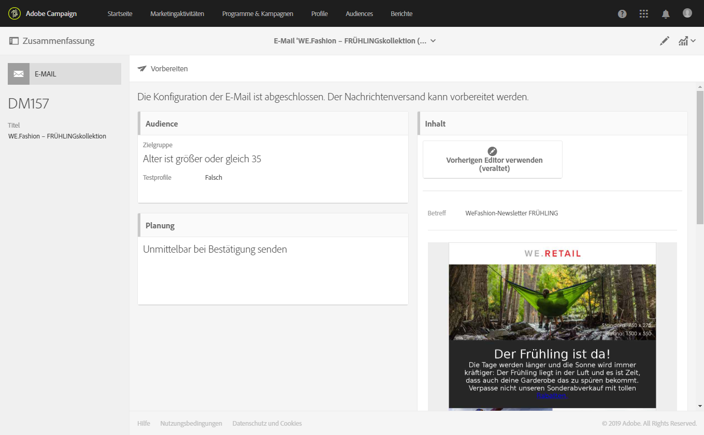

# Nachrichten-Dashboards{#message-dashboard}

Das Dashboard einer Nachricht enthält einen Arbeitsbereich mit verschiedenen Kacheln und eine Aktionsleiste mit Schaltflächen, die der Konfiguration und dem Versand der Nachricht dienen. Die einzelnen Elemente werden im Folgenden näher erläutert.

## Graue Leiste          {#gray-bar}

Die graue Leiste enthält verschiedene auf Ihre Nachricht bezogene Symbole.

* **[!UICONTROL Zusammenfassung]**: blendet zusammenfassende Informationen zur Nachricht ein oder aus.
* **[!UICONTROL Eigenschaften bearbeiten]**: bietet Zugriff auf die [erweiterten Parameter](../../administration/using/configuring-email-channel.md#list-of-email-properties) der Nachricht.
* **[!UICONTROL Berichte]**: bietet Zugriff auf Berichte zur Nachricht.

**Verwandte Themen:**

* [Kanäle konfigurieren](../../administration/using/about-channel-configuration.md)
* [Zugriff auf Berichte](../../reporting/using/about-dynamic-reports.md)

## Aktionsleiste {#action-bar}

Die Aktionsleiste enthält verschiedene Schaltflächen, die die Bearbeitung der Nachricht ermöglichen.

Je nach angegebenen Parametern und Bearbeitungsfortschritt stehen gewisse Schaltflächen u. U. nicht zur Verfügung.

* **[!UICONTROL Testsendungen anzeigen]**: blendet die Liste der gesendeten Tests ein oder aus. Diese Schaltfläche ist nur aktiv, wenn Testsendungen existieren.

  Weiterführende Informationen zu Testsendungen finden Sie im Abschnitt [Testversand durchführen](../../sending/using/sending-proofs.md).

* **[!UICONTROL Einen Test senden]**: ermöglicht Ihnen die Auswahl des zu verwendenden Validierungsmodus: **[!UICONTROL E-Mail-Rendering]** (nur bei E-Mails), **[!UICONTROL Testversand]** und/oder beides. Weiterführende Informationen zu Testprofilen finden Sie im Abschnitt [Testversand durchführen](../../sending/using/sending-proofs.md). Diese Schaltfläche ist nur dann aktiv, wenn mindestens ein Testprofil definiert wurde.

* **[!UICONTROL Versand vorbereiten]**: startet die Versandvorbereitung. Die Kachel **[!UICONTROL Bereitstellung]** erscheint und zeigt das Ergebnis der Vorbereitung an. Diese Schaltfläche erscheint nur, wenn die Zielgruppe angegeben wurde. Mithilfe der Schaltfläche &quot;Vorbereitung stoppen&quot; kann die Vorbereitung jederzeit unterbrochen werden. Weiterführende Informationen zur Nachrichtenvorbereitung finden Sie im Abschnitt [Versandvorbereitung](../../sending/using/preparing-the-send.md).

* **[!UICONTROL Versand bestätigen]**: löst den endgültigen Versand der Nachricht aus. In der Kachel **[!UICONTROL Bereitstellung]** erscheint nun das Versandergebnis. Diese Schaltfläche erscheint erst nach Abschluss der Versandvorbereitung. Der Versand kann mithilfe der Schaltflächen **Versand anhalten** oder **[!UICONTROL Unterbrechen]** jederzeit unterbrochen werden. Weitere Informationen zum Bestätigen von Sendungen finden Sie unter [Nachrichten senden](../../sending/using/confirming-the-send.md).

## Bausteine          {#blocks}

Der Arbeitsbereich besteht aus verschiedenen Kacheln. Klicken Sie in eine Kachel, um auf die entsprechenden Versandparameter zugreifen zu können:

* **[!UICONTROL Bereitstellung]**: gibt Auskunft über den Fortschritt der Vorbereitung oder des Versands der Nachricht. Mithilfe der Schaltfläche unten rechts in der Kachel lässt sich das Analyse- und Versandprotokoll anzeigen. Diese Kachel erscheint erst nach abgeschlossener Versandvorbereitung. Weiterführende Informationen dazu finden Sie im Abschnitt [Versand bestätigen](../../sending/using/confirming-the-send.md).
* **[!UICONTROL Audience]**: dient der Bestimmung der Hauptzielgruppe der Nachricht sowie der Testprofile. Siehe [Audiences erstellen](../../audiences/using/creating-audiences.md).
* **[!UICONTROL Planung]**: dient der Bestimmung des Versanddatums der Nachricht. Siehe [Versandplanung](../../sending/using/about-scheduling-messages.md).
* **[!UICONTROL Inhalt]**: dient der Definition und Vorschau des Nachrichteninhalts. Siehe [Wichtigste Schritte im Nachrichtenversand](../../channels/using/key-steps-to-send-a-message.md).

## Warnhinweise {#warnings}

In einigen Fällen kann ein Warnhinweis in einem gelben Banner über dem Nachrichten-Dashboard angezeigt werden.

Im Folgenden finden Sie eine Liste der Warnhinweise, die angezeigt werden können:

* *„Die SMTP-Testmodus-Option ist für diese E-Mail aktiviert: Es werden keine Nachrichten gesendet.“*

  Weiterführende Informationen hierzu finden Sie in [diesem Abschnitt](../../administration/using/configuring-email-channel.md#smtp-test-mode).

* *„Routing des externen Kontos wurde deaktiviert.“*

  Weiterführende Informationen hierzu finden Sie im Abschnitt [Externe Konten](../../administration/using/external-accounts.md).

* *„Nachrichten können nicht gesendet werden, da die aktuelle IP-Affinität von keinem Versandprozess verarbeitet wird.“*

  Wenn dieser Warnhinweis angezeigt wird, liegt ein Problem auf der Ebene der IP-Affinitätsdefinition oder auf der Ebene des Versandprozesses vor. Wenden Sie sich an Ihren Adobe-Administrator.

* *„Dies ist eine vordefinierte Transaktionsnachrichtenvorlage. Wenn Sie Änderungen vornehmen möchten, müssen Sie die Vorlage duplizieren und die Kopie bearbeiten.“*

  Einige dieser vordefinierten Transaktionsnachrichten-Vorlagen sind native Landingpage-Vorlagen. Weiterführende Informationen hierzu finden Sie in [diesem Abschnitt](../../channels/using/landing-page-templates.md).

* *„Bei dieser Nachricht handelt es sich um eine Nachrichtenvorlage für technische Transaktionen. Sie können sie bearbeiten oder veröffentlichen.“*

  Dieser Warnhinweis wird in leeren, nicht bearbeitbaren Transaktionsnachrichten-Vorlagen angezeigt. Weiterführende Informationen zu Transaktionsnachrichten finden Sie in [diesem Abschnitt](../../channels/using/getting-started-with-transactional-msg.md).
