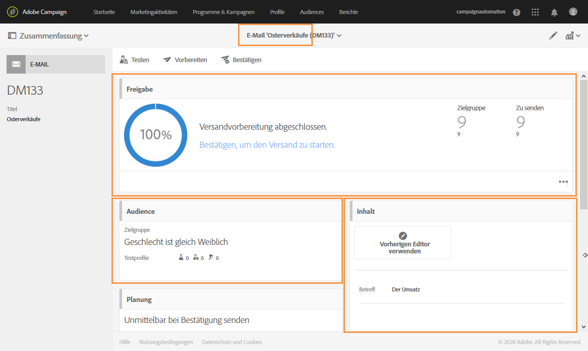

# Nachrichten-Dashboards{#message-dashboard}

Das Dashboard einer Nachricht enthält einen Arbeitsbereich mit verschiedenen Kacheln und eine Symbolleiste mit Schaltflächen, die der Konfiguration und dem Versand der Nachricht dienen. Die einzelnen Elemente werden im Folgenden näher erläutert.

## Graue Leiste   {#gray-bar}

Die graue Leiste enthält verschiedene auf Ihre Nachricht bezogene Symbole.

* **[!UICONTROL Summary]**: Blendet die Hauptinformationen zur Nachricht ein bzw. aus.
* **[!UICONTROL Edit properties]**: können Sie die [erweiterten Parameter](../../administration/using/configuring-email-channel.md#list-of-email-properties)der Nachricht bearbeiten.
* **[!UICONTROL Reports]**: gibt Ihnen Zugriff auf die Berichte, die sich auf die Nachricht beziehen.

**Verwandte Themen:**

* [Kanäle konfigurieren](../../administration/using/about-channel-configuration.md)
* [Zugriff auf Berichte](../../reporting/using/about-dynamic-reports.md)

## Symbolleiste   {#action-bar}

Die Symbolleiste enthält verschiedene Schaltflächen, die die Bearbeitung der Nachricht ermöglichen.

Je nach angegebenen Parametern und Bearbeitungsfortschritt stehen gewisse Schaltflächen u. U. nicht zur Verfügung.

* **[!UICONTROL Show proofs]**: Blendet die Liste der gesendeten Testversand ein bzw. aus, sofern vorhanden. Diese Schaltfläche ist nur aktiv, wenn Testsendungen existieren.

   Weiterführende Informationen zu Testsendungen finden Sie im Abschnitt [Testversand durchführen](../../sending/using/sending-proofs.md).

* **[!UICONTROL Send a test]**: können Sie den zu verwendenden Genehmigungsmodus auswählen: **[!UICONTROL Email rendering]**, **[!UICONTROL Proof]** oder beide für eine E-Mail. Weiterführende Informationen zu Testprofilen finden Sie im Abschnitt [Testversand durchführen](../../sending/using/sending-proofs.md).

   Die Schaltfläche ist nur dann aktiv, wenn mindestens ein Testprofil definiert wurde.

   >[!NOTE]
   >
   >For an SMS message, there is no other choice: it is automatically a **[!UICONTROL Proof]**.

* **[!UICONTROL Prepare send]**: Beginn, die den Versand vorbereiten sollen. The **[!UICONTROL Deployment]** block appears and displays the result of the preparation. Diese Schaltfläche erscheint nur, wenn die Zielgruppe angegeben wurde. Mithilfe der Schaltfläche &quot;Vorbereitung stoppen&quot; kann die Vorbereitung jederzeit unterbrochen werden.

   Weiterführende Informationen zur Nachrichtenvorbereitung finden Sie im Abschnitt [Versandvorbereitung](../../sending/using/preparing-the-send.md).

* **[!UICONTROL Confirm send]**: bestätigt das Senden der Nachricht. The sending statistics appear in the **[!UICONTROL Deployment]** block. Diese Schaltfläche erscheint erst nach Abschluss der Versandvorbereitung. You can stop or pause the send at any time using the **Stop send** and **[!UICONTROL Pause]** buttons.

   Lesen Sie diesbezüglich auch den Abschnitt [Nachrichten senden](../../sending/using/confirming-the-send.md).

## Bausteine   {#blocks}

Der Arbeitsbereich besteht aus verschiedenen Kacheln. Klicken Sie in eine Kachel, um auf die entsprechenden Versandparameter zugreifen zu können:

* **[!UICONTROL Deployment]**: ermöglicht es Ihnen, den Fortschritt der Nachrichtenvorbereitung oder des Nachrichtenversands zu verfolgen. Mithilfe der Schaltfläche unten rechts in der Kachel lässt sich das Analyse- und Versandprotokoll anzeigen. Diese Kachel erscheint erst nach abgeschlossener Versandvorbereitung. Weiterführende Informationen dazu finden Sie im Abschnitt [Versand bestätigen](../../sending/using/confirming-the-send.md).
* **[!UICONTROL Audience]**: ermöglicht Ihnen, sowohl die Hauptnachricht als auch die Zielgruppe der Profil zu bestimmen. Weiterführende Informationen dazu finden Sie im Abschnitt [Erstellung von Audiences](../../audiences/using/creating-audiences.md).
* **[!UICONTROL Schedule]**: können Sie das Datum angeben, an dem Ihre Nachricht gesendet werden soll. Siehe [Zeitplan](../../sending/using/about-scheduling-messages.md).
* **[!UICONTROL Content]**: können Sie den Inhalt und die Vorschau der Nachricht definieren. Siehe [Wichtigste Schritte im Nachrichtenversand](../../channels/using/key-steps-to-send-a-message.md).

## Warnhinweise {#warnings}

In einigen Fällen kann ein Warnhinweis in einem gelben Banner über dem Nachrichten-Dashboard angezeigt werden.

Im Folgenden finden Sie eine Liste der Warnhinweise, die angezeigt werden können:

* *„Die SMTP-Testmodus-Option ist für diese E-Mail aktiviert: Es werden keine Nachrichten gesendet.“*

   Weiterführende Informationen hierzu finden Sie in [diesem Abschnitt](../../administration/using/configuring-email-channel.md#smtp-test-mode).

* *„Routing des externen Kontos wurde deaktiviert.“*

   Weiterführende Informationen hierzu finden Sie im Abschnitt [Externe Konten](../../administration/using/external-accounts.md).

* *„Nachrichten können nicht gesendet werden, da die aktuelle IP-Affinität von keinem Versandprozess verarbeitet wird.“*

   Wenn dieser Warnhinweis angezeigt wird, liegt ein Problem auf der Ebene der IP-Affinitätsdefinition oder auf der Ebene des Versandprozesses vor. Wenden Sie sich an Ihren Adobe-Administrator.

* *&quot;Dies ist eine vordefinierte Transaktionsnachrichtenvorlage. Wenn Sie Änderungen vornehmen möchten, müssen Sie das Duplikat vornehmen und an Ihrer Kopie arbeiten.&quot;*

   Einige dieser vordefinierten Transaktionsnachrichten-Vorlagen sind native Landingpage-Vorlagen. Weiterführende Informationen hierzu finden Sie in [diesem Abschnitt](../../channels/using/landing-page-templates.md).

* *„Bei dieser Nachricht handelt es sich um eine Nachrichtenvorlage für technische Transaktionen. Sie können sie bearbeiten oder veröffentlichen.“*

   Dieser Warnhinweis wird in leeren, nicht bearbeitbaren Transaktionsnachrichten-Vorlagen angezeigt. Weiterführende Informationen zu Transaktionsnachrichten finden Sie in [diesem Abschnitt](../../channels/using/about-transactional-messaging.md).
