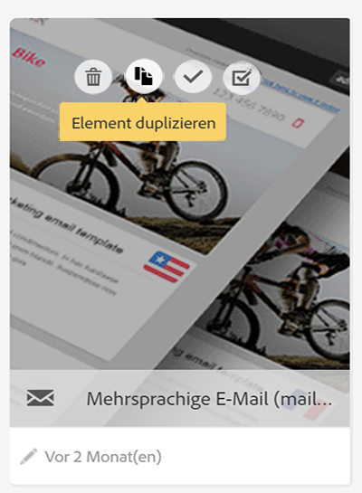

# Vorlagen für mehrsprachige Nachrichten {#multilingual-messages-template}

Eine mehrsprachige Vorlage dient zur Verwaltung mehrsprachiger Nachrichten. Diese Vorlagenart ist verfügbar für **** E-Mail- und SMS-Nachrichten **und kann im Einzelmodus, innerhalb eines Workflows oder in einem wiederkehrenden Versand verwendet werden.**

Bei mehrsprachigen Vorlagen basiert die Sprachverwaltung auf Varianten. **Jede Variante steht für eine Sprache**. In Adobe Campaign Standard können bis zu 40 Varianten erstellt werden.

Die in Adobe Campaign standardmäßig eingestellte Sprache ist **EN**. Die Standardsprache kann geändert werden, sollte aber niemals gelöscht werden.

Während der Vorlagenerstellung können Sie die Anzahl der Varianten entsprechend der Anzahl der für die Nachricht erforderlichen Sprachen hinzufügen.

Führen Sie zur Erstellung einer SMS- oder E-Mail-Vorlage die folgenden Schritte aus:

1. Duplizieren Sie eine vorhandene mehrsprachige Vorlage (SMS oder E-Mail).

   

   >[!NOTE]
   >
   >Sie können auch eine vorhandene Standardvorlage in eine mehrsprachige Vorlage umwandeln, indem Sie in den Vorlageneigenschaften die Schaltfläche **[!UICONTROL Inhaltsvariante initialisieren]** auswählen.

1. Passen Sie in den Eigenschaften Titel, Tracking etc. an.

1. Ändern Sie die Anzahl der gewünschten Varianten durch Anklicken der Variantenkachel. Das Variantenfenster öffnet sich.

   

   Dort können Sie Varianten hinzufügen oder entfernen. Um eine Variante hinzuzufügen, füllen Sie das Fenster **[!UICONTROL Neue Inhaltsvariante]** aus.

   

   >[!NOTE]
   >
   >Löschen Sie nicht die Standardvariante, da diese an die Profile gesendet wird, für die keine bevorzugte Sprache ausgewählt wurde.

1. Passen Sie bei Bedarf den Titel an und wählen Sie die Schaltfläche **[!UICONTROL Bestätigen]** aus.

1. Sie können den Inhalt für jede Variante auch direkt hinzufügen.

Jetzt können Sie basierend auf dieser mehrsprachigen Vorlage eine E-Mail oder SMS erstellen.

**Verwandte Themen:**

* [Mehrsprachige E-Mail erstellen](../../channels/using/creating-a-multilingual-email.md)
* [Profile erstellen](../../audiences/using/creating-profiles.md)
