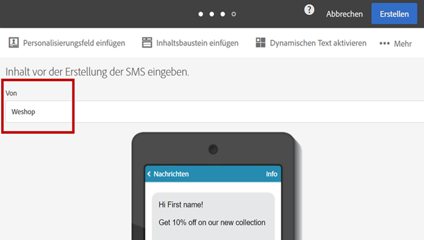

# SMS personalisieren{#personalizing-sms-messages}

Die Personalisierung von SMS erfolgt analog zu der von [E-Mail-Inhalten](../../designing/using/personalization.md#inserting-a-personalization-field). Beachten Sie jedoch die Transliterations-Optionen, die u. U. einen Einfluss auf den verwendeten Zeichensatz und somit auf die Anzahl an gesendeten SMS haben können. Lesen Sie diesbezüglich auch den Abschnitt [Transliteration und Länge von SMS](../../administration/using/configuring-sms-channel.md#sms-encoding--length-and-transliteration).

Das folgende Beispiel zeigt einen SMS-Inhalt mit Personalisierungsfeldern, welche je nachdem, ob die Transliteration aktiviert wird oder nicht, die Verwendung eines unterschiedlichen Zeichensatzes auslösen, was wiederum die Anzahl an zu sendenden SMS beeinflusst.

**Guten Tag &lt;Vorname> &lt;Nachname>, die neue Kollektion ist eingetroffen. Sehen und staunen Sie jetzt in Ihrem Shop!**

* Für einen Empfänger mit Namen &quot;Paul Schmidt&quot; wählt Adobe Campaign das GSM-Alphabet, welches bis zu 160 Zeichen pro SMS zulässt. Die Nachricht wird also in nur einer SMS gesendet.
* Bei einem Empfänger mit Namen &quot;Raphaël Laforêt&quot; sind die Zeichen &quot;ë&quot; und &quot;ê&quot; nicht im GSM-Alphabet enthalten. Abhängig von der Transliterations-Konfiguration bestehen zwei Möglichkeiten:

   * Wenn die Transliteration zugelassen wurde, werden &quot;ë&quot; und &quot;ê&quot; durch &quot;e&quot; ersetzt. Dies ermöglicht die Verwendung des GSM-Alphabets und lässt bis zu 160 Zeichen pro SMS zu. Die Nachricht wird also in nur einer SMS gesendet, allerdings in leicht abgewandelter Form.
   * Wenn die Transliteration nicht zugelassen wurde, sendet Adobe Campaign die Nachricht in Unicode und alle Zeichen werden unverändert übermittelt. Da SMS bei Verwendung des Unicode-Zeichensatzes auf 70 Zeichen begrenzt sind, wird Adobe Campaign die Nachricht automatisch in zwei Teilen senden.

>[!NOTE]
>
>Der Algorithmus, der automatisch den besten Zeichensatz auswählt, wird auf jede Nachricht einzeln angewendet. Dies bedeutet, dass nur die personalisierten Nachrichten, die nicht dem GSM-Alphabet entsprechen, in Unicode gesendet werden.

## SMS-Absender {#sms-sender}

>[!IMPORTANT]
>
>Überprüfen Sie bezüglich der Änderung des Absenders die gültige Rechtslage Ihres Landes. Stellen Sie außerdem sicher, dass Ihr SMS-Provider diese Funktionalität anbietet.

Die Option **[!UICONTROL Von]** erlaubt die Eingabe einer Zeichenfolge zur Personalisierung des SMS-Absenders. Es ist der hier eingegebene Name, der auf dem Mobiltelefon des Empfängers als Absender der SMS erscheint.

Bleibt das entsprechende Feld leer, wird die im externen Konto angegebene Anrufernummer verwendet. Sollte auch dort keine Anrufernummer gespeichert sein, wird die Kurzwahlnummer verwendet. Weiterführende Informationen zu SMS-spezifischen externen Konten finden Sie im Abschnitt [SMS-Routing definieren](../../administration/using/configuring-sms-channel.md#defining-an-sms-routing).

