# Push-Benachrichtigung vorbereiten und senden{#preparing-and-sending-a-push-notification}

## Benachrichtigung vorbereiten {#preparing-the-notification}

Die Erstellung einer Push-Benachrichtigung in Adobe Campaign umfasst folgende Etappen:

1. Erstellen Sie im Fenster **[!UICONTROL Marketingaktivitäten]** [eine neue Marketingaktivität](../../start/using/marketing-activities.md#creating-a-marketing-activity).

   Eine einzelne Push-Benachrichtigung kann auch in einer [Kampagne](../../start/using/marketing-activities.md#creating-a-marketing-activity) oder auf der [Startseite](../../start/using/interface-description.md#home-page) von Adobe Campaign erstellt werden.

   Es besteht außerdem die Möglichkeit, eine Aktivität für einen Push-Benachrichtigungsversand innerhalb eines Workflows zu verwenden. Diese Aktivität wird im Abschnitt [Push-Benachrichtigungsversand](../../automating/using/push-notification-delivery.md) beschrieben.

1. Wählen Sie **[!UICONTROL Push-Benachrichtigungen aus]**.
1. Wählen Sie eine Vorlage aus.

   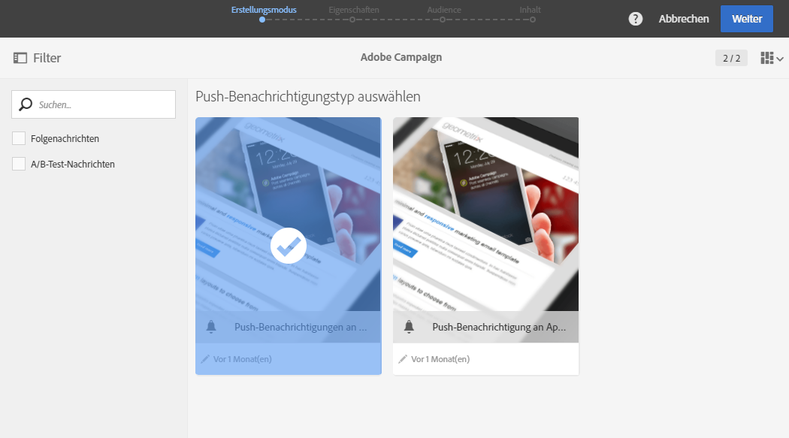

   Standardmäßig haben Sie die Wahl zwischen zwei Vorlagen:

   * **[!UICONTROL Push-Benachrichtigungen an Campaign-Profile senden]**: Verwenden Sie diese Vorlage, um die Adobe Campaign-CRM-Profile auszuwählen, die sich bei Ihrer Mobile App angemeldet und ausdrücklich um die Zusendung von Push-Benachrichtigungen ersucht haben. Sie können [Personalisierungsfelder](../../designing/using/personalization.md#inserting-a-personalization-field) in Ihre Push-Benachrichtigung einfügen, wie etwa den Vornamen des Empfängers.
   * **[!UICONTROL Push-Benachrichtigung an App-Abonnenten senden]**: Mit dieser Vorlage können Sie eine Push-Benachrichtigung an alle bekannten und anonymen Benutzer einer Mobile App senden, die Benachrichtigungen von Ihrer App erhalten möchten. Sie können diese Nachrichten mit Daten personalisieren, die von Ihrer Mobile App stammen.

   Es stehen auch mehrsprachige Vorlagen zur Auswahl. Weiterführende Informationen dazu finden Sie unter [Mehrsprachige Push-Benachrichtigungen erstellen](../../channels/using/creating-a-multilingual-push-notification.md).

   Weiterführende Informationen zu Vorlagen finden Sie im Abschnitt [Marketingaktivitäten-Vorlagen](../../start/using/marketing-activity-templates.md).

1. Geben Sie die Eigenschaften der Push-Benachrichtigung ein und wählen Sie im Feld **[!UICONTROL Mobile App einem Versand zuordnen]** die entsprechende Mobile App aus.

   Bitte beachten Sie, dass in der Dropdown-Liste sowohl SDK V4- als auch Experience Platform SDK-Anwendungen enthalten sind.

   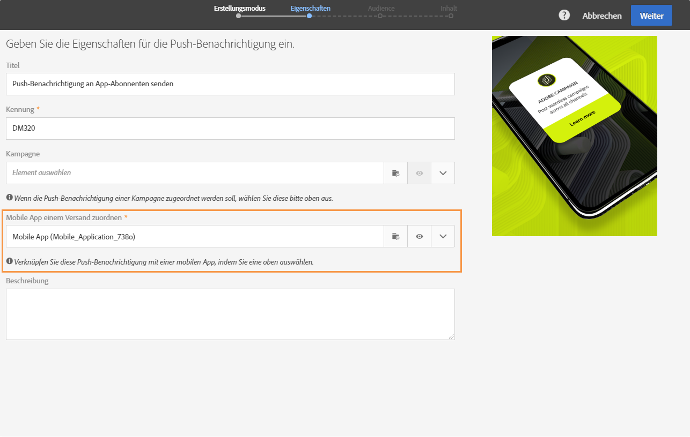

   Sie können die Push-Benachrichtigung mit einer Kampagne verknüpfen. Wählen Sie diese dazu aus den bereits existierenden Kampagnen aus.

1. Im darauffolgenden Bildschirm besteht die Möglichkeit, eine Audience zu definieren (beispielsweise alle VIP-Kunden, die eine bestimmte Mobile App abonniert haben). Weiterführende Informationen dazu finden Sie im Abschnitt [Erstellung von Audiences](../../audiences/using/creating-audiences.md).

   Ihre Audience wird automatisch auf der Basis der Mobile App gefiltert, die im vorherigen Schritt ausgewählt wurde.

   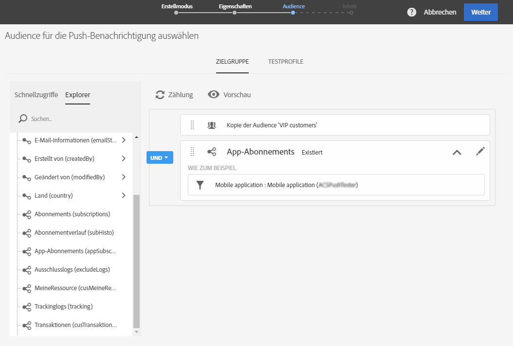

1. Sie können jetzt Ihre Push-Benachrichtigung anpassen. Wählen Sie zuerst den Nachrichtenstil aus: **[!UICONTROL Alert/Message/Badge]** oder **[!UICONTROL Stilles Pushen]**. Die Typen von Push-Benachrichtigungen werden im Abschnitt [Über Push-Benachrichtigungen](../../channels/using/about-push-notifications.md) beschrieben.

   Bearbeiten Sie den Inhalt Ihrer Push-Benachrichtigung und definieren Sie die erweiterten Optionen. Siehe [Push-Benachrichtigung anpassen](../../channels/using/customizing-a-push-notification.md).

   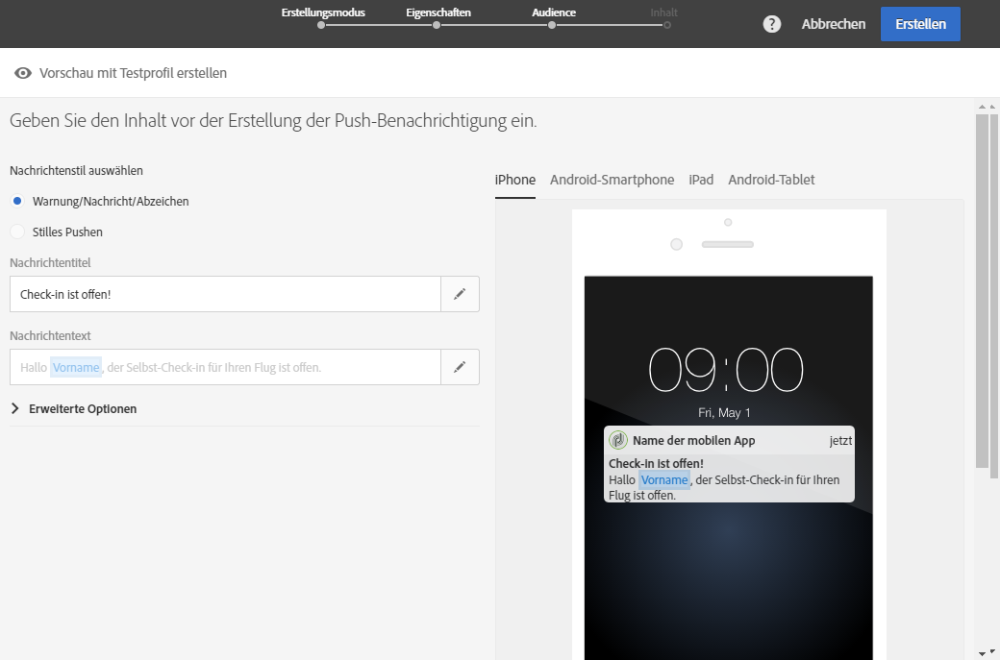

   Der Push-Benachrichtigungs-Inhalt und die Optionen, die hier konfiguriert werden, werden in Form von Payload an Ihr Mobile App übertragen. Die Struktur der Payload wird in der Technote [Understanding ACS push notifications payload structure](https://helpx.adobe.com/de/campaign/kb/understanding-campaign-standard-push-notifications-payload-struc.html) beschrieben.

1. Wählen Sie **[!UICONTROL Erstellen]** aus.

   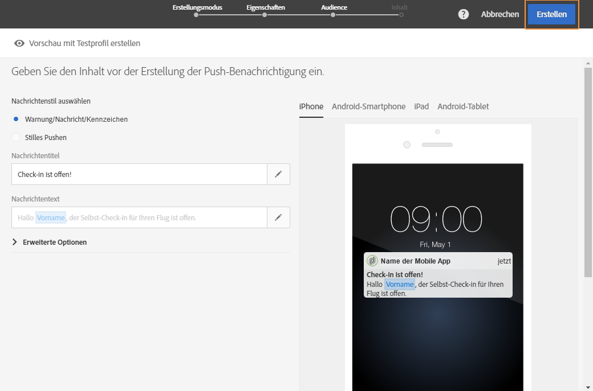

1. Vor dem Versand der Benachrichtigung können Sie diese mit Testprofilen testen und überprüfen, wie die Benachrichtigung in der Inbox der Empfänger dargestellt wird. Wählen Sie in der Versandzusammenfassung **[!UICONTROL Audiences]** und danach den Tab **[!UICONTROL Testprofile]** aus.

   Weiterführende Informationen zum Senden von Testnachrichten finden Sie in [Testprofile](../../sending/using/sending-proofs.md).

1. Wählen Sie Ihre Testprofile und danach **[!UICONTROL Vorschau]** aus, um die Benachrichtigung anzuzeigen: Der Inhalt wird mit den Daten des jeweiligen Testprofils personalisiert.
1. Überprüfen Sie das Layout der Push-Benachrichtigung auf unterschiedlichen Geräten: Wählen Sie iPhone, Android-Smartphone, iPad oder Android-Tablet aus, um sich die jeweilige Darstellung in der Vorschau anzusehen.

   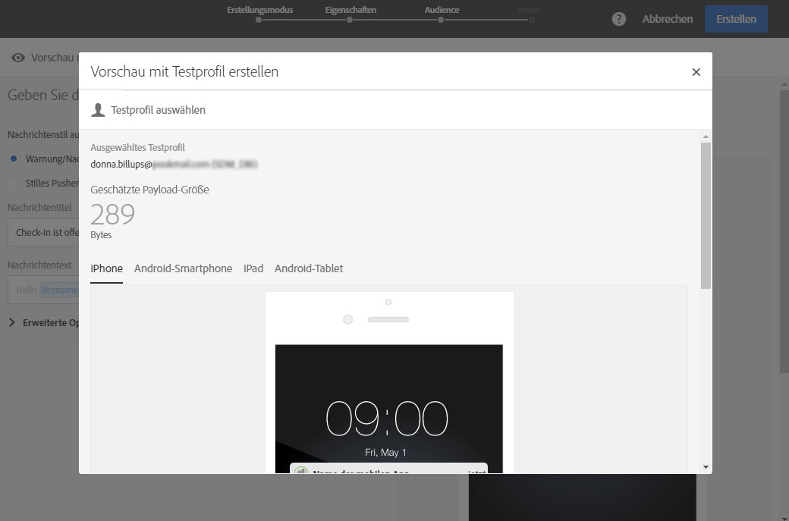

1. Die **[!UICONTROL Geschätzte Payload-Größe]** ist eine ungefähre Schätzung auf der Basis von Testprofildaten. Die tatsächliche Payload-Größe kann davon abweichen. Die maximale Größe einer Nachricht beträgt 4 KB.

   >[!CAUTION]
   >
   >Wenn die Payload-Größe die 4-KB-Grenze überschreitet, wird die Nachricht nicht zugestellt.

Beachten Sie, dass sich Personalisierungsdaten auf die Größe der Nachricht auswirken.

## Benachrichtigung senden {#sending-the-notification}

Push-Benachrichtigungen können an eine ausgewählte Audience in Adobe Campaign gesendet werden, indem die Kriterien der Audience definiert werden. Beispielsweise besteht die unten ausgewählte Audience aus vier Mobile-App-Abonnenten.

1. Wählen Sie **[!UICONTROL Vorbereiten]** aus, um die Zielgruppe zu berechnen und die Benachrichtigungen zu erstellen.

   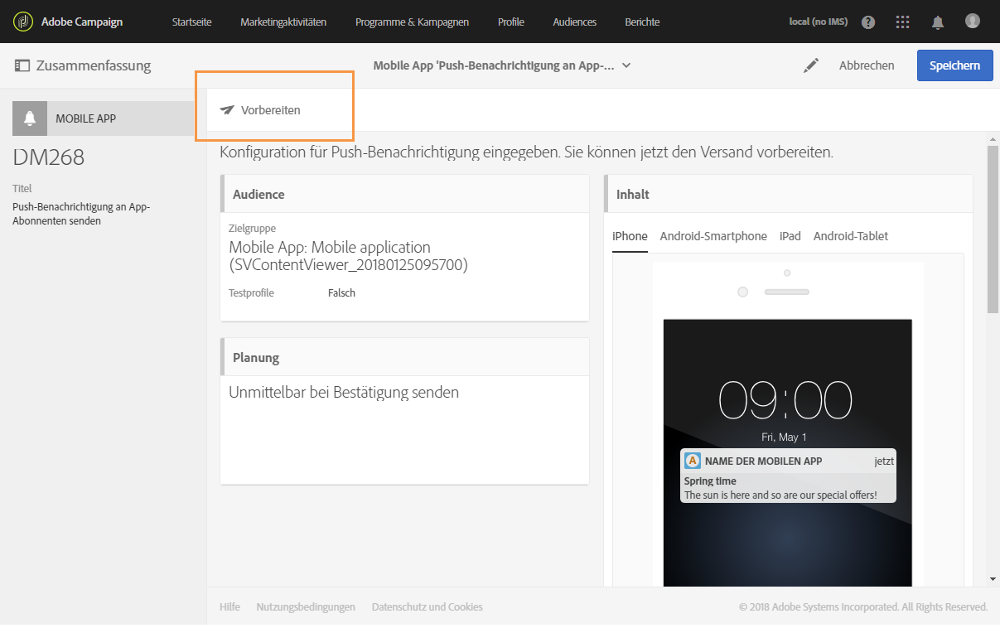

1. Nach dem erfolgreichen Abschluss der Vorbereitung werden im Fenster **[!UICONTROL Freigabe]** die folgenden KPIs angezeigt: **[!UICONTROL Zielgruppe]** und **[!UICONTROL Zu senden]**. Beachten Sie, dass die Anzahl der Profile in **[!UICONTROL Zu senden]** aufgrund von Ausschlüssen niedriger ist als in **[!UICONTROL Zielgruppe]**. Die Ausschlüsse können durch Auswahl der Schaltfläche  am unteren Rand des Fensters **[!UICONTROL Freigabe]** aufgerufen werden.

   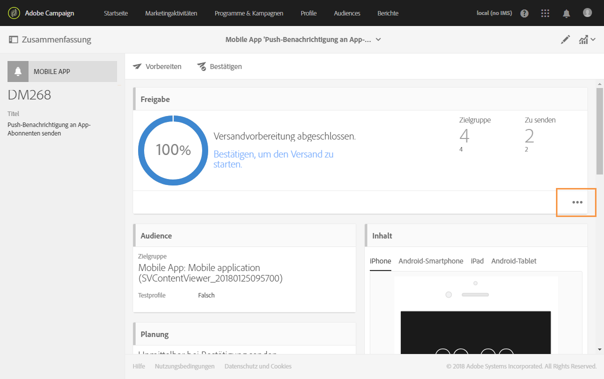

1. Im Tab **[!UICONTROL Ausschlusslogs]** befinden sich die Liste aller vom Versand an die Zielgruppe ausgeschlossenen Nachrichten sowie der Ausschlussgrund.

   In unserem Beispiel sehen wir, dass einer unserer Mobile-App-Abonnenten ausgeschlossen wurde, weil seine Adresse auf der Blockierungsliste steht, und die anderen Abonnenten, weil ihr Profil eine Dublette war.

   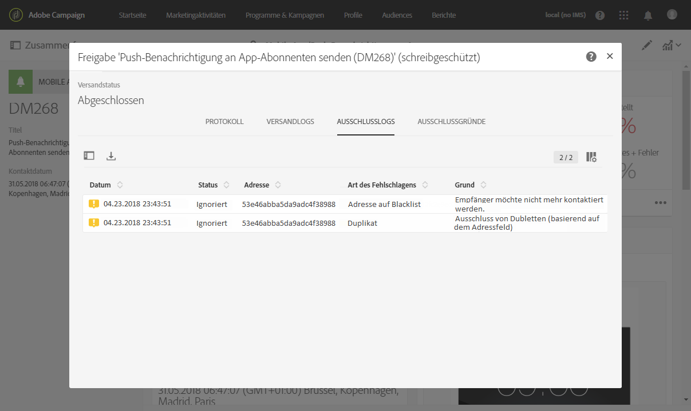

1. Wählen Sie den Tab **[!UICONTROL Ausschlussgründe]** aus, um die Anzahl der ausgeschlossenen Nachrichten anzuzeigen.

   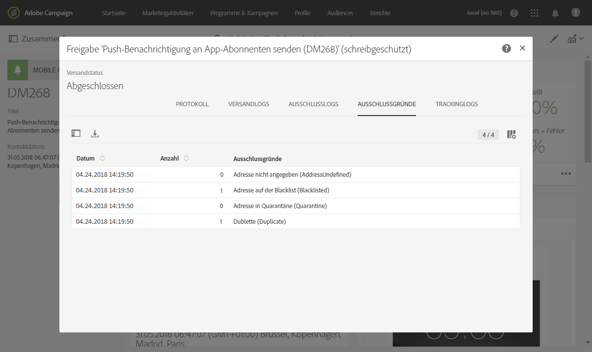

1. Wählen Sie dann **[!UICONTROL Bestätigen]** aus, um mit dem Versand der Push-Benachrichtigungen zu beginnen.
1. Prüfen Sie den Status Ihres Versands über das Nachrichten-Dashboard und die entsprechenden Protokolle. Weiterführende Informationen dazu finden Sie unter [Nachrichten versenden](../../sending/using/confirming-the-send.md) und [Versandlogs](../../sending/using/monitoring-a-delivery.md#delivery-logs).

   In diesem Beispiel wird im Nachrichten-Dashboard angezeigt, dass Adobe Campaign versucht hat, zwei Push-Benachrichtigungen zu senden: eine wurde erfolgreich zugestellt und die andere ist fehlgeschlagen. Wenn Sie feststellen möchten, warum der Versand Fehler enthält, wählen Sie die Schaltfläche  am unteren Rand des Fensters **[!UICONTROL Freigabe]** aus.

   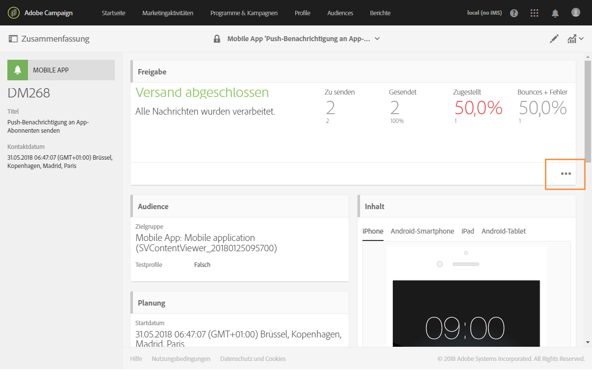

1. Wählen Sie im Fenster **[!UICONTROL Freigabe]** den Tab **[!UICONTROL Versandlogs]** aus, um auf die Liste gesendeter Push-Benachrichtigungen und ihren Status zuzugreifen. Bei diesem Versand wurde die eine Push-Benachrichtigung erfolgreich gesendet, während die andere wegen eines fehlerhaften Geräte-Tokens fehlgeschlagen ist. Dieser Abonnent wird dann auf die Blockierungsliste gesetzt und erhält keine weiteren Sendungen mehr.

   >[!NOTE]
   >
   >Die Gründe dafür können diverse Fehler im Anschluss an die Verarbeitung durch Adobe Campaign sein. Im Fall von Fehlern beim Provider, wie apns und FCM, werden diese im Grund aufgeführt. Weiterführende Informationen über Fehler bei Providern finden Sie in der Dokumentation von [Apple](https://developer.apple.com/library/content/documentation/NetworkingInternet/Conceptual/RemoteNotificationsPG/CommunicatingwithAPNs.html) und [Android](https://firebase.google.com/docs/cloud-messaging/http-server-ref).

   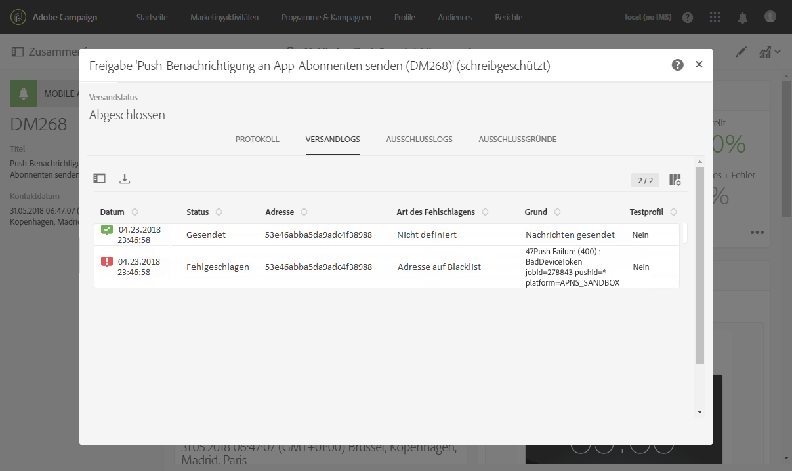

Jetzt können Sie die Wirkung Ihres Push-Benachrichtigungs-Versands mit dynamischen Berichten ermitteln.

**Verwandte Themen:**

* [Bericht zu Push-Benachrichtigungen](../../reporting/using/push-notification-report.md)
* [Push-Benachrichtigungen in einem Workflow versenden](../../automating/using/push-notification-delivery.md)
