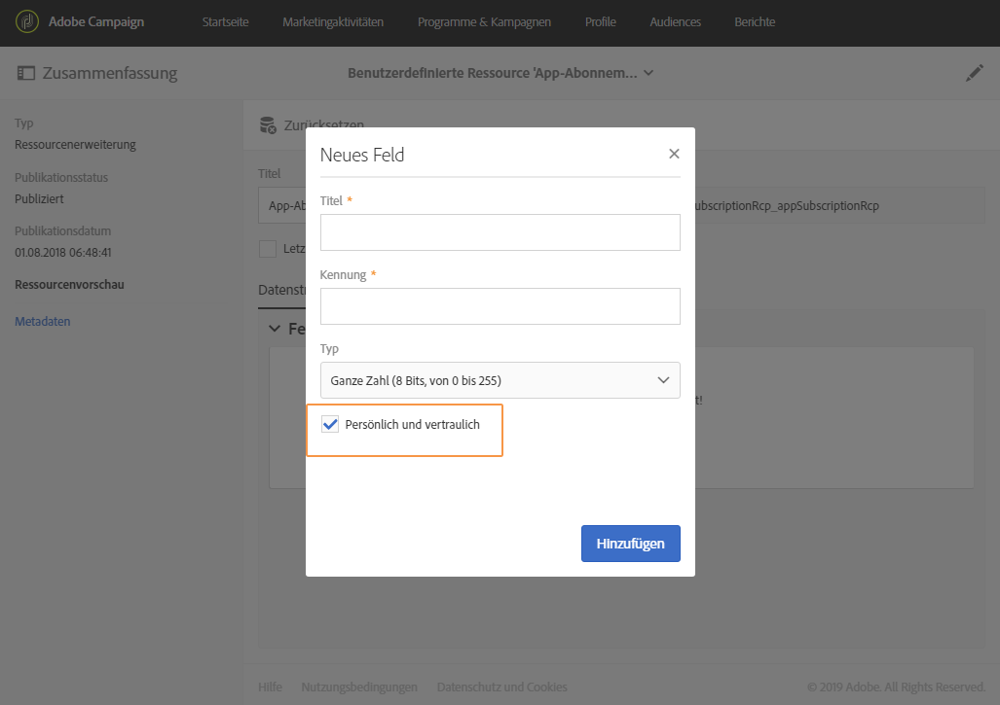
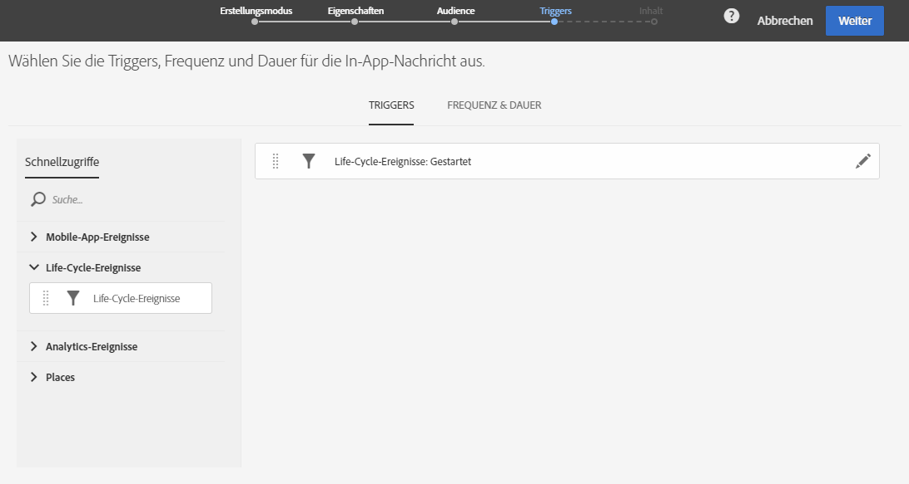

# In-App-Nachricht vorbereiten und senden{#preparing-and-sending-an-in-app-message}

>[!NOTE]
>
>Die In-App-Personalisierung wird über ein Verknüpfungsfeld durchgeführt, in dem normalerweise die CRM-ID und/oder die Login-Kennung der Mobile App eingetragen wird. Sie sind allein verantwortlich für die Sicherung dieses Verknüpfungsfeldes und dessen Verwendung in Verbindung mit Adobe Campaign. Wenn Sie Ihr Verknüpfungsfeld nicht ausreichend schützen, könnte die Sicherheit Ihrer personalisierten Nachricht beeinträchtigt werden. Adobe ist nicht für Schäden haftbar, die durch den unbefugten Zugriff oder die unbefugte Verwendung von Profildaten entstehen, falls Sie keine sicheren Verfahren zur Erstellung, Verwaltung und zum Schutz von Verknüpfungsfeldern anwenden.

In Adobe Campaign sind drei Arten von In-App-Nachrichten verfügbar:

* **[!UICONTROL Nutzer der Zielgruppe auf der Basis ihres Campaign-Profils (inAppProfile)]**: Mit diesem Nachrichtentyp können Sie Adobe Campaign-Profile (CRM-Profile) auswählen, die sich für Ihre Mobile App angemeldet haben. Dieser Nachrichtentyp kann mit allen in Adobe Campaign verfügbaren Profilattributen personalisiert werden, erfordert aber einen sicheren Handshake zwischen dem Mobile SDK und dem In-App-Messaging-Dienst von Campaign, um sicherzustellen, dass Nachrichten mit personenbezogenen und sensiblen Informationen nur von autorisierten Benutzern verwendet werden.

   Um diesen Nachrichtentyp mit den Geräten der Benutzer herunterzuladen, muss das Mobile SDK Verknüpfungsfelder zur Verknüpfung eines mobilen Profils mit einem CRM-Profil in Adobe Campaign senden. Weiterführende Informationen zu SDK APIs zur Unterstützung von In-App-Nachrichten finden Sie auf dieser [Seite](https://aep-sdks.gitbook.io/docs/using-mobile-extensions/adobe-campaign-standard/adobe-campaign-standard-api-reference).

* **[!UICONTROL Alle Nutzer einer Mobile App auswählen (inAppBroadcast)]**: Mit diesem Nachrichtentyp können Sie Nachrichten an alle (aktuellen oder künftigen) Benutzer Ihrer Mobile App senden, selbst wenn in Adobe Campaign kein Profil existiert. Bei der Anpassung der Nachrichten ist daher keine Personalisierung möglich, da das Benutzerprofil in Adobe Campaign ggf. gar nicht existiert.
* **[!UICONTROL Nutzer der Zielgruppe auf der Basis ihres mobilen Profils (inApp)]**: Mit diesem Nachrichtentyp können Sie alle bekannten oder anonymen Benutzer einer Mobile App auswählen, von denen ein mobiles Profil in Campaign existiert. Dieser Nachrichtentyp kann nur mit nicht-personenbezogenen und nicht-sensiblen Attributen personalisiert werden und benötigt auch keinen sicheren Handshake zwischen dem Mobile SDK und dem In-App-Messaging-Dienst von Adobe Campaign.

   Weiterführende Informationen zur Verwendung personenbezogener und sensibler Daten finden Sie im Abschnitt [Mobile Profilfelder mit personenbezogenen und sensiblen Daten verwenden](#handling-mobile-profile-fields-with-personal-and-sensitive-data).

## Mobile Profilfelder mit personenbezogenen und sensiblen Daten verwenden     {#handling-mobile-profile-fields-with-personal-and-sensitive-data}

In Adobe Campaign sind Attribute zu mobilen Profilen, die von Mobilgeräten gesendet werden, in der Ressource **[!UICONTROL App-Abonnements (appSubscriptionRcp)]** gespeichert. Dort können die Daten definiert werden, die über die Abonnenten Ihrer Apps gesammelt werden sollen.

Diese Ressource muss erweitert werden, damit die gewünschten, vom Mobilgerät an Adobe Campaign gesendeten Daten gesammelt werden. Eine detaillierte Anleitung dazu finden Sie auf dieser [Seite](../../developing/using/extending-the-subscriptions-to-an-application-resource.md).

Um eine sichere Personalisierung Ihrer In-App-Nachrichten zu ermöglichen, müssen die Profilfelder der Mobile App entsprechend konfiguriert werden. Aktivieren Sie in **[!UICONTROL App-Abonnements (appSubscriptionRcp)]** bei der Erstellung der neuen Profilfelder für eine Mobile App die Option **[!UICONTROL Persönlich und vertraulich]**, damit sie bei der Personalisierung von In-App-Nachrichten nicht verfügbar sind.

>[!NOTE]
>
>Wenn zu dieser Tabelle bereits eine Implementierung mit einer benutzerdefinierten Ressourcenerweiterung besteht, empfehlen wir, die Felder entsprechend zu benennen, bevor sie zur Personalisierung von In-App-Nachrichten verwendet werden.

Sobald die benutzerdefinierte Ressource **[!UICONTROL App-Abonnements]** konfiguriert und publiziert wurde, können Sie mit der Vorbereitung Ihres In-App-Versands mit der Vorlage **[!UICONTROL Nutzer der Zielgruppe auf der Basis ihres mobilen Profils (inApp)]** beginnen. Zur Personalisierung stehen dann in der Ressource **[!UICONTROL App-Abonnements (appSubscriptionRcp)]** nur nicht-sensible Felder zur Verfügung.

Wenn Sie eine Personalisierung mit den Feldern **Persönlich und vertraulich** durchführen möchten, empfehlen wir die Verwendung der Vorlage **[!UICONTROL Nutzer der Zielgruppe auf der Basis ihres Campaign-Profils (inAppProfile)]**, die zusätzliche Sicherheitsfunktionen aufweist, sodass die personenbezogenen Daten Ihrer Benutzer geschützt bleiben.

## In-App-Nachricht vorbereiten {#preparing-your-in-app-message}

Die Erstellung einer einzelnen In-App-Nachricht in Adobe Campaign umfasst folgende Schritte:

1. Wählen Sie ausgehend von der Startseite von Adobe Campaign die Karte **[!UICONTROL In-App-Messaging]** aus.

   Sie können eine In-App-Nachricht auch im Tab **Marketingaktivitäten** erstellen, indem Sie die Schaltfläche **[!UICONTROL Erstellen]** auswählen.

   Eine In-App-Nachricht kann auch in einer Kampagne, auf der Startseite von Adobe Campaign oder in einem Workflow erstellt werden.

1. Wählen Sie **In-App-Nachricht** aus.

   

1. Wählen Sie eine zur Zielgruppe der Audience passende Vorlage aus.

   

   Standardmäßig haben Sie die Wahl zwischen drei nativen Vorlagen:

   * **[!UICONTROL Nutzer der Zielgruppe auf der Basis ihres Campaign-Profils (inAppProfile)]**
   * **[!UICONTROL Alle Nutzer einer mobilen App auswählen (inAppBroadcast)]**
   * **[!UICONTROL Nutzer der Zielgruppe auf der Basis ihres mobilen Profils (inApp)]**

1. Geben Sie die Eigenschaften der In-App-Nachricht ein und wählen Sie im Feld **[!UICONTROL Mobile App einem Versand zuordnen]** die entsprechende Mobile App aus. Hinweis: Wenn Sie Ihre Mobile App nicht mit Adobe Campaign Standard konfiguriert haben, wird sie nicht in der Liste angezeigt. Weiterführende Informationen zur Konfiguration von Mobile Apps finden Sie auf dieser [Seite](https://helpx.adobe.com/de/campaign/kb/configuring-app-sdk.html#ChannelspecificapplicationconfigurationinAdobeCampaign).

   

1. Wählen Sie die Audience für Ihre In-App-Nachricht aus. Ihre Audience wird entsprechend der mit dem Versand verknüpften Mobile App vorab gefiltert.

   Bitte beachten Sie, dass dieser Schritt bei der Option **[!UICONTROL In-App-Broadcast-Nachricht senden (inAppBroadcast)]** nicht nötig ist, da hier alle Benutzer einer Mobile App ausgewählt werden.

   

1. Ziehen Sie das Ereignis, das Ihre Nachricht auslösen soll, in den Tab **[!UICONTROL Triggers]**. Durch die Auswahl eines Triggers definieren Sie eine Benutzeraktion, die die Anzeige einer In-App-Nachricht auslöst.

   Vier Ereigniskategorien sind verfügbar:

   * **[!UICONTROL Mobile-App-Ereignisse]**: Benutzerdefinierte Ereignisse, die in Ihrer Mobile App implementiert sind.

      Weiterführende Informationen zum Erstellen von Ereignissen finden Sie auf dieser [Seite](https://helpx.adobe.com/de/campaign/kb/configuring-app-sdk.html).

   * **[!UICONTROL Life-Cycle-Ereignisse]**: Native Life-Cycle-Ereignisse, die vom Adobe Mobile SDK unterstützt werden.

      Weiterführende Informationen zu Life-Cycle-Ereignissen finden Sie auf dieser [Seite](https://docs.adobe.com/content/help/de-DE/mobile-services/android/metrics.html).

   * **[!UICONTROL Analytics-Ereignisse]**: Je nach der Konfiguration Ihrer Mobile App werden die folgenden drei Kategorien unterstützt: Adobe Analytics, Kontextdaten oder Ansichtsstatus.

      Bitte beachten Sie, dass diese Ereignisse nur verfügbar sind, wenn Sie eine Adobe Analytics-Lizenz besitzen.

   * **[!UICONTROL Places]**: Die folgenden drei Kategorien nutzen Echtzeit-Standortdaten, um kontextuell relevante mobile Erlebnisse bereitzustellen: Places-Kontextdaten, benutzerdefinierte Places-Metadaten oder Places-Ereignistyp.

      Weiterführende Informationen zu Adobe Places finden Sie in der [Places-Dokumentation](https://placesdocs.com/).
   

1. Bei der Verwendung der Funktion **[!UICONTROL Analytics-Ereignisse]** werden Adobe Analytics- und Ansichtsstatus-Ereignisse abhängig von den in der Analytics-Erweiterung in Adobe Experience Platform Launch konfigurierten Report Suites automatisch mit Daten befüllt, während Kontextdaten-Ereignisse manuell hinzugefügt werden müssen.

   Bitte beachten Sie, dass diese Ereignisse nur verfügbar sind, wenn Sie eine Adobe Analytics-Lizenz besitzen.

   

1. Wenn Sie einen **[!UICONTROL Places]**-Trigger verwenden, werden Places-Kontextdaten, benutzerdefinierte Places-Metadaten oder der Places-Ereignistyp auf der Basis aller Bibliotheken und ihrer in Adobe Places erstellten POIs automatisch eingefügt.

   Beachten Sie, dass dieser Trigger auf dem Gerät nur für die POIs aus den Bibliotheken angewendet wird, die in der Places-Erweiterung in Experience Platform Launch ausgewählt wurden. Weiterführende Informationen zur Places-Erweiterung und deren Installation finden Sie in dieser [Dokumentation](https://docs.adobe.com/content/help/de-DE/places/using/places-ext-aep-sdks/places-extension/places-extension.html).

1. Wählen Sie im Tab **[!UICONTROL Frequenz &amp; Dauer]** die Häufigkeit für Ihren Trigger, das Start- und Enddatum sowie den Wochentag und die Uhrzeit, zu der Ihre In-App-Nachricht aktiv sein soll.

   

1. Bearbeiten Sie den Inhalt Ihrer Nachricht und definieren Sie die erweiterten Optionen. Siehe [In-App-Nachricht anpassen](https://helpx.adobe.com/de/campaign/standard/channels/using/customizing-an-in-app-message.html).

   

1. Wählen Sie **[!UICONTROL Erstellen]** aus.

Ihre In-App-Nachricht ist jetzt bereit für den Versand an Ihre ausgewählte Audience.

**Verwandte Themen:**

* [In-App-Nachricht anpassen](../../channels/using/customizing-an-in-app-message.md)
* [In-App-Bericht](../../reporting/using/in-app-report.md)
* [In-App-Nachricht in einem Workflow senden](../../automating/using/in-app-delivery.md)

## In-App-Nachricht senden {#sending-your-in-app-message}

Nach erfolgreicher Vorbereitung und Validierung Ihres Versands können Sie die Nachricht senden.

1. Wählen Sie **[!UICONTROL Vorbereiten]** aus, um die Zielgruppe zu berechnen und die Nachrichten zu erstellen.

   

1. Nach dem erfolgreichen Abschluss der Vorbereitung werden im Fenster **Freigabe** die folgenden KPIs angezeigt: **Zielgruppe** und **Zu senden**.

   Sie können durch Auswahl der Schaltfläche  das Freigabe-Fenster auf potenzielle Ausschlüsse oder Versandfehler prüfen.

   

1. Wählen Sie **[!UICONTROL Bestätigen]** aus, um mit dem Versand Ihrer In-App-Nachricht zu beginnen.

   

1. Prüfen Sie den Status Ihres Versands über das Nachrichten-Dashboard und die entsprechenden Protokolle. Weiterführende Informationen hierzu finden Sie in diesem [Abschnitt](../../sending/using/monitoring-a-delivery.md).

   Die KPI-Zählungen **[!UICONTROL Zugestellt]** und **[!UICONTROL Gesendet]** repräsentieren die erfolgreichen Sendungen von Campaign zum Nachrichtenversanddienst. Bitte beachten Sie, dass diese KPIs kein Hinweis auf die Anzahl der Mobilgeräte ist, die die Nachricht vom Nachrichtenversanddienst erhalten oder heruntergeladen haben.

   

1. Messen Sie die Wirksamkeit Ihrer In-App-Nachrichten mit Versandberichten. Weiterführende Informationen zum Reporting finden Sie in [diesem Abschnitt](../../reporting/using/in-app-report.md).

**Verwandte Themen:**

* [In-App-Bericht](../../reporting/using/in-app-report.md)
* [In-App-Nachricht in einem Workflow senden](../../automating/using/in-app-delivery.md)
