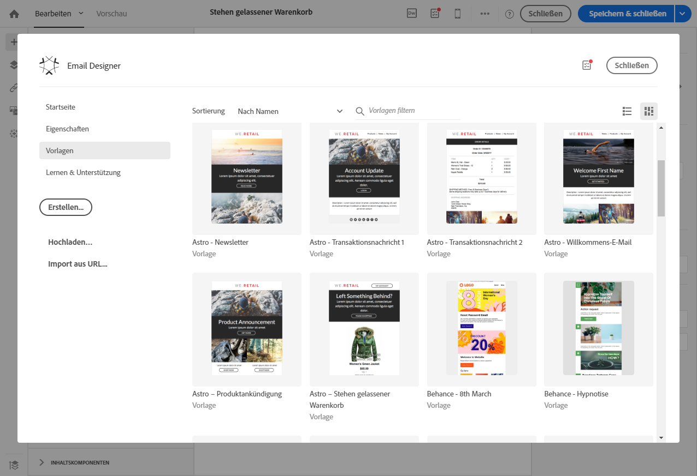

# Profil-Transaktionsnachrichten{#profile-transactional-messages}

Sie können Transaktionsnachrichten basierend auf Kunden-Marketing-Profilen versenden, bei denen Sie folgende Möglichkeiten haben:

* Marketing-Typologieregeln wie **[!UICONTROL Adresse auf Blockierungsliste]** oder [Ermüdungsregeln](../../sending/using/fatigue-rules.md) anwenden
* einen Abmelde-Link in die Nachricht einfügen
* die Transaktionsnachrichten zur allgemeinen Versandberichterstattung hinzufügen
* Die Transaktionsnachrichten für die Customer Journey nutzen

Nach der Erstellung und Publikation des gewünschten Ereignisses (im vorliegenden [Beispiel](../../channels/using/getting-started-with-transactional-msg.md#transactional-messaging-operating-principle) &quot;Stehen gelassener Warenkorb&quot;) wird die entsprechende Transaktionsnachricht automatisch erstellt.

Die Konfigurationsschritte finden Sie in Abschnitt [Ereignis konfigurieren, um eine Profil-Transaktionsnachricht zu senden](../../administration/using/configuring-transactional-messaging.md#use-case--configuring-an-event-to-send-a-transactional-message).

Damit das Ereignis mit dem Versand einer Transaktionsnachricht einhergeht, muss diese Nachricht personalisiert, getestet und dann publiziert werden.

>[!NOTE]
>
>Sie können nur dann auf Transaktionsnachrichten zugreifen, wenn Sie der Sicherheitsgruppe **[!UICONTROL Administratoren (alle Einheiten)]** angehören.
>
>Ermüdungsregeln sind mit Profil-Transaktionsnachrichten kompatibel. Näheres dazu finden Sie unter [Ermüdungsregeln](../../sending/using/fatigue-rules.md).

## Profil-Transaktionsnachricht senden    {#sending-a-profile-transactional-message}

Die Schritte für das Erstellen, Personalisieren und Publizieren einer Profil-Transaktionsnachricht sind mit denen einer Ereignis-Transaktionsnachricht identisch. Siehe [Ereignis-Transaktionsnachrichten](../../channels/using/event-transactional-messages.md).

Die Unterschiede sind unten aufgeführt.

1. Rufen Sie die erstellte Transaktionsnachricht auf, um sie zu bearbeiten.
1. Wählen Sie in der Transaktionsnachricht den Bereich **[!UICONTROL Inhalt]** aus. Anstelle der Transaktionsvorlage können Sie auch eine beliebige E-Mail-Vorlage auswählen, die auf die Ressource **[!UICONTROL Profil]** ausgerichtet ist.

   

1. Wählen Sie die Standard-E-Mail-Vorlage aus.

   Wie alle Marketing-E-Mails enthält sie einen Abmelde-Link.

   

   Außerdem haben Sie im Gegensatz zu auf Echtzeit-Ereignissen basierenden Konfigurationen direkten Zugriff auf alle Profilinformationen, um die Nachricht zu personalisieren. Siehe [Personalisierungsfelder einfügen](../../designing/using/personalization.md#inserting-a-personalization-field).

1. Speichern Sie Ihre Änderungen und publizieren Sie die Nachricht. Siehe [Transaktionsnachricht publizieren](../../channels/using/event-transactional-messages.md#publishing-a-transactional-message).

## Versand einer Profil-Transaktionsnachricht verfolgen    {#monitoring-a-profile-transactional-message-delivery}

Nachdem die Nachricht publiziert wurde und Ihre Webseiten-Integration abgeschlossen ist, kann der Versand verfolgt werden.

1. Der Zugriff auf den Versandlog der Nachricht ist über die Schaltfläche rechts unten in der **[!UICONTROL Freigabe]**-Kachel möglich.

   Weiterführende Informationen zum Zugriff auf Logs finden Sie im Abschnitt [Versand verfolgen](../../sending/using/monitoring-a-delivery.md).

1. Wählen Sie den Tab **[!UICONTROL Versandlogs]** aus. In der **[!UICONTROL Status]**-Spalte zeigt **[!UICONTROL Gesendet]** an, dass sich ein Profil angemeldet hat.

   

1. Wählen Sie den Tab **[!UICONTROL Ausschlusslogs]** aus, um die Empfänger anzuzeigen, die von der Versandzielgruppe ausgeschlossen wurden, wie zum Beispiel Adressen auf der Blockierungsliste.

   

Profile, die sich abgemeldet haben, wurden durch die Typologieregel **[!UICONTROL Adresse auf der Blockierungsliste]** ausgeschlossen.

Diese Regel ist Teil einer spezifischen Typologie, die für alle auf der **[!UICONTROL Profil]**-Tabelle basierenden Transaktionsnachrichten gilt.

**Verwandte Themen**:

* [Webseiten-Integration](../../administration/using/configuring-transactional-messaging.md#integrating-the-triggering-of-the-event-in-a-website)
* [Typologien](../../sending/using/about-typology-rules.md)

