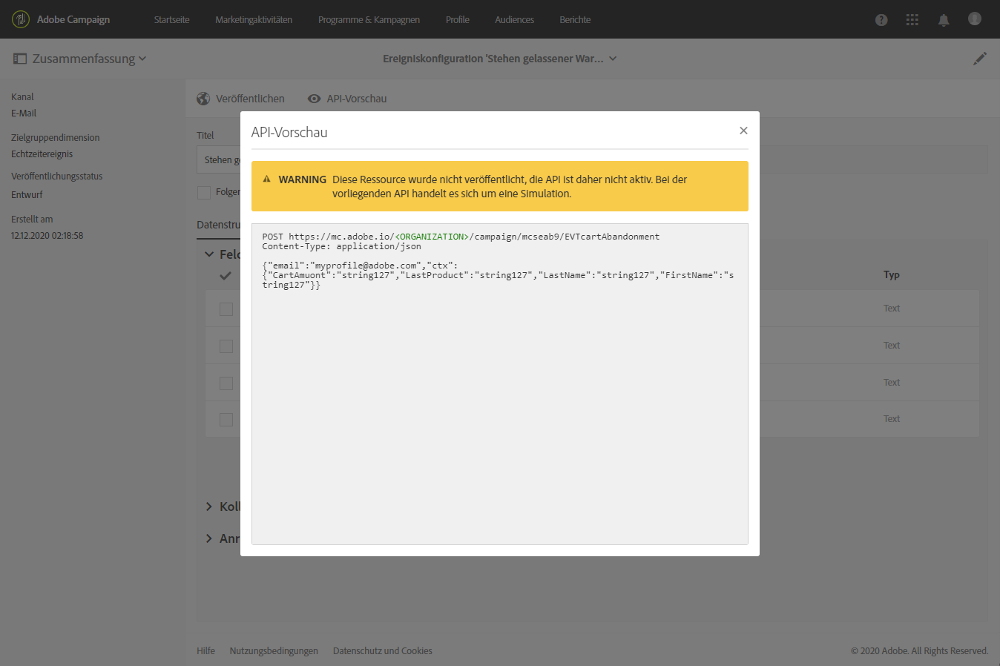
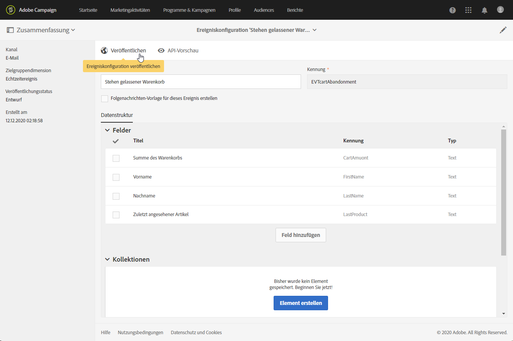
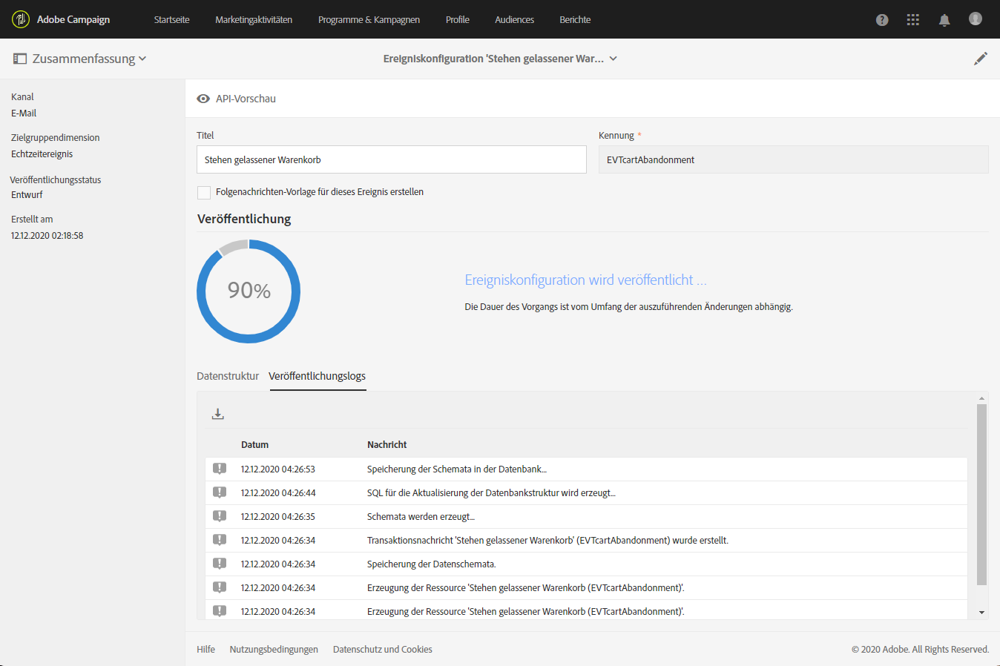
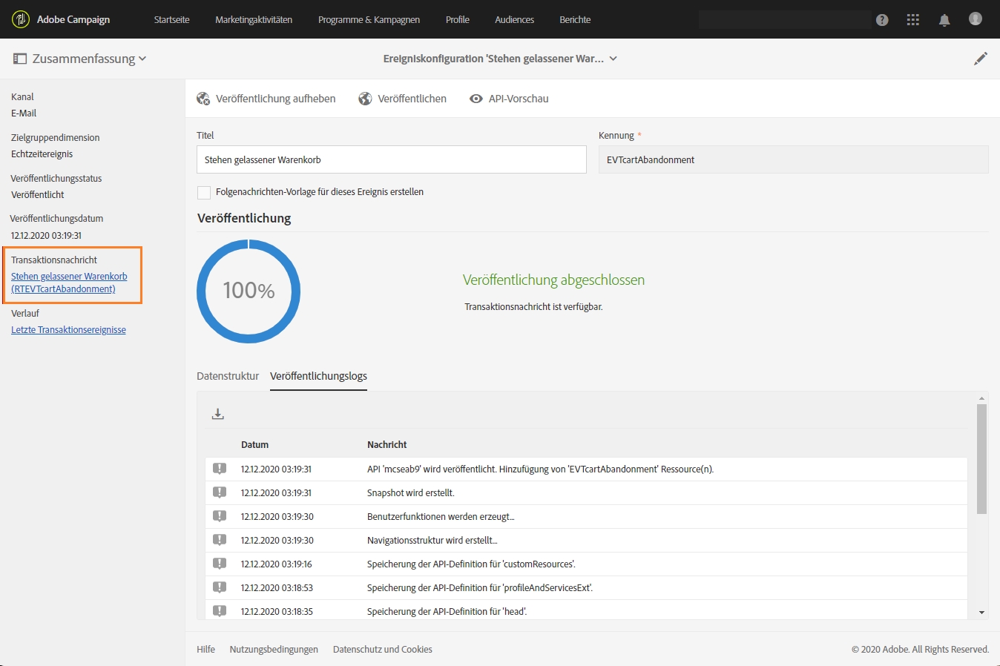
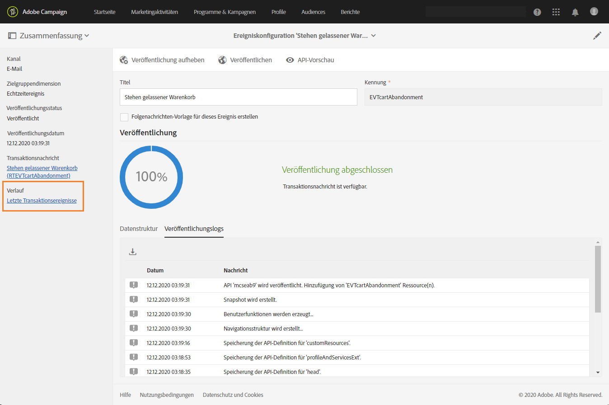
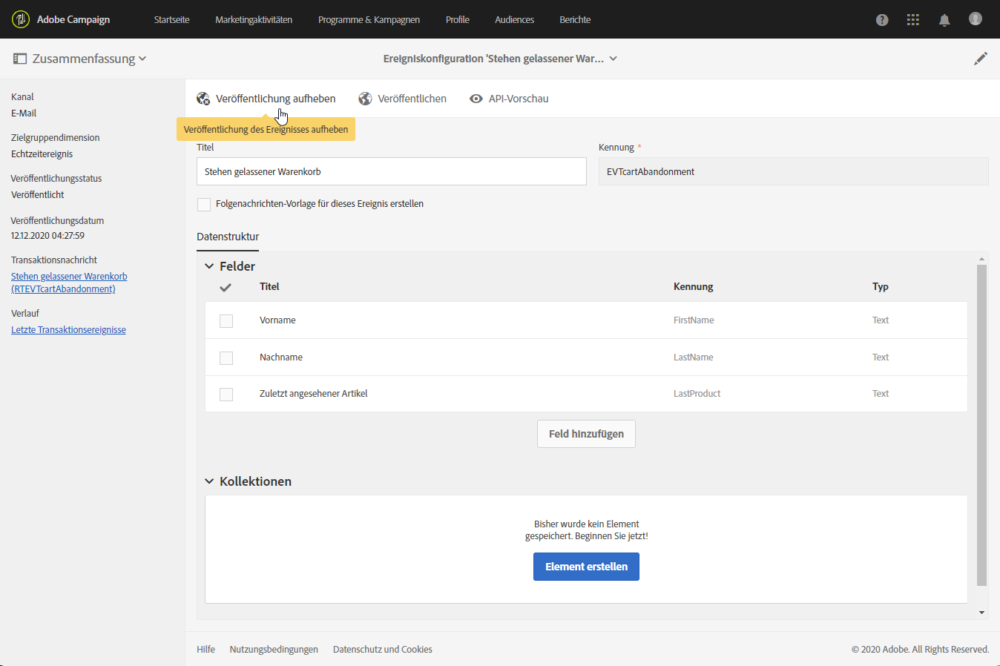
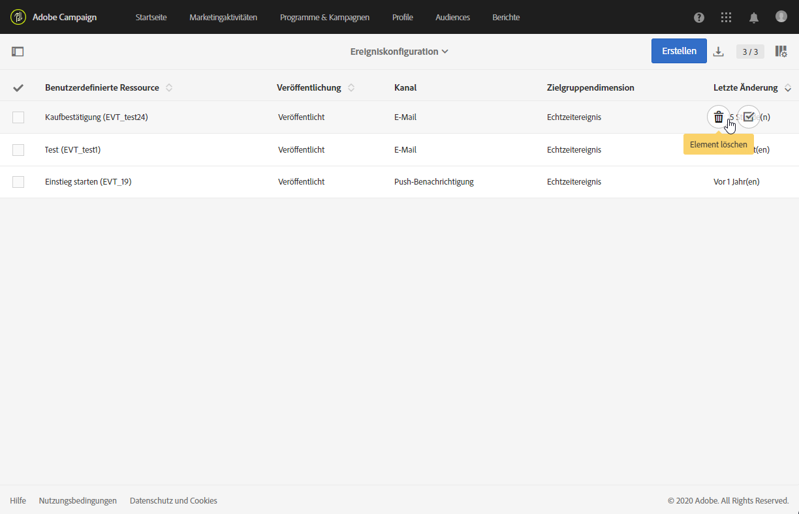
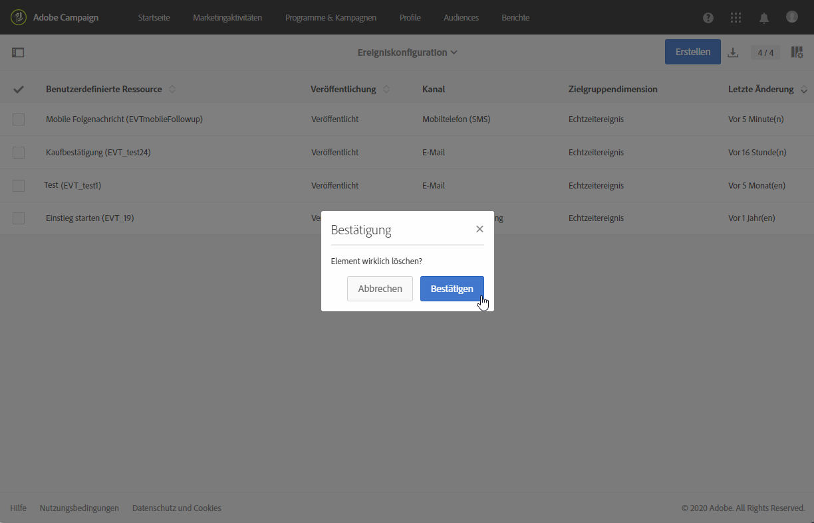

# Veröffentlichen eines transaktionalen Ereignisses {#publishing-transactional-event}

Sobald [configuration](../../channels/using/configuring-transactional-event.md) abgeschlossen ist, kann das Ereignis veröffentlicht werden. Die Schritte zum Vorschauen, Veröffentlichen, Rückgängigmachen der Veröffentlichung und Löschen eines Ereignisses werden nachfolgend beschrieben.

>[!IMPORTANT]
>
>Die Konfiguration und Veröffentlichung des Ereignisses muss von einem [administrator](../../administration/using/users-management.md#functional-administrators) durchgeführt werden.

Eine Grafik, die den gesamten Veröffentlichungsprozess für Transaktionsnachrichten einschließlich der Konfigurationen für Veröffentlichungs- und Rückgängigmachen der Veröffentlichung von Ereignissen veranschaulicht, finden Sie in [diesem Abschnitt](../../channels/using/publishing-transactional-message.md).

Nach der Veröffentlichung:
* Die entsprechende Transaktionsnachricht wird automatisch erstellt. Siehe [Bearbeiten von Transaktionsnachrichten](../../channels/using/editing-transactional-message.md).
* Die von Ihrem Website-Entwickler verwendete API wird bereitgestellt und die Transaktionsereignisse können jetzt gesendet werden. Siehe Integrate Ereignis trigating(../../channels/using/getting-started-with-transactional-msg.md#integrate-Ereignis-trigger).

## Vorschau erstellen und Ereignis publizieren {#previewing-and-publishing-the-event}

Bevor Sie das Ereignis verwenden können, müssen Sie eine Vorschau erstellen und es publizieren.

1. Verwenden Sie die Schaltfläche **[!UICONTROL API-Vorschau]**, um eine Simulation der von Ihrem Web-Entwickler verwendeten REST-API anzuzeigen, bevor sie publiziert wird.

   Nach der Publikation des Ereignisses dient diese Schaltfläche des Weiteren dazu, eine Vorschau der in Produktion befindlichen API anzuzeigen. Siehe Integrate Ereignis trigating(../../channels/using/getting-started-with-transactional-msg.md#integrate-Ereignis-trigger).

   

   >[!NOTE]
   >
   >Die REST-API variiert je nach ausgewähltem Kanal und nach ausgewählter Zielgruppendimension. Weiterführende Informationen zu den unterschiedlichen Konfigurationen finden Sie unter [Konfigurationen für Transaktionsereignisse](../../channels/using/configuring-transactional-event.md#transactional-event-specific-configurations).

1. Starten Sie mit der Schaltfläche **[!UICONTROL Publizieren]** die Publikation.

   

   Die von Ihrem Website-Entwickler verwendete API wird bereitgestellt und die Transaktionsereignisse können jetzt gesendet werden.

1. Die Publikationslogs lassen sich mithilfe des gleichnamigen Tabs einsehen.

   

   >[!IMPORTANT]
   >
   >Jedes Mal, wenn Sie ein Ereignis ändern, müssen Sie anschließend die Schaltfläche **[!UICONTROL Publizieren]** verwenden, um die von Ihrem Web-Entwickler verwendete REST-API zu aktualisieren.

   Nachdem das Ereignis veröffentlicht wurde, wird automatisch eine [Transaktionsnachricht](../../channels/using/editing-transactional-message.md) erstellt, die mit dem neuen Ereignis verknüpft ist.

1. Sie können direkt über den Link auf der linken Seite auf diese Transaktionsnachricht zugreifen.

   

   >[!NOTE]
   >
   >* Damit das Ereignis das Senden einer Transaktionsnachricht auslösen kann, müssen Sie die soeben erstellte Meldung ändern und veröffentlichen. Siehe die Abschnitte [Bearbeiten](../../channels/using/editing-transactional-message.md) und [Veröffentlichen einer Transaktionsnachricht](../../channels/using/publishing-transactional-message.md).
      >
      >
   * Sie müssen auch [dieses Auslöser-Ereignis](../../channels/using/getting-started-with-transactional-msg.md#integrate-event-trigger) in Ihre Website integrieren.

1. Sobald Adobe Campaign-Beginn Ereignisse im Zusammenhang mit dieser Ereignis-Konfiguration erhalten, können Sie auf den Link **[!UICONTROL Neueste Transaktionsstipps]** unter **[!UICONTROL Verlauf]** klicken, um auf die neuesten Ereignis zuzugreifen, die von Ihrem Drittanbieter-Dienst gesendet und von Adobe Campaign verarbeitet wurden.

Die Ereignisse (im JSON-Format) werden von den jüngsten hin zu den ältesten aufgelistet. Mit dieser Liste können Sie Daten wie den Inhalt oder Status eines Ereignisses zu Kontroll- und Debugging-Zwecken überprüfen.

## Ereignis depublizieren     {#unpublishing-an-event}

Mithilfe der **[!UICONTROL Depublizieren]**-Schaltfläche lässt sich die Publikation des Ereignisses abbrechen, wodurch auch die Ressource aus der REST-API gelöscht wird, die dem zuvor von Ihnen erstellten Ereignis entspricht.

Selbst wenn das Ereignis auf Ihrer Webseite ausgelöst wird, werden die entsprechenden Nachrichten nun nicht mehr gesendet und auch nicht in der Datenbank gespeichert.

>[!NOTE]
>
>Sollten Sie die entsprechende Transaktionsnachricht bereits publiziert haben, wird die Transaktionsnachrichtenpublikation ebenfalls abgebrochen. Siehe [Transaktionsnachricht depublizieren](../../channels/using/publishing-transactional-message.md#unpublishing-a-transactional-message).

Verwenden Sie die Schaltfläche **[!UICONTROL Publizieren]**, um die neue REST-API zu erzeugen.

<!--## Transactional messaging publication process {#transactional-messaging-pub-process}

The chart below illustrates the transactional messaging publication process.

For more on publishing, pausing and unpublishing a transactional message, see [this section](../../channels/using/publishing-transactional-message.md).-->

## Löschen eines Ereignisses {#deleting-an-event}

Wenn Ereignis depubliziert oder noch nicht publiziert wurde, können Sie es aus der Ereigniskonfigurationsliste löschen. Gehen Sie dazu wie folgt vor:

1. Verwenden Sie das **[!UICONTROL Adobe Campaign]**-Logo oben links im Bildschirm und anschließend die Schaltflächen **[!UICONTROL Marketingpläne]** > **[!UICONTROL Transaktionsnachrichten]** > **[!UICONTROL Ereigniskonfiguration]**.
1. Bewegen Sie den Mauszeiger über die gewünschte Ereigniskonfiguration und wählen Sie die Schaltfläche **[!UICONTROL Element löschen]**.

   

   >[!NOTE]
   >
   >Vergewissern Sie sich, dass die Ereigniskonfiguration den Status **[!UICONTROL Entwurf]** aufweist; andernfalls können Sie sie nicht löschen. Der Status **[!UICONTROL Entwurf]** gilt für ein Ereignis, das noch nicht publiziert bzw. das [depubliziert](#unpublishing-an-event) wurde.

1. Wählen Sie die Schaltfläche **[!UICONTROL Bestätigen]**.

   

>[!IMPORTANT]
>
>Wenn Sie eine bereits publizierte und in Verwendung befindliche Ereigniskonfiguration löschen, werden auch die entsprechenden Transaktionsnachrichten sowie deren Versand- und Trackinglogs gelöscht.
