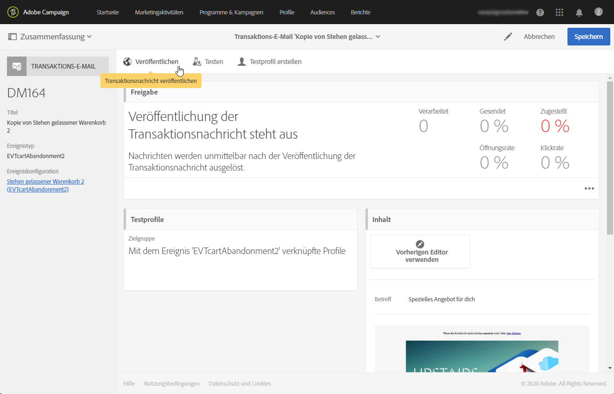
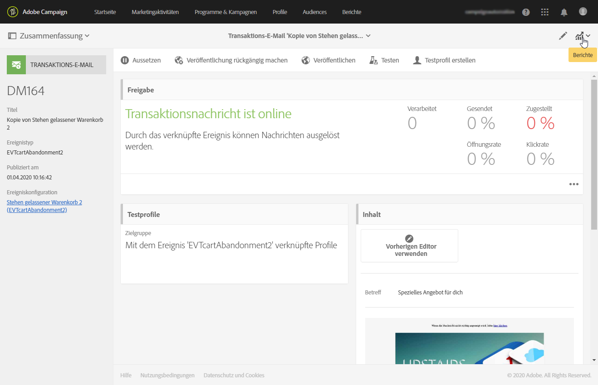

# Lebenszyklus von Transaktionsnachrichten {#publishing-transactional-message}

Wenn die [Transaktionsnachricht](../../channels/using/editing-transactional-message.md) zum Senden bereit ist, kann sie veröffentlicht werden.

Die Schritte zum Veröffentlichen, Aussetzen, Aufheben der Veröffentlichung und Löschen einer Transaktionsnachricht sind nachfolgend beschrieben.

>[!IMPORTANT]
>
>Nur Benutzer mit der Rolle [Administration](../../administration/using/users-management.md#functional-administrators) können auf Transaktionsnachrichten zugreifen und sie veröffentlichen.

## Veröffentlichungsprozess bei Transaktionsnachrichten {#transactional-messaging-pub-process}

Die nachstehende Tabelle zeigt den allgemeinen Veröffentlichungsprozess bei Transaktionsnachrichten.

**Verwandte Themen:**
* [Transaktionsnachricht veröffentlichen](#publishing-a-transactional-message)
* [Transaktionsnachricht aussetzen](#suspending-a-transactional-message-publication)
* [Veröffentlichung einer Transaktionsnachricht aufheben](#unpublishing-a-transactional-message)
* [Ereignisse veröffentlichen](../../channels/using/publishing-transactional-event.md)

<!--## Testing a transactional message {#testing-a-transactional-message}

You first need to create a specific test profile that will allow you to properly check the transactional message.

### Defining a specific test profile {#defining-specific-test-profile}

Define a test profile that will be linked to your event, which will allow you to preview your message and send a relevant proof.

1. From the transactional message dashboard, click the **[!UICONTROL Create test profile]** button.

   

1. Specify the information to send in JSON format in the **[!UICONTROL Event data used for personalization]** section. This is the content that will be used when previewing the message and when the test profile receives the proof.

   

   >[!NOTE]
   >
   >You can also enter the information relating to the profile table. See [Enriching the event](../../channels/using/configuring-transactional-event.md#enriching-the-transactional-message-content) and [Personalizing a transactional message](../../channels/using/editing-transactional-message.md#personalizing-a-transactional-message).

1. Once created, the test profile will be pre-specified in the transactional message. Click the **[!UICONTROL Test profiles]** block of the message to check the target of your proof.

   

You can also create a new test profile or use one that already exists in the **[!UICONTROL Test profiles]** menu. To do this:

1. Click the **Adobe** logo, in the top-left corner, then select **[!UICONTROL Profiles & audiences]** > **[!UICONTROL Test profiles]**.
1. In the **[!UICONTROL Event]** section, select the event that you have just created. In this example, select "Cart abandonment (EVTcartAbandonment)".
1. Specify the information to send in JSON format in the **[!UICONTROL Event data]** text box.

   

1. Save your changes.
1. Access the message that you created and select the updated test profile.

**Related topics:**

* [Managing test profiles](../../audiences/using/managing-test-profiles.md)
* [Creating audiences](../../audiences/using/creating-audiences.md)

### Sending the proof {#sending-proof}

Once you have created one or more specific test profiles and saved your transactional message, you can send a proof to test it.

The steps for sending a proof are detailed in the [Sending proofs](../../sending/using/sending-proofs.md) section.-->

## Transaktionsnachricht veröffentlichen {#publishing-a-transactional-message}

Nachdem Sie Ihre Transaktionsnachricht bearbeitet und getestet haben, kann diese veröffentlicht werden. **[!UICONTROL Veröffentlichen]** Sie die Änderungen mithilfe der gleichnamigen Schaltfläche.

Bei jeder Auslösung des Ereignisses &quot;Stehen gelassener Warenkorb&quot; wird nun automatisch eine Nachricht hinzugefügt, die die Anrede und den Namen des Empfängers, die URL des Warenkorbs, den zuletzt hinzugefügten Artikel bzw. eine Produktliste, falls eine Produktliste definiert wurde, sowie den Gesamtbetrag des Warenkorbs enthält.

Über die Schaltfläche **[!UICONTROL Berichte]** können Sie auf Statistiken zur entsprechenden Transaktionsnachricht zugreifen. Siehe [Dynamische Berichte](../../reporting/using/about-dynamic-reports.md).

**Verwandte Themen**:
* [Transaktionsnachricht bearbeiten](../../channels/using/editing-transactional-message.md)
* [Transaktionsnachrichten testen](../../channels/using/testing-transactional-message.md)
* [Ereignisaktivierung integrieren](../../channels/using/getting-started-with-transactional-msg.md#integrate-event-trigger)

## Veröffentlichung einer Transaktionsnachricht aussetzen {#suspending-a-transactional-message-publication}

Sie haben die Möglichkeit, die Veröffentlichung Ihrer Transaktionsnachricht mittels der Verwendung der Schaltfläche **[!UICONTROL Aussetzen]** zeitweise zu unterbinden, um beispielsweise die in der Nachricht enthaltenen Daten abzuändern. Die Ereignisse werden so nicht länger verarbeitet, sondern stattdessen in einer Warteschlange der Adobe Campaign-Datenbank aufbewahrt.

Die in der Warteschlange befindlichen Ereignisse werden für einen Zeitraum aufbewahrt, der in der REST-API (siehe [REST-API-Dokumentation](../../api/using/managing-transactional-messages.md)) oder im Trigger-Ereignis definiert ist, wenn Sie den Triggers Core Service verwenden (siehe [Über Adobe Experience Cloud Triggers](../../integrating/using/about-adobe-experience-cloud-triggers.md)).

Bei Verwendung der Schaltfläche **[!UICONTROL Wieder aufnehmen]** werden alle Ereignisse verarbeitet, sofern ihre Gültigkeit nicht abgelaufen ist. Diese Nachrichten beinhalten nun die während der Aussetzung der Vorlagenveröffentlichung vorgenommenen Änderungen.

## Veröffentlichung einer Transaktionsnachricht aufheben   {#unpublishing-a-transactional-message}

Mithilfe der Schaltfläche **[!UICONTROL Veröffentlichung aufheben]** lässt sich die Veröffentlichung der Transaktionsnachricht und zudem des entsprechenden Ereignisses abbrechen, wodurch auch die Ressource aus der REST-API gelöscht wird, die dem zuvor von Ihnen erstellten Ereignis entspricht.

Selbst wenn das Ereignis auf Ihrer Webseite ausgelöst wird, werden die entsprechenden Nachrichten nun nicht mehr gesendet und auch nicht in der Datenbank gespeichert.

>[!NOTE]
>
>Zur erneuten Veröffentlichung der Nachricht müssen Sie zunächst zur entsprechenden Ereigniskonfiguration zurückkehren, [das Ereignis veröffentlichen](../../channels/using/publishing-transactional-event.md) und anschließend [die Nachricht veröffentlichen](#publishing-a-transactional-message).

Wenn Sie die Veröffentlichung einer ausgesetzten Transaktionsnachricht aufheben, müssen Sie ggf. bis zu 24 Stunden warten, bevor Sie sie erneut veröffentlichen können. In dieser Zeit können alle in die Warteschlange gesendeten Ereignisse durch den **[!UICONTROL Datenbankbereinigung]**-Workflow (cleanup) entfernt werden.

Die Vorgehensweise zum Aussetzen einer Nachricht wird im Abschnitt [Veröffentlichung einer Transaktionsnachricht aussetzen](#suspending-a-transactional-message-publication) beschrieben.

Auf den Workflow **[!UICONTROL Datenbankbereinigung]**, der standardmäßig jeden Tag um 4 Uhr gestartet wird, kann über das Menü **[!UICONTROL Administration]** > **[!UICONTROL Anwendungsparameter]** > **[!UICONTROL Workflows]** zugegriffen werden.

## Transaktionsnachricht löschen {#deleting-a-transactional-message}

Nachdem die Veröffentlichung einer Transaktionsnachricht aufgehoben wurde bzw. wenn eine Transaktionsnachricht noch nicht veröffentlicht wurde, können Sie sie aus der Liste der Transaktionsnachrichten löschen. Gehen Sie dazu wie folgt vor:

1. Klicken Sie auf das **Adobe**-Logo oben links im Bildschirm und anschließend auf **[!UICONTROL Marketing-Pläne]** > **[!UICONTROL Transaktionsnachrichten]** > **[!UICONTROL Transaktionsnachrichten]**.
1. Bewegen Sie den Mauszeiger über die Nachricht Ihrer Wahl.
1. Wählen Sie die Schaltfläche **[!UICONTROL Element löschen]** aus.

Transaktionsnachrichten können jedoch nur unter gewissen Voraussetzungen gelöscht werden:

* Vergewissern Sie sich, dass die Transaktionsnachricht den Status **[!UICONTROL Entwurf]** aufweist; andernfalls können Sie sie nicht löschen. Der Status **[!UICONTROL Entwurf]** gilt für eine Nachricht, die noch nicht veröffentlicht bzw. deren Veröffentlichung [aufgehoben ](#unpublishing-a-transactional-message) (und nicht [ausgesetzt](#suspending-a-transactional-message-publication)) wurde.

* **Transaktionsnachrichten**: Wenn keine andere Transaktionsnachricht mit dem entsprechenden Ereignis verknüpft ist und die Veröffentlichung der Transaktionsnachricht aufgehoben wird, muss auch die Veröffentlichung der Ereigniskonfiguration aufgehoben werden, damit die Transaktionsnachricht erfolgreich gelöscht werden kann. Weiterführende Informationen finden Sie unter [Veröffentlichung eines Ereignisses aufheben](../../channels/using/publishing-transactional-event.md#unpublishing-an-event).

  >[!IMPORTANT]
  >
  >Durch das Löschen einer Transaktionsnachricht, über die bereits Benachrichtigungen versendet wurden, werden auch ihre Versand- und Trackinglogs gelöscht.

* **Transaktionsnachrichten aus einer nativen Ereignisvorlage (interne Transaktionsnachrichten)**: Wenn eine interne Transaktionsnachricht die einzige Transaktionsnachricht ist, die mit dem entsprechenden internen Ereignis verknüpft ist, kann sie nicht gelöscht werden. Sie müssen zuerst eine andere Transaktionsnachricht erstellen, indem Sie sie duplizieren oder das Menü **[!UICONTROL Ressourcen]** > **[!UICONTROL Vorlagen]** > **[!UICONTROL Transaktionsnachrichten-Vorlagen]** verwenden.

<!--## Monitoring transactional message delivery {#monitoring-transactional-message-delivery}

Once the message is published and your site integration is done, you can monitor the delivery.

To monitor transactional messaging, you need to access **execution deliveries**. An execution delivery is a non-actionable and non-functional technical message created once a month for each transactional message, and each time a transactional message is edited and published again.

1. To view the message delivery log, click the icon at the bottom right of the **[!UICONTROL Deployment]** block.

   

1. Click the **[!UICONTROL Execution list]** tab.

   

1. Select the execution delivery of your choice.

   

1. Click again the icon at the bottom right of the **[!UICONTROL Deployment]** block.

   

   For each execution delivery, you can consult the delivery logs as you would do for a standard delivery. For more on accessing and using the logs, see [Monitoring a delivery](../../sending/using/monitoring-a-delivery.md).

**Related topics**:
* [Publishing a transactional message](#publishing-a-transactional-message)
* [Integrate the event triggering](../../channels/using/getting-started-with-transactional-msg.md#integrate-event-trigger)

### Profile-based transactional message specificities {#profile-transactional-message-monitoring}

For profile-based transactional messages, you can monitor the following profile information.

Select the **[!UICONTROL Sending logs]** tab. In the **[!UICONTROL Status]** column, **[!UICONTROL Sent]** indicates that a profile has opted in.

Select the **[!UICONTROL Exclusions logs]** tab to view recipients who have been excluded from the message target, such as addresses on denylist.

For any profile that has opted out, the **[!UICONTROL Address on denylist]** typology rule excluded the corresponding recipient.

This rule is part of a specific typology that applies to all transactional messages based on the **[!UICONTROL Profile]** table.

**Related topics**:

* [About typologies and typology rules](../../sending/using/about-typology-rules.md)
* [Monitoring a delivery](../../sending/using/monitoring-a-delivery.md)

## Transactional message retry process {#transactional-message-retry-process}

A temporarily undelivered transactional message is subject to automatic retries that are performed until the delivery expires. For more on the delivery duration, see [Validity period parameters](../../administration/using/configuring-email-channel.md#validity-period-parameters).

When a transactional message fails to be sent, there are two retry systems:

* At the transactional messaging level, a transactional message can fail before the event is assigned to an execution delivery, meaning between the event reception and the delivery preparation. See [Event processing retry process](#event-processing-retry-process).
* At the sending process level, once the event has been assigned to an execution delivery, the transactional message can fail due to a temporary error. See [Message sending retry process](#message-sending-retry-process).

The definition of **execution delivery** can be found in the [Monitoring transactional message delivery](#monitoring-transactional-message-delivery) section.

### Event processing retry process {#event-processing-retry-process}

When an event is triggered, it is assigned to an execution delivery.

If the event cannot be assigned to an execution delivery, the event processing is postponed. Retries are then performed until it is assigned to a new execution delivery.

>[!NOTE]
>
>A postponed event does not appear in the transactional message sending logs, because it is not assigned to an execution delivery yet.

For example, the event could not be assigned to an execution delivery because its content was not correct, there was an issue with access rights or branding, an error was detected on applying typology rules, etc. In this case, you can pause the message, edit it to fix the problem and publish it again. The retry system will then assign it to a new execution delivery.

### Message sending retry process {#message-sending-retry-process}

Once the event has been assigned to an execution delivery, the transactional message can fail due to a temporary error, if the recipient's mailbox is full for example. For more on this, see [Retries after a delivery temporary failure](../../sending/using/understanding-delivery-failures.md#retries-after-a-delivery-temporary-failure).

>[!NOTE]
>
>When an event is assigned to an execution delivery, it appears in the sending logs of this execution delivery, and only at this time. The failed deliveries are displayed in the **[!UICONTROL Execution list]** tab of the transactional message sending logs.

### Retry process limitations {#limitations}

**Sending logs update**

In the retry process, the sending logs of the new execution delivery are not immediately updated (the update is performed through a scheduled workflow). It means that the message could be in **[!UICONTROL Pending]** status even if the transactional event has been processed by the new execution delivery.

**Failed execution delivery**

You cannot stop an execution delivery. However, if the current execution delivery fails, a new one is created as soon as a new event is received, and all new events are processed by this new execution delivery. No new events are processed by the failed execution delivery.

If some events already assigned to an execution delivery have been postponed as part of the retry process and if that execution delivery fails, the retry system does not assign the postponed events to the new execution delivery, which means that these events are lost. Check the [delivery logs](#monitoring-transactional-message-delivery) to see the recipients that may have been impacted.-->
