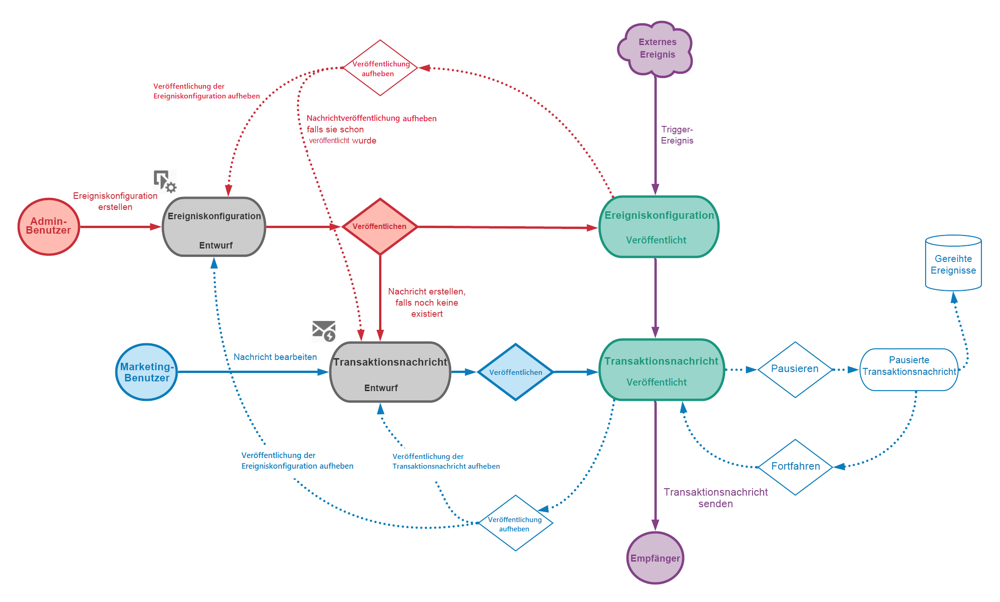
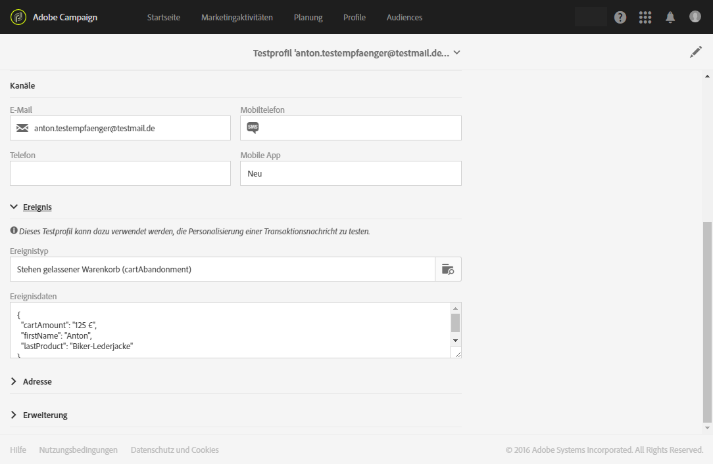

# Lebenszyklus der Transaktionsnachricht {#publishing-transactional-message}

Wenn die [Transaktionsnachricht](../../channels/using/editing-transactional-message.md) zum Senden bereit ist, kann sie veröffentlicht werden.

Die Schritte zum Testen, Veröffentlichen, Anhalten, Rückgängigmachen der Veröffentlichung und Löschen eines Ereignisses sind nachfolgend beschrieben. In diesem Abschnitt wird auch der Vorgang zum Wiederholen von Nachrichten beschrieben.

## Publikationsprozess bei Transaktionsnachrichten {#transactional-messaging-pub-process}

Die nachstehende Tabelle zeigt den gesamten Prozess der Veröffentlichung von Transaktionsnachrichten.

Weitere Informationen zum Veröffentlichen einer Transaktionsnachricht finden Sie unter [dieser Abschnitt](#publishing-a-transactional-message).
Weitere Informationen zum Anhalten einer Transaktionsnachricht finden Sie unter [dieser Abschnitt](#suspending-a-transactional-message-publication).
Weitere Informationen zum Rückgängigmachen der Veröffentlichung einer Transaktionsnachricht finden Sie unter [dieser Abschnitt](#unpublishing-a-transactional-message).

Weitere Informationen zum Veröffentlichen und Rückgängigmachen der Veröffentlichung eines Ereignisses finden Sie unter [dieser Abschnitt](../../channels/using/publishing-transactional-event.md).

## Transaktionsnachricht testen {#testing-a-transactional-message}

Zuerst müssen Sie ein spezifisches Testprofil erstellen, mit dem Sie die Transaktionsnachricht ordnungsgemäß überprüfen können.

### Spezifisches Testprofil definieren {#defining-specific-test-profile}

Definieren Sie ein Profil, das mit Ihrem Ereignis verknüpft wird. Auf diese Weise können Sie eine Vorschau Ihrer Nachricht anzeigen und einen relevanten Testversand durchführen.

1. Klicken Sie im Dashboard für Transaktionsnachrichten auf die Schaltfläche **[!UICONTROL Testprofil erstellen]**.

   

1. Geben Sie im Bereich **[!UICONTROL Für die Personalisierung verwendete Ereignisdaten]** die zu übermittelnden Daten im JSON-Format an. Bei den angegebenen Daten handelt es sich um den Inhalt, der in der Vorschau verwendet und dem Testprofil im Testversand übermittelt wird.

   

   >[!NOTE]
   >
   >Sie können auch die Information von der Profiltabelle eingeben. Siehe [Anreichern des Ereignisses](../../channels/using/configuring-transactional-event.md#enriching-the-transactional-message-content)<!--and [Personalizing a transactional message](../../channels/using/editing-transactional-message.md#personalizing-a-transactional-message)-->.

1. Nach seiner Erstellung ist das Testprofil in der Transaktionsnachricht vorausgefüllt. Verwenden Sie den Block **[!UICONTROL Testprofile]** der Nachricht, um Ihre Testversand-Zielgruppe zu überprüfen.

   

Sie haben außerdem die Möglichkeit, ausgehend vom Menü **[!UICONTROL Testprofile]** ein neues Testprofil zu erstellen bzw. ein bereits existierendes zu verwenden. Gehen Sie dazu wie folgt vor:

1. Verwenden Sie hierzu das **[!UICONTROL Adobe-Campaign]**-Logo oben links im Bildschirm und anschließend die Schaltflächen **[!UICONTROL Profile &amp; Audiences]** > **[!UICONTROL Testprofile]**.
1. Wählen Sie im Abschnitt **[!UICONTROL Ereignis]** das soeben erstellte Ereignis aus. Im vorliegenden Beispiel handelt es sich um &quot;Warenkorbabbruch (EVTcartAbandonment)&quot;.
1. Geben Sie im Tab **[!UICONTROL Ereignisdaten]** im Texteditor die zu übermittelnden Daten im JSON-Format an.

   

1. Speichern Sie Ihre Änderungen.
1. Rufen Sie die von Ihnen erstellte Nachricht auf und wählen Sie das aktualisierte Testprofil aus.

**Verwandte Themen:**

* [Verwaltung von Testprofilen](../../audiences/using/managing-test-profiles.md)
* [Audiences erstellen](../../audiences/using/creating-audiences.md)

### Testversand durchführen {#sending-proof}

Nachdem Sie ein oder mehrere spezifische Testprofile erstellt und Ihre Transaktionsnachricht gespeichert haben, können Sie einen Testversand durchführen.

Die Schritte zum Senden eines Testversands finden Sie im Abschnitt [Senden von Testversänden](../../sending/using/sending-proofs.md).

## Transaktionsnachricht publizieren          {#publishing-a-transactional-message}

Nach Validierung der Transaktionsnachricht kann diese publiziert werden.

Bei jeder Auslösung des Ereignisses &quot;Stehen gelassener Warenkorb&quot; wird nun automatisch eine Nachricht hinzugefügt, die die Anrede und den Namen des Empfängers, die URL des Warenkorbs, den zuletzt hinzugefügten Artikel bzw. eine Produktliste, falls eine Produktliste definiert wurde, sowie den Gesamtbetrag des Warenkorbs enthält.

Über die Schaltfläche **[!UICONTROL Berichte]** können Sie auf Statistiken zur entsprechenden Transaktionsnachricht zugreifen. Siehe [Dynamische Berichte](../../reporting/using/about-dynamic-reports.md).

### Publikation einer Transaktionsnachricht aussetzen           {#suspending-a-transactional-message-publication}

Sie haben die Möglichkeit, die Publikation Ihrer Transaktionsnachricht mittels der Verwendung der Schaltfläche **[!UICONTROL Aussetzen]** zeitweise zu unterbinden, um beispielsweise die in der Nachricht enthaltenen Daten abzuändern. Die Ereignisse werden so nicht länger verarbeitet, sondern stattdessen in einer Warteschlange der Adobe Campaign-Datenbank aufbewahrt.

Die in die Warteschlange gestellten Ereignis werden während eines Zeitraums aufbewahrt, der in der REST-API definiert ist (siehe [REST-API-Dokumentation](../../api/using/managing-transactional-messages.md) oder im Ereignis trigger, wenn Sie den Trigger-Hauptdienst verwenden (siehe [Info zu Adobe Experience Cloud-Auslöser](../../integrating/using/about-adobe-experience-cloud-triggers.md)).

Bei Verwendung der Schaltfläche **[!UICONTROL Wieder aufnehmen]** werden alle Ereignisse verarbeitet, sofern ihre Gültigkeit nicht abgelaufen ist. Diese Nachrichten beinhalten nun die während der Aussetzung der Vorlagenpublikation vorgenommenen Änderungen.

### Transaktionsnachricht depublizieren           {#unpublishing-a-transactional-message}

Mithilfe der **[!UICONTROL Depublizieren]**-Schaltfläche lässt sich die Publikation der Transaktionsnachricht und zudem des entsprechenden Ereignisses abbrechen, wodurch auch die Ressource aus der REST-API gelöscht wird, die dem zuvor von Ihnen erstellten Ereignis entspricht.

Selbst wenn das Ereignis auf Ihrer Webseite ausgelöst wird, werden die entsprechenden Nachrichten nun nicht mehr gesendet und auch nicht in der Datenbank gespeichert.

>[!NOTE]
>
>Um die Nachricht erneut zu veröffentlichen, müssen Sie zur entsprechenden Ereignis-Konfiguration zurückkehren, [das Ereignis](../../channels/using/publishing-transactional-event.md) veröffentlichen und [die Meldung ](#publishing-a-transactional-message) veröffentlichen.

Wenn Sie eine ausgesetzte Transaktionsnachricht depublizieren, müssen Sie ggf. bis zu 24 Stunden warten, bevor Sie sie erneut publizieren können. In dieser Zeit können alle in die Warteschlange gesendeten Ereignisse durch den **[!UICONTROL Datenbankbereinigung]**-Workflow (cleanup) entfernt werden.

Die Vorgehensweise zum Aussetzen einer Nachricht wird im Abschnitt [Publikation einer Transaktionsnachricht aussetzen](#suspending-a-transactional-message-publication) beschrieben.

Auf den Workflow **[!UICONTROL Datenbankbereinigung]**, der standardmäßig jeden Tag um 4 Uhr gestartet wird, kann über das Menü **[!UICONTROL Administration]** > **[!UICONTROL Anwendungsparameter]** > **[!UICONTROL Workflows]** zugegriffen werden.

### Transaktionsnachricht löschen {#deleting-a-transactional-message}

Nachdem eine Transaktionsnachricht depubliziert wurde bzw. wenn eine Transaktionsnachricht noch nicht veröffentlicht wurde, können Sie sie aus der Liste der Transaktionsnachrichten löschen. Gehen Sie dazu wie folgt vor:

1. Verwenden Sie das **[!UICONTROL Adobe-Campaign]**-Logo oben links im Bildschirm und anschließend die Schaltflächen **[!UICONTROL Marketingpläne]** > **[!UICONTROL Transaktionsnachrichten]** > **[!UICONTROL Transaktionsnachrichten]**.
1. Bewegen Sie den Mauszeiger über die Nachricht Ihrer Wahl.
1. Wählen Sie die Schaltfläche **[!UICONTROL Element löschen]** aus.

Transaktionsnachrichten können jedoch nur unter gewissen Voraussetzungen gelöscht werden:

* Vergewissern Sie sich, dass die Transaktionsnachricht den Status **[!UICONTROL Entwurf]** aufweist; andernfalls können Sie sie nicht löschen. Der Status **[!UICONTROL Entwurf]** gilt für eine Nachricht, die noch nicht publiziert bzw. die [depubliziert](#unpublishing-a-transactional-message) (und nicht [ausgesetzt](#suspending-a-transactional-message-publication)).

* **Transaktionsnachrichten**: Wenn keine andere Transaktionsnachricht mit dem entsprechenden Ereignis verknüpft ist und die Transaktionsnachricht depubliziert wird, muss auch die Ereigniskonfiguration depubliziert werden, damit die Transaktionsnachricht erfolgreich gelöscht werden kann. Weiterführende Informationen finden Sie unter [Ereignis depublizieren](../../channels/using/publishing-transactional-event.md#unpublishing-an-event).

   >[!IMPORTANT]
   >
   >Durch das Löschen einer Transaktionsnachricht, über die bereits Benachrichtigungen versendet wurden, werden auch ihre Versand- und Trackinglogs gelöscht.

* **Transaktionsnachrichten aus einer nativen Ereignisvorlage (interne Transaktionsnachrichten)**: Wenn eine interne Transaktionsnachricht die einzige Transaktionsnachricht ist, die mit dem entsprechenden internen Ereignis verknüpft ist, kann sie nicht gelöscht werden. Sie müssen zuerst eine andere Transaktionsnachricht erstellen, indem Sie sie duplizieren oder das Menü **[!UICONTROL Ressourcen]** > **[!UICONTROL Vorlagen]** > **[!UICONTROL Transaktionsnachrichten-Vorlagen]** verwenden.

## Transaktionsnachricht erneut versenden           {#transactional-message-retry-process}

Vorläufig nicht zugestellte Transaktionsnachrichten werden so lange automatisch erneut versendet, bis ihre Gültigkeit abgelaufen ist. Weiterführende Informationen zur Versandlaufzeit finden Sie in Abschnitt [Parameter für den Gültigkeitszeitraum](../../administration/using/configuring-email-channel.md#validity-period-parameters).

Wenn eine Transaktionsnachricht nicht gesendet werden kann, gibt es zwei Systeme, durch die erneute Zustellversuche unternommen werden.

* Auf der Ebene der Transaktionsnachrichten kann eine Transaktionsnachricht fehlschlagen, bevor das Ereignis einem Ausführungsversand zugewiesen wurde, d. h. zwischen dem Ereignisempfang und der Versandvorbereitung. Siehe [Wiederholungsverfahren bei der Ereignisverarbeitung](#event-processing-retry-process).
* Auf der Ebene des Versandverfahrens kann die Transaktionsnachricht nach der Zuweisung des Ereignisses zu einem Ausführungsversand wegen eines temporären Fehlers fehlschlagen. Siehe [Wiederholungsverfahren beim Nachrichtenversand](#message-sending-retry-process).

### Wiederholungsverfahren bei der Ereignisverarbeitung           {#event-processing-retry-process}

Wenn ein Ereignis keinem Ausführungsversand zugewiesen werden kann, wird die Ereignisverarbeitung verschoben. Wiederholungen werden dann durchgeführt, bis das Ereignis einem neuen Ausführungsversand zugewiesen wird.

>[!NOTE]
>
>Ein verschobenes Ereignis wird nicht in den Versandlogs für Transaktionsnachrichten angezeigt, weil das Ereignis noch keinem Ausführungsversand zugeordnet ist.

Beispielsweise kann es sein, dass das Ereignis keinem Ausführungsversand zugewiesen werden konnte, weil der Inhalt nicht korrekt war, es ein Problem mit den Zugriffsrechten oder dem Branding gab oder ein Fehler beim Anwenden von Typologieregeln erkannt wurde. In diesem Fall können Sie die Nachricht vorläufig anhalten, bearbeiten, um den Fehler zu beheben, und erneut publizieren. Das Wiederholungssystem weist die Nachricht daraufhin einem neuen Ausführungsversand zu.

### Wiederholungsverfahren beim Nachrichtenversand           {#message-sending-retry-process}

Nachdem das Ereignis einem Ausführungsversand zugewiesen wurde, kann die Transaktionsnachricht aufgrund eines temporären Fehlers fehlschlagen, z. B. falls das Postfach des Empfängers voll ist. Weiterführende Informationen dazu finden Sie in Abschnitt [Weitere Zustellversuche nach einem vorübergehend fehlgeschlagenen Versand](../../sending/using/understanding-delivery-failures.md#retries-after-a-delivery-temporary-failure).

>[!NOTE]
>
>Wenn ein Ereignis einem Ausführungsversand zugewiesen wird, wird es nur dieses eine Mal in den Versandlogs dieses Ausführungsversands angezeigt. Die fehlgeschlagenen Sendungen werden im Tab **[!UICONTROL Liste der Ausführungen]** der Versandlogs der Transaktionsnachricht angezeigt.

### Beschränkungen beim Wiederholungsvorgang {#limitations}

**Aktualisierung der Versandlogs**

Im Wiederholungsvorgang werden die Versandlogs des neuen Ausführungsversands nicht sofort aktualisiert (die Aktualisierung erfolgt über einen zeitversetzten Workflow). Das bedeutet, dass die Nachricht den Status **[!UICONTROL Ausstehend]** aufweisen könnte, selbst wenn das Transaktionsereignis vom neuen Ausführungsversand verarbeitet worden ist.

**Fehlgeschlagener Ausführungsversand**

Ein Ausführungsversand kann nicht angehalten werden. Wenn jedoch ein aktueller Ausführungsversand fehlschlägt, wird ein neuer erstellt, sobald ein neues Ereignis empfangen wird, und alle neuen Ereignisse werden von diesem neuen Ausführungsversand verarbeitet. Vom fehlgeschlagenen Ausführungsversand werden keine neuen Ereignisse verarbeitet.

Wenn manche, einem Ausführungsversand bereits zugewiesenen Ereignisse verschoben wurden und dieser Ausführungsversand fehlschlägt, weist das Wiederholungssystem dem neuen Ausführungsversand nicht die verschobenen Ereignisse zu. Diese Ereignisse gehen verloren.
