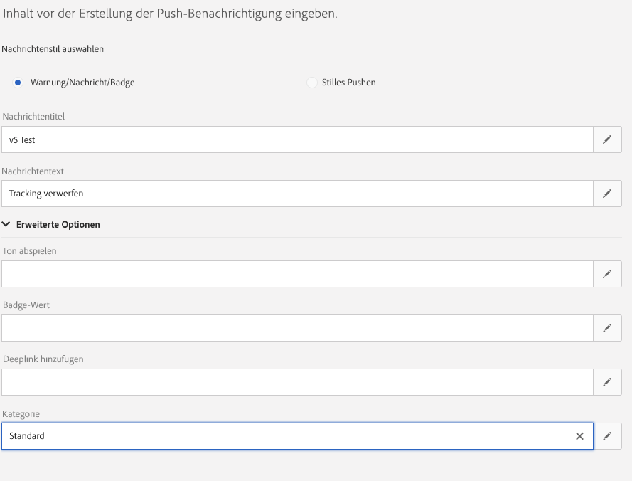

# Implementierung der Push-Verfolgung {#push-tracking}

## Informationen zur Push-Verfolgung {#about-push-tracking}

Um sicherzustellen, dass die Push-Benachrichtigung vollständig entwickelt wurde, müssen Sie sicherstellen, dass der Verfolgungsanteil korrekt implementiert wurde.

Mit den folgenden Schritten können Sie sicherstellen, dass die Push-Verfolgung korrekt implementiert wurde. Dies setzt voraus, dass Sie die ersten Teile der Push-Benachrichtigungs-Implementierung bereits implementiert haben: Registrieren des App-Benutzers und Verarbeiten einer Push-Benachrichtigung.

Die Push-Verfolgung ist in drei Typen unterteilt:

* **Push-Impressionen** : Wenn eine Push-Benachrichtigung an das Gerät gesendet wurde und im Benachrichtigungscenter sitzt, aber überhaupt nicht angefasst wurde.  Dies gilt als Eindruck.  In den meisten Fällen sollten die Impressionszahlen ähnlich sein, wenn nicht mit der gelieferten Nummer identisch sein. Dadurch wird sichergestellt, dass das Gerät die Meldung erhalten und diese Informationen an den Server zurückgegeben hat.

* **Push-Klick** : Wenn eine Push-Benachrichtigung an das Gerät gesendet wurde und der Benutzer auf das Gerät geklickt hat.  Der Benutzer wollte entweder die Benachrichtigung Ansicht haben (die wiederum zur Push Open Tracking-Funktion wechseln wird) oder die Benachrichtigung schließen.

* **Push Open** - Wenn eine Push-Benachrichtigung an das Gerät gesendet wurde und der Benutzer auf die Benachrichtigung geklickt hat, wodurch die App geöffnet wird.  Dies ist ähnlich der Push-Klick-Kategorie mit dem Unterschied, dass keine Push-Öffnung ausgelöst wird, wenn die Benachrichtigung verworfen wird.

Um die Verfolgung für Campaign Standard zu implementieren, muss die mobile App Mobile SDK enthalten. Diese SDK sind in Adobe Mobile Services verfügbar.

Zum Senden von Verfolgungsinformationen müssen drei Variablen gesendet werden. Zwei davon gehören zu den von Campaign Standard erhaltenen Daten und eine Aktionsvariable, die vorgibt, ob es sich um eine **Impression**, **Click** oder **Open** handelt.

| Variable | Wert |
|:-:|:-:|
| BroadlogId | _mId aus Daten |
| deliveryId | _dId aus Daten |
| Aktion | 1 für &quot;Öffnen&quot;, 2 für &quot;Klicken&quot;und 7 für &quot;Impression&quot; |

## Implementierung für Android {#implementation-android}

### Implementieren der Push-Impressionsverfolgung {#push-impression-tracking-android}

Für die Impressionsverfolgung müssen Sie den Wert &quot;7&quot;für die Aktion senden, wenn Sie die Funktion trackAction() aufrufen.

```
@Override
public void onMessageReceived(RemoteMessage remoteMessage) {
....{Handle push messages}....
  if (data.size() > 0) {
    String deliveryId = data.get("_dId");
    String messageId = data.get("_mId");
    HashMap<String, String> contextData = new HashMap<>();
    if (deliveryId != null && messageId != null) {
                contextData.put("deliveryId", deliveryId);
                contextData.put("broadlogId", messageId);
                contextData.put("action", "7");
                MobileCore.trackAction("tracking", contextData);
    }
  }
}
```

### Implementierung der Klick-Tracking {#push-click-tracking-android}

Für die Klick-Verfolgung müssen Sie den Wert &quot;2&quot;für die Aktion senden, wenn Sie die Funktion trackAction() aufrufen.

Zur Verfolgung von Klicks müssen zwei Szenarien behandelt werden:

* Der Benutzer sieht die Benachrichtigung, löscht sie jedoch.
* Der Benutzer sieht die Benachrichtigung und klickt darauf, um sie in eine offene Verfolgung umzuwandeln.

Dazu müssen Sie zwei Intents verwenden: eine zum Klicken auf die Benachrichtigung und eine andere zum Schließen der Benachrichtigung.

MyFirebaseMessagingService.java

```
private void sendNotification(Map<String, String> data) {
    Intent openIntent = new Intent(this, CollectPIIActivity.class);
    Intent dismissIntent = new Intent(this, NotificationDismissedReceiver.class);
    openIntent.addFlags(Intent.FLAG_ACTIVITY_CLEAR_TOP);
  
    //put the data map into the intent to track clickthroughs
    Bundle pushData = new Bundle();
    Set<String> keySet = data.keySet();
    for (String key : keySet) {
        pushData.putString(key, data.get(key));
    }
    openIntent.putExtras(pushData);
    dissmissIntent.putExtras(pushData);
  
  
    PendingIntent pendingIntent = PendingIntent.getActivity(this, 0, openIntent,
        PendingIntent.FLAG_UPDATE_CURRENT);
    PendingIntent onDismissPendingIntent = PendingIntent.getBroadcast(this.getApplicationContext(), 0, dismissIntent, 0);
  
    //<BUILD NOTIFICATION using notification builder>
    //Add both Intents to the notification
    notificationBuilder.setContentIntent(pendingIntent);
    notificationBuilder.setDeleteIntent(onDismissPendingIntent);
}
```

Damit der BroadcastReceiver funktioniert, müssen Sie ihn bei AndroidManifest.xml registrieren

```
<manifest>
    <application>
        <receiver android:name=".NotificationDismissedReceiver">
        </receiver>
    </application>
</manifest>
```

NotificationDismessedReceiver.java

```
public class NotificationDismissedReceiver extends BroadcastReceiver {
    private static final String TAG = NotificationDismissedReceiver.class.getSimpleName();
    @Override
    public void onReceive(Context context, Intent intent) {
        Bundle data = intent.getExtras();
        String deliveryId = data.getString("_dId");
        String messageId = data.getString("_mId");
  
        HashMap<String, Object> contextData = new HashMap<>();
  
        //We only send the click tracking since the user dismissed the notification
        if (deliveryId != null && messageId != null) {
            contextData.put("deliveryId", deliveryId);
            contextData.put("broadlogId", messageId);
            contextData.put("action", "1");
            MobileCore.trackAction("tracking", contextData);
        }
    }
}
```

### Implementierung der offenen Verfolgung {#push-open-tracking-android}

Sie müssen &quot;1&quot;und &quot;2&quot;senden, da der Benutzer zum Öffnen der App auf &quot;notification&quot;klicken muss. Wenn die App nicht über eine Push-Benachrichtigung gestartet/geöffnet wird, treten keine Ereignis zur Verfolgung auf.

Um open verfolgen zu können, müssen Sie Intent erstellen. Zielobjekte ermöglichen es Android OS, Ihre Methode aufzurufen, wenn bestimmte Aktionen ausgeführt werden. In diesem Fall klicken Sie auf die Benachrichtigung, um die App zu öffnen.

Dieser Code basiert auf der Implementierung der Klick-Impressionsverfolgung. Mit der Einstellung &quot;Zielmedium&quot;müssen Sie jetzt Verfolgungsinformationen zurück an die Kampagne senden. In diesem Fall müssen Sie die Open Intent-Methode so einstellen, dass sie für eine bestimmte Ansicht in Ihrer App geöffnet wird. Dies ruft die onResume-Methode MIT den Benachrichtigungsdaten im Intent-Objekt auf.

```
@Override
protected void onResume() {
    super.onResume();
    handleTracking();
}
  
  
private void handleTracking() {
    //Check to see if this view was opened based on a notification
    Intent intent = getIntent();
    Bundle data = intent.getExtras();
  
    if (data != null) {
        //Looks it was opened based on the notification, lets get the tracking we passed on.
        String deliveryId = data.getString("_dId");
        String messageId = data.getString("_mId");
  
        HashMap<String, Object> contextData = new HashMap<>();
  
        if (deliveryId != null && messageId != null) {
            contextData.put("deliveryId", deliveryId);
            contextData.put("broadlogId", messageId);
  
            //Send Click Tracking since the user did click on the notification
            contextData.put("action", "2");
            MobileCore.trackAction("tracking", contextData);
  
            //Send Open Tracking since the user opened the app
            contextData.put("action", "1");
            MobileCore.trackAction("tracking", contextData);
        }
    }
}
```

## Implementierung für iOS {#implementation-iOS}

### Implementieren der Push-Impressionsverfolgung {#push-impression-tracking-iOS}

Für die Impressionsverfolgung müssen Sie den Wert &quot;7&quot;für die Aktion senden, wenn Sie die Funktion trackAction() aufrufen.

Um zu verstehen, wie iOS-Benachrichtigungen funktionieren, müssen die drei Status einer App detailliert sein:

* **Vordergrund**: wenn die App aktuell aktiv ist und sich derzeit auf dem Bildschirm befindet (im Vordergrund).
* **Hintergrund**: wenn die is-App nicht auf dem Bildschirm angezeigt wird, der Prozess jedoch nicht geschlossen ist. Wenn Sie mit der Dublette auf die Schaltfläche &quot;Startseite&quot;klicken, werden in der Regel alle im Hintergrund befindlichen Apps angezeigt.
* **Aus/geschlossen**: eine App, deren Prozess beendet wurde.

Wenn eine App geschlossen ist, ruft Apple die App erst nach einem Neustart der App auf. Das bedeutet, dass Sie nicht wissen können, wann die Benachrichtigung unter iOS erhalten wurde.

Damit die Nachverfolgung von Impressionen weiterhin funktioniert, während sich die App im Hintergrund befindet, müssen wir **Content-Available** senden, um der App mitzuteilen, dass eine Verfolgung durchgeführt werden muss.

>[!CAUTION]
>
>Die iOS-Impressionsverfolgung ist nicht genau und sollte nicht als zuverlässig angesehen werden.

Die folgende Code-Zielgruppen-Hintergrundanwendung:

```
// In didReceiveRemoteNotification event handler in AppDelegate.m
  
//In order to handle push notification when only in background with content-available: 1
func application(_ application: UIApplication, didReceiveRemoteNotification userInfo: [AnyHashable : Any], fetchCompletionHandler completionHandler: @escaping (UIBackgroundFetchResult) -> Void) {
  
        //Check if the app is not in the foreground right now
        if(UIApplication.shared.applicationState != .active) {
            let deliveryId = userInfo["_dId"] as? String
            let broadlogId = userInfo["_mId"] as? String
            if (deliveryId != nil && broadlogId != nil) {
               ACPCore.trackAction("tracking", data: ["deliveryId": deliveryId!, "broadlogId": broadlogId!, "action":"7"])
            }
        }
        completionHandler(UIBackgroundFetchResult.noData)
    }
```

Die folgende Code-Zielgruppe enthält die Vordergrund-App:

```
// This will get called when the app is in the foreground
  
func userNotificationCenter(_ center: UNUserNotificationCenter, willPresent notification: UNNotification, withCompletionHandler completionHandler: @escaping (UNNotificationPresentationOptions) -> Void) {
  
  
        let userInfo = notification.request.content.userInfo
        let deliveryId = userInfo["_dId"] as? String
        let broadlogId = userInfo["_mId"] as? String
        if (deliveryId != nil && broadlogId != nil) {
             ACPCore.trackAction("tracking", data: ["deliveryId": deliveryId!, "broadlogId": broadlogId!, "action":"7"])
        }
        completionHandler([.alert,.sound])
    }
```

### Implementierung der Klick-Tracking {#push-click-tracking-iOS}

Für die Klick-Verfolgung müssen Sie den Wert &quot;2&quot;für die Aktion senden, wenn Sie die Funktion trackAction() aufrufen.

```
// AppDelegate.swift
...
import os.log
import UserNotifications
...
  
func registerForPushNotifications() {
        let center = UNUserNotificationCenter.current()
        center.delegate = notificationDelegate
        //Here we are creating a new Category that allows us to handle Dismiss Actions
        let defaultCategory = UNNotificationCategory(identifier: "DEFAULT", actions: [], intentIdentifiers: [], options: .customDismissAction)
        //Add it to our array of Category, in this case we only have one
        center.setNotificationCategories([defaultCategory])
        center.requestAuthorization(options: [.alert, .sound, .badge]) {
            (granted, error) in
            os_log("Permission granted: %{public}@", type:. debug, granted.description)
            if error != nil {
                return
            }
            if granted {
                os_log("Notifications allowed", type: .debug)
            }
            else {
                os_log("Notifications denied", type: .debug)
            }
  
            // 2. Attempt registration for remote notifications on the main thread
            DispatchQueue.main.async {
                UIApplication.shared.registerForRemoteNotifications()
            }
        }
    }
```

Wenn Sie jetzt Push-Benachrichtigungen senden, müssen Sie eine Kategorie hinzufügen. In diesem Fall nannten wir es &quot;STANDARD&quot;.



Um dann den Dismiss-Vorgang zu bearbeiten und eine Verfolgungsinfo zu senden, müssen Sie Folgendes hinzufügen:

```
func userNotificationCenter(_ center: UNUserNotificationCenter, didReceive response: UNNotificationResponse, withCompletionHandler completionHandler: @escaping () -> Void) {
        let userInfo = response.notification.request.content.userInfo
        switch response.actionIdentifier {
        case UNNotificationDismissActionIdentifier:
            print("Dismiss Action")
            let deliveryId = userInfo["_dId"] as? String
            let broadlogId = userInfo["_mId"] as? String
            if (deliveryId != nil && broadlogId != nil) {
                ADBMobile.trackAction("tracking", data: ["deliveryId": deliveryId!, "broadlogId": broadlogId!, "action":"2"])
            }
        default:
            ////MORE CODE
        }
        completionHandler()
    }
```

### Implementierung der offenen Verfolgung {#push-open-tracking-iOS}

Sie müssen &quot;1&quot;und &quot;2&quot;senden, da der Benutzer zum Öffnen der App auf &quot;notification&quot;klicken muss. Wenn die App nicht über eine Push-Benachrichtigung gestartet/geöffnet wird, treten keine Ereignis zur Verfolgung auf.

```
import Foundation
import UserNotifications
import UserNotificationsUI
  
class NotificationDelegate: NSObject, UNUserNotificationCenterDelegate {
  
    // Called when user clicks the push notification or also called from willPresent()
    func userNotificationCenter(_ center: UNUserNotificationCenter, didReceive response: UNNotificationResponse, withCompletionHandler completionHandler: @escaping () -> Void) {
  
        let userInfo = response.notification.request.content.userInfo
        os_log("App push data %{public}@, in userNotificationCenter:didReceive()", type: .debug, userInfo)
        switch response.actionIdentifier {
        case UNNotificationDismissActionIdentifier:
            //This is to handle the Dismiss Action
            let deliveryId = userInfo["_dId"] as? String
            let broadlogId = userInfo["_mId"] as? String
            if (deliveryId != nil && broadlogId != nil) {
                ACPCore.trackAction("tracking", data: ["deliveryId": deliveryId!, "broadlogId": broadlogId!, "action":"2"])
            }
        default:
            //This is to handle the tracking when the app opens
            let deliveryId = userInfo["_dId"] as? String
            let broadlogId = userInfo["_mId"] as? String
            if (deliveryId != nil && broadlogId != nil) {
                ACPCore.trackAction("tracking", data: ["deliveryId": deliveryId!, "broadlogId": broadlogId!, "action":"2"])
                ACPCore.trackAction("tracking", data: ["deliveryId": deliveryId!, "broadlogId": broadlogId!, "action":"1"])
            }
        }
        completionHandler()
    }
}
```
