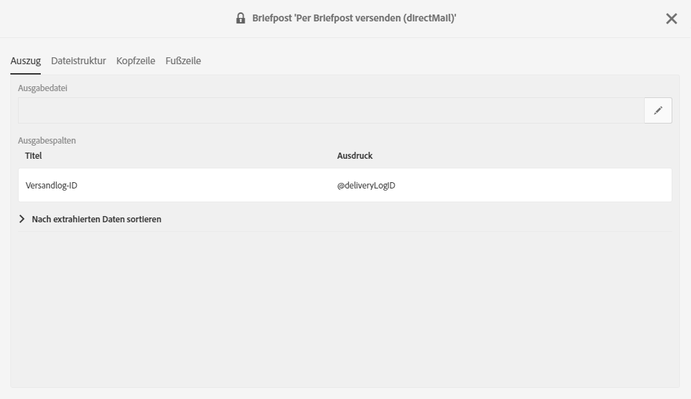
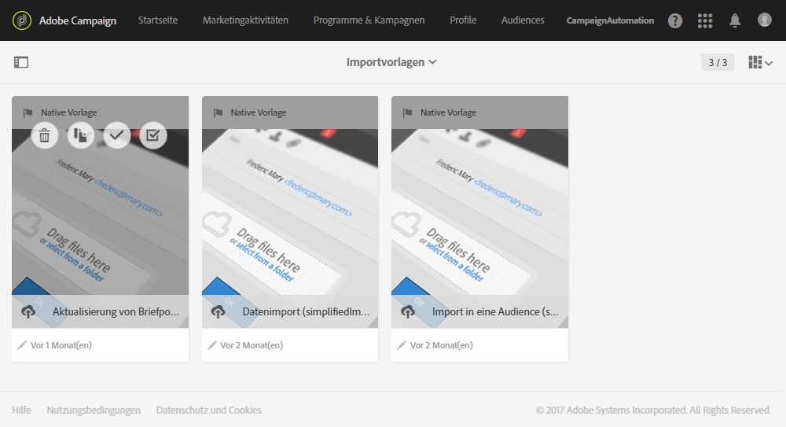

# An den Absender zurücksenden{#return-to-sender}

Der Austausch einfach strukturierter Dateien, die Rücksendeinformation enthalten, mit Briefpost-Dienstleistern wird unterstützt. Auf diese Weise können entsprechende Anschriften von der künftigen Kommunikation ausgeschlossen werden. Zusätzlich können Sie sich über fehlerhafte Adressen informieren lassen und mit dem Kunden über andere Kanäle in Kontakt treten oder ihn auffordern, seine Anschrift zu aktualisieren.

Beispiel: Ein Kontakt ist umgezogen und hat Ihnen nicht seine neue Anschrift mitgeteilt. Der Anbieter ruft die Liste von falschen Adressen ab und sendet diese Informationen an Adobe Campaign, wodurch automatisch die fehlerhaften Adressen zur blockierungsliste hinzugefügt werden.

Damit dies funktioniert, ist im Inhalt der Standard-Versandvorlage für die Briefpost eine Versandlog-ID enthalten. Dadurch kann Adobe Campaign das Profil und die Versanddaten mit den vom Provider zurückgesendeten Informationen synchronisieren.

Eine Importvorlage ist verfügbar unter **[!UICONTROL Adobe Campaign > Ressourcen > Vorlagen > Importvorlagen > Aktualisierung von Briefpost-Quarantänen und Versandlogs]**. Duplizieren Sie diese Vorlage, um Ihre eigene zu erstellen. Weiterführende Informationen zur Verwendung von Importvorlagen finden Sie unter [Importvorlagen verwenden](../../automating/using/importing-data-with-import-templates.md#setting-up-import-templates).

Nach Abschluss des Imports führt Adobe Campaign automatisch die folgenden Aktionen aus:

* Falsche Adressen werden der blockierungsliste auf Profil-Ebene hinzugefügt
* Die wichtigsten Versandindikatoren (KPIs) werden aktualisiert.
* Die Versandlogs werden aktualisiert.

