# Anmeldung mit zweifacher Bestätigung einrichten{#setting-up-a-double-opt-in-process}

## Über die Anmeldung mit zweifacher Bestätigung {#about-double-opt-in}

Die Anmeldung mit zweifacher Bestätigung zählt zu den Best Practices beim E-Mail-Versand. Die Plattform wird dadurch vor falschen oder ungültigen E-Mail-Adressen und Spambots geschützt, wodurch Spam-Beschwerden verhindert werden.

Das Prinzip dahinter ist folgendes: Der Besucher füllt ein Formular auf einer Online-Landingpage aus, erhält dann eine E-Mail und muss den Bestätigungs-Link anklicken, um die Anmeldung abzuschließen. Erst dann wird er als ‘Profil&#39; in der Campaign-Datenbank gespeichert.

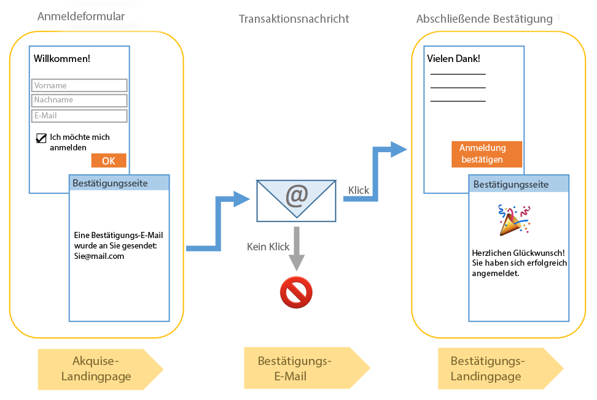

Gehen Sie dazu folgendermaßen vor:

1. Erstellen und publizieren Sie eine Landingpage, auf der sich Besucher registrieren und anmelden können. Diese Landingpage ist auf einer Website verfügbar. Besucher, die diese Landingpage ausfüllen und diese Informationen abschicken, werden in der Datenbank gespeichert, aber auf die ‘Blacklist‘ gesetzt, damit sie keine Nachrichten vor der endgültigen Bestätigung erhalten (siehe [Blacklists in Campaign verwenden](../../audiences/using/about-opt-in-and-opt-out-in-campaign.md)).
1. Erstellen und senden Sie automatisch die Anmelde-E-Mail mit einem Bestätigungs-Link. Diese E-Mail wird an die Personen gesendet, die ihre Informationen auf der Landingpage abgeschickt haben. Die E-Mail basiert auf einer E-Mail-Vorlage, mit der ‘abgemeldete’ Profile gehandhabt werden können.
1. Richten Sie eine Weiterleitung zu einer Bestätigungs-Landingpage ein. Diese abschließende Landingpage weist eine Bestätigungs-Schaltfläche auf, die die Besucher anklicken müssen. Sie können eine Willkommens-E-Mail erstellen, die nach Abschluss des Bestätigungsprozesses gesendet wird und beispielsweise ein spezielles Angebot für neue Empfänger enthält.

Diese Schritte müssen in Adobe Campaign in einer bestimmten Reihenfolge ausgeführt werden, damit alle Parameter ordnungsgemäß aktiviert werden.

## Schritt 1: Bestätigungs-Landingpage erstellen  {#step-1--create-the-confirmation-landing-page}

Um eine Anmeldung mit zweifacher Bestätigung einzurichten, muss zunächst die Bestätigungs-Landingpage erstellt werden: Diese Seite wird angezeigt, wenn ein Besucher die Bestätigungs-E-Mail anklickt, um sich zu registrieren.

Um diese Landingpage zu erstellen und zu konfigurieren, gehen Sie folgendermaßen vor:

1. Design a [new landing page](../../channels/using/getting-started-with-landing-pages.md) based on the **[!UICONTROL Profile acquisition (acquisition)]** template. Geben Sie den Titel &#39;**CONFIRMATION**‘ ein.

   If you need to use [services](../../audiences/using/about-subscriptions.md), you can also use the **[!UICONTROL Subscription (sub)]** template.

1. Bearbeiten Sie die Eigenschaften der Landingpage und heben Sie unter dem **[!UICONTROL Access and loading]** Abschnitt die Auswahl der Option auf **[!UICONTROL Authorize unidentified visitors]** und wählen Sie **[!UICONTROL Preload visitor data]** (dieser ist nicht obligatorisch).

   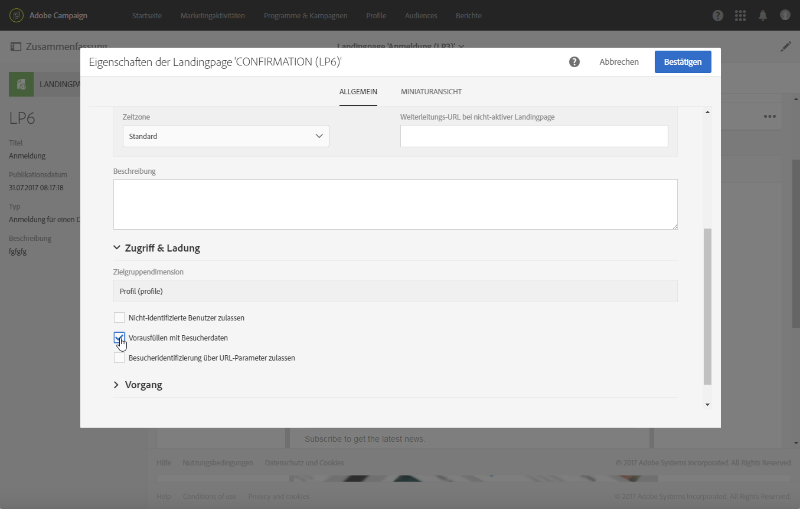

1. Klicken Sie im Abschnitt **[!UICONTROL Job]** > **[!UICONTROL Additional data]** auf **[!UICONTROL Add an element]** und geben Sie den folgenden Kontextpfad ein:

   /context/profile/blackList

   Set the value to **false** and click **[!UICONTROL Add]**.

   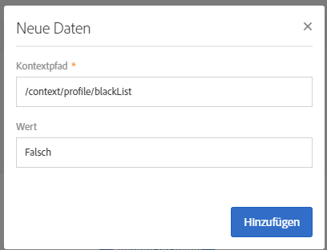

   Dadurch wird das Blacklist-Feld entfernt, sodass E-Mails gesendet werden können. Später werden wir sehen, dass die ursprüngliche Einstellung des Felds für die Landingpage vor der Bestätigung **Wahr** war, was den Versand von E-Mails an nicht bestätigte Profile verhindert hat. Weiterführende Informationen dazu finden Sie unter [Schritt 3: Akquise-Landingpage erstellen](#step-3--create-the-acquisition-landing-page).

1. Passen Sie den Inhalt der Landingpage an: Sie können personalisierte Daten anzeigen und den Titel der Bestätigungs-Schaltfläche beispielsweise in ‘Klicken Sie hier, um Ihre Anmeldung zu bestätigen’ ändern.

   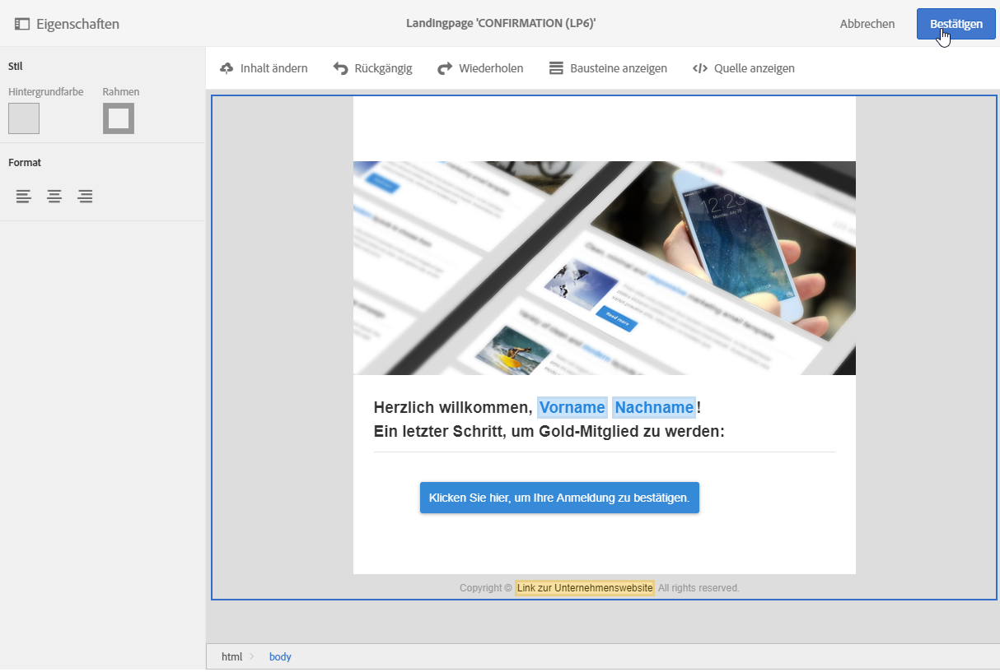

1. Ändern Sie den Inhalt der Bestätigungsseite so, dass Ihre Abonnenten darüber informiert werden, dass sie registriert sind.

   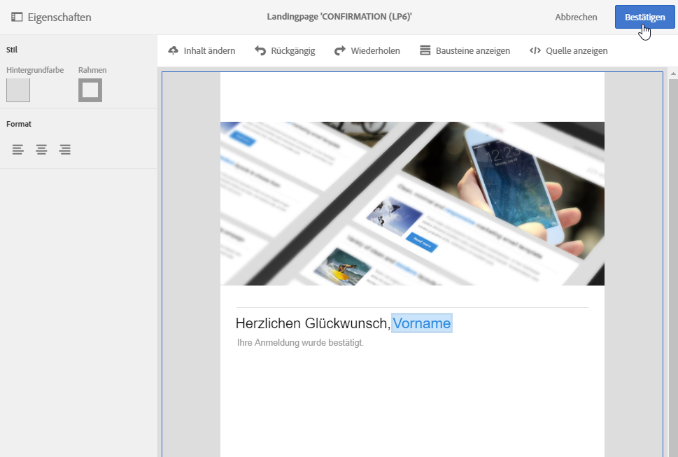

1. [Testen und publizieren](../../channels/using/testing-publishing-landing-page.md) Sie die Landingpage.

## Schritt 2: Bestätigungs-E-Mail erstellen  {#step-2--create-the-confirmation-email}

Nachdem die Bestätigungs-Landingpage fertig ist, kann die Bestätigungs-E-Mail erstellt werden. Diese E-Mail wird automatisch jedem Besucher gesendet, der die Akquise-Landingpage bestätigt. Diese Bestätigung wird als Ereignis erachtet und die E-Mail gilt als Transaktionsnachricht, die mit einer bestimmten Typologieregel verknüpft ist, wodurch Abmeldungen gehandhabt werden können.

Die Schritte zur Erstellung dieser Elemente werden unten beschrieben. Führen Sie sie aus, bevor Sie die Akquise-Landingpage erstellen, da diese auf die E-Mail-Vorlage verweist.

### Ereignis erstellen  {#create-the-event}

Die Bestätigungs-E-Mail ist eine [Transaktionsnachricht](../../channels/using/about-transactional-messaging.md), da sie auf ein Ereignis reagiert, nämlich die Bestätigung des Formulars. Erstellen Sie zuerst das Ereignis und danach die Vorlage der Transaktionsnachricht.

1. Erstellen Sie ein Ereignis aus dem Menü **[!UICONTROL Marketing plans]** > **[!UICONTROL Transactional messages]** > **[!UICONTROL Event configuration]** , das Sie über das Adobe Campaign-Logo aufrufen können, und geben Sie die Bezeichnung &quot;**CONFIRM**&quot;ein.
1. Wählen Sie die **[!UICONTROL Profile]** Zielgruppendimension aus und klicken Sie auf **[!UICONTROL Create]**.

   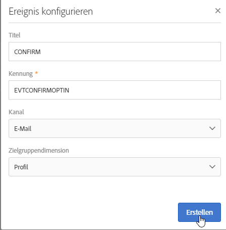

1. In the **[!UICONTROL Fields]** section, click **[!UICONTROL Create element]** and add the **[!UICONTROL email]** in the data structure to enable reconciliation.
1. Klicken Sie im **[!UICONTROL Enrichment]** Abschnitt auf **[!UICONTROL Create element]** und wählen Sie die **[!UICONTROL Profile]** Ressource Zielgruppe aus. You can then map on the **[!UICONTROL email]** field in the **[!UICONTROL Join definition]** section, or any other composite reconciliation key, depending on your needs.

   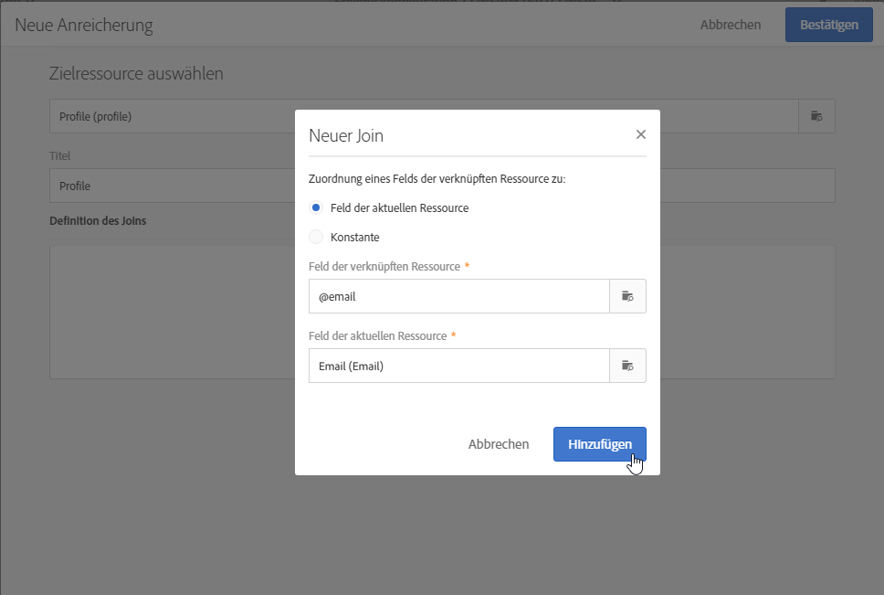

   If you need to use services, add the **[!UICONTROL Service]** target resource and map on the **[!UICONTROL serviceName]** field. Weiterführende Informationen dazu finden Sie unter .

1. Wählen Sie **[!UICONTROL Profile]** als **[!UICONTROL Targeting enrichment]** in der Dropdown-Liste aus.
1. Click **[!UICONTROL Publish]** to publish the event.

Das Ereignis ist somit fertig eingerichtet. Jetzt können Sie die E-Mail-Vorlage erstellen. Diese Vorlage muss einen Link zur zuvor erstellten Landingpage **CONFIRMATION** aufweisen. Weiterführende Informationen dazu finden Sie im Abschnitt [Bestätigungsnachricht erstellen](#design-the-confirmation-message).

### Create the typology {#create-the-typology-rule}

You need to create a specific [typology](../../sending/using/about-typology-rules.md), by duplicating an out-of-box one. Die Typologie ermöglicht es, Nachrichten an Profil zu senden, die ihre Zustimmung noch nicht bestätigt haben und noch auf der Blacklist sind. Standardmäßig schließen Typologien Ausschluss-Opt-out-Profil (d. h. auf der Blacklist) aus. Gehen Sie wie folgt vor, um diese Typologie zu erstellen:

1. Wählen Sie im Adobe Campaign-Logo **[!UICONTROL Administration]** > **[!UICONTROL Channels]** > **[!UICONTROL Typologies]** und klicken Sie auf **[!UICONTROL Typologies]**.
1. Duplikat der vordefinierten Typologie **[!UICONTROL Transactional message on profile (mcTypologyProfile)]**.
1. Bearbeiten Sie danach die neue Typologie und geben Sie den Titel **TYPOLOGY_PROFILE** ein.
1. Entfernen Sie die Regel **Adresse auf der Blacklist**.
1. Klicks **[!UICONTROL Save]**.

Diese Typologie kann jetzt mit der Bestätigungs-E-Mail verknüpft werden.

### Bestätigungsnachricht erstellen  {#design-the-confirmation-message}

Die Bestätigungs-E-Mail ist eine Transaktionsnachricht, die auf einem zuvor erstellen Ereignis basiert. Führen Sie die folgenden Schritte aus, um eine solche Nachricht zu erstellen:

1. Wählen Sie im Adobe Campaign-Logo **[!UICONTROL Marketing plans]** > **[!UICONTROL Transactional messages]** und klicken Sie auf **[!UICONTROL Transactional messages]**.
1. Bearbeiten Sie die E-Mail-Vorlage **CONFIRM** und personalisieren Sie sie. Sie können einen vorhandenen Inhalt hochladen oder eine Standardvorlage verwenden.
1. Add a link to the **CONFIRMATION** landing page, and click **[!UICONTROL Confirm]** to save modifications.

   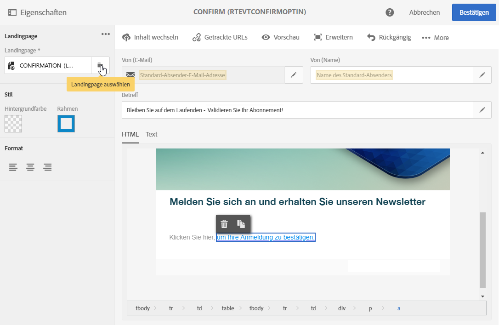

1. Bearbeiten Sie die Eigenschaften der E-Mail-Vorlage. In the **[!UICONTROL Advanced parameters]** > **[!UICONTROL Preparation]** section, select the **TYPOLOGY_PROFILE** typology created before.
1. Speichern und publizieren Sie die Transaktionsnachricht.

## Schritt 3: Akquise-Landingpage erstellen  {#step-3--create-the-acquisition-landing-page}

Erstellen Sie die ursprüngliche Akquise-Landingpage. Sie enthält ein Anmeldeformular, das daraufhin auf Ihrer Website veröffentlicht wird.

Um diese Landingpage zu erstellen und zu konfigurieren, gehen Sie folgendermaßen vor:

1. Design a [new landing page](../../channels/using/getting-started-with-landing-pages.md) based on the **[!UICONTROL Profile acquisition (acquisition)]** template. Geben Sie den Titel &#39;**ACQUISITION**‘ ein.
1. Bearbeiten Sie die Eigenschaften der Landingpage: Klicken Sie im Abschnitt **[!UICONTROL Job]** > **[!UICONTROL Additional data]** auf **[!UICONTROL Add an element]** und geben Sie den folgenden Kontextpfad ein:

   /context/profile/blackList

   und wählen Sie den Wert **Wahr** aus.

   Dies ist nötig, damit Besucher, die ihre Anmeldung noch nicht bestätigt haben, auf die Blacklist gesetzt werden und keine Nachrichten erhalten. Durch die Bestätigung der CONFIRMATION-Landingpage erhält dieses Feld den Wert **Falsch**. Weiterführende Informationen dazu finden Sie unter [Schritt 1: Bestätigungs-Landingpage erstellen](#step-1--create-the-confirmation-landing-page).

1. Wählen Sie im Abschnitt **[!UICONTROL Job]** > **[!UICONTROL Specific actions]** die Option aus **[!UICONTROL Start sending messages]**.
1. Wählen Sie in der dazugehörigen Dropdown-Liste die von Ihnen erstellte Transaktionsnachrichtenvorlage **CONFIRM** aus.

   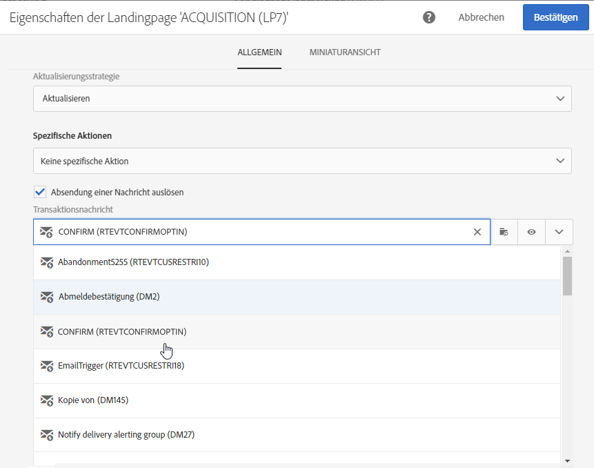

1. Passen Sie den Inhalt auf der Landingpage entsprechend Ihrer Marke und den von Ihnen benötigten Daten an. Sie können personalisierte Daten anzeigen und den Titel der Bestätigungs-Schaltfläche beispielsweise in **Anmeldung bestätigen** ändern.

   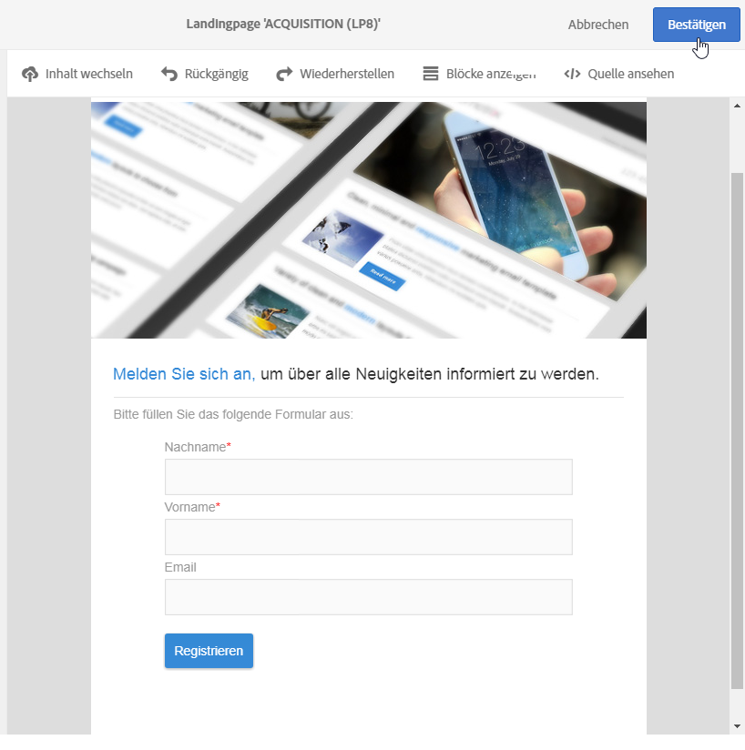

1. Passen Sie die Bestätigungsseite an, damit der neue Abonnent darüber informiert wird, dass er diese Anmeldung bestätigen muss.

   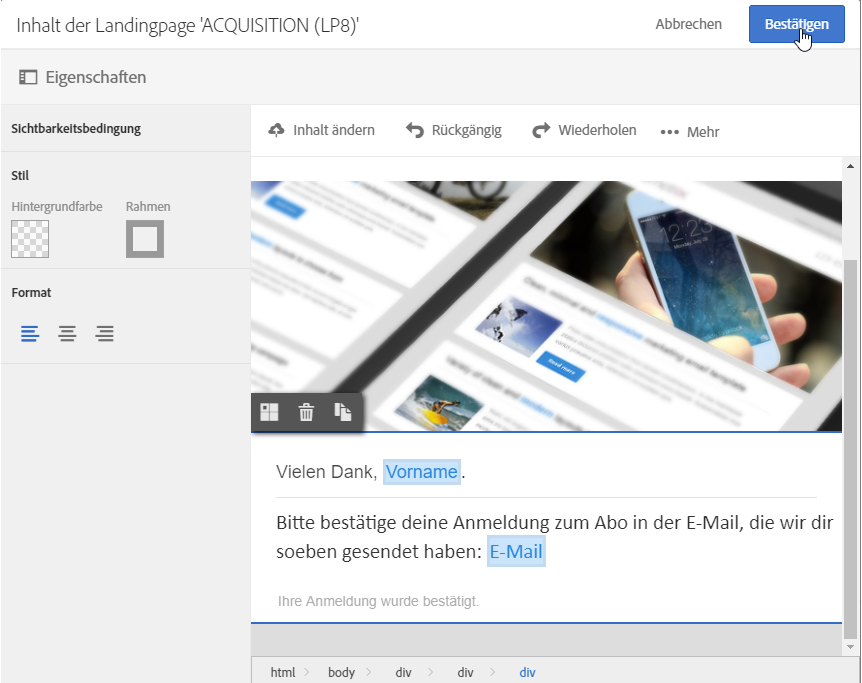

1. [Testen und publizieren](../../channels/using/testing-publishing-landing-page.md) Sie die Landingpage.

Die Anmeldung mit zweifacher Bestätigung ist jetzt konfiguriert. Sie können diesen Vorgang von Anfang bis Ende ausführen und testen, indem Sie bei der öffentlichen URL dieser **[!UICONTROL ACQUISITION]**-Landingpage beginnen. Diese URL wird im Dashboard der Landingpage angezeigt.
