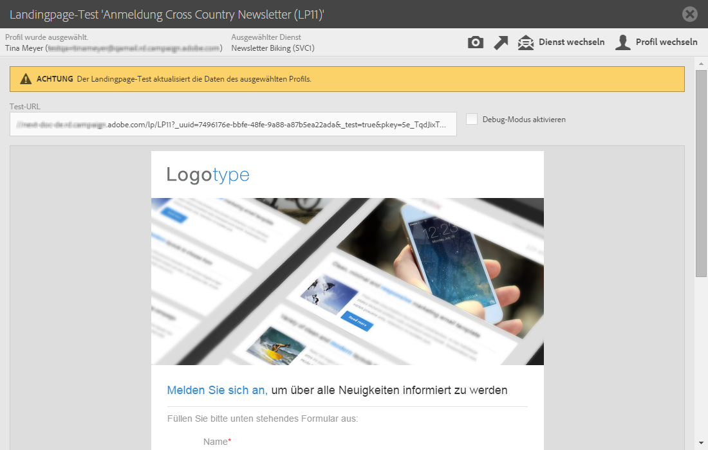
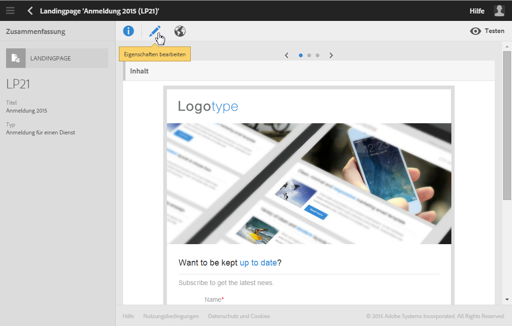
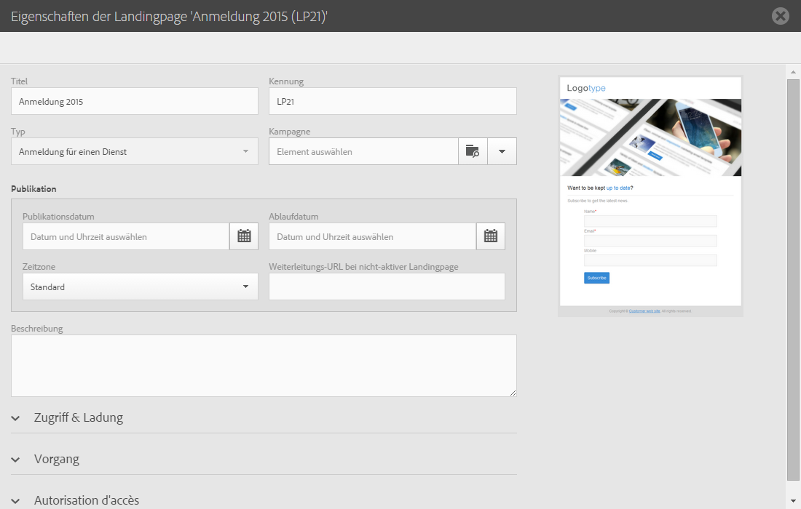

# Landingpage freigeben{#sharing-a-landing-page}

## Über die Publikation von Landingpages {#about-landing-page-publication}

Vor der Publikation einer Landingpage müssen Sie Tests durchführen: Validieren Sie die Ausführung, konfigurieren Sie den Zugriff darauf und legen Sie das Funktionsende der Landingpage fest. Diese Maßnahmen sind erforderlich und müssen mit Sorgfalt ausgeführt werden.

## Landingpage testen {#testing-the-landing-page-}

Da die Landingpage Auswirkungen auf Ihre Plattform und Ihre Daten hat, muss sie sorgfältig getestet werden. Gehen Sie wie folgt vor:

1. Verwenden Sie hierzu die Schaltfläche **[!UICONTROL Testen]in der Symbolleiste der Landingpage.**
1. Wenn auf der Landingpage Abonnements verarbeitet werden sollen, wählen Sie auf dem Testbildschirm ein Testprofil und einen Testdienst.

   

1. Geben Sie in den Feldern Daten ein und wählen Sie Optionen aus.
1. Übermitteln Sie die Landingpage und prüfen Sie die entsprechenden Aktualisierungen in der Datenbank.

   >[!CAUTION]
   >
   >Wenn das Formular übermittelt wird, werden der Dienst und das Profil aktualisiert.

1. Wiederholen Sie diesen Vorgang mit verschiedenen Profilen und Daten.

   Bei Bedarf können Sie in diesem Bildschirm auch eine Miniaturansicht der Landingpage erzeugen.

## Gültigkeitsparameter einrichten {#setting-up-validity-parameters}

Wir empfehlen dringend, aus Gründen der Sicherheit und der Plattform-Leistung vor der Publikation in den Eigenschaften der Landingpage ein Ablaufdatum einzurichten. Bei Erreichen des angegebenen Datums wird die Landingpage automatisch offline gestellt. Gehen Sie wie folgt vor:

1. Bearbeiten Sie die Landingpage-Eigenschaften über die Schaltfläche 

   

1. Definieren Sie im Bereich **[!UICONTROL Publikation]das Ablaufdatum und die entsprechende Uhrzeit. Die Landingpage wird automatisch am angegebenen Datum depubliziert und ist dann nicht mehr verfügbar.**

   Sie können die Zeitzone auswählen, die für dieses Datum und die Uhrzeit berücksichtigt werden soll.

1. Definieren Sie eine Weiterleitungs-URL, um die Besucher weiterzuleiten, die versuchen, auf eine nicht aktive Landingpage zuzugreifen.

   

>[!CAUTION]
>
>Sie können auch ein Publikationsdatum und die entsprechende Uhrzeit definieren. Die Landingpage wird dann automatisch am angegebenen Datum publiziert.

## Landingpage publizieren {#publishing-a-landing-page}

Wenn Sie eine Landingpage publizieren, ist sie online für Besucher verfügbar.

Eine Landingpage-Depublizierung bzw. -Aktualisierung ist jederzeit über die Schaltfläche **[!UICONTROL Publizieren]möglich.** Wenn vor der erneuten Publikation die Landingpage nicht depubliziert wurde und ein Fehler auftritt, bleibt die erste Version online.
