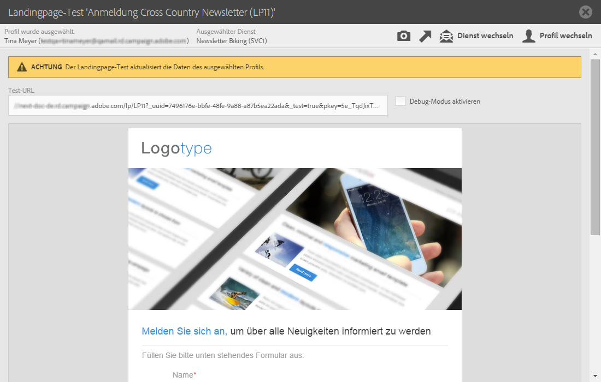
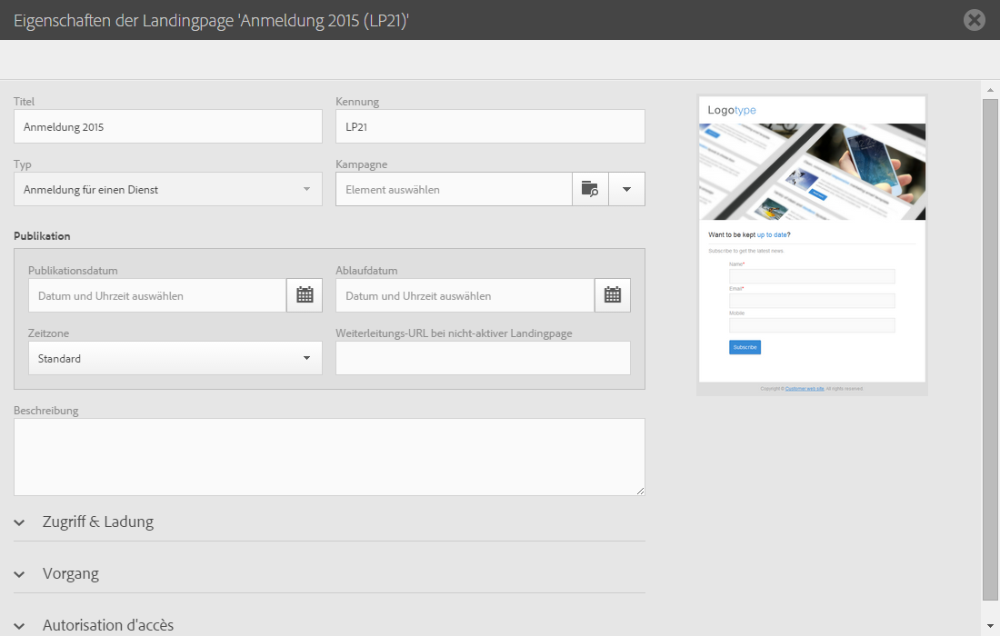

# Landingpage testen und veröffentlichen{#testing-publishing--landing-page}

## Über die Veröffentlichung von Landingpages {#about-landing-page-publication}

Vor der Veröffentlichung einer Landingpage müssen Sie Tests durchführen: Validieren Sie die Ausführung, konfigurieren Sie den Zugriff darauf und legen Sie das Funktionsende der Landingpage fest. Diese Maßnahmen sind erforderlich und müssen mit Sorgfalt ausgeführt werden.

## Landingpage testen         {#testing-the-landing-page-}

Da die Landingpage Auswirkungen auf Ihre Plattform und Ihre Daten hat, muss sie sorgfältig getestet werden. Gehen Sie wie folgt vor:

1. Verwenden Sie hierzu die Schaltfläche **[!UICONTROL Testen]** in der Aktionsleiste der Landingpage.
1. Wenn auf der Landingpage Abonnements verarbeitet werden sollen, wählen Sie auf dem Testbildschirm ein Testprofil und einen Testdienst.

   

1. Geben Sie in den Feldern Daten ein und wählen Sie Optionen aus.
1. Übermitteln Sie die Landingpage und prüfen Sie die entsprechenden Aktualisierungen in der Datenbank.

   >[!IMPORTANT]
   >
   >Wenn das Formular übermittelt wird, werden der Dienst und das Profil aktualisiert.

1. Wiederholen Sie diesen Vorgang mit verschiedenen Profilen und Daten.

Bei Bedarf können Sie in diesem Bildschirm auch eine Miniaturansicht der Landingpage erzeugen.

>[!NOTE]
>
>Um die Vorschau der Landingpage in der Campaign-Benutzeroberfläche anzuzeigen, muss die URL des Anwendungs-Servers sicher sein. Verwenden Sie in diesem Fall https:// anstelle von http://, um diese URL beim [Konfigurieren Ihrer Marke](../../administration/using/branding.md#configuring-and-using-brands) einzurichten.

## Gültigkeitsparameter einrichten         {#setting-up-validity-parameters}

Wir empfehlen dringend, aus Gründen der Sicherheit und der Plattform-Leistung vor der Veröffentlichung in den Eigenschaften der Landingpage ein Ablaufdatum einzurichten. Bei Erreichen des angegebenen Datums wird die Veröffentlichung der Landingpage automatisch aufgehoben. Gehen Sie wie folgt vor:

1. Bearbeiten Sie die Landingpage-Eigenschaften über die Schaltfläche  im Landingpage-Dashboard.

   

1. Definieren Sie im Bereich **[!UICONTROL Veröffentlichung]** das Ablaufdatum und die entsprechende Uhrzeit. Die Veröffentlichung der Landingpage wird automatisch am angegebenen Datum aufgehoben und sie ist dann nicht mehr verfügbar.

   Sie können die Zeitzone auswählen, die für dieses Datum und die Uhrzeit berücksichtigt werden soll.

1. Definieren Sie eine Weiterleitungs-URL, um die Besucher weiterzuleiten, die versuchen, auf eine nicht aktive Landingpage zuzugreifen.

   

>[!IMPORTANT]
>
>Sie können auch ein Bereitstellungsdatum und die entsprechende Uhrzeit definieren. Die Landingpage wird dann automatisch am angegebenen Datum veröffentlicht.

## Landingpage veröffentlichen   {#publishing-a-landing-page}

Wenn Sie eine Landingpage veröffentlichen, ist sie online für Besucher verfügbar.

Die Aufhebung der Veröffentlichung der Landingpage bzw. ihre Aktualisierung ist jederzeit über die Schaltfläche **[!UICONTROL Veröffentlichen]** möglich. Wenn vor der erneuten Veröffentlichung die Veröffentlichung der Landingpage nicht aufgehoben wurde und ein Fehler auftritt, bleibt die erste Version online.
