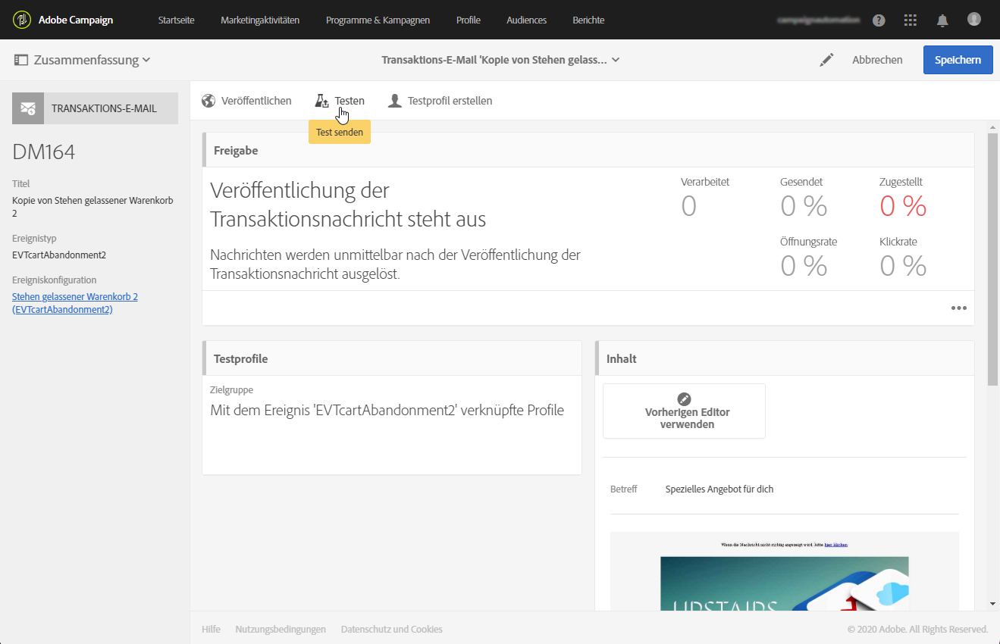

# Transaktionsnachrichten testen {#testing-a-transactional-message}

Bevor Sie Ihre Transaktionsnachricht veröffentlichen, können Sie ein spezifisches Testprofil erstellen, mit dem Sie die Nachricht ordnungsgemäß überprüfen können.

## Spezifisches Testprofil definieren {#defining-specific-test-profile}

Definieren Sie ein Testprofil, das mit Ihrem Ereignis verknüpft wird. Auf diese Weise können Sie eine Vorschau Ihrer Nachricht anzeigen und einen entsprechenden Testversand durchführen.

1. [Klicken Sie im Dashboard für Transaktionsnachrichten](../../channels/using/editing-transactional-message.md#accessing-transactional-messages) auf die Schaltfläche **[!UICONTROL Testprofil erstellen]**.

   

1. Geben Sie im Bereich **[!UICONTROL Für die Personalisierung verwendete Ereignisdaten]** die zu übermittelnden Daten im JSON-Format an. Bei den angegebenen Daten handelt es sich um den Inhalt, der in der Vorschau verwendet und dem Testprofil im Testversand übermittelt wird.

   

   >[!NOTE]
   >
   >Wenn Sie Ihre Nachricht angereichert haben, können Sie auch Informationen zu einer anderen Tabelle eingeben, z. B. **[!UICONTROL Profil]**. Siehe [Ereignisse anreichern](../../channels/using/configuring-transactional-event.md#enriching-the-transactional-message-content) und [Transaktionsnachrichten personalisieren](../../channels/using/editing-transactional-message.md#personalizing-a-transactional-message).

1. Nach seiner Erstellung ist das Testprofil in der Transaktionsnachricht vorausgefüllt. Verwenden Sie den Block **[!UICONTROL Testprofile]** der Nachricht, um Ihre Testversand-Zielgruppe zu überprüfen.

   

Sie haben außerdem die Möglichkeit, ausgehend vom Menü **[!UICONTROL Testprofile]** ein neues Testprofil zu erstellen bzw. ein bereits existierendes zu verwenden. Gehen Sie dazu wie folgt vor:

1. Klicken Sie auf das **Adobe**-Logo oben links im Bildschirm und anschließend auf **[!UICONTROL Profile und Zielgruppen]** > **[!UICONTROL Testprofile]**.
1. Wählen Sie im Abschnitt **[!UICONTROL Ereignis]** das soeben erstellte Ereignis aus. Im vorliegenden Beispiel handelt es sich um &quot;Warenkorbabbruch (EVTcartAbandonment)&quot;.
1. Geben Sie im Tab **[!UICONTROL Ereignisdaten]** im Texteditor die zu übermittelnden Daten im JSON-Format an.

   

1. Speichern Sie Ihre Änderungen.
1. [Rufen Sie die von Ihnen erstellte Nachricht auf und wählen Sie das aktualisierte Testprofil aus.](../../channels/using/editing-transactional-message.md#accessing-transactional-messages)

**Verwandte Themen:**

* [Testprofile verwalten](../../audiences/using/managing-test-profiles.md)
* [Zielgruppen erstellen](../../audiences/using/creating-audiences.md)

## Testversand durchführen {#sending-proof}

Nachdem Sie ein oder mehrere spezifische Testprofile erstellt und Ihre Transaktionsnachricht gespeichert haben, können Sie einen Testversand durchführen.

Lesen Sie diesbezüglich auch den Abschnitt [Testsendungen erzeugen](../../sending/using/sending-proofs.md).
