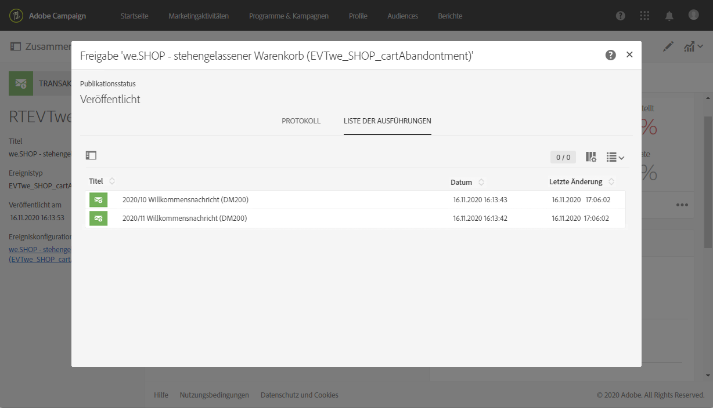
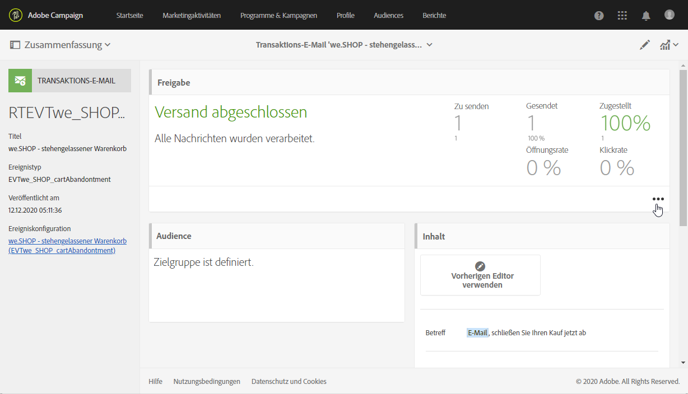
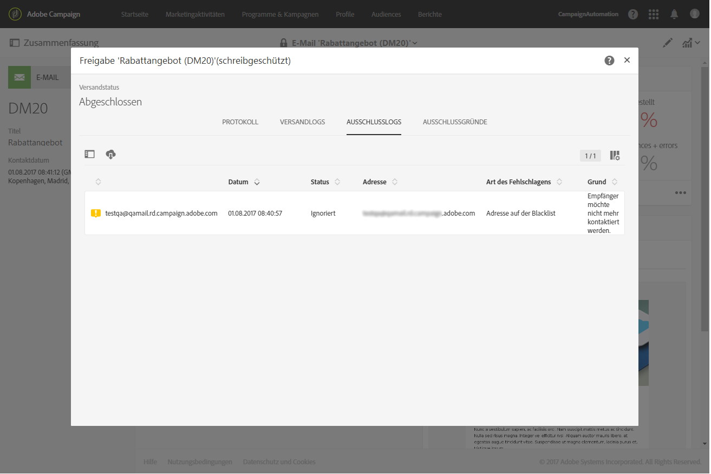

# Ausführung und Überwachung von Transaktionsnachrichten {#transactional-messaging-execution}

## Ausführungsversand von Transaktionsnachrichten {#transactional-message-execution-delivery}

Sobald die Nachricht veröffentlicht wurde und Ihre Site-Integration abgeschlossen ist, wird sie einem Ausführungsversand zugewiesen, sobald ein Ereignis aktiviert wird.

Ein **Ausführungsversand** ist eine technische Nachricht ohne Aktionen oder Funktionen, die einmal monatlich für jede Transaktionsnachricht und jedes Mal, wenn eine Transaktionsnachricht bearbeitet und erneut veröffentlicht wird, erstellt wird.

**Verwandte Themen**:
* [Transaktionsnachricht veröffentlichen](../../channels/using/publishing-transactional-message.md#publishing-a-transactional-message)
* [Ereignisaktivierung integrieren](../../channels/using/getting-started-with-transactional-msg.md#integrate-event-trigger)

## Wiederholungsvorgang für Transaktionsnachrichten {#transactional-message-retry-process}

Vorläufig nicht zugestellte Transaktionsnachrichten werden so lange automatisch erneut versendet, bis ihre Gültigkeit abgelaufen ist. Weiterführende Informationen zur Versandlaufzeit finden Sie in Abschnitt [Parameter für den Gültigkeitszeitraum](../../administration/using/configuring-email-channel.md#validity-period-parameters).

Wenn eine Transaktionsnachricht nicht gesendet werden kann, gibt es zwei Systeme, durch die erneute Zustellversuche unternommen werden.

* Auf der Ebene der Transaktionsnachrichten kann eine Transaktionsnachricht fehlschlagen, bevor das Ereignis einem Ausführungsversand zugewiesen wurde, d. h. zwischen dem Ereignisempfang und der Versandvorbereitung. Siehe [Wiederholungsverfahren bei der Ereignisverarbeitung](#event-processing-retry-process).
* Auf der Ebene des Versandverfahrens kann die Transaktionsnachricht nach der Zuweisung des Ereignisses zu einem Ausführungsversand wegen eines temporären Fehlers fehlschlagen. Siehe [Wiederholungsverfahren beim Nachrichtenversand](#message-sending-retry-process).

### Wiederholungsverfahren bei der Ereignisverarbeitung {#event-processing-retry-process}

Wenn ein Ereignis aktiviert wird, wird es einem Ausführungsversand zugewiesen. Wenn ein Ereignis keinem Ausführungsversand zugewiesen werden kann, wird die Ereignisverarbeitung verschoben. Wiederholungen werden dann durchgeführt, bis das Ereignis einem neuen Ausführungsversand zugewiesen wird.

>[!NOTE]
>
>Ein verschobenes Ereignis wird nicht in den Versandlogs für Transaktionsnachrichten angezeigt, weil das Ereignis noch keinem Ausführungsversand zugeordnet ist.

Beispielsweise kann es sein, dass das Ereignis keinem Ausführungsversand zugewiesen werden konnte, weil der Inhalt nicht korrekt war, es ein Problem mit den Zugriffsrechten oder dem Branding gab oder ein Fehler beim Anwenden von Typologieregeln erkannt wurde. In diesem Fall können Sie die Nachricht vorläufig anhalten, bearbeiten, um den Fehler zu beheben, und erneut veröffentlichen. Das Wiederholungssystem weist die Nachricht daraufhin einem neuen Ausführungsversand zu.

### Wiederholungsverfahren beim Nachrichtenversand {#message-sending-retry-process}

Nachdem das Ereignis einem Ausführungsversand zugewiesen wurde, kann die Transaktionsnachricht aufgrund eines temporären Fehlers fehlschlagen, z. B. falls das Postfach des Empfängers voll ist. Weiterführende Informationen dazu finden Sie in Abschnitt [Weitere Zustellversuche nach einem vorübergehend fehlgeschlagenen Versand](../../sending/using/understanding-delivery-failures.md#retries-after-a-delivery-temporary-failure).

>[!NOTE]
>
>Wenn ein Ereignis einem Ausführungsversand zugewiesen wird, wird es nur dieses eine Mal in den Versandlogs dieses Ausführungsversands angezeigt. Die fehlgeschlagenen Sendungen werden im Tab **[!UICONTROL Liste der Ausführungen]** der Versandlogs der Transaktionsnachricht angezeigt.

### Beschränkungen beim Wiederholungsvorgang {#limitations}

**Aktualisierung der Versandlogs**

Im Wiederholungsvorgang werden die Versandlogs des neuen Ausführungsversands nicht sofort aktualisiert (die Aktualisierung erfolgt über einen zeitversetzten Workflow). Das bedeutet, dass die Nachricht den Status **[!UICONTROL Ausstehend]** aufweisen könnte, selbst wenn das Transaktionsereignis vom neuen Ausführungsversand verarbeitet worden ist.

**Fehlgeschlagener Ausführungsversand**

Ein Ausführungsversand kann nicht angehalten werden. Wenn jedoch ein aktueller Ausführungsversand fehlschlägt, wird ein neuer erstellt, sobald ein neues Ereignis empfangen wird, und alle neuen Ereignisse werden von diesem neuen Ausführungsversand verarbeitet. Vom fehlgeschlagenen Ausführungsversand werden keine neuen Ereignisse verarbeitet.

Wenn manche, einem Ausführungsversand bereits zugewiesenen Ereignisse als Teil eines Wiederholungsvorgangs verschoben wurden und dieser Ausführungsversand fehlschlägt, weist das Wiederholungssystem dem neuen Ausführungsversand nicht die verschobenen Ereignisse zu. Diese Ereignisse gehen verloren. Markieren Sie die [Versandlogs](#monitoring-transactional-message-delivery), um die möglicherweise betroffenen Empfänger anzuzeigen.

## Transaktionsnachrichten überwachen {#monitoring-transactional-message-delivery}

Um eine Transaktionsnachricht zu überwachen, müssen Sie die entsprechenden [Ausführungssendungen](#transactional-message-execution-delivery) aufrufen.

1. Um das Versandlog der Nachricht anzuzeigen, klicken Sie auf das Symbol unten rechts in der Kachel **[!UICONTROL Bereitstellung]**.

   

1. Klicken Sie auf den Tab **[!UICONTROL Ausführungsliste]**.

   

1. Wählen Sie den gewünschten Ausführungsversand aus.

   

1. Klicken Sie erneut auf das Symbol unten rechts in der Kachel **[!UICONTROL Bereitstellung]**.

   

   Für jeden Ausführungsversand können Sie die Versandlogs genau wie für einen standardmäßigen Versand einsehen. Weitere Informationen zum Aufrufen und Verwenden der Logs finden Sie unter [Versand überwachen](../../sending/using/monitoring-a-delivery.md).

### Besonderheiten profilbasierter Transaktionsnachrichten {#profile-transactional-message-monitoring}

Bei profilbasierten Transaktionsnachrichten können Sie die folgenden Profilinformationen überwachen.

Wählen Sie den Tab **[!UICONTROL Versandlogs]** aus. In der **[!UICONTROL Status]**-Spalte zeigt **[!UICONTROL Gesendet]** an, dass sich ein Profil angemeldet hat.

Wählen Sie den Tab **[!UICONTROL Ausschlusslogs]** aus, um die Empfänger anzuzeigen, die von der Versandzielgruppe ausgeschlossen wurden, wie zum Beispiel Adressen auf der Blockierungsliste.

Profile, die sich abgemeldet haben, wurden durch die Typologieregel **[!UICONTROL Adresse auf Blockierungsliste]** ausgeschlossen.

Diese Regel ist Teil einer spezifischen Typologie, die für alle auf der **[!UICONTROL Profil]**-Tabelle basierenden Transaktionsnachrichten gilt.

**Verwandte Themen**:

* [Über Typologien und Typologieregeln](../../sending/using/about-typology-rules.md)
* [Sendungen überwachen](../../sending/using/monitoring-a-delivery.md)
