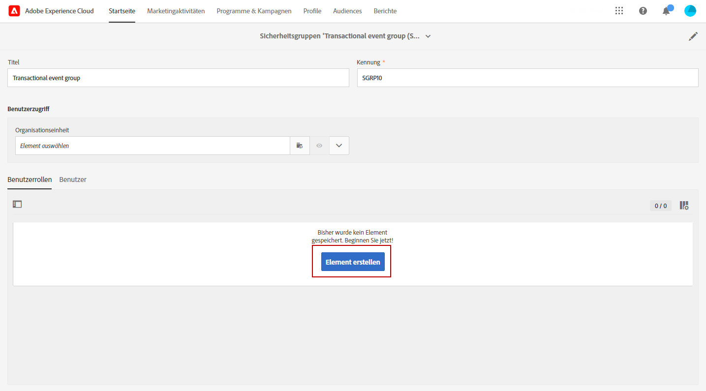
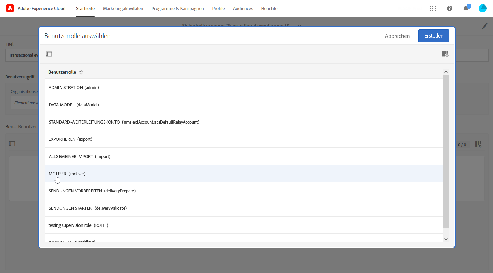
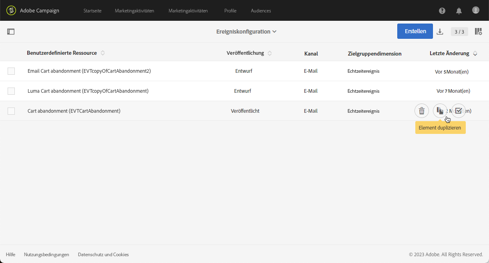
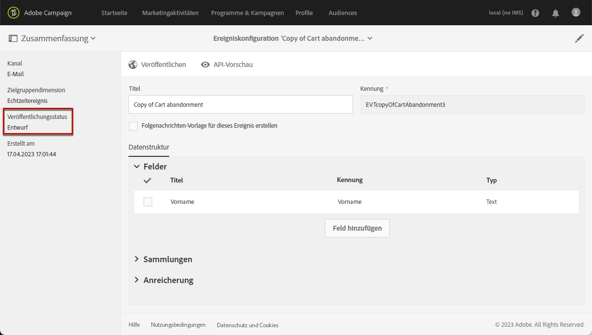
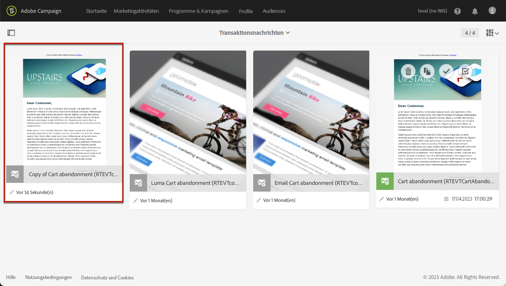
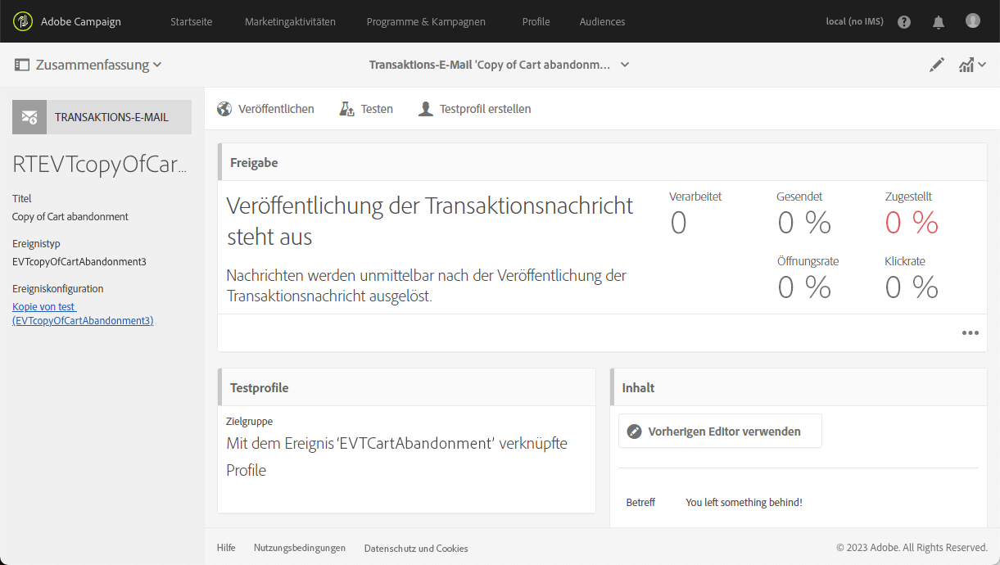

# Verbesserungen bei Transaktionsereignissen {#transactional-event-improvements}

>[!AVAILABILITY]
>
>Diese Funktionen sind derzeit nur für eine Reihe von Organisationen verfügbar (eingeschränkte Verfügbarkeit). Weitere Informationen erhalten Sie von Ihrem Kundenbetreuer für Adobe.

Derzeit können in Adobe Campaign Standard Benutzer ohne Administrator-Sicherheitsgruppe nicht auf Transaktionsereignisse zugreifen, diese erstellen oder veröffentlichen, was zu Problemen für Geschäftsbenutzer führt, die Ereignisse konfigurieren und veröffentlichen müssen, aber keine Administratorrechte haben. Außerdem ist es nicht möglich, Transaktionsereignisse zu duplizieren.

Die Zugriffskontrolle auf Transaktionsnachrichten wurde folgendermaßen verbessert:

* Eine neue **[!UICONTROL Rolle]** aufgerufen **MC-Benutzer** wurde hinzugefügt, damit Benutzer, die keine Administratoren sind, die Konfiguration von Transaktionsereignissen verwalten können. Die Rolle **MC USER** bietet diesen Benutzerinnen und Benutzern die Möglichkeit, auf Transaktionsereignisse und -nachrichten zuzugreifen, sie zu erstellen, zu veröffentlichen und ihre Veröffentlichung aufzuheben.

* Ausführungsversand (d. h. technische Nachrichten, die jedes Mal erstellt werden, wenn eine Transaktionsnachricht bearbeitet und erneut veröffentlicht wird, oder standardmäßig einmal im Monat) auf **[!UICONTROL Organisationseinheit]** der Sicherheitsgruppe, zu der der Benutzer gehört, der das Ereignis erstellt, anstatt auf die **[!UICONTROL Organisationseinheit]** des **Message Center Agent (mcExec)** Sicherheitsgruppe.

* **Administratoren** kann jetzt veröffentlichte Transaktionsereignisse sowie Benutzer mit der Variablen **MC-Benutzer** Rolle, sofern sie sich in derselben **Organisationseinheit** -Hierarchie als Benutzer, der das Ereignis erstellt hat.

## Zuweisen der Benutzerrolle &quot;MC&quot; {#assign-role}

So weisen Sie die **MC-Benutzer** Rolle für Ihre Sicherheitsgruppe:

1. Erstellen Sie eine neue **[!UICONTROL Sicherheitsgruppe]** oder aktualisieren Sie eine vorhandene. [Weitere Informationen](../../administration/using/managing-groups-and-users.md).

1. Klicken Sie auf **[!UICONTROL Element erstellen]**, um Ihrer Sicherheitsgruppe Rollen zuzuweisen.

   

1. Wählen Sie die **[!UICONTROL Rolle]** „MC USER“ aus und klicken Sie auf **[!UICONTROL Bestätigen]**.

   >[!IMPORTANT]
   >
   > Gehen Sie beim Zuweisen der Rolle „MC USER“ vorsichtig vor, da diese Rolle Benutzerinnen und Benutzer die Möglichkeit gibt, die Veröffentlichung von Ereignissen aufzuheben.

   

1. Klicken Sie nach der Konfiguration auf **[!UICONTROL Speichern]**.

Benutzer, die damit verknüpft sind **[!UICONTROL Sicherheitsgruppe]** Sie können jetzt auf Transaktionsereignisse und -nachrichten zugreifen, sie erstellen und veröffentlichen.

## Zuweisen der MC-Sicherheitsgruppe {#assign-group}

1. Wählen Sie in der Admin Console die **Produkte** Registerkarte.

1. Auswählen **Adobe Campaign Standard** Wählen Sie dann Ihre Instanz aus.

1. Aus dem **Produktprofile** Liste, wählen Sie die **MC-Benutzer** hinzugefügt.

1. Klicken **Benutzer hinzufügen** und geben Sie den Namen, die Benutzergruppe oder die E-Mail-Adresse des Profils ein, das Sie diesem Produktprofil hinzufügen möchten.

1. Klicken Sie nach dem Hinzufügen auf **Speichern**.

Benutzer, die hinzugefügt wurden **[!UICONTROL Sicherheitsgruppe]** Sie können jetzt auf Transaktionsereignisse und -nachrichten zugreifen, sie erstellen und veröffentlichen.

## Transaktionsereignisse duplizieren {#duplicate-transactional-events}

Ein Benutzer mit der **Administrator** Sicherheitsgruppe<!--([Functional administrators](../../administration/using/users-management.md#functional-administrators)?)--> kann jetzt eine Ereigniskonfiguration duplizieren, wenn das Ereignis **veröffentlicht**.

Darüber hinaus verwenden Benutzer ohne Administratorrechte mit der **MC-Benutzer** Rolle kann jetzt auf Ereigniskonfigurationen zugreifen, ihre Berechtigung zum Duplizieren wird jedoch durch die Variable **Organisationseinheit** gehören. Wenn der aktuelle Benutzer und der Benutzer, der das Ereignis erstellt hat, zur gleichen Hierarchie der Organisationseinheiten gehören, ist eine Duplizierung zulässig.

Wenn beispielsweise ein Benutzer, der zur Organisationseinheit &quot;France Sales&quot;gehört, eine Ereigniskonfiguration erstellt:

* Ein anderer Benutzer, dessen Organisationseinheit &quot;Paris Sales&quot; ist, kann diese Veranstaltung duplizieren, da &quot;Paris Sales&quot; Teil der Organisationseinheit &quot;France Sales&quot; ist.

* Ein Benutzer, dessen Organisationseinheit &quot;San Francisco Sales&quot; ist, kann dies jedoch nicht tun, da &quot;San Francisco Sales&quot; unter der Organisationseinheit &quot;US Sales&quot; steht, die von der Organisationseinheit &quot;France Sales&quot; getrennt ist.

Gehen Sie wie folgt vor, um eine Ereigniskonfiguration zu duplizieren.

1. Klicken Sie auf das  **Adobe**-Logo oben links im Bildschirm und anschließend auf **[!UICONTROL Marketing-Pläne]** > **[!UICONTROL Transaktionsnachrichten]** > **[!UICONTROL Ereigniskonfiguration]**.

1. Bewegen Sie den Mauszeiger über die veröffentlichte Ereigniskonfiguration Ihrer Wahl und wählen Sie die **[!UICONTROL Element duplizieren]** Schaltfläche.

   

   >[!CAUTION]
   >
   >Eine nicht veröffentlichte Ereigniskonfiguration kann nicht dupliziert werden. [Weitere Informationen](publishing-transactional-event.md)

1. Das duplizierte Ereignis wird automatisch angezeigt. Sie enthält dieselbe Konfiguration wie das ursprüngliche Ereignis, verfügt jedoch über die **[!UICONTROL Entwurf]** Status.

   

1. Die entsprechende Transaktionsnachricht wird automatisch erstellt. Um darauf zuzugreifen, navigieren Sie zu **[!UICONTROL Transaktionsnachrichten]** > **[!UICONTROL Transaktionsnachrichten]**.

   

1. Öffnen Sie die neu duplizierte Nachricht. Sie enthält dasselbe Design, das Sie für die ursprüngliche Nachricht definiert haben, hat jedoch die **[!UICONTROL Entwurf]** Status, auch wenn die ursprüngliche Transaktionsnachricht veröffentlicht wurde.

   

1. Sie können diese Nachricht jetzt bearbeiten und personalisieren. Siehe [Transaktionsnachrichten bearbeiten](../../channels/using/editing-transactional-message.md).

## Auswirkungen {#impacts}

Die nachstehende Tabelle zeigt die Auswirkungen dieser Verbesserungen:

| Objekte | Vor dieser Änderung | Nach dieser Änderung |
|:-: | :--: | :-:|
| Transaktionsereignisse | Nur Benutzerinnen und Benutzer innerhalb der Sicherheitsgruppe **Administrator** können Ereignisse erstellen und veröffentlichen. | Die Rolle **MC USER** ermöglicht Benutzerinnen und Benutzern das Erstellen und Veröffentlichen von Ereignissen. |
| Transaktionsnachrichten | Transaktionsnachrichten werden auf die Variable **Organisationseinheit** des **Message Center Agent (mcExec)** Sicherheitsgruppe. | Transaktionsnachrichten werden auf die Variable **Organisationseinheit** der Sicherheitsgruppe, zu der der Benutzer gehört, der das Transaktionsereignis/die Transaktionsnachricht erstellt. |
| Ausführungsversand | Die Ausführungsversand-Aktivität wird auf den Wert **Organisationseinheit** des **Message Center Agent (mcExec)** Sicherheitsgruppe. | Die Ausführungsversand-Aktivität wird auf den Wert **Organisationseinheit** der Sicherheitsgruppe, zu der der Benutzer gehört, der das Transaktionsereignis/die Transaktionsnachricht erstellt. |
| Veröffentlichte Transaktionsereignisse | Eine Duplizierung ist für keinen Benutzer möglich. | <ul><li>Benutzer mit **Administrator** Sicherheitsgruppe kann veröffentlichte Ereignisse duplizieren.</li> <li>Benutzer mit **MC-Benutzer** Rolle kann veröffentlichte Ereignisse duplizieren, sofern sie sich im selben befinden **Organisationseinheit** -Hierarchie als Benutzer, der das Ereignis erstellt hat.</li></ul> |

<!--Transactional Message Templates| Transactional Message templates are set to the Organizational unit **All**. | Transaction Message Template will be set to the **Organizational unit** of the security group to which the user creating the message template belongs.-->