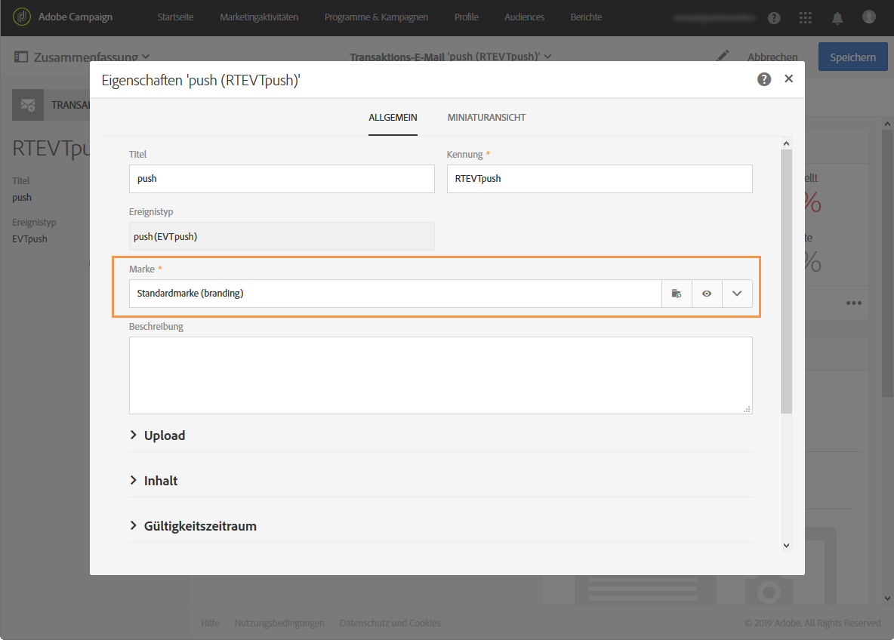

# Einschränkungen bei Transaktionsnachrichten {#transactional-messaging-limitations}

Im folgenden Abschnitt finden Sie die Einschränkungen, die Sie kennen sollten, bevor Sie mit dem Erstellen von Transaktionsnachrichten beginnen.

Weitere Informationen zu Transaktionsnachrichten, einschließlich ihrer Konfiguration und Erstellung, finden Sie unter [Erste Schritte mit Transaktionsnachrichten](../../channels/using/getting-started-with-transactional-msg.md).

>[!IMPORTANT]
>
>Für den Zugriff auf Transaktionsnachrichten benötigen Sie Administratorrechte.

## Gestaltung und Publikation {#design-and-publication}

Bei der Gestaltung und Publikation von Transaktionsnachrichten können manche Schritte nicht mehr rückgängig gemacht werden. Achten Sie bitte auf folgende Einschränkungen:

* Für jede Ereigniskonfiguration kann jeweils nur ein Kanal verwendet werden. Siehe [Ereignis erstellen](../../administration/using/configuring-transactional-messaging.md#creating-an-event).
* Nach der Erstellung des Ereignisses lässt sich der Kanal nicht mehr ändern. Deshalb müssen Sie den Mechanismus festlegen, über den eine Nachricht im Fall einer erfolglosen Sendung über einen anderen Kanal mit einem Workflow gesendet werden kann. Siehe [Workflow-Daten und -Prozesse](../../automating/using/get-started-workflows.md).
* Nach der Erstellung des Ereignisses können Sie die Zielgruppendimension (**[!UICONTROL Echtzeit-Ereignis]** or **[!UICONTROL Profil]**) nicht mehr ändern. Siehe [Ereignis erstellen](../../administration/using/configuring-transactional-messaging.md#creating-an-event).
* Es ist nicht möglich, eine Publikation rückgängig zu machen, Sie können aber ein Ereignis depublizieren: Dadurch wird der Zugriff auf das Ereignis und die damit verknüpften Transaktionsnachrichten gesperrt. Siehe [Ereignis depublizieren](../../administration/using/configuring-transactional-messaging.md#unpublishing-an-event).
* Die einzige Transaktionsnachricht, die mit einem Ereignis verknüpft werden kann, ist die Nachricht, die automatisch beim Publizieren dieses Ereignisses erstellt wird. Siehe [Vorschau erstellen und Ereignis publizieren](../../administration/using/configuring-transactional-messaging.md#previewing-and-publishing-the-event).

## Personalisierung       {#personalization}

Die Möglichkeiten zur Personalisierung eines Nachrichteninhalts hängt vom Typ der Transaktionsnachricht ab. Unten finden Sie die Spezifikationen.

### Ereignisbasierte Transaktionsnachrichten

* Die Personalisierungsinformationen stammen von den im Ereignis selbst enthaltenen Daten. Siehe [Ereignis-Transaktionsnachrichten](../../channels/using/event-transactional-messages.md).
* Sie können in einer Ereignis-Transaktionsnachricht **keine** Inhaltsbausteine für **[!UICONTROL Abmelde-Links]** verwenden.
* Beim ereignisbasierten Transaktionsnachrichtenversand sollen ausschließlich die Daten verwendet werden, die im gesendeten Ereignis der Personalisierung von Empfängern und Nachrichteninhalten dienen. Der Inhalt Ihrer Transaktionsnachricht lässt sich jedoch durch die Verwendung von in der Adobe-Campaign-Datenbank enthaltenen Informationen anreichern. Siehe [Inhalt der Transaktionsnachricht anreichern](../../administration/using/configuring-transactional-messaging.md#enriching-the-transactional-message-content).
* Da Ereignis-Transaktionsnachrichten keine Profilinformationen enthalten, sind sie nicht mit Ermüdungsregeln kompatibel (auch nicht, wenn sie mit Profilen angereichert werden). Näheres dazu finden Sie unter [Ermüdungsregeln](../../sending/using/fatigue-rules.md).

### Profilbasierte Transaktionsnachrichten  

* Die Personalisierungsinformationen können von den im Ereignis enthaltenen Daten oder von den abgestimmten Profildaten stammen. Siehe [Profil-Transaktionsnachrichten](../../channels/using/profile-transactional-messages.md).
* Sie **können in einer Profil-Transaktionsnachricht** Inhaltsbausteine für **[!UICONTROL Abmelde-Links]** verwenden. Siehe [Inhaltsbausteine](../../designing/using/personalization.md#adding-a-content-block).
* Ermüdungsregeln sind mit Profil-Transaktionsnachrichten kompatibel. Näheres dazu finden Sie unter [Ermüdungsregeln](../../sending/using/fatigue-rules.md).

Beachten Sie, dass Produktlisten nur in Nachrichten von Transaktions-E-Mails verfügbar sind. Siehe [Produktlisten in Transaktionsnachrichten verwenden](../../channels/using/event-transactional-messages.md#using-product-listings-in-a-transactional-message).

## Berechtigungen und Branding       {#permissions-and-branding}

Beim [Branding](../../administration/using/branding.md) bieten Transaktionsnachrichten weniger Flexibilität als Standardnachrichten. Adobe empfiehlt, alle in Transaktionsnachrichten verwendeten Marken mit der Organisationseinheit **[!UICONTROL Alle]**[ zu verknüpfen](../../administration/using/organizational-units.md). Weiterführende Informationen dazu finden Sie in der unten stehenden Erläuterung.

Bei der Bearbeitung einer Transaktionsnachricht können Sie sie mit einer Marke verknüpfen, um einige Parameter automatisch einzufügen, wie z. B. den Markennamen oder das Markenlogo. In den Eigenschaften der Transaktionsnachricht ist standardmäßig die **[!UICONTROL Standardmarke]** ausgewählt.

Alle in einer Transaktionsnachricht verwendeten Objekte (einschließlich der Marke) müssen in der Organisationseinheit **[!UICONTROL Message Center]** sichtbar sein, d. h. diese Objekte müssen sich in der Organisationseinheit **[!UICONTROL Message Center]** oder **[!UICONTROL Alle]** befinden.

Wenn aber die in den Nachrichteneigenschaften ausgewählte Marke mit einer anderen Organisationseinheit als **[!UICONTROL Message Center]** oder **[!UICONTROL Alle]** verknüpft ist, tritt ein Fehler auf und die Transaktionsnachricht kann nicht gesendet werden.

Deshalb müssen Sie im Fall von Multibranding bei Transaktionsnachrichten alle Marken entweder mit der Organisationseinheit **[!UICONTROL Message Center]** oder **[!UICONTROL Alle]** verknüpfen.

## Transaktionsnachrichten exportieren und importieren {#exporting-and-importing-transactional-messages}

* Um eine Transaktionsnachricht zu exportieren, müssen Sie bei der [Erstellung des Package-Exports](../../automating/using/managing-packages.md#creating-a-package) die entsprechende Ereigniskonfiguration einbeziehen.
* Nachdem die Transaktionsnachricht [in einem Package importiert wurde](../../automating/using/managing-packages.md#importing-a-package), wird sie nicht mehr in der Liste der Transaktionsnachrichten angezeigt. [Publizieren](../../administration/using/configuring-transactional-messaging.md#previewing-and-publishing-the-event) Sie die Ereigniskonfiguration, um die damit verbundene Transaktionsnachricht verfügbar zu machen.
