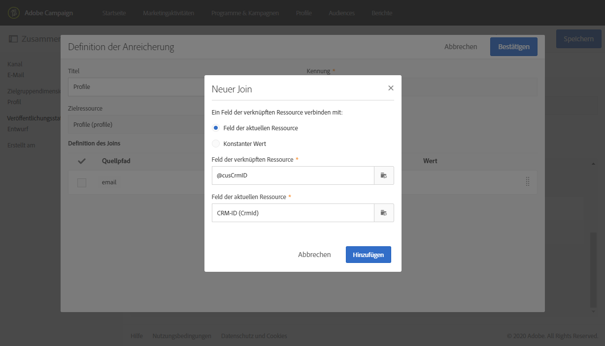
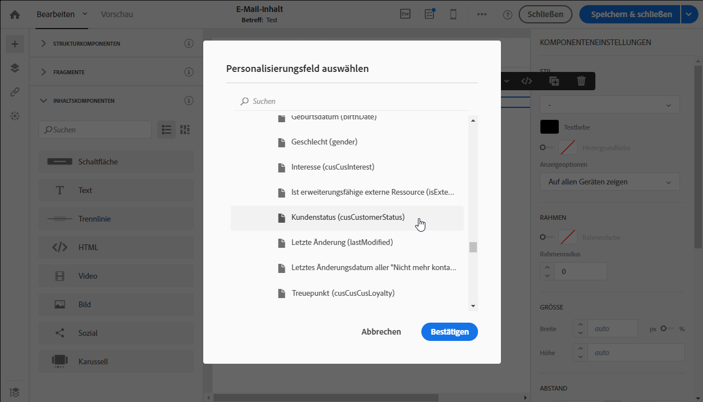

# Anwendungsfall für Transaktionsnachrichten {#transactional-messaging-use-case}

In diesem Beispiel möchten Sie die Transaktionsnachrichtenfunktion von Adobe Campaign verwenden, um nach jedem Einkauf auf Ihrer Website eine Bestätigungs-E-Mail zu senden und Ihre Kunden anhand ihrer CRM-ID zu identifizieren.

Die Voraussetzungen sind wie folgt:

* Stellen Sie sicher, dass die Ressource **[!UICONTROL Profil]** entsprechend der CRM-ID um ein neues Feld erweitert wurde.

* Erstellen und veröffentlichen Sie eine benutzerdefinierte Ressource, die Käufen entspricht, und verknüpfen Sie sie mit der Ressource **[!UICONTROL Profil]**. Auf diese Weise können Sie Informationen aus dieser Ressource zur Anreicherung des Nachrichteninhalts abrufen.

Weitere Informationen zum Erweitern, Erstellen und Veröffentlichen von Ressourcen finden Sie in [diesem Abschnitt](../../developing/using/key-steps-to-add-a-resource.md).

Die wichtigsten Schritte zur Implementierung dieses Anwendungsfalls werden nachfolgend beschrieben.

>[!NOTE]
>
>Eine grafische Darstellung des allgemeinen Transaktionsnachrichtenprozesses finden Sie in [diesem Schema](../../channels/using/getting-started-with-transactional-msg.md#key-steps).

## Schritt 1: Ereigniskonfiguration erstellen und veröffentlichen {#create-event-configuration}

1. Erstellen Sie ein neues Ereignis über den **[!UICONTROL E-Mail-Kanal]**. Siehe [Erstellen eines Ereignisses](../../channels/using/configuring-transactional-event.md#creating-an-event).

1. Wählen Sie die Zielgruppendimension **[!UICONTROL Profil]** aus, um eine [profilbasierte Transaktionsnachricht](../../channels/using/configuring-transactional-event.md#profile-based-transactional-messages) zu erstellen.

1. Definieren Sie die Attribute, die zur Personalisierung der Transaktionsnachricht verfügbar sein sollen. Fügen Sie in diesem Beispiel die Felder &quot;CRM-ID&quot; und &quot;Produkt-ID&quot; hinzu. Siehe [Ereignisattribute definieren](../../channels/using/configuring-transactional-event.md#defining-the-event-attributes).

   

1. Um den Inhalt der Nachricht mit Informationen über die Käufe des Kunden anzureichern, erstellen Sie eine Anreicherung, die auf die **[!UICONTROL Kauf]**-Ressource abzielt. Siehe [Ereignisse anreichern](../../channels/using/configuring-transactional-event.md#enriching-the-transactional-message-content).

   

1. Erstellen Sie eine Join-Bedingung zwischen dem zuvor zum Ereignis hinzugefügten Feld &quot;Produkt-ID&quot; und dem entsprechenden Feld in der Ressource **[!UICONTROL Kauf]**.

   

1. Da dies für profilbasierte Ereignisse obligatorisch ist, müssen Sie auch eine Anreicherung erstellen, die auf die **[!UICONTROL Profil]**-Ressource abzielt.

1. Erstellen Sie eine Join-Bedingung zwischen dem zuvor zur Nachricht hinzugefügten Feld &quot;CRM-ID&quot; und dem entsprechenden Feld in der erweiterten Ressource **[!UICONTROL Profil]**. <!--What's the purpose to have created a CRM ID for this event and to have the CRM ID as a join condition? could it be any other field provided you created it in the event?-->.

   

1. Wählen Sie dann im Bereich **[!UICONTROL Zielgruppen-Anreicherung]** die Anreicherung der Ressource **[!UICONTROL Profil]** aus, die beim Versand als Zielgruppe verwendet wird.

   

1. Erstellen Sie eine Vorschau und veröffentlichen Sie das Ereignis. Siehe [Erstellen einer Vorschau und Veröffentlichen des Ereignisses](../../channels/using/publishing-transactional-event.md#previewing-and-publishing-the-event).

## Schritt 2: Transaktionsnachricht bearbeiten und veröffentlichen {#create-transactional-message}

1. Wechseln Sie zu der Transaktionsnachricht, die beim Veröffentlichen des Ereignisses automatisch erstellt wurde. Siehe [Transaktionsnachrichten aufrufen](../../channels/using/editing-transactional-message.md#accessing-transactional-messages).

1. Bearbeiten und personalisieren Sie die Nachricht. Siehe [Profil-Transaktionsnachrichten bearbeiten](../../channels/using/editing-transactional-message.md#editing-profile-transactional-message).

1. Durch Abstimmung mit dem Feld „CRM-ID“, das Sie der Ressource **[!UICONTROL Profil]** hinzugefügt haben, haben Sie direkten Zugriff auf alle Profilinformationen, um Ihre Nachricht zu [personalisieren](../../designing/using/personalization.md#inserting-a-personalization-field).

   

1. Durch Abstimmung mit dem Feld „Produkt-ID“ können Sie den Inhalt der Nachricht mit Informationen zu den Käufen des Kunden anreichern, indem Sie ein Feld aus der Ressource **[!UICONTROL Kauf]** hinzufügen.

   

   Wählen Sie dazu **[!UICONTROL Personalisierungsfeld einfügen]** aus der kontextuellen Symbolleiste aus. Öffnen Sie unter dem Knoten **[!UICONTROL Kontext]** > **[!UICONTROL Transaktionsereignis]** > **[!UICONTROL Ereigniskontext]** den Knoten, der der benutzerdefinierten Ressource **[!UICONTROL Kauf]** entspricht und wählen Sie ein beliebiges Feld aus.

1. Sie können Ihre Nachricht mit einem spezifischen Testprofil testen. Siehe [Transaktionsnachricht testen](../../channels/using/testing-transactional-message.md#testing-a-transactional-message).

1. Sobald der Inhalt fertig ist, speichern Sie die Änderungen und veröffentlichen Sie die Nachricht. Siehe [Transaktionsnachricht veröffentlichen](../../channels/using/publishing-transactional-message.md#publishing-a-transactional-message).

## Schritt 3: Ereignisaktivierung integrieren {#integrate-event-trigger}

Integrieren Sie das Ereignis in Ihre Website. Siehe [Ereignis-Aktivierung integrieren](../../channels/using/getting-started-with-transactional-msg.md#integrate-event-trigger).

## Schritt 4: Nachrichtenversand {#message-delivery}

Nachdem alle diese Schritte ausgeführt wurden, erhalten Kunden beim Kauf von Produkten auf Ihrer Website eine persönliche Bestätigungs-E-Mail mit Informationen zum Kauf.
