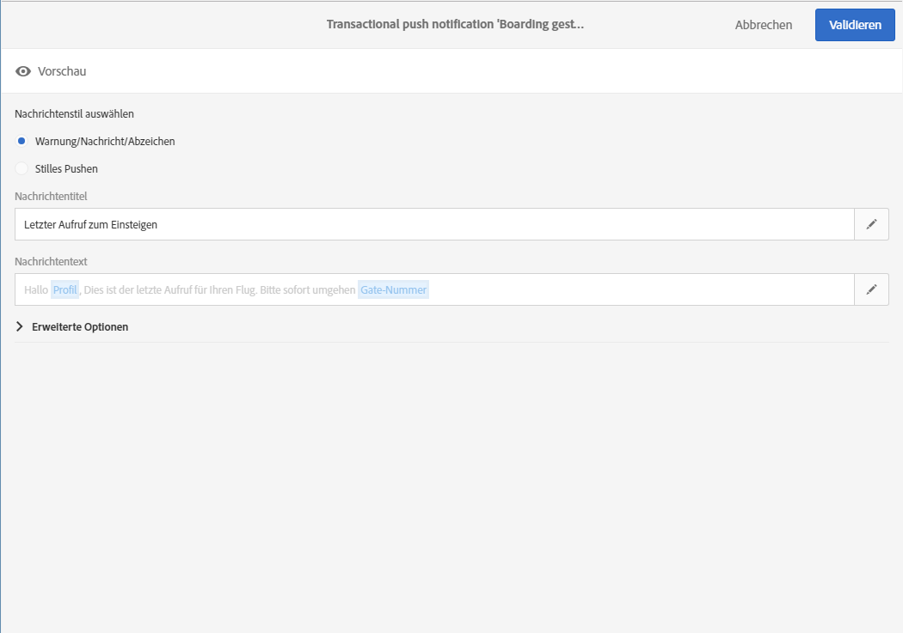

# Push-Benachrichtigungen für Transaktionen{#transactional-push-notifications}

Sie können mit Adobe Campaign Transaktions-Push-Benachrichtigungen an iOS- und Android-Mobilgeräte versenden. Diese Nachrichten werden auf Mobile Apps empfangen, die in Adobe Campaign unter Verwendung des Experience Cloud Mobile SDK eingerichtet werden.

>[!NOTE]
>
>Der Push-Kanal ist optional. Prüfen Sie diesbezüglich Ihren Lizenzvertrag. Weitere Informationen zu Standard-Push-Benachrichtigungen finden Sie im Abschnitt [Push-Benachrichtigungen](../../channels/using/about-push-notifications.md).

Sie können zwei Arten von Transaktions-Push-Benachrichtigungen versenden:

* Transaktions-Push-Benachrichtigungen, bei denen die Zielgruppenbestimmung durch ein Ereignis erfolgt.
* Transaktions-Push-Benachrichtigungen, bei denen die Zielgruppenbestimmung durch Profile in der Adobe-Campaign-Datenbank erfolgt.

Nach der Erstellung und Publikation des gewünschten Ereignisses (&quot;Stehen gelassener Warenkorb&quot; wie in [diesem Abschnitt](../../channels/using/getting-started-with-transactional-msg.md#transactional-messaging-operating-principle) beschrieben) wird die entsprechende Transaktions-Push-Benachrichtigung automatisch erstellt.

Die Konfigurationsschritte finden Sie in Abschnitt [Ereignis konfigurieren, um eine Transaktions-Push-Nachricht zu senden](../../administration/using/configuring-transactional-messaging.md#use-case--configuring-an-event-to-send-a-transactional-message).

Damit das Ereignis mit dem Versand einer Transaktionsnachricht einhergeht, muss diese Nachricht personalisiert, getestet und dann publiziert werden.

>[!NOTE]
>
>Sie können nur dann auf Transaktionsnachrichten zugreifen, wenn Sie der Sicherheitsgruppe **[!UICONTROL Administratoren (alle Einheiten)]** angehören.

## Transaktions-Push-Benachrichtigungen, bei denen die Zielgruppenbestimmung durch ein Ereignis erfolgt {#transactional-push-notifications-targeting-an-event}

Sie können eine anonyme Transaktions-Push-Benachrichtigung an alle Benutzer senden, die sich für den Erhalt von Benachrichtigungen von Ihrer Mobile App angemeldet haben.

In diesem Fall werden nur die im Ereignis selbst enthaltenen Daten zur Bestimmung der Versandzielgruppe verwendet. Daten aus der integrierten Profildatenbank von Adobe Campaign werden nicht genutzt.

### Transaktions-Push-Benachrichtigungen senden, bei denen die Zielgruppenbestimmung durch ein Ereignis erfolgt {#sending-a-transactional-push-notification-targeting-an-----------event}

Beispiel: Eine Fluglinie möchte ihre Mobile-App-Nutzer auffordern, sich zum Boarding zum entsprechenden Flugsteig zu begeben.

Das Unternehmen sendet eine einzige Transaktions-Push-Benachrichtigung pro Benutzer (durch einen Anmeldetoken registriert) mit einer einzigen Mobile App über ein einziges Gerät.

1. Rufen Sie die erstellte Transaktionsnachricht auf, um sie zu bearbeiten. Siehe [Ereignis-Transaktionsnachrichten](../../channels/using/event-transactional-messages.md).

   

1. Öffnen Sie nun mithilfe der gleichnamigen Kachel den **[!UICONTROL Inhalt]** der Nachricht, um den Titel und den Hauptteil anzupassen.

   Sie können Personalisierungsfelder einfügen, um die von Ihnen während der Ereigniserstellung definierten Elemente hinzuzufügen.

   

   To find these fields, click the pencil next to an item, click **[!UICONTROL Insert personalization field]** and select **[!UICONTROL Context]** > **[!UICONTROL Real-time event]** > **[!UICONTROL Event context]**.

   

   Weiterführende Informationen zur Bearbeitung eines Push-Benachrichtigungs-Inhalts finden Sie unter [Push-Benachrichtigungen erstellen](../../channels/using/preparing-and-sending-a-push-notification.md).

1. Speichern Sie Ihre Änderungen und publizieren Sie die Nachricht. Siehe [Transaktionsnachricht publizieren](../../channels/using/event-transactional-messages.md#publishing-a-transactional-message).
1. Senden Sie unter Verwendung einer Mobile App (WeFlight) unter Android (gcm) mithilfe der Adobe-Campaign-Standard-REST-API an einen Anmeldetoken (ABCDEF123456789) ein Ereignis, das die Boarding-Daten enthält.

   ```
   {
     "registrationToken":"ABCDEF123456789",
     "application":"WeFlight",
     "pushPlatform":"gcm",
     "ctx":
     {
       "gateNumber":"Gate B18",
       "lastname":"Green",
       "firstname":"Jane"
     }
   }
   ```

   Weiterführende Informationen zur Integration der Ereignisaktivierung in ein externes System finden Sie unter [Webseiten-Integration](../../administration/using/configuring-transactional-messaging.md#integrating-the-triggering-of-the-event-in-a-website).

Wenn der Anmeldetoken existiert, erhält der entsprechende Benutzer eine Transaktions-Push-Benachrichtigung mit folgendem Inhalt:

&quot;Hallo, Jane Green, das Boarding hat soeben begonnen! Bitte gehen Sie zu Flugsteig B18.&quot;

## Transaktions-Push-Benachrichtigung, bei der die Zielgruppenbestimmung durch ein Profil erfolgt {#transactional-push-notifications-targeting-a-profile}

Sie können eine Transaktions-Push-Benachrichtigung an die Adobe-Campaign-Profile senden, die Ihre Mobile App abonniert haben. Dieser Versand kann [Personalisierungsfelder](../../designing/using/personalization.md#inserting-a-personalization-field) enthalten, wie beispielsweise den Vornamen des Empfängers.

In diesem Fall muss das Ereignis einige Felder enthalten, die die Abstimmung mit einem Profil in der Adobe-Campaign-Datenbank ermöglichen.

Bei der Zielgruppenbestimmung durch Profile wird pro Mobile App und Gerät eine einzige Transaktions-Push-Benachrichtigung versendet. Wenn sich beispielsweise ein Adobe-Campaign-Benutzer für zwei Anwendungen angemeldet hat, erhält er zwei Benachrichtigungen. Wenn sich ein Benutzer für dieselbe Anwendung mit zwei unterschiedlichen Geräten angemeldet hat, erhält er auf jedes Gerät eine Benachrichtigung.

Die Mobile Apps, für die sich ein Profil angemeldet hat, werden im Tab **[!UICONTROL Mobile-App-Anmeldungen]** dieses Profils aufgelistet. Um diesen Tab zu öffnen, wählen Sie ein Profil und danach rechts die Schaltfläche **[!UICONTROL Profileigenschaften bearbeiten]** aus.


Weitere Informationen zum Öffnen und Bearbeiten von Profilen finden Sie unter [Profile](../../audiences/using/creating-profiles.md).

### Transaktions-Push-Benachrichtigungen senden, bei denen die Zielgruppenbestimmung durch ein Profil erfolgt {#sending-a-transactional-push-notification-targeting-a-----------profile}

Beispiel: Eine Fluglinie möchte allen Adobe-Campaign-Benutzern, die sich für ihre Mobile App angemeldet haben, eine letzte Aufforderung zum Boarding senden.

1. Rufen Sie die erstellte Transaktionsnachricht auf, um sie zu bearbeiten. Siehe [Ereignis-Transaktionsnachrichten](../../channels/using/event-transactional-messages.md).

   <!---->

1. Öffnen Sie nun mithilfe der gleichnamigen Kachel den **[!UICONTROL Inhalt]** der Nachricht, um den Titel und den Hauptteil anzupassen.

   Im Gegensatz zu auf Echtzeit-Ereignissen basierenden Konfigurationen haben Sie direkten Zugriff auf alle Profilinformationen, um die Nachricht zu personalisieren. Siehe [Personalisierungsfelder einfügen](../../designing/using/personalization.md#inserting-a-personalization-field).

   <!---->

   Weiterführende Informationen zur Bearbeitung von Push-Benachrichtigungs-Inhalt finden Sie im Abschnitt [Push-Benachrichtigungen erstellen](../../channels/using/preparing-and-sending-a-push-notification.md).

1. Speichern Sie Ihre Änderungen und publizieren Sie die Nachricht. Siehe [Transaktionsnachricht publizieren](../../channels/using/event-transactional-messages.md#publishing-a-transactional-message).
1. Senden Sie unter Verwendung der Adobe-Campaign-Standard-REST-API ein Ereignis an ein Profil.

   ```
   {
     "ctx":
     {
       "email":"janegreen@email.com",
       "gateNumber":"D16",
     }
   }
   ```

   Weiterführende Informationen zur Integration der Ereignisaktivierung in ein externes System finden Sie unter [Webseiten-Integration](../../administration/using/configuring-transactional-messaging.md#integrating-the-triggering-of-the-event-in-a-website).

   >[!NOTE]
   >
   >Es gibt keine Felder für Anmeldetoken, Anwendung und Push-Plattform. In diesem Beispiel erfolgt die Abstimmung über das E-Mail-Feld.

