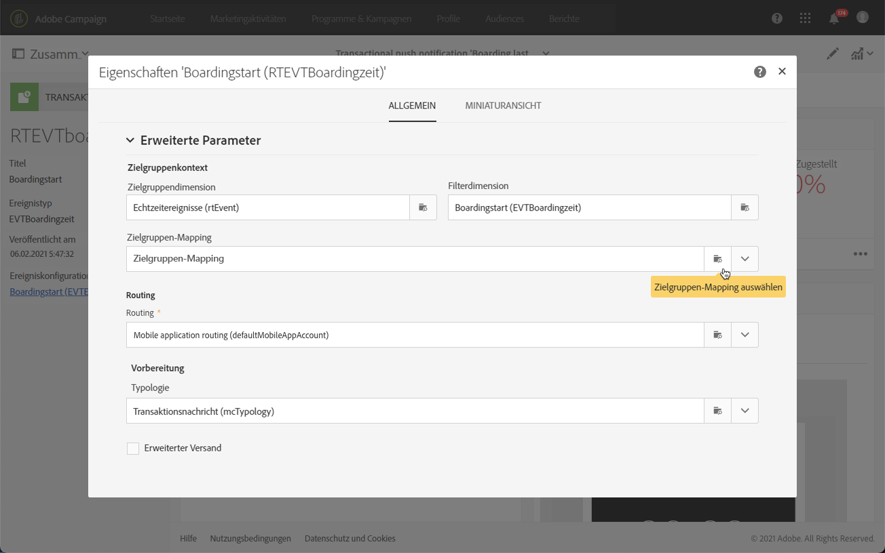
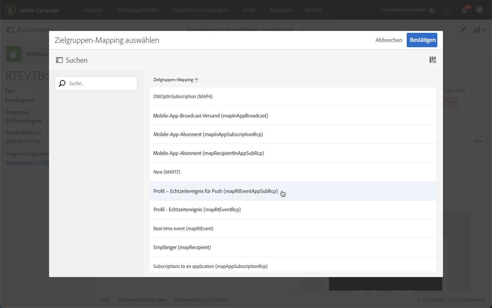

# Transaktions-Push-Benachrichtigung{#transactional-push-notifications}

Sie können mit Adobe Campaign Transaktions-Push-Benachrichtigungen an iOS- und Android-Mobilgeräte versenden. Diese Nachrichten werden auf Mobile Apps empfangen, die in Adobe Campaign unter Verwendung des Experience Cloud Mobile SDK eingerichtet werden.

>[!NOTE]
>
>Der Push-Kanal ist optional. Prüfen Sie diesbezüglich Ihren Lizenzvertrag. Weitere Informationen zu Standard-Push-Benachrichtigungen finden Sie unter [Über Push-Benachrichtigungen](../../channels/using/about-push-notifications.md).

Für den Versand von Transaktions-Push-Benachrichtigungen müssen Sie Adobe Campaign entsprechend konfigurieren. Siehe [Mobile App konfigurieren](../../administration/using/configuring-a-mobile-application.md).

Sie können zwei Arten von Transaktions-Push-Benachrichtigungen versenden:

* [Transaktions-Push-Benachrichtigungen, bei denen die Zielgruppenbestimmung durch ein Ereignis erfolgt](#transactional-push-notifications-targeting-an-event)
* [Transaktions-Push-Benachrichtigungen, bei denen die Zielgruppenbestimmung durch Profile in der Adobe Campaign-Datenbank erfolgt](#transactional-push-notifications-targeting-a-profile)

## Transaktions-Push-Benachrichtigungen, bei denen die Zielgruppenbestimmung durch ein Ereignis erfolgt {#transactional-push-notifications-targeting-an-event}

Sie können Adobe Campaign verwenden, um eine **anonyme Transaktions-Push-Benachrichtigung an alle Benutzer** zu senden, die sich für den Erhalt von Benachrichtigungen von Ihrer App angemeldet haben.

In diesem Fall werden nur **die im Ereignis selbst enthaltenen Daten zur Zielgruppenbestimmung verwendet**. Daten aus der integrierten Profildatenbank von Adobe Campaign werden nicht genutzt.

### Ereignisbasierte Transaktions-Push-Benachrichtigung konfigurieren {#configuring-event-based-transactional-push-notification}

Um eine Transaktions-Push-Benachrichtigung an alle Benutzer zu senden, die sich für den Empfang von Benachrichtigungen von Ihrer Mobile App angemeldet haben, erstellen und konfigurieren Sie zunächst ein Ereignis, bei dem die im Ereignis selbst enthaltenen Daten zur Zielgruppenbestimmung verwendet werden.

>[!NOTE]
>
>Sie können den Inhalt einer ereignisbasierten Transaktions-Push-Benachrichtigung weiterhin mit [Ereignisattributen](../../channels/using/configuring-transactional-event.md#defining-the-event-attributes) (Daten aus dem Ereignis) und [Ereignisanreicherung](../../channels/using/configuring-transactional-event.md#enriching-the-transactional-message-content) (Daten aus der Campaign-Datenbank) personalisieren. Siehe [das Beispiel unten](#sending-event-based-transactional-push-notification).

Das Ereignis muss diese drei Elemente enthalten:

* Einen **Anmeldetoken** als Nutzerkennung für eine Mobile App und ein Gerät. Möglicherweise entspricht es keinem Profil in der Adobe Campaign-Datenbank.
* Einen **Mobile-App-Namen** (einen für alle Geräte – Android und iOS). Dies ist die Kennung der in Adobe Campaign konfigurierten Mobile App, die für den Empfang von Push-Benachrichtigungen auf den Geräten des Benutzers verwendet wird. Weiterführende Informationen dazu finden Sie unter [Mobile App konfigurieren](../../administration/using/configuring-a-mobile-application.md).
* Eine **Push-Plattform** (&quot;gcm&quot; für Android oder &quot;apns&quot; für iOS).

Gehen Sie zur Konfiguration des Ereignisses folgendermaßen vor:

1. Wählen Sie bei der Erstellung der Ereigniskonfiguration den Kanal **[!UICONTROL Push-Benachrichtigung]** und die Zielgruppendimension **[!UICONTROL Echtzeit-Ereignis]** (siehe [Ereignis erstellen](../../channels/using/configuring-transactional-event.md#creating-an-event)).
1. Fügen Sie dem Ereignis Felder hinzu. Auf diese Weise können Sie die Transaktionsnachricht personalisieren (siehe [Ereignisattribute definieren](../../channels/using/configuring-transactional-event.md#defining-the-event-attributes)). Definieren Sie in diesem Beispiel die Felder &quot;gateNumber&quot;, &quot;lastname&quot;und &quot;firstname&quot;.
1. Sie können auch den Inhalt Ihrer Nachricht anreichern. Fügen Sie dazu Felder aus der Tabelle hinzu, die Sie mit Ihrer Ereigniskonfiguration verknüpft haben (siehe [Ereignisse anreichern](../../channels/using/configuring-transactional-event.md#enriching-the-transactional-message-content)).

   <!--Event-based transactional messaging is supposed to use only the data that are in the sent event to define the recipient and the message content personalization. However, you can enrich the content of your transactional message using information from the Adobe Campaign database.-->

1. [Erstellen Sie eine Vorschau und veröffentlichen Sie das Ereignis](../../channels/using/publishing-transactional-event.md#previewing-and-publishing-the-event).

   Bei der Vorschau des Ereignisses enthält die REST-API die Attribute &quot;registrationToken&quot;, &quot;application&quot; und &quot;pushPlatform&quot;, die für die Zielgruppenbestimmung des Versands verwendet werden.

   

   Mit Ausführung der Veröffentlichung wird automatisch eine dem neuen Ereignis entsprechende Transaktions-Push-Benachrichtigung erzeugt. Sie können jetzt die soeben erstellte Nachricht ändern und veröffentlichen (siehe [diesen Abschnitt](#sending-event-based-transactional-push-notification)).

1. Integrieren Sie das Ereignis in Ihre Website (siehe [Ereignis-Aktivierung integrieren](../../channels/using/getting-started-with-transactional-msg.md#integrate-event-trigger)).

### Ereignisbasierte Transaktions-Push-Benachrichtigung senden {#sending-event-based-transactional-push-notification}

Beispiel: Eine Fluglinie möchte ihre Mobile-App-Nutzer auffordern, sich zum Boarding zum entsprechenden Flugsteig zu begeben.

Das Unternehmen sendet eine einzige Transaktions-Push-Benachrichtigung pro Benutzer (durch einen Anmeldetoken registriert) mit einer einzigen Mobile App über ein einziges Gerät.

1. Rufen Sie die erstellte Transaktionsnachricht auf, um sie zu bearbeiten. Siehe [Transaktionsnachrichten aufrufen](../../channels/using/editing-transactional-message.md#accessing-transactional-messages).

   

1. Öffnen Sie nun mithilfe der gleichnamigen Kachel den **[!UICONTROL Inhalt]** der Nachricht, um den Titel und den Hauptteil anzupassen.

1. Sie können Personalisierungsfelder einfügen, um die von Ihnen während der Ereigniserstellung definierten Elemente hinzuzufügen (siehe [Ereignisattribute definieren](../../channels/using/configuring-transactional-event.md#defining-the-event-attributes)).

   

   Wählen Sie dazu das Stiftsymbol neben einem Objekt und **[!UICONTROL Personalisierungsfeld einfügen]** aus und danach **[!UICONTROL Kontext]** > **[!UICONTROL Echtzeit-Ereignis]** > **[!UICONTROL Ereigniskontext]**.

   

   Weiterführende Informationen zur Bearbeitung eines Push-Benachrichtigungs-Inhalts finden Sie unter [Push-Benachrichtigungen vorbereiten und senden](../../channels/using/preparing-and-sending-a-push-notification.md).

1. Sie können den Inhalt der Transaktionsnachricht auch anreichern, wenn Sie Zusatzinformationen aus der Adobe Campaign-Datenbank verwenden möchten (siehe[Ereignisse anreichern](../../channels/using/configuring-transactional-event.md#enriching-the-transactional-message-content)).

1. Speichern Sie Ihre Änderungen und veröffentlichen Sie die Nachricht. Siehe [Transaktionsnachricht veröffentlichen](../../channels/using/publishing-transactional-message.md#publishing-a-transactional-message).

1. Senden Sie unter Verwendung einer Mobile App (WeFlight) unter Android (gcm) mithilfe der Adobe Campaign Standard-REST-API an einen Anmeldetoken (ABCDEF123456789) ein Ereignis, das die Boarding-Daten enthält:

   ```
   {
     "registrationToken":"ABCDEF123456789",
     "application":"WeFlight",
     "pushPlatform":"gcm",
     "ctx":
     {
       "gateNumber":"Gate B18",
       "lastname":"Green",
       "firstname":"Jane"
     }
   }
   ```

   Weiterführende Informationen zur Integration der Ereignis-Aktivierung in ein externes System finden Sie unter [Ereignis-Aktivierung integrieren](../../channels/using/getting-started-with-transactional-msg.md#integrate-event-trigger).

Wenn der Anmelde-Token existiert, erhält der entsprechende Benutzer eine Transaktions-Push-Benachrichtigung mit folgendem Inhalt:

*&quot;Hallo, Jane Green, das Boarding hat soeben begonnen! Bitte gehen Sie zu Flugsteig B18.&quot;*

## Transaktions-Push-Benachrichtigung, bei der die Zielgruppenbestimmung durch ein Profil erfolgt  {#transactional-push-notifications-targeting-a-profile}

Sie können eine Transaktions-Push-Benachrichtigung **an die Adobe Campaign-Profile senden, die Ihre Mobile App abonniert haben**. Dieser Versand kann [Personalisierungsfelder](../../designing/using/personalization.md#inserting-a-personalization-field) enthalten, z. B. den Vornamen des Empfängers, der direkt aus der Adobe Campaign-Datenbank abgerufen wird.

In diesem Fall muss das Ereignis einige Felder enthalten, die die **Abstimmung mit einem Profil in der Adobe Campaign-Datenbank ermöglichen**.

Bei der Zielgruppenbestimmung durch Profile wird pro Mobile App und Gerät eine einzige Transaktions-Push-Benachrichtigung versendet. Wenn sich beispielsweise ein Adobe Campaign-Benutzer für zwei Anwendungen angemeldet hat, erhält er zwei Benachrichtigungen. Wenn sich ein Benutzer für dieselbe Anwendung mit zwei unterschiedlichen Geräten angemeldet hat, erhält er auf jedes Gerät eine Benachrichtigung.

Die Mobile Apps, für die sich ein Profil angemeldet hat, werden auf der Registerkarte **[!UICONTROL Mobile-App-Abonnements]** dieses Profils aufgelistet. Um diese Registerkarte zu öffnen, wählen Sie ein Profil und danach rechts die Schaltfläche **[!UICONTROL Profileigenschaften bearbeiten]** aus.


Weitere Informationen zum Aufrufen und Bearbeiten von Profilen finden Sie unter [Über Profile](../../audiences/using/about-profiles.md).

### Profilbasierte Transaktions-Push-Benachrichtigung konfigurieren {#configuring-profile-based-transactional-push-notification}

Um eine Transaktions-Push-Benachrichtigung an die Adobe Campaign-Profile zu senden, die sich für Ihre Mobile App angemeldet haben, müssen Sie zunächst ein Ereignis erstellen und konfigurieren, bei dem die in der Adobe Campaign-Datenbank enthaltenen Daten zur Zielgruppenbestimmung verwendet werden.

1. Wählen Sie bei der Erstellung der Ereigniskonfiguration den Kanal **[!UICONTROL Push-Benachrichtigung]** und die Zielgruppendimension **[!UICONTROL Profil]** aus (siehe [Ereignis erstellen](../../channels/using/configuring-transactional-event.md#creating-an-event)).

   Standardmäßig wird die Transaktions-Push-Benachrichtigung an alle Mobile Apps gesendet, für die sich der Empfänger angemeldet hat. Um die Push-Benachrichtigung an eine bestimmte Mobile App zu senden, wählen Sie sie in der Liste aus. Die anderen Mobile Apps werden zwar bei der Zielgruppenbestimmung der Nachricht berücksichtigt, aber vom Versand ausgeschlossen.

   

1. Fügen Sie zum Ereignis Felder hinzu, wenn Sie die Transaktionsnachricht personalisieren möchten (siehe [Ereignisattribute definieren](../../channels/using/configuring-transactional-event.md#defining-the-event-attributes)).

   >[!NOTE]
   >
   >Für eine Anreicherung müssen Sie mindestens ein Feld hinzufügen. Sie müssen keine anderen Felder wie **Vorname** und **Nachname** erstellen, da Sie Personalisierungsfelder aus der Adobe Campaign-Datenbank verwenden können.

1. Erstellen Sie eine Anreicherung, um das Ereignis mit der Ressource **[!UICONTROL Profil]** zu verknüpfen (siehe [Ereignisse anreichern](../../channels/using/configuring-transactional-event.md#enriching-the-transactional-message-content)) und wählen Sie diese Anreicherung als **[!UICONTROL Zielgruppenbestimmungs-Anreicherung]** aus.

   >[!IMPORTANT]
   >
   >Dieser Schritt ist bei profilbasierten Ereignissen obligatorisch.

1. [Erstellen Sie eine Vorschau und veröffentlichen Sie das Ereignis](../../channels/using/publishing-transactional-event.md#previewing-and-publishing-the-event).

   Bei der Vorschau des Ereignisses enthält die REST-API kein Attribut, das das Anmeldetoken, den App-Namen und die Push-Plattform spezifiziert, da diese Informationen aus der Ressource **[!UICONTROL Profil]** abgerufen werden.

   Mit Ausführung der Veröffentlichung wird automatisch eine dem neuen Ereignis entsprechende Transaktions-Push-Benachrichtigung erzeugt. Sie können jetzt die soeben erstellte Nachricht ändern und veröffentlichen (siehe [diesen Abschnitt](#sending-profile-based-transactional-push-notification)).

1. Integrieren Sie das Ereignis in Ihre Website (siehe [Ereignis-Aktivierung integrieren](../../channels/using/getting-started-with-transactional-msg.md#integrate-event-trigger)).

### Profilbasierte Transaktions-Push-Benachrichtigung senden {#sending-profile-based-transactional-push-notification}

Beispiel: Eine Fluglinie möchte allen Adobe Campaign-Benutzern, die sich für ihre Mobile App angemeldet haben, eine letzte Aufforderung zum Boarding senden.

1. Rufen Sie die erstellte Transaktionsnachricht auf, um sie zu bearbeiten. Siehe [Transaktionsnachrichten aufrufen](../../channels/using/editing-transactional-message.md#accessing-transactional-messages).

1. Öffnen Sie nun mithilfe der gleichnamigen Kachel den **[!UICONTROL Inhalt]** der Nachricht, um den Titel und den Hauptteil anzupassen.

   Im Gegensatz zu auf Echtzeit-Ereignissen basierenden Konfigurationen haben Sie direkten Zugriff auf alle Profilinformationen, um die Nachricht zu personalisieren. Siehe [Personalisierungsfelder einfügen](../../designing/using/personalization.md#inserting-a-personalization-field).

   Weitere Informationen zur Bearbeitung eines Push-Benachrichtigungs-Inhalts finden Sie unter [Push-Benachrichtigung vorbereiten und senden](../../channels/using/preparing-and-sending-a-push-notification.md).

1. Speichern Sie Ihre Änderungen und veröffentlichen Sie die Nachricht. Siehe [Transaktionsnachricht veröffentlichen](../../channels/using/publishing-transactional-message.md#publishing-a-transactional-message).
1. Senden Sie unter Verwendung der Adobe Campaign Standard-REST-API ein Ereignis an ein Profil:

   ```
   {
     "ctx":
     {
       "email":"janegreen@email.com",
       "gateNumber":"D16",
     }
   }
   ```

Weitere Informationen zur Integration der Ereignis-Aktivierung in ein externes System finden Sie unter [Ereignis-Aktivierung integrieren](../../channels/using/getting-started-with-transactional-msg.md#integrate-event-trigger).

Der entsprechende Benutzer erhält eine Transaktions-Push-Benachrichtigung einschließlich aller Personalisierungselemente, die aus der Adobe Campaign-Datenbank abgerufen werden.

>[!NOTE]
>
>Es gibt keine Felder für Anmeldetoken, Anwendung und Push-Plattform. In diesem Beispiel erfolgt die Abstimmung über das E-Mail-Feld.

## Zielgruppen-Mapping in einer Transaktions-Push-Benachrichtigung ändern {#change-target-mapping}

Transaktions-Push-Benachrichtigungen verwenden ein bestimmtes [Zielgruppen-Mapping](../../administration/using/target-mappings-in-campaign.md), das die technischen Einstellungen enthält, die zum Senden dieses Versandtyps erforderlich sind.

Gehen Sie wie folgt vor, um dieses Zielgruppen-Mapping zu ändern:

1. Wählen Sie in der Liste der Transaktionsnachrichten eine Push-Benachrichtigung aus.

1. Klicken Sie im Nachrichten-Dashboard auf die Schaltfläche **[!UICONTROL Eigenschaften bearbeiten]**.

   

1. Erweitern Sie den Abschnitt **[!UICONTROL Erweiterte Parameter]**.

1. Klicken Sie auf **[!UICONTROL Zielgruppen-Mapping-Element auswählen]**.

   

1. Wählen Sie ein Zielgruppen-Mapping aus der Liste aus.

   >[!NOTE]
   >
   >Um eine optimale Versandvorbereitungszeit und Performance beim Senden von **profilbasierten** Transaktions-Push-Benachrichtigungen zu erhalten, verwenden Sie das Zielgruppen-Mapping **[!UICONTROL Profil – Echtzeit-Ereignis für Push (mapRtEventAppSubRcp)]**.

   

1. Bestätigen Sie Ihre Änderung und veröffentlichen Sie die Nachricht. Siehe [Transaktionsnachricht veröffentlichen](../../channels/using/publishing-transactional-message.md#publishing-a-transactional-message).

   >[!IMPORTANT]
   >
   >Sie müssen die Nachricht erneut veröffentlichen, damit die Änderung wirksam wird. Andernfalls wird das vorherige Zielgruppen-Mapping weiterhin verwendet.


