# Erstellen und Aktualisieren von Profilinformationen auf Basis der von einer Mobile App erfassten Daten

## Übersicht

Auf dieser Seite erfahren Sie, wie Sie einen Workflow entwickeln, durch den Profildaten erstellt bzw. aktualisiert werden, sobald eine Mobile App die von ihr erfassten PII-Daten auf regelmäßiger Basis überträgt.

* **PII** steht für &quot;persönlich identifizierbare Informationen&quot;. PII können beliebige Daten sein, auch Informationen, die normalerweise nicht in der Profiltabelle Ihrer Adobe Campaign-Datenbank enthalten sind, z. B. Analytics for Mobile-[POIs](../../integrating/using/about-campaign-points-of-interest-data-integration.md). Die PII wird vom Mobile-App-Entwickler definiert, in der Regel gemeinsam mit einem Marketing-Experten.
* **Collect PII** (PII erfassen) ist eine HTTP-POST-Operation, die von einer Mobile App initiiert und an eine Rest-API in Adobe Campaign Standard übergeben wird.

Ziel dieses Anwendungsfalls ist die Erstellung oder Aktualisierung eines Campaign Standard-Profils, wenn die von einer Mobile App zurückgegebenen PII-Daten profilrelevante Daten enthalten.

## Voraussetzungen

Zur Aktivierung von Push-Benachrichtigungen in Campaign Standard müssen mehrere Konfigurationsschritte ausgeführt werden. Erst danach können Profile auf Basis der Abonnementdaten einer Mobile App erstellt oder aktualisiert werden:

1. [Erstellen einer Mobile App](../../administration/using/configuring-a-mobile-application.md)
1. [Integrieren des Adobe Mobile SDK mit der Mobile App](../../administration/using/supported-mobile-use-cases.md)
1. [Konfigurieren von Adobe Campaign für das Senden von Push-Benachrichtigungen](../../administration/using/configuring-a-mobile-application.md)

## Schritt 1: Erweitern der Profilressource für Push-Benachrichtigungen/Abonnements

Um in der Profilressource PII-Daten eintragen oder aktualisieren zu können, müssen Sie die gewünschten Felder zunächst zur Profilressource hinzufügen. Gehen Sie wie folgt vor:

* Ermitteln Sie, welche PII-Felder von der Mobile App übertragen werden.
* Ermitteln Sie, welches Feld zur Verknüpfung der PII-Daten mit den Profildaten abgestimmt werden soll.

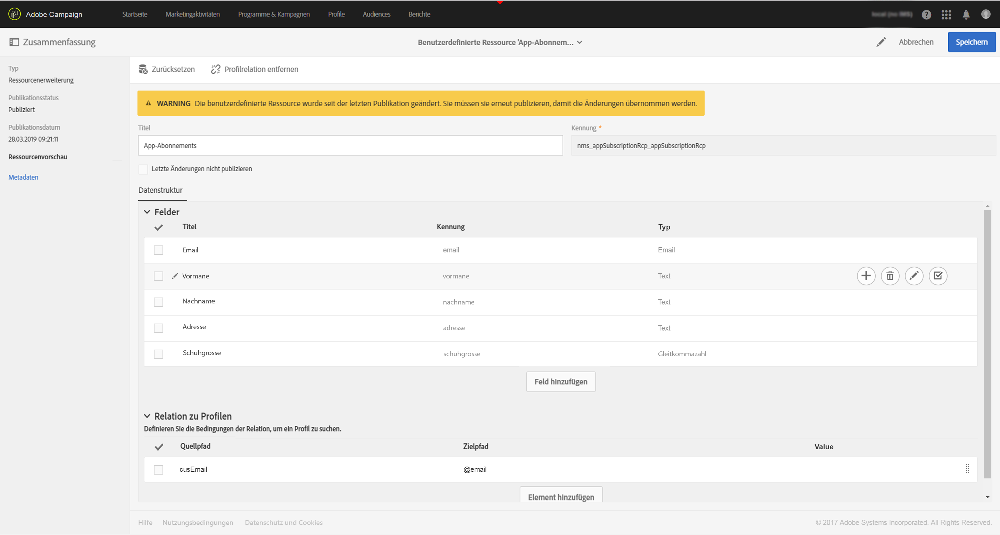

In diesem Beispiel zeigt der Abschnitt **[!UICONTROL Felder]** die von der Mobile App übertragenen PII-Daten. Im Abschnitt **[!UICONTROL Profilrelation]** ist das Feld angegeben, das zum Abgleich der PII-Daten mit den Profildaten verwendet wird. **cusEmail** wird hier mit **@email** abgeglichen.

Die Zuordnung der Profildaten ist während der Erweiterung der Ressource **[!UICONTROL App-Abonnements]** schreibgeschützt. Sie wird lediglich für die Abstimmung verwendet. Um das Profil abstimmen zu können, muss es mit den erforderlichen Daten in das System eingetragen werden. In diesem Fall muss eine E-Mail-Adresse im Profil mit einer E-Mail-Adresse aus der „Collect PII“ übereinstimmen, damit die Abgleichung erfolgt:

* Collect PII wird von einer Mobile App für einen Benutzer empfangen, dessen Vorname &quot;Jane&quot;, Nachname &quot;Doe&quot; und E-Mail-Adresse janedoe@doe.com lautet.
* Die Profildaten müssen separat vorhanden sein (z. B. müssen die Daten manuell eingegeben werden oder aus einer anderen Ressource stammen), wobei die E-Mail-Adresse des Profils janedoe@doe.com lautet.

**Verwandte Themen:**

* [App-Abonnements-Ressource erweitern](../../developing/using/extending-the-subscriptions-to-an-application-resource.md)
* [Erstellen oder Erweitern einer vorhandenen Ressource](../../developing/using/key-steps-to-add-a-resource.md)

## Schritt 2: Erstellen des Workflows

Mittels eines Workflows kann ein Administrator in Campaign Standard die AppSubscription- bzw. Abonnentendaten und die Profil- bzw. Empfängerdaten eindeutig identifizieren und miteinander synchronisieren. Eine Workflow-basierte Aktualisierung synchronisiert die Profildaten zwar nicht in Echtzeit, jedoch entstehen dadurch in der Regel auch keine Datenbanksperren oder Overheads.

Dies sind die wichtigsten Schritte der Workflow-Erstellung:

1. Abrufen einer Liste der neuesten Abonnements mit der Aktivität **[!UICONTROL Abfragen]** oder **[!UICONTROL Inkrementell abfragen]**
1. Zuordnen der PII-Daten zum Profil durch die Aktivität **[!UICONTROL Abstimmung]**
1. Hinzufügen eines Prüfprozesses
1. Erstellen oder Aktualisieren der PII-Daten im Profil durch die Aktivität **[!UICONTROL Daten aktualisieren]**

In diesem Workflow wird von folgenden Voraussetzungen ausgegangen:

* Alle erweiterten Felder zur Erstellung bzw. Aktualisierung der Profiltabelle sind verfügbar.
* Die Profiltabelle kann erweitert werden, um auch Felder zu unterstützen, die nativ nicht unterstützt werden (z. B. „T-Shirt-Größe“).
* Leere Felder der AppSubscription-Tabelle werden in der Profiltabelle nicht aktualisiert.
* Jeder Datensatz, der in der AppSubscription-Tabelle aktualisiert wurde, wird der nächsten Workflow-Ausführung hinzugefügt.

Um den Workflow zu erstellen, ziehen Sie die folgenden Aktivitäten per Drag-and-Drop in den Arbeitsbereich und verknüpfen Sie sie miteinander: **[!UICONTROL Beginn]**, **[!UICONTROL Planung]**, **[!UICONTROL Inkrementelle Abfrage]**, **[!UICONTROL Daten aktualisieren]**.

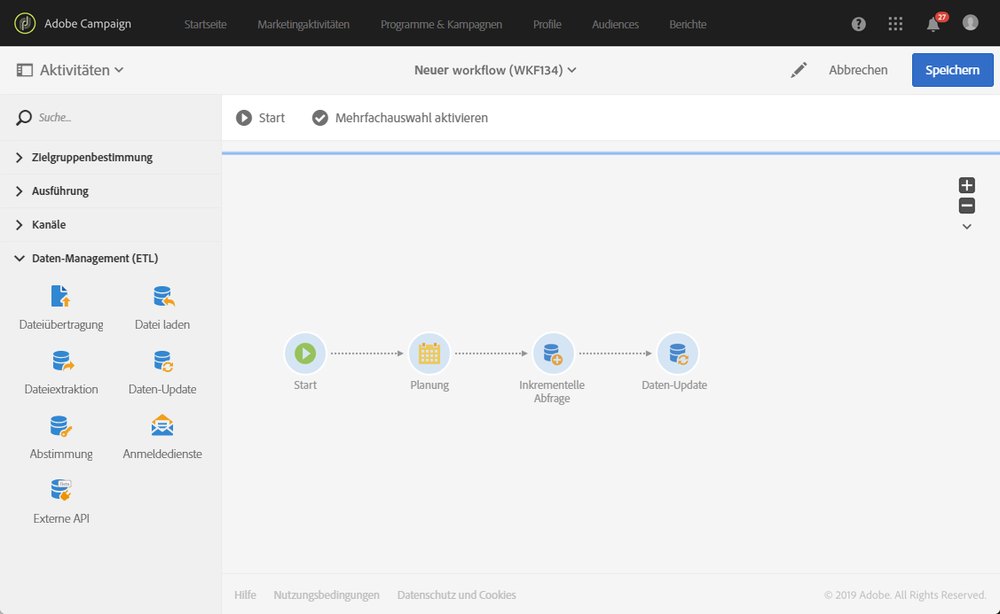

Gehen Sie dann wie folgt vor, um jede Aktivität zu konfigurieren.

### Konfigurieren Sie die Aktivität **[!UICONTROL Planen]**

Legen Sie auf der Registerkarte **[!UICONTROL Allgemein]** die **[!UICONTROL Ausführungsfrequenz]** (z. B. &quot;Täglich&quot;), die **[!UICONTROL Zeit]**(z. B. 1:00:00 Uhr) und den **[!UICONTROL Start]** (z. B. das heutige Datum) fest.

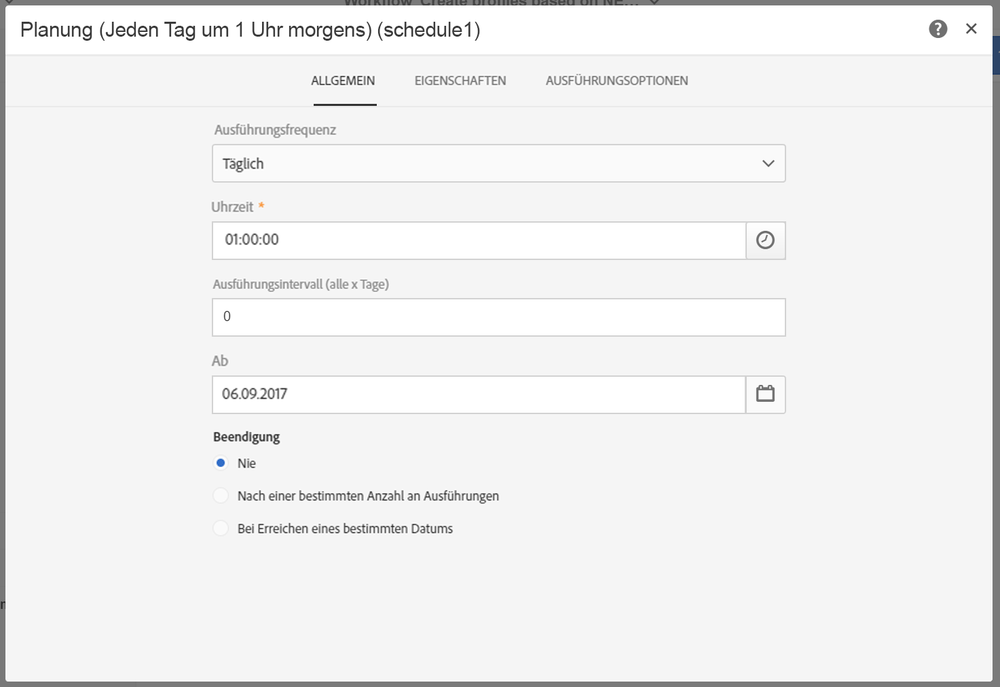

### Konfigurieren Sie die Aktivität **[!UICONTROL Inkrementelle Abfrage]**.

1. Im **[!UICONTROL Eigenschaften]** klicken Sie auf die **[!UICONTROL Element auswählen]** des **[!UICONTROL Ressource]** und wählen Sie anschließend die **[!UICONTROL App-Abonnements (`nms:appSubscriptionRcp:appSubscriptionRcpDetail`)]** -Element.

   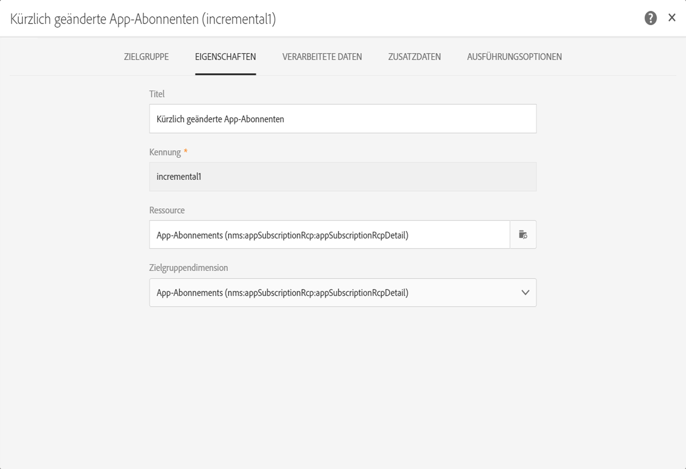

1. Ziehen Sie auf der Registerkarte **[!UICONTROL Target]** den Filter **[!UICONTROL Mobile App]** und wählen Sie den Namen einer Mobile App aus.

   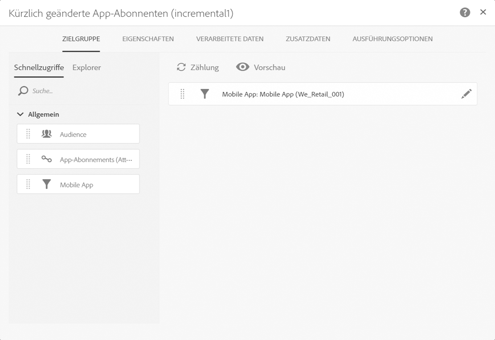

1. Wählen Sie auf der Registerkarte **[!UICONTROL Verarbeitete Daten]** die Option **[!UICONTROL Datumsfeld verwenden]** aus und fügen Sie das Feld **[!UICONTROL Zuletzt geändert (lastModified)]** als **[!UICONTROL Pfad zum Datumsfeld]** hinzu.

   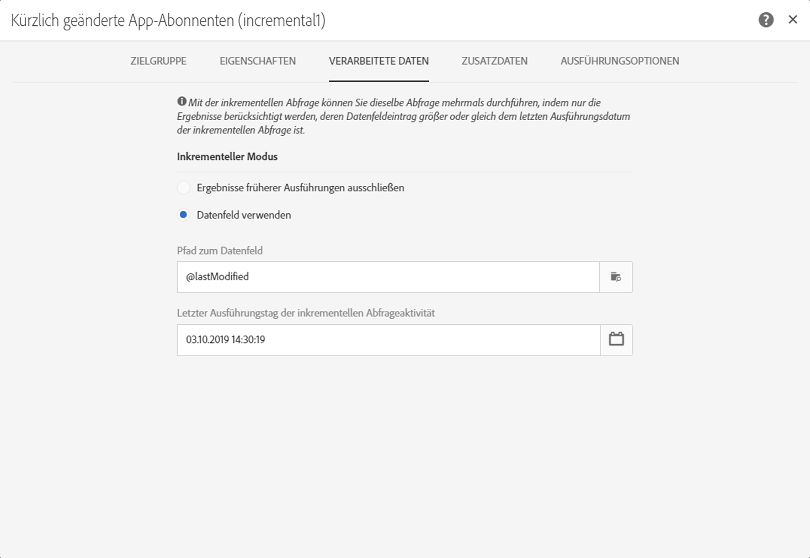

### Konfigurieren Sie die Aktivität **[!UICONTROL Daten aktualisieren]**.

1. Vergewissern Sie sich auf der Registerkarte **[!UICONTROL Identifizierung]**, dass das Feld **[!UICONTROL Zu aktualisierende Dimension]** auf „Profile (profile)“ gesetzt ist, und klicken Sie dann auf die Schaltfläche **[!UICONTROL Element erstellen]**, um ein Feld als Abstimmungskriterium hinzuzufügen.

   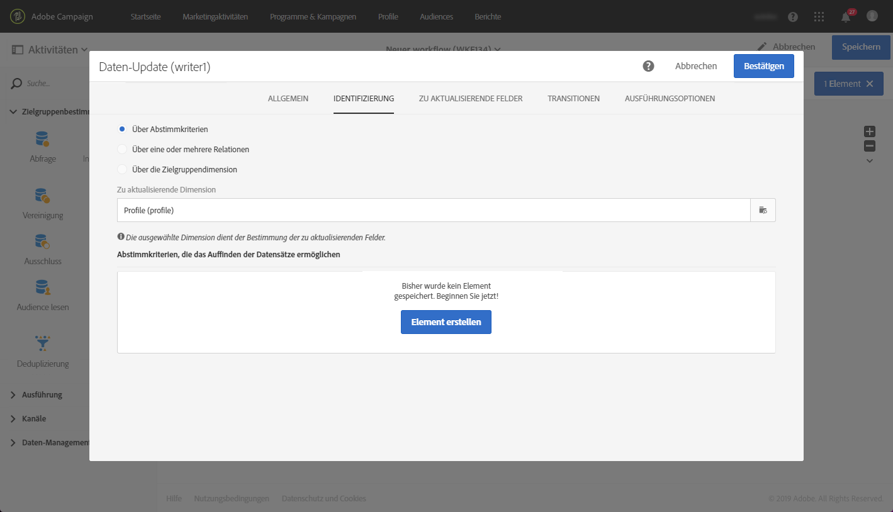

1. Wählen Sie im Feld **[!UICONTROL Quelle]** ein Feld aus der Tabelle „appSubscrsiptionRcp“ als Abstimmungsfeld aus. Sie können hier z. B. das Feld &quot;email&quot;, &quot;crmId&quot; oder &quot;marketingCloudId&quot; des Profils auswählen. Verwenden Sie in diesem Beispiel das Feld &quot;E-Mail (cusEmail)&quot;.

1. Wählen Sie im Feld **[!UICONTROL Ziel]** ein Feld aus der Profiltabelle aus, mit dem die Daten aus der Tabelle „appSubscriptionRcp“ abgestimmt werden sollen. Dies kann das E-Mail-Feld des Profils oder ein beliebiges erweitertes Feld wie „crmId“ oder „marketingCloudId“ sein. In diesem Beispiel wählen Sie das Feld „E-Mail (email)“ aus, um es dem Feld „E-Mail (cusEmail)“ der Tabelle „appSubscriptionRcp“ zuzuordnen.

   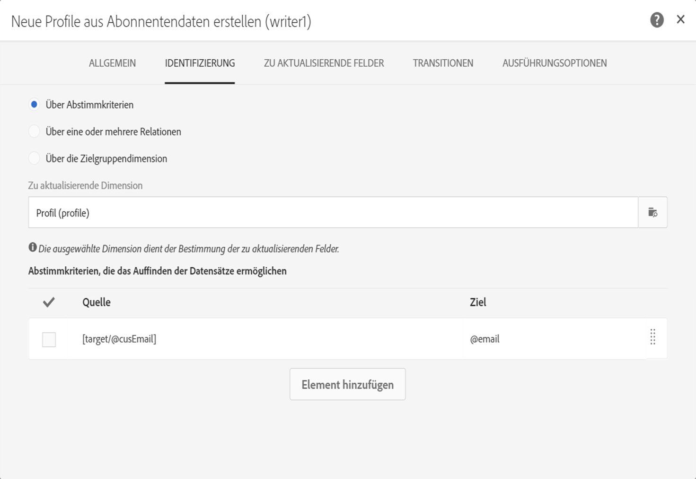

1. Klicken Sie auf der Registerkarte **[!UICONTROL Zu aktualisierende Felder]** auf die Schaltfläche **[!UICONTROL Element erstellen]** und ordnen Sie die Felder aus der Tabelle „appSubscriptionRcp“ (Feld **[!UICONTROL Quelle]**) den Feldern zu, die Sie in der Profiltabelle (Feld **[!UICONTROL Ziel]**) aktualisieren möchten.

1. Fügen Sie dem Feld **[!UICONTROL Aktiviert wenn]** einen Ausdruck hinzu, der sicherstellt, dass das entsprechende Feld in der Profiltabelle nur aktualisiert wird, wenn das Quellfeld einen Wert enthält. Wählen Sie dazu das Feld in der Liste aus und fügen Sie den Ausdruck &quot;!=&#39;&#39;&quot; hinzu (wenn das Quellfeld `[target/@cusEmail]` lautet, geben Sie im Ausdruckseditor `[target/@cusEmail] != ''"` ein).

   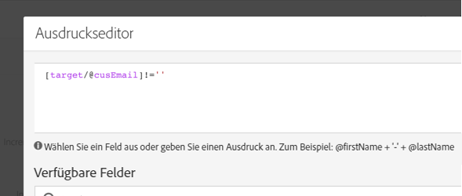

>[!NOTE]
>
>In diesem Fall führt der Workflow ein UPSERT aus. Da sich dieses UPSERT jedoch auf eine **[!UICONTROL inkrementelle Abfrage]** bezieht, werden die Daten nur eingefügt. Eine Änderung der Abfrage kann sich auf die eingefügten oder aktualisierten Daten auswirken.
>Darüber hinaus bestimmen auch die Einstellungen auf der Registerkarte „Zu aktualisierende Felder“, welche Felder unter bestimmten Bedingungen eingefügt oder aktualisiert werden. Diese Einstellungen sind oft anwendungs- oder kundenspezifisch.
>Konfigurieren Sie diese Einstellungen mit größter Sorgfalt, da sie andernfalls unbeabsichtigte Folgen haben können. Durch die Aktualisierung der Profildatensätze auf Basis der appSubscriptionRcp-Daten können sich personenbezogene Benutzerdaten ohne Validierung ändern.

Klicken Sie auf **[!UICONTROL Bestätigen]**, wenn Sie alle im Profil einzufügenden bzw. zu aktualisierenden Felder hinzugefügt haben.

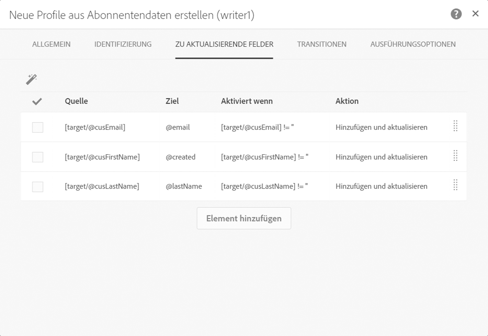

Speichern Sie den Workflow und klicken Sie dann auf **[!UICONTROL Start]**, um den Workflow-Prozess zu starten.

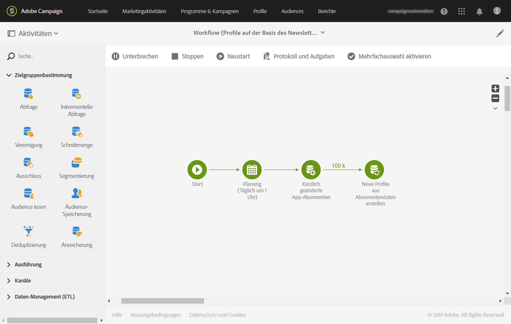
