# Über die Inhaltserstellung in E-Mails{#about-email-content-design}

Verwenden Sie die Drag &amp; Drop-Benutzeroberfläche von Email Designer, um E-Mail-Inhalt in Adobe Campaign zu erstellen und zu bearbeiten.

In diesem Abschnitt wird Email Designer genauer beschrieben:

* [Über Email Designer](../../designing/using/about-email-content-design.md#about-the-email-designer)
* [E-Mail-Struktur definieren](../../designing/using/defining-the-email-structure.md)
* [E-Mail-Stile bearbeiten](../../designing/using/editing-email-styles.md)

Weiterführende Informationen zu den wichtigsten Marketingaktivitäten finden Sie in diesen Abschnitten:

* Lesen Sie zur Personalisierung des Inhalts die Abschnitte [Personalisierungsfelder einfügen](../../designing/using/inserting-a-personalization-field.md) und [Inhaltsbausteine](../../designing/using/adding-a-content-block.md).
* Lesen Sie zum Import von E-Mail-Inhalt den Abschnitt [Existierenden Inhalt auswählen](../../designing/using/selecting-an-existing-content.md).
* Lesen Sie zur Definition dynamischer Inhalte in einer E-Mail den Abschnitt [Dynamische Inhalte in einer E-Mail definieren](../../designing/using/defining-dynamic-content-in-an-email.md).
* Lesen Sie zum Einfügen von Links in eine E-Mail den Abschnitt [Link einfügen](../../designing/using/inserting-a-link.md).
* Lesen Sie zum Einfügen von Bildern in eine E-Mail den Abschnitt [Bilder einfügen](../../designing/using/inserting-images.md).

Lesen Sie diesbezüglich auch die [allgemeinen Best Practices für die Gestaltung von Inhalten](../../designing/using/content-design-best-practices.md).

## Über Email Designer {#about-the-email-designer}

Email Designer ermöglicht die Erstellung von E-Mail-Inhalten und Vorlagen für E-Mail-Inhalte. Der Editor ist kompatibel mit einfachen E-Mails, Transaktions-E-Mails, A/B-Test-E-Mails, mehrsprachigen E-Mails und wiederkehrenden E-Mails.

In diesen [Videos](https://helpx.adobe.com/campaign/kt/acs/using/acs-email-designer-tutorial.html#GettingStarted) erhalten Sie eine Anleitung zur Verwendung von Email Designer und dessen Funktionen. Insbesondere wird erläutert, wie neue E-Mails ohne Vorlage und solche mit Vorlage erstellt werden können.

### Startseite von Email Designer {#email-designer-home-page}

Bei der [Erstellung einer E-Mail](../../channels/using/creating-an-email.md) wird bei der Auswahl des E-Mail-Inhalts automatisch die Startseite von **[!UICONTROL Email Designer]angezeigt.**


Im Tab **[!UICONTROL Eigenschaften]können Sie die Details der E-Mail bearbeiten, wie z. B. den Titel, die E-Mail-Adresse und den Namen des Absenders sowie den Betreff der E-Mail.** Auf diesen Tab können Sie auch durch Auswahl des E-Mail-Titels am oberen Bildschirmrand zugreifen.


Im Tab **[!UICONTROL Vorlagen]können Sie aus nativen HTML-Inhalten oder Ihren bereits erstellten Vorlagen auswählen, was die Erstellung der E-Mail beschleunigt.** Siehe auch [Inhaltsvorlagen](../../start/using/about-templates.md#content-templates).

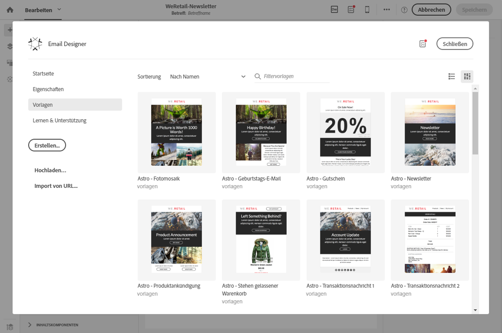

Im Tab **[!UICONTROL Lernen &amp; Unterstützung]können Sie auf entsprechende Handbücher und Tutorials zugreifen.**

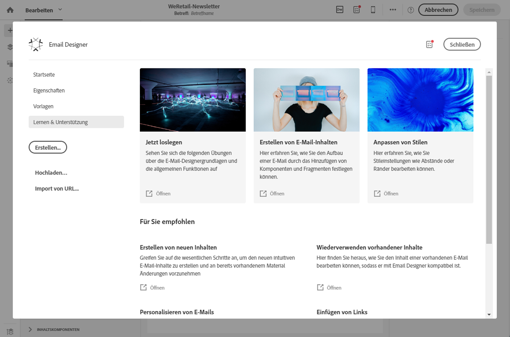

Wenn Sie keine Vorlage auswählen, können Sie über die Startseite von Email Designer auch wählen, wie Sie Ihren Inhalt erstellen möchten:

* Wählen Sie die Schaltfläche **[!UICONTROL Erstellen], um ganz neuen Inhalt zu erstellen.** Siehe auch [Neuen E-Mail-Inhalt gestalten](../../designing/using/about-email-content-design.md#designing-an-email-content-from-scratch).
* Wählen Sie die Schaltfläche **[!UICONTROL Hochladen]aus, um eine Datei von Ihrem Computer zu laden.** Siehe auch [Inhalt aus einer Datei importieren](../../designing/using/importing-content-from-a-file.md).
* Wählen Sie die Schaltfläche **[!UICONTROL Import von URL], um vorhandenen Inhalt von einer URL abzurufen.** Siehe auch [Inhalt aus einer URL importieren](../../designing/using/importing-content-from-a-url.md).

### Benutzeroberfläche von Email Designer {#email-designer-interface}

Email Designer verfügt über zahlreiche Optionen zur Erstellung, Bearbeitung und Anpassung von Inhalten.

Die Benutzeroberfläche besteht aus mehreren Bereichen mit unterschiedlichen Funktionen:

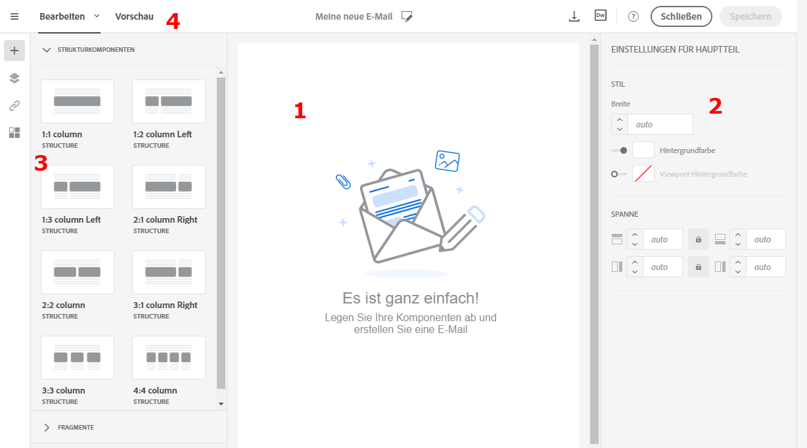

Sie können mit Drag &amp; Drop Strukturkomponenten und Inhaltsfragmente aus den verfügbaren Elementen in der **Palette** (1) in den **Arbeitsbereich** (2) verschieben. Danach können Sie eine Komponente oder ein Element im **Arbeitsbereich** (2) auswählen und im Fenster **Einstellungen** (3) Stil und Aussehen anpassen.

In der **Symbolleiste** (4) sind weitere allgemeine Optionen und Einstellungen verfügbar.

>[!NOTE]
>
>Der Bereich **Einstellungen** kann abhängig von Ihrer Bildschirmauflösung und Anzeige nach links verschoben werden.


In der **dedizierten Symbolleiste** der Editor-Oberfläche sind je nach markiertem Bereich unterschiedliche Schaltflächen verfügbar. Sie enthält Aktionsschaltflächen sowie Schaltflächen zur Anpassung des Textstils. Alle Änderungen beziehen sich somit jeweils nur auf das ausgewählte Element.

### Allgemeine Empfehlungen für die Verwendung von Email Designer {#general-recommendations-for-using-the-email-designer}

Um Email Designer optimal zu nutzen und E-Mails möglichst einfach zu erstellen, empfehlen wir folgende Vorgehensweise:

* Verwenden Sie Inline Styling anstatt eines separaten CSS-Stylesheets und CSS im &lt;head&gt;-Abschnitt einer HTML-Datei. Die Verwendung von Inline Styling ermöglicht eine optimale Speicherung und Wiederverwendung der Inhaltsfragmente.

   Siehe auch den Abschnitt zum [Hinzufügen von Inline-Styling-Attributen](../../designing/using/editing-email-styles.md#adding-inline-styling-attributes).

* Die einfache Erstellung und Wiederverwendung von Inhaltsfragmenten hilft Ihnen, Ihre Marketingkampagnen konsistent zu halten und damit Ihr Branding zu stärken.

   Siehe [Inhaltsfragment erstellen](../../designing/using/defining-the-email-structure.md#creating-a-content-fragment).

Lesen Sie diesbezüglich auch die [allgemeinen Best Practices für die Gestaltung von Inhalten](../../designing/using/content-design-best-practices.md).

### Kompatibilitätsmodus von Email Designer {#email-designer-compatibility-mode}

Beim Hochladen von Inhalt muss dieser ein bestimmtes Tagging aufweisen, um vollständig kompatibel und im WYSIWYG-Editor von Email Designer bearbeitbar zu sein.

Wenn die hochgeladenen HTML-Datei oder Teile davon nicht mit dem Tagging kompatibel ist, wird der Inhalt im so genannten Kompatibilitätsmodus geladen, in dem die Bearbeitungsmöglichkeiten über die Benutzeroberfläche eingeschränkt sind.

Im Kompatibilitätsmodus können Sie die folgenden Änderungen über die Benutzeroberfläche vornehmen (nicht verfügbare Aktionen sind verborgen):

* Ändern des Textes oder eines Bildes
* Einfügen von Links und Personalisierungsfeldern
* Bearbeiten einiger Stiloptionen im ausgewählten HTML-Baustein
* Definieren von bedingten Inhalten

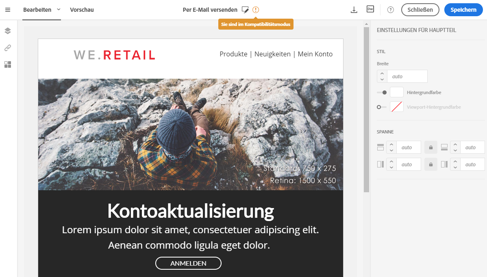

Sonstige Änderungen, wie etwa das Hinzufügen neuer Bereiche zu Ihrer E-Mail oder deren zusätzliche Gestaltung, müssen direkt im Quellcode der E-Mail im HTML-Modus vorgenommen werden.

Weiterführende Informationen zur Konvertierung einer vorhandenen E-Mail in eine mit Email Designer kompatible E-Mail finden Sie in [diesem Abschnitt](../../designing/using/about-email-content-design.md#designing-an-email-using-existing-contents).

### Einschränkungen in Email Designer {#email-designer-limitations}

* Personalisierungsfelder können nicht in einem Fragment verwendet werden. Weiterführende Informationen zu Fragmenten finden Sie in [diesem Abschnitt](../../designing/using/defining-the-email-structure.md#about-fragments).
* Sie können Inhalt einer in Email Designer bearbeiteten E-Mail nicht direkt als Fragment speichern Stattdessen müssen Sie den entsprechenden HTML-Code kopieren und in ein neues Fragment einfügen. Weiterführende Informationen dazu finden Sie im Abschnitt [Inhalt als ein Fragment speichern](../../designing/using/defining-the-email-structure.md#saving-content-as-a-fragment).
* Bei der Bearbeitung von Stilen sind nur die Web Fonts verfügbar, die von den meisten E-Mail-Clients offiziell unterstützt werden.
* Stile lassen sich nicht als Thema zur künftigen Wiederverwendung speichern. Doch der CSS-Stil kann in einer Inhaltsvorlage oder einer E-Mail gespeichert werden. Weiterführende Informationen dazu finden Sie in [diesem Abschnitt](../../designing/using/editing-email-styles.md).

### Updates für E-Mail-Designer {#email-designer-updates}

Der E-Mail-Designer wird ständig verbessert. Wenn Sie einen E-Mail-Inhalt von Grund auf von einer vordefinierten Vorlage aus erstellt haben oder Fragmente erstellt haben, erhalten Sie beim nächsten Öffnen Ihres Inhalts möglicherweise folgende Aktualisierungsmeldung:

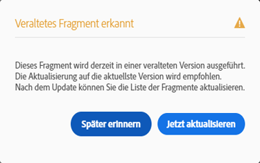

Adobe empfiehlt, Ihren Inhalt auf die neueste Version zu aktualisieren, um Probleme wie CSS-Kollision zu vermeiden. Klicken Sie auf **[!UICONTROL Jetzt aktualisieren]**.

Wenn beim Aktualisieren des Inhalts ein Fehler auftritt, überprüfen Sie Ihren HTML und beheben Sie ihn, bevor Sie dieses Update erneut ausführen.

Beachten Sie bei Fragmenten Folgendes:

* Wenn Sie ein Fragment zu einer neuen E-Mail oder Vorlage hinzufügen möchten und diese Meldung erhalten, müssen Sie dieses Fragment zuerst aktualisieren.

* Wenn Sie mehrere Fragmente haben, müssen Sie jedes Fragment aktualisieren, das Sie in einem E-Mail-Inhalt verwenden möchten.

* Um Auswirkungen auf die aktuellen E-Mail-Nachrichten zu vermeiden, die noch nicht vorbereitet sind, können Sie bestimmte Fragmente nicht aktualisieren.

* Sie können weiterhin E-Mails senden, bei denen ein nicht aktualisiertes Fragment bereits verwendet wird, das Fragment jedoch nicht bearbeitbar ist.

* Die Aktualisierung von Fragmenten in E-Mails, die bereits vorbereitet sind, hat keine Auswirkungen auf diese E-Mails.

## Neuen E-Mail-Inhalt gestalten {#designing-an-email-content-from-scratch}

Dies sind die wichtigsten Schritte zum Erstellen und Gestalten eines neuen E-Mail-Inhalts mithilfe von Email Designer:

1. Erstellen Sie eine E-Mail und öffnen Sie ihren Inhalt.
1. Fügen Sie Strukturkomponenten hinzu, um der E-Mail die gewünschte Form zu geben. Siehe auch den Abschnitt [E-Mail-Struktur bearbeiten](../../designing/using/defining-the-email-structure.md#editing-the-email-structure)
1. Fügen Sie Inhaltskomponenten und Fragmente in die Strukturkomponenten ein. Siehe auch den Abschnitt [Fragmente und Inhaltskomponenten hinzufügen](../../designing/using/defining-the-email-structure.md#adding-fragments-and-content-components)
1. Fügen Sie Bilder hinzu und bearbeiten Sie den Text der E-Mail. Siehe [Bilder einfügen](../../designing/using/inserting-images.md).
1. Personalisieren Sie Ihre E-Mail durch Hinzufügen von Personalisierungsfeldern, Links etc. Siehe [Personalisierungsfelder einfügen](../../designing/using/inserting-a-personalization-field.md), [Link einfügen](../../designing/using/inserting-a-link.md) und [Dynamische Inhalte in einer E-Mail definieren](../../designing/using/defining-dynamic-content-in-an-email.md).
1. Definieren Sie die Betreffzeile Ihrer E-Mail. Siehe [Betreffzeile einer E-Mail personalisieren](../../designing/using/personalizing-the-subject-line-of-an-email.md).
1. Sehen Sie sich die E-Mail in der Vorschau an.
1. Speichern Sie den Inhalt und fahren Sie mit der Nachricht fort, nachdem Sie eine Audience definiert und den Versandzeitpunkt festgelegt haben.

Sehen Sie sich dazu auch dieses [Einführungsvideo](https://video.tv.adobe.com/v/22771/?autoplay=true&hidetitle=true&captions=ger) an.

>[!NOTE]
>
>Wenn Sie keinen völlig neuen E-Mail-Inhalt erstellen möchten, können Sie auch die nativen Inhaltsvorlagen verwenden. Weiterführende Informationen dazu finden Sie im Abschnitt [Inhaltsvorlagen](../../start/using/about-templates.md#content-templates).

**Verwandte Themen**:

* [E-Mails erstellen](../../channels/using/creating-an-email.md)
* [Existierenden Inhalt auswählen](../../designing/using/selecting-an-existing-content.md)
* [Audience in einer Nachricht auswählen](../../audiences/using/selecting-an-audience-in-a-message.md)
* [Versandplanung](../../sending/using/about-scheduling-messages.md)
* [Vorschau der Nachricht erzeugen](../../sending/using/previewing-messages.md)
* [E-Mail-Rendering](../../sending/using/email-rendering.md)

## E-Mail aus vorhandenem Inhalt erstellen {#designing-an-email-using-existing-contents}

In diesem Abschnitt wird erklärt, wie Sie eine vorhandene E-Mail in eine mit Email Designer kompatible E-Mail konvertieren können.

Standardmäßig wird der Inhalt beim Hochladen von HTML-Code (siehe [Inhalt aus einer Datei importieren](../../designing/using/importing-content-from-a-file.md)) im [Kompatibilitätsmodus](../../designing/using/about-email-content-design.md#email-designer-compatibility-mode) geladen, wodurch die Bearbeitungsmöglichkeiten über die Benutzeroberfläche einschränkt werden (nur Bearbeitung an Ort und Stelle, kein Drag &amp; Drop).

Wenn Sie jedoch einen Rahmen aus modularen Vorlagen und Fragmenten erstellen möchten, die kombiniert und in mehreren E-Mails wiederverwendet werden können, empfiehlt es sich, den E-Mail-HTML-Code in eine Email Designer-Vorlage zu konvertieren.

Bei der Erstellung von Inhalt mit Email Designer haben Sie drei Möglichkeiten:

* [Erstellen von Inhalt aus einer nativen Vorlage](../../designing/using/about-email-content-design.md#building-content-from-an-out-of-the-box-template)
* Ein HTML-Design [unter Verwendung von Fragmenten und Komponenten](../../designing/using/about-email-content-design.md#using-fragments-and-components) neu erstellen
* [Konvertieren einer E-Mail mit HTML-Inhalt](../../designing/using/about-email-content-design.md#converting-an-html-content) in modularen Email Designer-Inhalt

### Erstellen von Inhalt aus einer nativen Vorlage {#building-content-from-an-out-of-the-box-template}

1. Erstellen Sie eine E-Mail und öffnen Sie ihren Inhalt. Weiterführende Informationen dazu finden Sie im Abschnitt [E-Mails erstellen](../../channels/using/creating-an-email.md).
1. Wählen Sie das Startseiten-Symbol aus, um die Startseite von **[!UICONTROL Email Designer]zu öffnen.**
1. Wählen Sie den Tab **[!UICONTROL Vorlagen]aus.**
1. Wählen Sie eine native HTML-Vorlage aus.

   Die unterschiedlichen Vorlagen bestehen aus Kombinationen verschiedener Typen von Elementen. Beispielsweise haben die Vorlagen vom Typ "Feather" Ränder, die Vorlagen vom Typ "Astro" haben dagegen keine. Weiterführende Informationen dazu finden Sie im Abschnitt [Inhaltsvorlagen](../../start/using/about-templates.md#content-templates).

1. Sie können diese Elemente zu mehreren E-Mail-Varianten kombinieren. Beispielsweise können Sie einen Teil einer E-Mail duplizieren, indem Sie eine Strukturkomponente markieren und in der dedizierten Symbolleiste **[!UICONTROL Duplizieren]auswählen.**
1. Sie können die Elemente mit den blauen Pfeilen auf der linken Seite verschieben, indem Sie eine Strukturkomponente unter oder über eine andere ziehen. Weiterführende Informationen dazu finden Sie im Abschnitt zum [Bearbeiten des E-Mail-Aufbaus](../../designing/using/defining-the-email-structure.md#editing-the-email-structure).
1. Sie können Komponenten auch verschieben und so die Anordnung in jedem Strukturelement ändern. Weiterführende Informationen dazu finden Sie im Abschnitt [Fragmente und Inhaltskomponenten hinzufügen](../../designing/using/defining-the-email-structure.md#adding-fragments-and-content-components).
1. Sie können den Inhalt jedes Elements nach Bedarf ändern: Bilder, Text, Links.
1. Sie können auch die Stiloptionen beliebig auf Ihren Inhalt anpassen. Weiterführende Informationen dazu finden Sie im Abschnitt [E-Mail-Stile bearbeiten](../../designing/using/editing-email-styles.md).

### Verwendung von Fragmenten und Komponenten {#using-fragments-and-components}

Um die Kompatibilität von externem Inhalt mit Email Designer zu gewährleisten, empfiehlt Adobe, eine neue Nachricht zu erstellen und den Inhalt aus der existierenden E-Mail in Fragmente und Komponenten hinzuzufügen.

Wenn Sie Inhalt haben, der nicht wiederhergestellt werden kann, können Sie den HTML-Code mithilfe der **[!UICONTROL HTML]-Inhaltskomponente aus der Original-E-Mail kopieren und einfügen.** Nur Benutzer, die mit HTML vertraut sind, sollten diese Schritte ausführen.

Weiter unten finden Sie ein Beispiel dafür.

>[!NOTE]
>
>Der neue Inhalt ist keine exakte Kopie der ursprünglichen E-Mail, aber mithilfe der unten stehenden Schritte können Sie eine Nachricht erstellen, die dem Original möglichst ähnelt.

Nehmen wir an, Sie möchten einen vorhandenen Newsletter verwenden, der außerhalb von Adobe Campaign erstellt wurde.

Sie möchten in allen mit Adobe Campaign versendeten E-Mails dieselbe Kopf- und Fußzeile verwenden. Der Textkörper der E-Mail ändert sich entsprechend dem jeweiligen Inhalt des Newsletters.

**Voraussetzungen**

1. Stellen Sie fest, welche Bereiche Ihrer ursprünglichen E-Mail Sie in späteren E-Mails wiederverwenden möchten.
1. Speichern Sie alle Bilder und Assets, die Sie verwenden möchten.
1. Wenn Sie ausreichende HTML-Kenntnisse haben, teilen Sie Ihren ursprünglichen HTML-Inhalt in unterschiedliche Teile auf.

**Fragmente für den wiederverwendbaren Inhalt erstellen**

Erstellen Sie mit Email Designer für jeden wiederverwendbaren Bereich ein Fragment. Für unser Beispiel brauchen wir zwei Fragmente: eines für die Kopfzeile und eines für die Fußzeile. Kopieren Sie dann die entsprechenden Teile aus dem existierenden Inhalt in diese Fragmente.

Gehen Sie dazu wie folgt vor:

1. In Adobe Campaign, go to **[!UICONTROL Resources]** &gt; **[!UICONTROL Content templates &amp; fragments]** and create a fragment for your header. Weiterführende Informationen dazu finden Sie im Abschnitt [Inhaltsfragment erstellen](../../designing/using/defining-the-email-structure.md#creating-a-content-fragment).
1. Fügen Sie beliebig viele Strukturkomponenten zu diesem Fragment hinzu.

   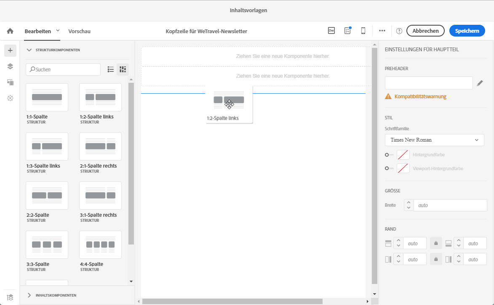

1. Fügen Sie Bild- und Textkomponenten in Ihre Struktur ein.

   

1. Laden Sie das entsprechende Bild hoch, geben Sie Ihren Text ein und passen Sie die Einstellungen an.

   Weiterführende Informationen zur Verwaltung von Stileinstellungen und Inline-Attributen finden Sie im Abschnitt [E-Mail-Stile bearbeiten](../../designing/using/editing-email-styles.md).

   

1. Speichern Sie Ihr Fragment.
1. Gehen Sie bei der Erstellung der Fußzeile analog vor und speichern Sie sie.

   

   Wenn Sie HTML-Kenntnisse haben, können Sie den HTML-Code mit der **[!UICONTROL HTML]-Inhaltskomponente aus der Original-Fußzeile kopieren und einfügen.** Weiterführende Informationen dazu finden Sie im Abschnitt [Über Inhaltskomponenten](../../designing/using/defining-the-email-structure.md#about-content-components).

   

Ihre Fragmente können jetzt in einer Vorlage verwendet werden.

**Fragmente und Komponenten in eine Vorlage einfügen**

Sie können jetzt mit Email Designer eine E-Mail-Vorlage erstellen. Mit Inhaltskomponenten können Sie die unterschiedlichen Bereiche der E-Mail gestalten und die Einstellungen so anpassen, dass das Ergebnis möglichst dem ursprünglichen Newsletter entspricht. Fügen Sie schließlich die soeben von Ihnen erstellten Fragmente ein.

1. Erstellen Sie mit Email Designer eine Vorlage. Weiterführende Informationen dazu finden Sie im Abschnitt [Inhaltsvorlagen](../../start/using/about-templates.md#content-templates).
1. Fügen Sie mehrere Strukturkomponenten in die Vorlage ein, die der Kopfzeile, Fußzeile und dem Textkörper Ihrer E-Mail entsprechen. Weiterführende Informationen zum Hinzufügen von Strukturkomponenten finden Sie im Abschnitt [Die E-Mail-Struktur mit Email Designer bearbeiten](../../designing/using/defining-the-email-structure.md#editing-the-email-structure).
1. Fügen Sie so viele Inhaltskomponenten ein, wie Sie für die Erstellung Ihres Newsletters benötigen. Diesen Inhalt werden Sie in Ihrer E-Mail jeden Monat aktualisieren können.

   

   Wenn Sie HTML-Kenntnisse besitzen, empfiehlt Adobe **[!UICONTROL HTML]-Komponenten für komplexe Elemente der ursprünglichen E-Mail zu verwenden und diese zu kopieren und einzufügen.** Use other components such as **[!UICONTROL Button]**, **[!UICONTROL Image]** or **[!UICONTROL Text]** for the rest of the content. Weiterführende Informationen dazu finden Sie im Abschnitt [Über Inhaltskomponenten](../../designing/using/defining-the-email-structure.md#about-content-components).

   >[!NOTE]
   >
   >Mit der **[!UICONTROL HTML]-Komponente können Komponenten erstellt werden, die beschränkte Bearbeitungsmöglichkeiten bieten.** Wählen Sie diese Komponente nur aus, wenn Sie mit der Handhabung von HTML-Code vertraut sind.

1. Passen Sie die Inhaltskomponenten so an, dass sie der ursprünglichen E-Mail möglichst ähnlich sind.

   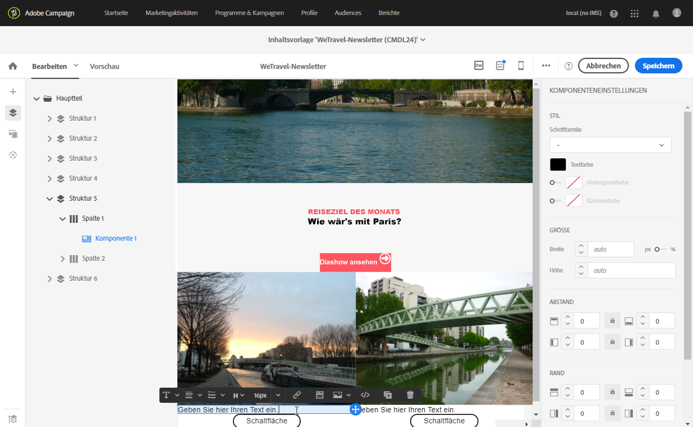

   Weiterführende Informationen zur Verwaltung von Stileinstellungen und Inline-Attributen finden Sie im Abschnitt [E-Mail-Stile bearbeiten](../../designing/using/editing-email-styles.md).

1. Fügen Sie die zwei Fragmente (Kopf- und Fußzeile) ein, die Sie zuvor in der gewünschten Strukturkomponente erstellt haben.

   

1. Speichern Sie Ihre Vorlage.

Sie können diese Vorlage jetzt in Email Designer vollständig verwalten und damit einen Newsletter erstellen, aktualisieren und monatlich an Ihre Empfänger senden.

Erstellen Sie dazu eine E-Mail und wählen Sie die soeben von Ihnen erstellte Inhaltsvorlage aus.

**Verwandtes Thema**:

* [E-Mails erstellen](../../channels/using/creating-an-email.md)
* [Einführungsvideo für Email Designer](https://video.tv.adobe.com/v/22771/?autoplay=true&hidetitle=true&captions=ger)
* [Neuen E-Mail-Inhalt gestalten](../../designing/using/about-email-content-design.md#designing-an-email-content-from-scratch)

### HTML-Inhalt konvertieren {#converting-an-html-content}

In diesem Anwendungsbeispiel erfahren Sie, wie Sie eine HTML-E-Mail rasch in Email Designer-Komponenten konvertieren können.

>[!CAUTION]
>
>Dieser Abschnitt richtet sich an Benutzer mit fortgeschrittenen HTML-Kenntnissen.

>[!NOTE]
>
>Wie im Kompatibilitätsmodus ist eine HTML-Komponente nur beschränkt bearbeitbar: Sie kann nur an Ort und Stelle bearbeitet werden.

Achten Sie darauf, dass der ursprüngliche HTML-Code außerhalb von Email Designer in wiederverwendbare Bereiche unterteilt ist.

Ist dies nicht der Fall, schneiden Sie die unterschiedlichen Bestandteile aus Ihrem HTML-Code aus. Beispiel:

```
<!-- 3 COLUMN w/CTA (SCALED) -->
<table width="100%" align="center" cellspacing="0" cellpadding="0" border="0" role="presentation" style="max-width:680px;">
<tbody>
<tr>
<td class="padh10" align="center" valign="top" style="padding:0 5px 20px 5px;">
<table width="100%" cellspacing="0" cellpadding="0" border="0" role="presentation">
<tbody>
<tr>
...
</tr>
</tbody>
</table>
</td>
</tr>
</tbody>
</table>
<!-- //3 COLUMN w/CTA (SCALED) -->
```

Sobald Sie alle Bestandteile identifiziert haben, wiederholen Sie in Email Designer folgenden Vorgang für jeden Teil Ihrer vorhandenen E-Mail:

1. Öffnen Sie Email Designer, um leeren E-Mail-Inhalt zu erstellen.
1. Legen Sie die Attribute für den Hauptteil fest: Hintergrundfarben, Breite etc. Weiterführende Informationen dazu finden Sie im Abschnitt [E-Mail-Stile bearbeiten](../../designing/using/editing-email-styles.md).
1. Fügen Sie eine Strukturkomponente hinzu. Weiterführende Informationen dazu finden Sie im Abschnitt zum [Bearbeiten des E-Mail-Aufbaus](../../designing/using/defining-the-email-structure.md#editing-the-email-structure).
1. Fügen Sie eine HTML-Komponente hinzu. Weiterführende Informationen dazu finden Sie im Abschnitt [Fragmente und Inhaltskomponenten hinzufügen](../../designing/using/defining-the-email-structure.md#adding-fragments-and-content-components).
1. Fügen Sie Ihren HTML-Code mit Copy &amp; Paste in diese Komponente ein.
1. Zur Mobile-Ansicht wechseln. Weiterführende Informationen hierzu finden Sie in [diesem Abschnitt](../../designing/using/about-email-content-design.md#switching-to-mobile-view).

   Die responsive Ansicht ist fehlerhaft, da Ihr CSS fehlt.

1. Um dieses Problem zu beheben, wechseln Sie zum Quellcode-Modus und kopieren Sie Ihren CSS-Abschnitt in einen neuen CSS-Abschnitt. Beispiel:

   ```
   <style type="text/css">
   a {text-decoration:none;}
   body {min-width:100% !important; margin:0 auto !important; padding:0 !important;}
   img {line-height:100%; text-decoration:none; -ms-interpolation-mode:bicubic;}
   ...
   </style>
   ```

   >[!NOTE]
   >
   >Verändern Sie das von Email Designer erzeugte CSS nicht: `<style acrite-template-css="true">` und `<style acrite-custom-styles="" type="text/css">`. Fügen Sie anschließend Ihren Stil hinzu.

1. Kehren Sie zur mobilen Ansicht zurück und prüfen Sie, ob Ihr Inhalt korrekt angezeigt wird, und speichern Sie Ihre Änderungen.

## Zur Mobile-Ansicht wechseln {#switching-to-mobile-view}

Sie können das responsive Design einer E-Mail anpassen, indem Sie alle Stiloptionen für die Darstellung auf Mobilgeräten einzeln bearbeiten. So können Sie beispielsweise für die mobile Version Ihrer E-Mail die Spannen und Abstände verändern sowie kleinere oder größere Schriftgrade verwenden, die Schaltflächen ändern oder unterschiedliche Hintergrundfarben auswählen.

Alle Stiloptionen sind in der Mobile-Ansicht verfügbar. Weiterführende Informationen zu den Stileinstellungen von Email Designer finden Sie im Abschnitt [E-Mail-Stile bearbeiten](../../designing/using/editing-email-styles.md).

1. Erstellen Sie eine E-Mail und bearbeiten Sie den Inhalt. Weiterführende Informationen dazu finden Sie im Abschnitt [Neuen E-Mail-Inhalt gestalten](../../designing/using/about-email-content-design.md#designing-an-email-content-from-scratch).
1. Öffnen Sie mit der Schaltfläche **[!UICONTROL Zur Mobile-Ansicht wechseln]die Mobile-Ansicht.**

   

   Die Mobile-Version der E-Mail wird angezeigt. Sie enthält alle in der Desktop-Ansicht definierten Komponenten und Stile.

1. Sie können alle Stileinstellungen unabhängig voneinander bearbeiten, z. B. Hintergrundfarbe, Ausrichtung, Abstand, Spanne, Schriftart, Textfarbe usw.

   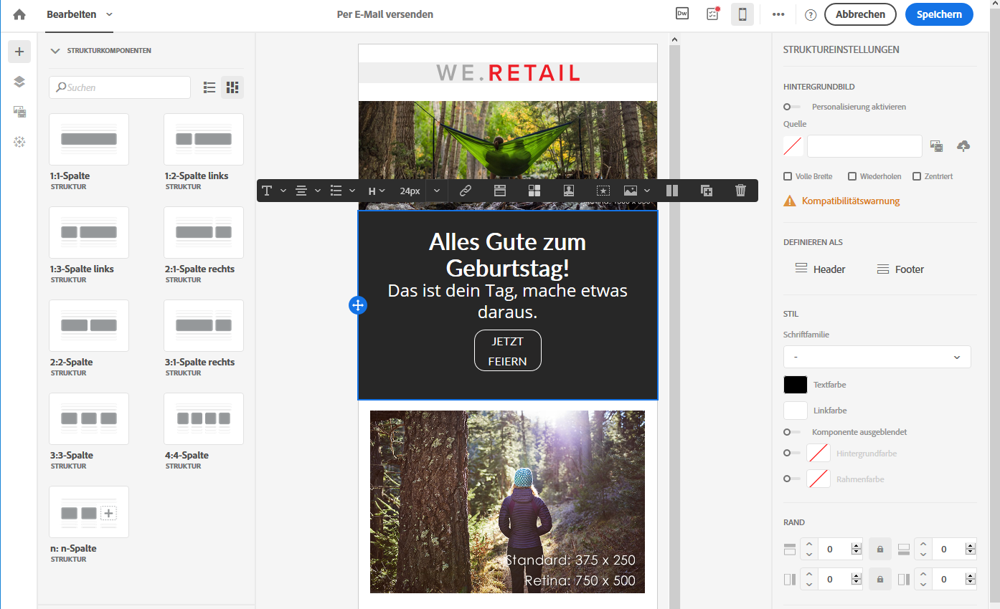

1. Änderungen von Stileinstellungen in der Mobile-Ansicht werden nur auf die Mobile-Version angewendet.

   Sie können in der Mobile-Ansicht z. B. die Größe eines Bildes verringern, einen grünen Hintergrund hinzufügen und den Abstand verändern.

   

1. Sie können eine Komponente ausblenden, wenn sie auf einem Mobilgerät angezeigt wird. Wählen Sie dazu **[!UICONTROL die Option Nur auf Desktopgeräten]** anzeigen aus den **[!UICONTROL Anzeigeoptionen]**.
Sie können diese Komponente auch auf Desktopgeräten ausblenden, was bedeutet, dass sie nur auf Mobilgeräten angezeigt wird. Wählen Sie dazu **[!UICONTROL nur auf Mobilgeräten anzeigen]**.
Mit dieser Option können Sie beispielsweise ein bestimmtes Bild auf Mobilgeräten und ein anderes Bild auf Desktopgeräten anzeigen.
Sie können diese Option entweder über die Mobil- oder Desktop-Ansicht festlegen.

   

1. Wählen Sie nochmals die Schaltfläche **[!UICONTROL Zur Mobile-Ansicht wechseln]aus, um zur Desktop-Ansicht zu wechseln.** Die soeben vorgenommenen Stiländerungen sind in dieser Version nicht vorhanden.

   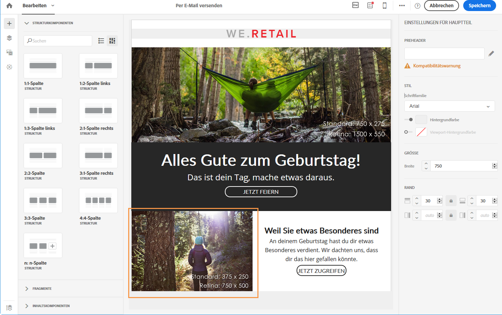

   >[!NOTE]
   >
   >Die einzige Ausnahme sind die Einstellungen für **[!UICONTROL Inline-Stile].** Inline-Stil-Einstellungen werden auch von der standardmäßigen Desktop-Ansicht übernommen.

1. Andere Änderungen an der Struktur oder am Inhalt der E-Mail, wie zum Beispiel Textänderungen, der Upload eines neuen Bildes, das Hinzufügen einer neuen Komponente etc. werden auch in der Standardansicht angezeigt.

   Wechseln Sie wieder in die Mobile-Ansicht und ändern Sie z. B. Text und ersetzen Sie ein Bild.

   

   Wählen Sie nochmals die Schaltfläche **[!UICONTROL Zur Mobile-Ansicht wechseln]aus, um zur Desktop-Ansicht zu wechseln.** Die Änderungen wurden übernommen.

   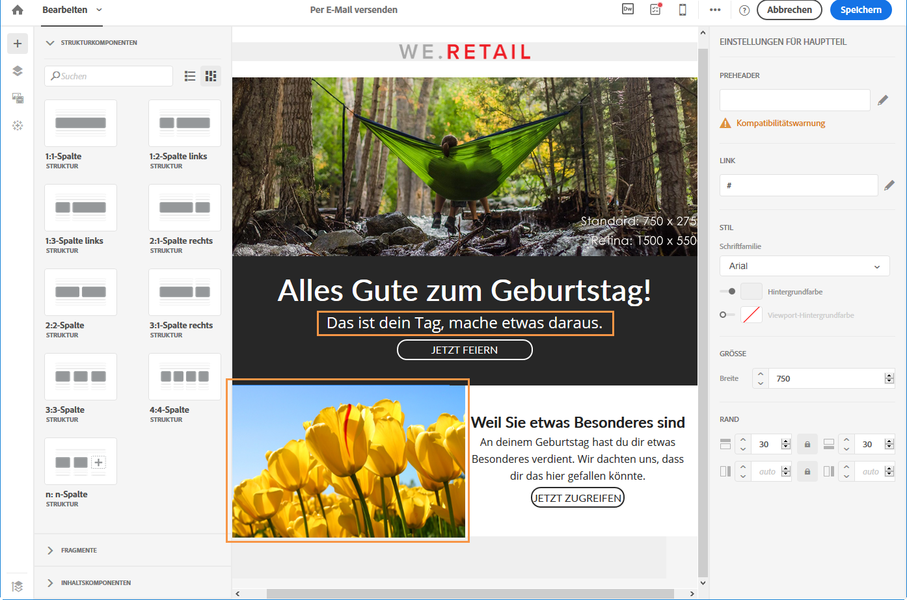

1. Wenn Sie in der Mobile-Version einen Stil entfernen, wird der im Desktop-Modus angewendete Stil übernommen.

   Fügen Sie in der Mobile-Ansicht z. B. für eine Schaltfläche eine grüne Hintergrundfarbe ein.

   

1. Wechseln Sie in die Desktop-Ansicht und wählen Sie für dieselbe Schaltfläche einen grauen Hintergrund.

   

1. Wechseln Sie nochmals zur Mobile-Ansicht und deaktivieren Sie die Einstellung **[!UICONTROL Hintergrundfarbe].**

   

   Die in der Desktop-Ansicht ausgewählte Hintergrundfarbe wird jetzt angewendet: Die Schaltfläche wird grau (nicht farblos) dargestellt.

   Die einzige Ausnahme ist die Einstellung für die **[!UICONTROL Randfarbe].** Wenn diese in der Mobile-Ansicht deaktiviert ist, wird kein Rahmen mehr hinzugefügt, selbst wenn in der Desktop-Ansicht eine Randfarbe definiert wird.

## Text- und HTML-Modus {#plain-text-and-html-modes}

### Textversion der E-Mail erstellen {#generating-a-text-version-of-the-email}

Standardmäßig wird eine **[!UICONTROL reine Textversion]** Ihrer E-Mail automatisch erzeugt und mit der **bearbeiteten]Version synchronisiert.[!UICONTROL **

Auch die zur HTML-Version hinzugefügten Personalisierungsfelder und Inhaltsbausteine werden mit der Textversion synchronisiert.

>[!NOTE]
>
>Um Inhaltsbausteine in der Textversion verwenden zu können, dürfen sie keinen HTML-Code enthalten.

Um eine Textversion zu erhalten, die anders ist als die HTML-Version, deaktivieren Sie die Synchronisation, indem Sie den Schalter **[!UICONTROL Mit HTML synchronisieren]** in der **Nur Text]-Ansicht Ihrer E-Mail auswählen.[!UICONTROL **

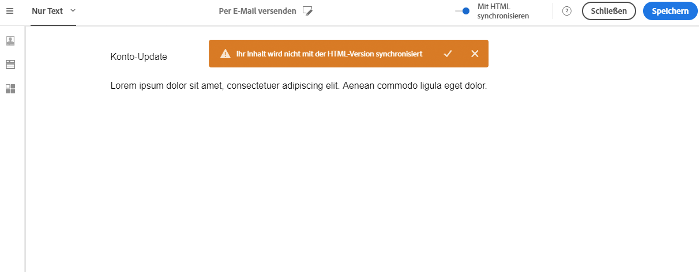

Sie können dann die Textversion nach Bedarf bearbeiten.

>[!NOTE]
>
>Wenn Sie die **[!UICONTROL Nur Text]**-Version bei deaktivierter Synchronisation bearbeiten, werden das nächste Mal, wenn Sie die Option **Mit HTML synchronisieren]aktivieren, alle Änderungen, die Sie in der Textversion vorgenommen haben, durch die HTML-Version ersetzt.[!UICONTROL ** Die Änderungen, die Sie in der **[!UICONTROL Nur Text]**-Ansicht vorgenommen haben, werden in der **HTML]-Ansicht nicht dargestellt.[!UICONTROL **

### Die Inhaltsquelle einer E-Mail in HTML bearbeiten {#editing-an-email-content-source-in-html}

Für fortgeschrittene Benutzer und zur Fehlerbehebung kann der E-Mail-Inhalt direkt im HTML-Format angezeigt und bearbeitet werden.

Es gibt zwei Möglichkeiten, die HTML-Version der E-Mail zu bearbeiten:

* Select **[!UICONTROL Edit]** &gt; **[!UICONTROL HTML]** to open the HTML version of the entire email.

   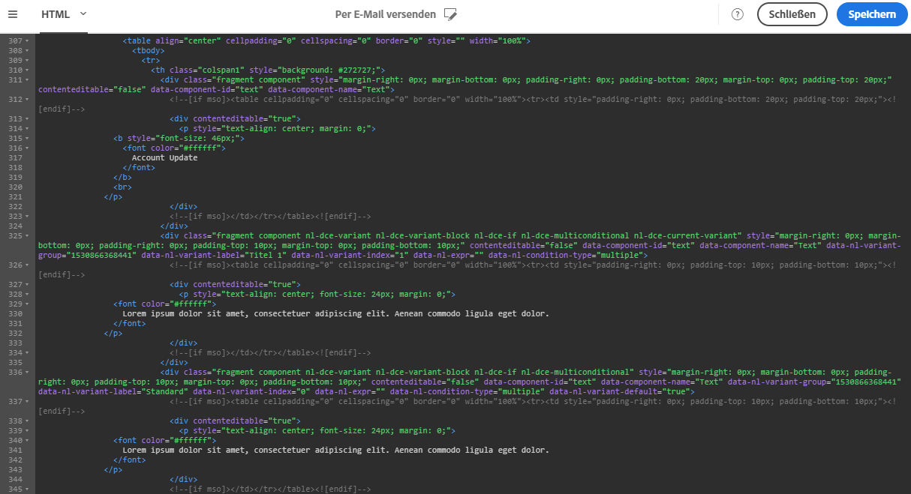

* Wählen Sie in der WYSIWYG-Benutzeroberfläche ein Element aus und danach das Symbol **[!UICONTROL Quellcode].**

   Nur der Quellcode des ausgewählten Elements wird angezeigt. Sie können den Quellcode bearbeiten, wenn das ausgewählte Element eine **[!UICONTROL HTML]-Inhaltskomponente ist.** Andere Komponenten sind schreibgeschützt, können aber in der vollständigen HTML-Version der E-Mail bearbeitet werden.

   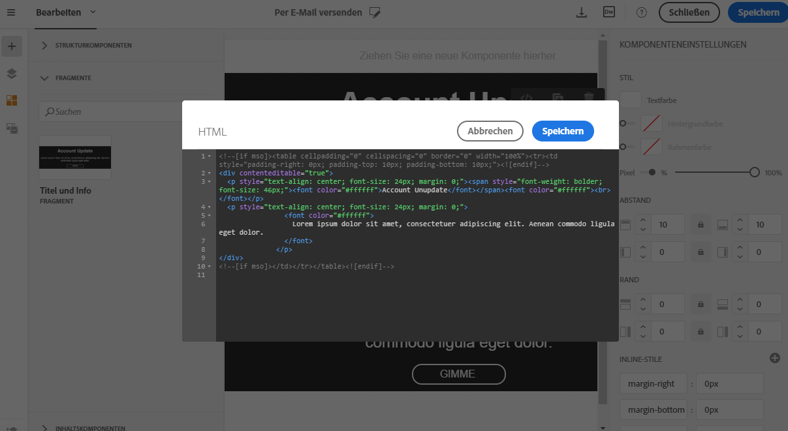

Wenn Sie den HTML-Code ändern, könnte es sein, dass Ihre E-Mails nicht mehr responsiv sind. Deshalb sollten Sie diese Funktion unbedingt unter Verwendung der Schaltfläche **[!UICONTROL Vorschau]testen.** Siehe [Vorschau der Nachricht erzeugen](../../sending/using/previewing-messages.md).

## Inhaltserstellung durch Adobe-Campaign-Integrationen {#design-through-adobe-campaign-integrations}

### Inhalt in Dreamweaver bearbeiten {#editing-content-in-dreamweaver}

Durch die Integration von Adobe Campaign Standard mit Dreamweaver kann E-Mail-Inhalt in der Benutzeroberfläche von Dreamweaver bearbeitet werden. Damit haben Sie Zugriff auf die leistungsstarken Optionen von Dreamweaver, um responsiven E-Mail-Content zu erstellen.

* **Bidirektionale Synchronisation**

   Wenn eine Änderung an einem Produkt vorgenommen wird, wird sie auch vom anderen in Echtzeit übernommen. Wenn Sie die Textfarbe in Dreamweaver verändern möchten, ist diese Änderung unmittelbar in Campaign zu sehen. Wenn Sie Code in Dreamweaver oder Campaign auswählen, ist diese Auswahl in diesen beiden Produkten identisch, da die Zeilennummern übereinstimmen. Dies ist sehr hilfreich, wenn Sie nach einer bestimmten Stelle im Code suchen.

* **Lokale Bilder über Dreamweaver in Adobe Campaign hochladen**

   Bei der Erstellung oder Bearbeitung einer E-Mail in Dreamweaver können Sie einfach ein auf Ihrem Desktop oder lokalen PC ausgewähltes Bild verwenden. Dreamweaver hat schon immer diese Möglichkeit geboten. Jetzt wird aber die lokale Datei unmittelbar zum Adobe Campaign-Server hochgeladen, wenn Dreamweaver und Campaign verbunden sind, ohne dass Bilder manuell hochgeladen werden müssen, wenn sich der Inhalt ändert. Zusätzlich wird damit sichergestellt, dass immer die aktuellen Bilder in Campaign vorhanden sind.

* **Campaign-Personalisierung in Dreamweaver hinzufügen**

   For the email developer there is no longer a need to add text like ```[[FIRSTNAME_PLACEHOLDER]]``` nor to look up the syntax of your data model’s tables. Die Campaign-Symbolleiste in Dreamweaver stellt eine direkte Verbindung zum Datenmodell Ihrer Campaign-Instanz her. Das bedeutet, dass Sie beliebige Personalisierungsdaten von z. B. Vorname zu Adresse ziehen können. Auch direkt in Campaign erstellte Inhaltsbausteine können direkt zu Dreamweaver gezogen werden.

Diese Funktion wird im Detail im [Dreamweaver-Handbuch](https://helpx.adobe.com/dreamweaver/using/working-with-dreamweaver-and-campaign.html) beschrieben. Auch ein [Video](https://helpx.adobe.com/campaign/kt/acs/using/acs-dreamweaver-integration-feature-video-use.html) ist zur Veranschaulichung verfügbar.

### Inhalt in Adobe Experience Manager bearbeiten {#editing-content-in-experience-manager}

Inhalte können in Experience Manager bearbeitet und danach für mehrere E-Mail-Nachrichten in Adobe Campaign Standard verwendet werden. In [diesem Dokument](../../integrating/using/integrating-with-experience-manager.md) erfahren Sie mehr dazu.

### Funktionen zur E-Mail-Erstellung im Vergleich {#email-design-options-comparison}

Adobe Campaign bietet mehrere Möglichkeiten zur Erstellung von E-Mails. In der folgenden Tabelle werden die wichtigsten Funktionen, Vorteile und Beschränkungen aufgeführt.

<table> 
 <thead> 
  <tr> 
   <th> </th> 
   <th> Email Designer<br /> </th> 
   <th> Experience Manager<br /> </th> 
   <th> Dreamweaver<br /> </th> 
  </tr> 
 </thead> 
 <tbody> 
  <tr> 
   <td> <strong>Neue E-Mail erstellen</strong><br /> </td> 
   <td> Unterstützt<br /> </td> 
   <td> Unterstützt<br /> </td> 
   <td> Unterstützt<br /> </td> 
  </tr> 
  <tr> 
   <td> <strong>HTML schreiben</strong><br /> </td> 
   <td> Unterstützt<br /> </td> 
   <td> Nicht unterstützt<br /> </td> 
   <td> Unterstützt<br /> </td> 
  </tr> 
  <tr> 
   <td> <strong>HTML aktualisieren</strong><br /> </td> 
   <td> Nur innerhalb einer HTML-Komponente<br /> </td> 
   <td> Nicht unterstützt<br /> </td> 
   <td> Unterstützt<br /> </td> 
  </tr> 
  <tr> 
   <td> <strong>Einfache Personalisierung</strong><br /> </td> 
   <td> Unterstützt<br /> </td> 
   <td> Unterstützt<br /> </td> 
   <td> Unterstützt<br /> </td> 
  </tr> 
  <tr> 
   <td> <strong>Erweiterte Personalisierung</strong><br /> </td> 
   <td> Unterstützt<br /> </td> 
   <td> Nicht unterstützt<br /> </td> 
   <td> Nicht unterstützt<br /> </td> 
  </tr> 
  <tr> 
   <td> <strong>Testversand/Vorschau</strong><br /> </td> 
   <td> Unterstützt<br /> </td> 
   <td> Vorschau in AEM<br /> Testversand in Campaign<br /> </td> 
   <td> Vorschau und Testversand in Campaign<br /> </td> 
  </tr> 
  <tr> 
   <td> <strong>Produktlisten</strong><br /> </td> 
   <td> In E-Mail-Transaktionsnachrichten unterstützt<br /> </td> 
   <td> Nicht unterstützt<br /> </td> 
   <td> Nicht unterstützt<br /> </td> 
  </tr> 
  <tr> 
   <td> <strong>Vorteile</strong><br /> </td> 
   <td> 
     - Einfache E-Email-Erstellung durch Drag &amp; Drop-Erlebnis<br/>
 - Funktionen ähneln Ähnlichem Content Editor<br/>
 - wiederverwendbarer Inhalt mit Fragmenten
  </td> 
   <td> 
     - Wiederverwenden von Assets aus der Website in E-Emails<br/>
 - Nutzen der Power von Experience Manager in E-Email-Inhalten
    </td> 
   <td> 
    - Fähigkeit eines Entwicklers, eine E-Email<br/>
 direkt zu kodieren - bidirektionale Synchronisierung<br/>
 - Offline in Dreamweaver bearbeiten und später
 synchronisieren<br/>- Bilder in Adobe Campaign über Dreamweaver hochladen
  </td> 
  </tr> 
  <tr> 
   <td> <strong>Einschränkungen</strong><br /> </td> 
   <td> 
     - Kein bedingter Inhalt in Fragmenten<br/>
 - Verwenden von Experience Manager-Fragmenten nicht möglich
  </td> 
   <td> 
     - Erweiterte Personalisierung schwer implementiert<br/>
 - Tests müssen in Adobe Campaign gesendet werden
  </td> 
   <td> Dynamische Inhalte nicht unterstützt<br /> </td> 
  </tr> 
  <tr> 
   <td> <strong>Zielgruppe</strong><br /> </td> 
   <td> Marketer, die Flexibilität schätzen und HTML-Komponenten in Kombination mit Drag &amp; Drop-Funktionen verwenden möchten<br /> </td> 
   <td> Marketer, die bereits Experience Manager verwenden und Standard-E-Mail-Vorlagen mit wenig Personalisierung verwenden möchten<br /> </td> 
   <td> Entwickler, die Code für E-Mail-Inhalte selbst schreiben möchten und eine direkte Integration mit Adobe Campaign wünschen<br /> </td> 
  </tr> 
  <tr> 
   <td> <strong>Weitere Informationen</strong><br /> </td> 
   <td> Siehe auch <a href="../../designing/using/about-email-content-design.md#about-the-email-designer">Über Email Designer</a><br /> </td> 
   <td> Siehe auch <a href="../../integrating/using/integrating-with-experience-manager.md">Integration mit Experience Manager</a><br /> </td> 
   <td> Siehe auch <a href="https://helpx.adobe.com/dreamweaver/using/working-with-dreamweaver-and-campaign.html">Dreamweaver und Campaign</a> und dieses <a href="https://helpx.adobe.com/campaign/kt/acs/using/acs-dreamweaver-integration-feature-video-use.html">Video</a><br />. </td> 
  </tr> 
 </tbody> 
</table>

