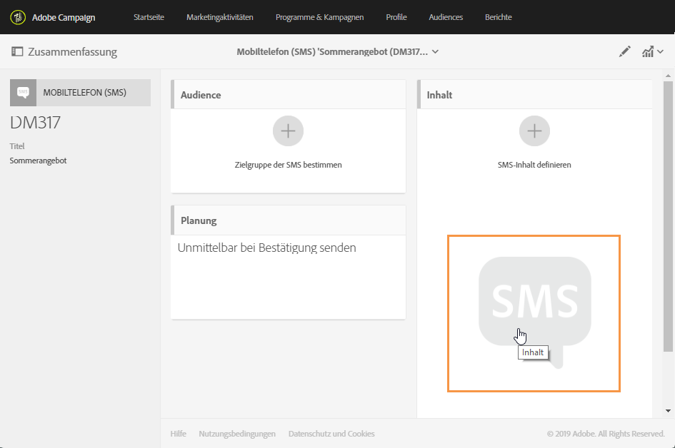
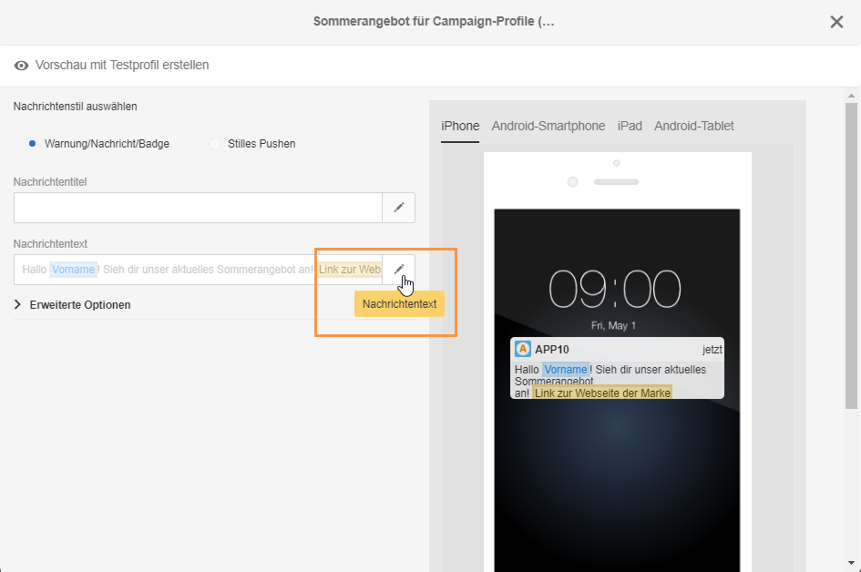

# Über die Inhaltserstellung für SMS und Push-Benachrichtigungen{#about-sms-and-push-content-design}

Mit dem Inhaltseditor können Sie den Inhalt von SMS und Push-Benachrichtigungen in Adobe Campaign definieren, ändern und personalisieren.

In diesem Abschnitt wird der Inhaltseditor für SMS- und Push-Nachrichten beschrieben, einschließlich dessen [Benutzeroberfläche](../../designing/using/sms-and-push-content-editor-interface.md).

In den folgenden Abschnitten werden die für Marketingaktivitäten am häufigsten erforderlichen Aktionen beschrieben:

* Weiterführende Informationen zur Personalisierung des Inhalts von SMS oder Push-Benachrichtigungen finden Sie in den Abschnitten [Personalisierungsfelder einfügen](../../designing/using/inserting-a-personalization-field.md) und [Inhaltsbausteine](../../designing/using/adding-a-content-block.md).
* Weiterführende Informationen zur Definition von bedingtem Text in einer SMS-Nachricht oder Push-Benachrichtigung finden Sie im Abschnitt [Dynamische Texte definieren](../../designing/using/defining-dynamic-text.md).

Um auf den Inhaltseditor für SMS und Push-Benachrichtigungen zuzugreifen, gehen Sie wie folgt vor:

* Wählen Sie im Dashboard einer SMS die Kachel **[!UICONTROL Inhalt]aus.**

   

* Wählen Sie im Dashboard einer Push-Benachrichtigung neben dem Feld **[!UICONTROL Nachrichtentext]das Stiftsymbol aus.**

   

**Verwandte Themen:**

* [SMS erstellen](../../channels/using/creating-an-sms-message.md)
* [Push-Benachrichtigung erstellen und senden](../../channels/using/preparing-and-sending-a-push-notification.md)

