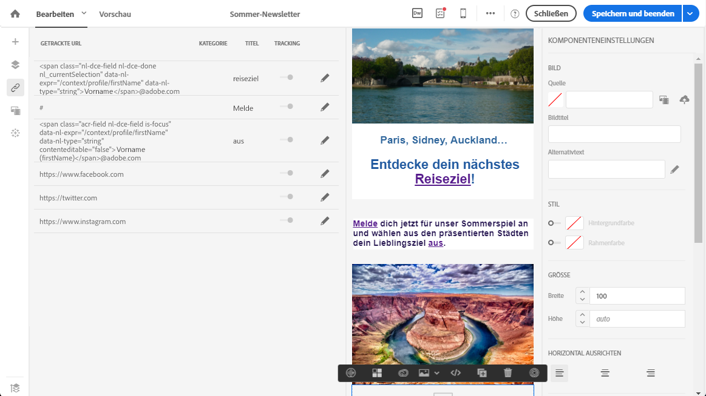
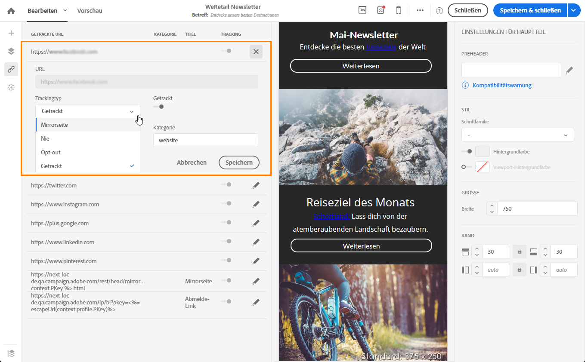

# Über getrackte URLs{#about-tracked-urls}

Adobe Campaign bietet Ihnen die Möglichkeit, das Verhalten der Empfänger zu verfolgen, wenn sie eine in einer E-Mail enthaltene URL anklicken. Weiterführende Informationen dazu finden Sie in [diesem Abschnitt](../../sending/using/tracking-messages.md#about-tracking).

Im Symbol **[!UICONTROL Links]in der Symbolleiste wird automatisch die Liste aller getrackten URLs Ihres Inhalts angezeigt.**

>[!NOTE]
>
>Das Tracking ist standardmäßig aktiviert. Damit diese Funktion für E-Mails verfügbar ist, muss das Tracking in Adobe Campaign aktiv sein. Weiterführende Informationen zu Trackingparametern finden Sie in [diesem Abschnitt](../../administration/using/configuring-email-channel.md#tracking-parameters).

Die URL, die Kategorie, der Titel und der Trackingtyp eines jeden Links können in dieser Liste geändert werden. Um einen Link zu bearbeiten, wählen Sie das entsprechende Stiftsymbol aus.

Für jede getrackte URL können Sie einen der folgenden Tracking-Modi auswählen:

* **Getrackt**: aktiviert das Tracking dieser URL.
* **Mirrorseite**: diese URL wird als Mirrorseite behandelt.
* **Nie**: Das Tracking dieser URL wird nie aktiviert. Diese Einstellung wird gespeichert. Wenn die URL künftig in einer Nachricht erscheint, ist ihr Tracking automatisch deaktiviert.
* **Opt-out**: Diese URL wird als Opt-out-URL behandelt.

Sie können das Tracking für jede URL aktivieren oder deaktivieren.

>[!NOTE]
>
>Standardmäßig werden in Adobe Campaign alle Inhalts-URLs getrackt außer die **URL der Mirrorseite** und der **Abmelde-Link**.

Sie haben die Möglichkeit, Ihre URLs mithilfe des Felds **[!UICONTROL Kategorie]je nach den in der Nachricht verwendeten URLs zu gruppieren.** Diese Kategorien können in Berichten angezeigt werden, z. B. in [URLs und Clickstreams](../../reporting/using/urls-and-click-streams.md).

Wenn Sie einen Bericht erstellen, wählen Sie im Tab **[!UICONTROL Komponenten]** die Option **Dimension]aus. Scrollen Sie dann die Liste hinunter, um auf die Tracking-Komponenten zuzugreifen.[!UICONTROL ** So können Sie z. B. **[!UICONTROL Kategorie des URL-Trackings]in den Arbeitsbereich ziehen, um die Ergebnisse zur Tracking-Kategorie jeder angeklickten URL anzuzeigen.**

Weiterführende Informationen zur Erstellung benutzerdefinierter Berichte finden Sie in [diesem Abschnitt](../../reporting/using/about-dynamic-reports.md).
