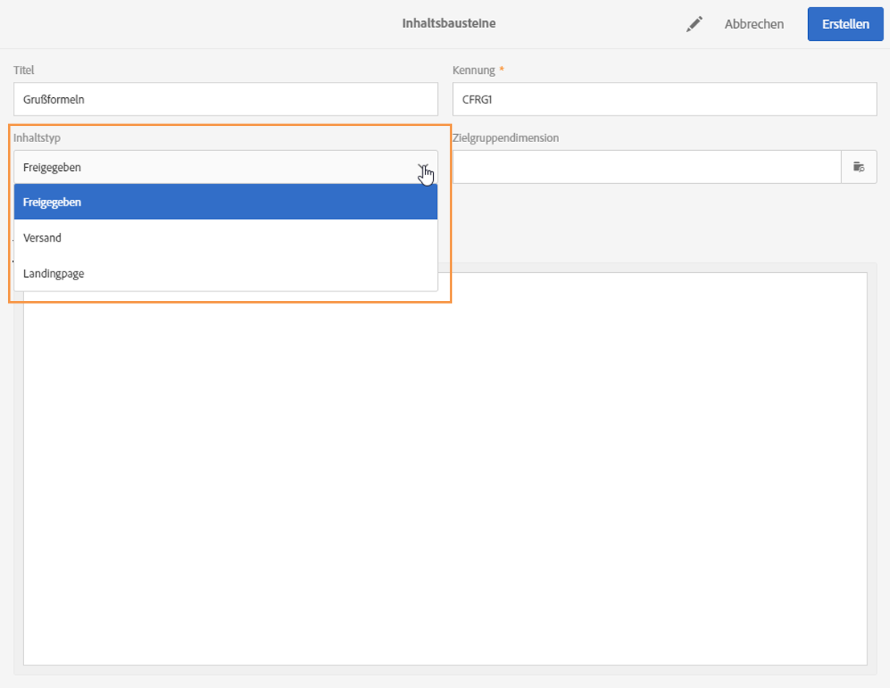

# Inhaltsbausteine{#adding-a-content-block}

Adobe Campaign bietet eine Reihe von vorkonfigurierten Inhaltsbausteinen. Diese Bausteine sind dynamisch und personalisierbar und sie weisen ein spezifisches Rendering auf. Sie ermöglichen beispielsweise das Einfügen einer bestimmten Anrede in Abhängigkeit von den verfügbaren Empfängerinformationen oder auch eines Links zur Mirrorseite.

>[!NOTE]
>
>Auf den unten stehenden Bildern sehen Sie, wie Sie einen Inhaltsbaustein mit [Email Designer](../../designing/using/about-email-content-design.md#about-the-email-designer) einfügen können.

So fügen Sie einen Inhaltsbaustein hinzu:

1. Klicken Sie in einen Textbaustein und wählen Sie dann in der dedizierten Symbolleiste das **[!UICONTROL Personalisierungssymbol]** und danach **[!UICONTROL Inhaltsbaustein einfügen]** aus. Weiterführende Informationen zur Benutzeroberfläche von Email Designer finden Sie [in diesem Abschnitt](../../designing/using/about-email-content-design.md#email-designer-interface).

   

1. Wählen Sie den einzufügenden Inhaltsbaustein aus der Liste aus. Je nach Kontext (E-Mail oder Landingpage) können unterschiedliche Bausteine verfügbar sein.

   

1. Wählen Sie **[!UICONTROL Speichern aus]**.

Der Name des Bausteins erscheint daraufhin im Editor. Er ist gelb unterlegt. Er wird in der Personalisierungsphase automatisch an das Profil angepasst.

Es stehen folgende native Inhaltsbausteine zur Verfügung:

* **[!UICONTROL Basis-URL in den E-Mails (EmailUrlBase)]**: Dieser Inhaltsbaustein kann nur in einem **Versand** verwendet werden.
* **[!UICONTROL URL der Mirrorseite (MirrorPageUrl)]**: Dieser Inhaltsbaustein kann nur in einem **Versand** verwendet werden.
* **[!UICONTROL Link zur Mirrorseite (MirrorPage)]**: Dieser Inhaltsbaustein kann nur in einem **Versand** verwendet werden.
* **[!UICONTROL Grußformeln (Greetings)]**
* **[!UICONTROL Abmelde-Link (UnsubscriptionLink)]**: Dieser Inhaltsbaustein kann nur in einem **Versand** verwendet werden.
* **[!UICONTROL Teilen-Links der sozialen Netzwerke (LandingPageViralLinks)]**: Dieser Inhaltsbaustein kann nur in einer **Landingpage** verwendet werden.
* **[!UICONTROL Name des Standard-Absenders (DefaultSenderName)]**: Dieser Inhaltsbaustein kann nur in einem **Versand** verwendet werden.
* **[!UICONTROL Name der Standard-E-Mail-Adresse für Antworten (DefaultReplyName)]**: Dieser Inhaltsbaustein kann nur in einem **Versand** verwendet werden.
* **[!UICONTROL Standard-E-Mail-Adresse des Absenders (DefaultSenderAddress)]**: Dieser Inhaltsbaustein kann nur in einem **Versand** verwendet werden.
* **[!UICONTROL Standard-E-Mail-Adresse für Fehler (DefaultErrorAddress)]**: Dieser Inhaltsbaustein kann nur in einem **Versand** verwendet werden.
* **[!UICONTROL Standard-E-Mail-Adresse für Antworten (DefaultReplyAddress)]**: Dieser Inhaltsbaustein kann nur in einem **Versand** verwendet werden.
* **[!UICONTROL Markenname (BrandingUsualName)]**
* **[!UICONTROL Link zur Webseite der Marke (BrandingWebSiteLink)]**
* **[!UICONTROL Markenlogo (BrandingLogo)]**
* **[!UICONTROL Benachrichtigungsstil (notificationStyle)]**

## Benutzerdefinierte Inhaltsbausteine erstellen {#creating-custom-content-blocks}

Sie haben die Möglichkeit, weitere Inhaltsbausteine zu erstellen, die in Nachrichten oder Landingpages eingefügt werden können.

Gehen Sie wie folgt vor, um einen Inhaltsbaustein zu erstellen:

1. Greifen Sie über das erweiterte Menü und die Schaltflächen **[!UICONTROL Ressourcen &gt; Inhaltsbausteine]** auf die Liste der Inhaltsbausteine zu.
1. Verwenden Sie die Schaltfläche **[!UICONTROL Erstellen]** oder duplizieren Sie einen bereits existierenden Inhaltsbaustein.

   

1. Geben Sie einen Titel ein.
1. Wählen Sie den **[!UICONTROL Inhaltstyp des Bausteins]**. Dabei stehen drei Optionen zur Verfügung:

   * **[!UICONTROL Freigegeben:]** Der Inhaltsbaustein kann in einem Versand oder einer Landingpage verwendet werden.
   * **[!UICONTROL Versand:]** Der Inhaltsbaustein kann nur in einem Versand verwendet werden.
   * **[!UICONTROL Landingpage:]** Der Inhaltsbaustein kann nur in einer Landingpage verwendet werden.
   

1. Sie können eine **[!UICONTROL Zielgruppendimension]** auswählen. Weiterführende Informationen dazu finden Sie im Abschnitt [Über Zielgruppendimensionen](../../designing/using/adding-a-content-block.md#about-targeting-dimension).

   

1. Wählen Sie gegebenenfalls die Option **[!UICONTROL Formatabhängig]** aus, um zwei verschiedene Bausteine zu definieren: einen für E-Mails im HTML-Format und einen für E-Mails im Textformat. Im unteren Teil des Editors werden in diesem Fall zwei Tabs (HTML und Text) angezeigt, um den jeweiligen Inhalt zu definieren.

   

1. Geben Sie den Inhalt des bzw. der Inhaltsbausteine an und bestätigen Sie die Angaben mithilfe der Schaltfläche **[!UICONTROL Erstellen]**.

Der Inhaltsbaustein kann nun im Inhaltseditor einer Nachricht oder einer Landingpage verwendet werden.

>[!CAUTION]
>
>Achten Sie darauf, dass beim Bearbeiten des Inhalts eines Bausteins keine zusätzlichen Leerzeichen zwischen dem Anfang und dem Ende Ihrer *if*-Anweisungen vorhanden sind. In HTML werden die Leerzeichen auf dem Bildschirm angezeigt und wirken sich daher auf die Darstellung des Inhalts aus.

## Über Zielgruppendimensionen   {#about-targeting-dimension}

Mit der Zielgruppendimension können Sie festlegen, in welchem Nachrichtentyp Sie den Inhaltsbaustein verwenden können. Auf diese Weise wird verhindert, dass in einer Nachricht unpassende Bausteine verwendet werden, die zu Fehlern führen könnten.

Beim Bearbeiten einer Nachricht können Sie nur Inhaltsbausteine mit einer Zielgruppendimension auswählen, die mit der Zielgruppendimension der Nachricht kompatibel ist.

Beispielsweise ist die Zielgruppendimension des Bausteins **[!UICONTROL Abmelde-Link]** **[!UICONTROL Profile]**, da diese Zielgruppendimension Personalisierungsfelder speziell für die Ressource **[!UICONTROL Profile]** enthält. Folglich kann der Baustein **[!UICONTROL Abmelde-Link]** nicht in einer [Ereignis-Transaktionsnachricht](../../channels/using/event-transactional-messages.md) verwendet werden, weil die Zielgruppendimension dieses Nachrichtentyps **[!UICONTROL Echtzeit-Ereignisse]** lautet. Sie können aber den Baustein **Abmelde-Link** in einer [Profil-Transaktionsnachricht](../../channels/using/profile-transactional-messages.md) verwenden, weil die Zielgruppendimension dieses Nachrichtentyps **Profile** lautet. Der Baustein **[!UICONTROL Link zur Mirrorseite]** hat keine Zielgruppendimension, deshalb kann er in jeder beliebigen Nachricht verwendet werden.

Wenn Sie dieses Feld leer lassen, ist der Inhaltsbaustein unabhängig von der Zielgruppendimension mit allen Nachrichten kompatibel. Wenn Sie eine Zielgruppendimension festlegen, ist dieser Baustein nur mit Nachrichten kompatibel, die dieselbe Zielgruppendimension aufweisen.

Lesen Sie diesbezüglich auch den Abschnitt [Zielgruppendimensionen und Ressourcen](../../automating/using/query.md#targeting-dimensions-and-resources).
