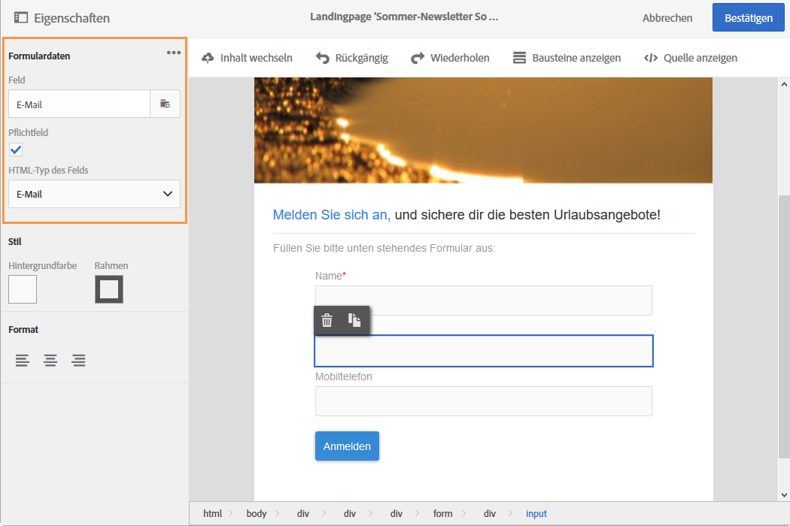

# Landingpage über die Dateneigenschaften ändern{#changing-a-landing-page-form-data-properties}

Inhaltsblöcken wie beispielsweise Eingabefeldern, Radiobuttons oder Checkboxes können Datenbankfelder zugeordnet werden. Markieren Sie hierfür den entsprechenden Block und konfigurieren Sie den Abschnitt **[!UICONTROL Formulardaten]in der Palette.**

* Wählen Sie aus der Dropdown-Liste **Feld** das Datenbankfeld aus, das dem Formularfeld zugeordnet werden soll.
* Wenn die Option **Pflichtfeld** aktiviert ist, kann der Nutzer das Formular nicht absenden, ohne dieses Feld ausgefüllt zu haben. In diesem Fall wird eine Fehlermeldung angezeigt.

