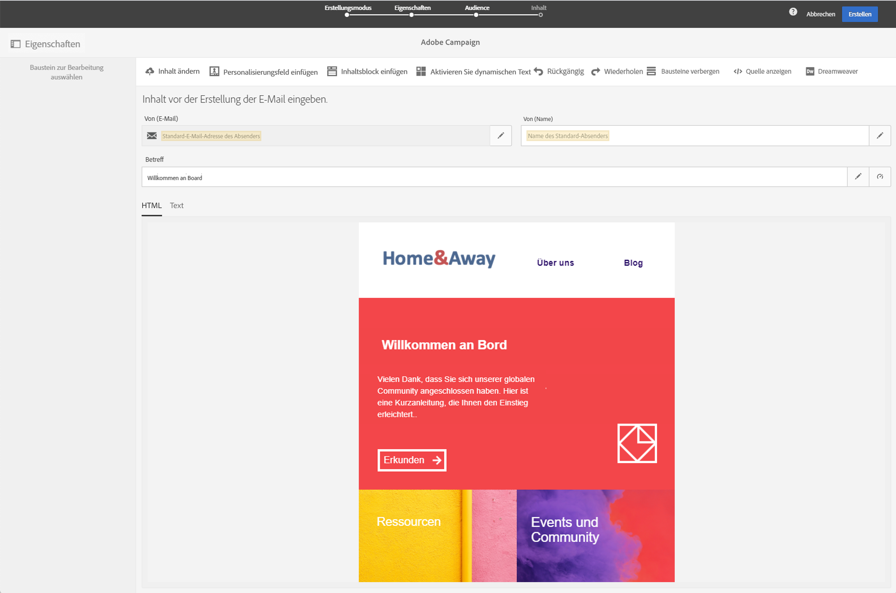
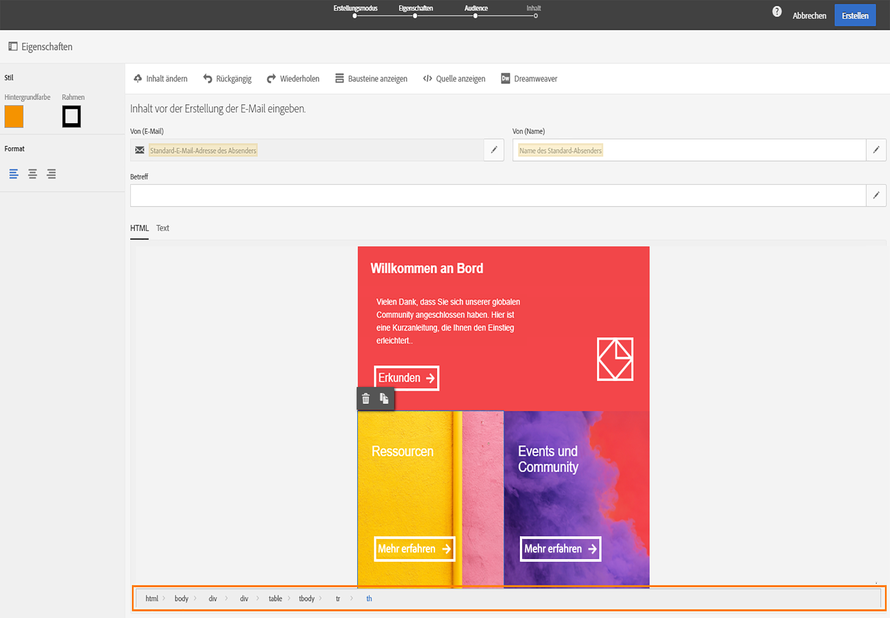
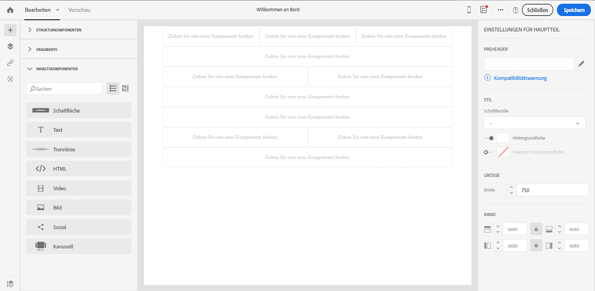
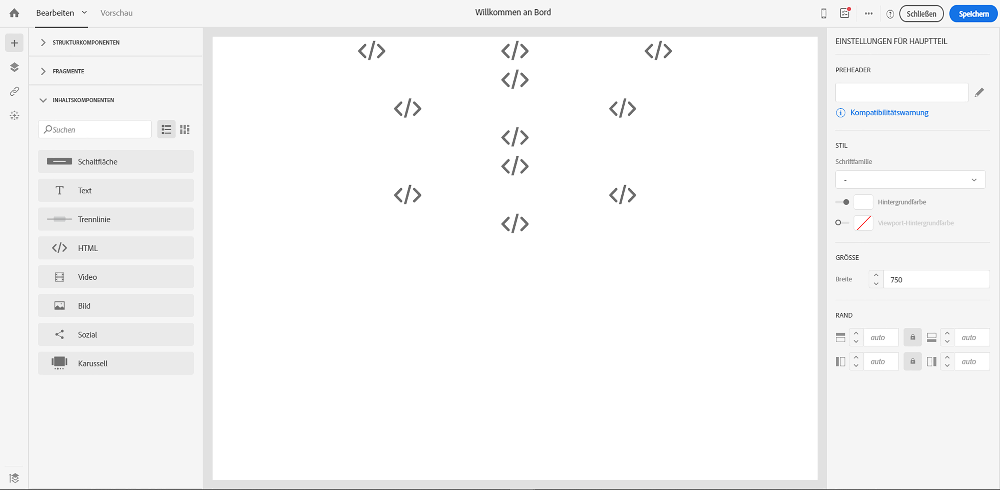
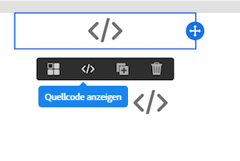
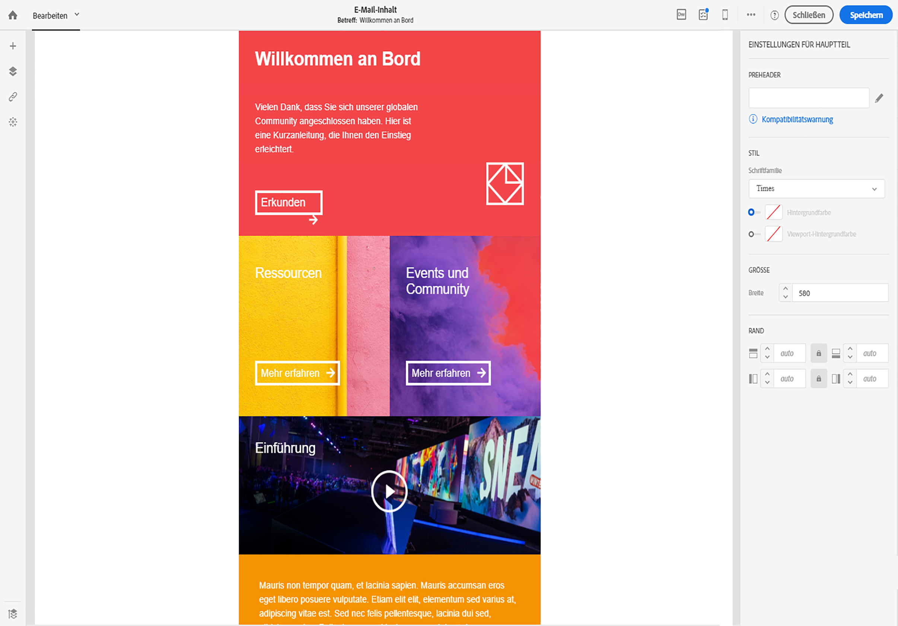

# E-Mails des alten Editors in Email Designer konvertieren {#converting-an-html-content}

Beginnen Sie mit Email Designer zu arbeiten und erstellen Sie wiederverwendbare Vorlagen und Fragmente aus dem im alten Editor generierten E-Mail-HTML-Code.

Dieser Anwendungsfall ermöglicht es Ihnen, eine Email Designer-Vorlage zu erstellen, indem Sie eine HTML-E-Mail verwenden und sie in Email Designer in HTML-Komponenten aufteilen.

>[!NOTE]
>
>Wie im Kompatibilitätsmodus ist eine HTML-Komponente nur beschränkt bearbeitbar: Sie kann nur an Ort und Stelle bearbeitet werden.

>[!IMPORTANT]
>
>Dieser Abschnitt richtet sich an Benutzer mit fortgeschrittenen HTML-Kenntnissen.

## E-Mail-Inhalte vorbereiten

1. Wählen Sie eine HTML-E-Mail aus.
1. Identifizieren Sie Abschnitte, um die HTML-E-Mail zu unterteilen.
1. Schneiden Sie die verschiedenen Blöcke aus Ihrer HTML-E-Mail aus.

## E-Mail-Struktur erstellen

1. Öffnen Sie **[!UICONTROL Email Designer]**, um leeren E-Mail-Inhalt zu erstellen.
1. Legen Sie die Attribute für den Hauptteil fest: Hintergrundfarben, Breite etc. Weiterführende Informationen dazu finden Sie im Abschnitt [E-Mail-Stile bearbeiten](../../designing/using/styles.md).
1. Fügen Sie so viele Strukturkomponenten hinzu, wie Sie Abschnitte haben. Weiterführende Informationen dazu finden Sie im Abschnitt zum [Bearbeiten des E-Mail-Aufbaus](../../designing/using/designing-from-scratch.md#defining-the-email-structure).

## HTML-Inhalt hinzufügen

1. Fügen Sie zu jeder Strukturkomponente eine HTML-Komponente hinzu. Weiterführende Informationen dazu finden Sie im Abschnitt [Fragmente und Inhaltskomponenten hinzufügen](../../designing/using/designing-from-scratch.md#defining-the-email-structure).
1. Fügen Sie Ihren HTML-Code in jede Komponente ein.

## Stil Ihrer E-Mail verwalten {#manage-the-style-of-your-email}

1. Wechseln Sie zur **[!UICONTROL Mobile-Ansicht]**. Weiterführende Informationen hierzu finden Sie in [diesem Abschnitt](../../designing/using/plain-text-html-modes.md#switching-to-mobile-view).

1. Um dieses Problem zu beheben, wechseln Sie zum Quellcode-Modus und kopieren Sie Ihren CSS-Abschnitt in einen neuen CSS-Abschnitt. Beispiel:

   ```
   <style type="text/css">
   a {text-decoration:none;}
   body {min-width:100% !important; margin:0 auto !important; padding:0 !important;}
   img {line-height:100%; text-decoration:none; -ms-interpolation-mode:bicubic;}
   ...
   </style>
   ```

   >[!NOTE]
   >
   >Stellen Sie sicher, dass Sie Ihren Stil nach diesem Abschnitt in einem anderen CSS-Tag hinzufügen.
   >
   >Verändern Sie das von Email Designer erzeugte CSS nicht:
   >
   >* `<style data-name="default" type="text/css">(##)</style>`
   >* `<style data-name="supportIOS10" type="text/css">(##)</style>`
   >* `<style data-name="mediaIOS8" type="text/css">(##)</style>`
   >* `<style data-name="media-default-max-width-500px" type="text/css">(##)</style>`
   >* `<style data-name="media-default--webkit-min-device-pixel-ratio-0" type="text/css">(##)</style>`


1. Kehren Sie zur mobilen Ansicht zurück und prüfen Sie, ob Ihr Inhalt korrekt angezeigt wird, und speichern Sie Ihre Änderungen.

## Anwendungsbeispiel

Hier wird diese im alten Editor erstellte E-Mail in eine **[!UICONTROL Email Designer]**-Vorlage konvertiert.

### Abschnitt Ihrer E-Mail identifizieren

Wir können 11 Abschnitte in dieser E-Mail identifizieren.



Um zu ermitteln, welches Element welcher Abschnitt des HTML-Codes ist, können Sie es auswählen.



Um die HTML-Version der E-Mail anzuzeigen, klicken Sie auf **[!UICONTROL Quelle anzeigen]**.

### E-Mail-Vorlage und deren Struktur erstellen

1. Ziehen Sie **[!UICONTROL Strukturkomponenten]** in den Arbeitsbereich, die das Layout der E-Mail widerspiegeln.

1. Wiederholen Sie diese Schritte so oft wie nötig. Für dieses Beispiel müssen elf Strukturkomponenten erstellt werden.

   

### HTML-Inhaltskomponenten einfügen

1. Fügen Sie in jede **[!UICONTROL Strukturkomponente]** eine **[!UICONTROL HTML-Komponente]** ein.

   

1. Klicken Sie für jeden Abschnitt auf **[!UICONTROL Quellcode anzeigen]**.

   

1. Fügen Sie den HTML-Abschnitt ein.

1. Wählen Sie **[!UICONTROL Speichern]** aus.

Sie können nun das Rendering Ihrer E-Mail überprüfen.



### Stile für die Ansicht auf Mobilgeräten verwalten

1. Fügen Sie CSS-Elemente ein, um sicherzustellen, dass Ihre E-Mail für die Ansicht auf Mobilgeräten geeignet ist.

1. Wechseln Sie zum Quellcode und kopieren Sie Ihren Stilabschnitt in einen neuen Stilabschnitt.

Weitere Informationen finden Sie unter [Stil Ihrer E-Mail verwalten ](#manage-the-style-of-your-email).

Ihre alte E-Mail ist jetzt in Email Designer verfügbar.