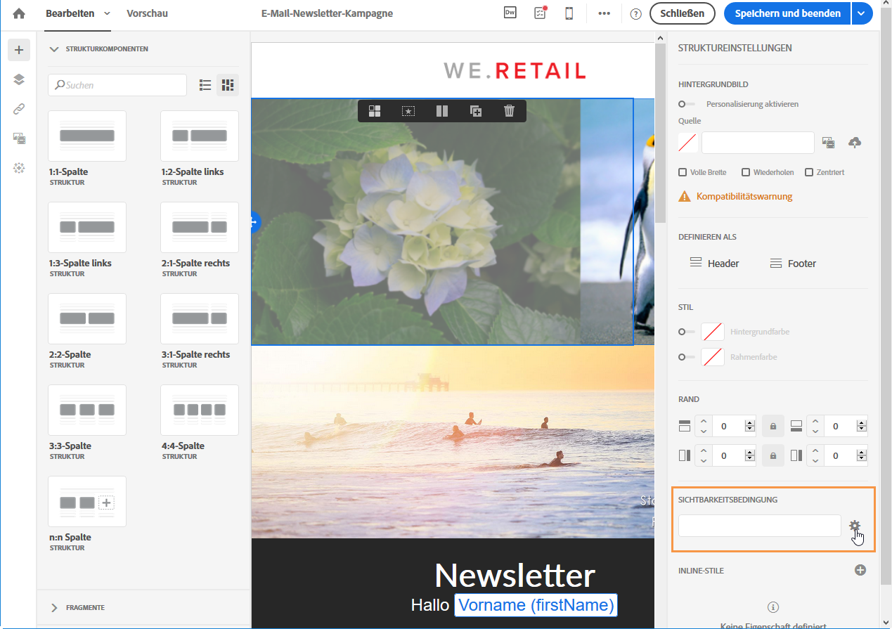

# Sichtbarkeitsbedingung definieren{#defining-a-visibility-condition}

Es besteht die Möglichkeit, für alle Elemente Sichtbarkeitsbedingungen zu definieren. Das entsprechende Element wird nur dann angezeigt, wenn die Bedingung erfüllt ist.

Markieren Sie den gewünschten Block und geben Sie in den Einstellungen im Feld **[!UICONTROL Sichtbarkeitsbedingung]** die zu erfüllende Bedingung an.

Diese Option steht nur für folgende Elemente zur Verfügung: ADDRESS, BLOCKQUOTE, CENTER, DIR, DIV, DL, FIELDSET, FORM, H1, H2, H3, H4, H5, H6, NOSCRIPT, OL, P, PRE, UL, TR, TD.

Weiterführende Informationen zum Ausdruckseditor finden Sie im Abschnitt [Ausdrucksbearbeitung](../../automating/using/editing-queries.md#about-query-editor).

Derartige Bedingungen nehmen die Syntax von XTK-Ausdrücken an (z. B. **context.profile.email !=''** oder **context.profile.status='0'**). Standardmäßig werden alle Felder angezeigt.

>[!NOTE]
>
>Es ist nicht möglich, Bedingungen für Blöcke zu definieren, die Unterelemente mit dynamischen Inhalten enthalten oder die selbst bereits einem dynamischen Inhalt angehören. Unsichtbare dynamische Blöcke, wie beispielsweise Dropdown-Menüs, können nicht bearbeitet werden.

