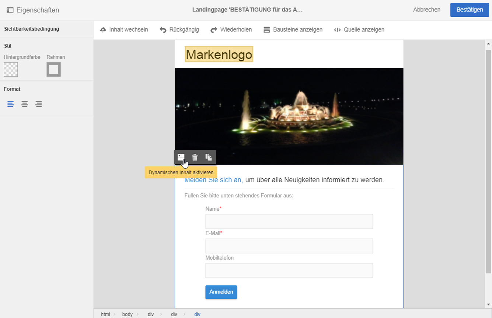
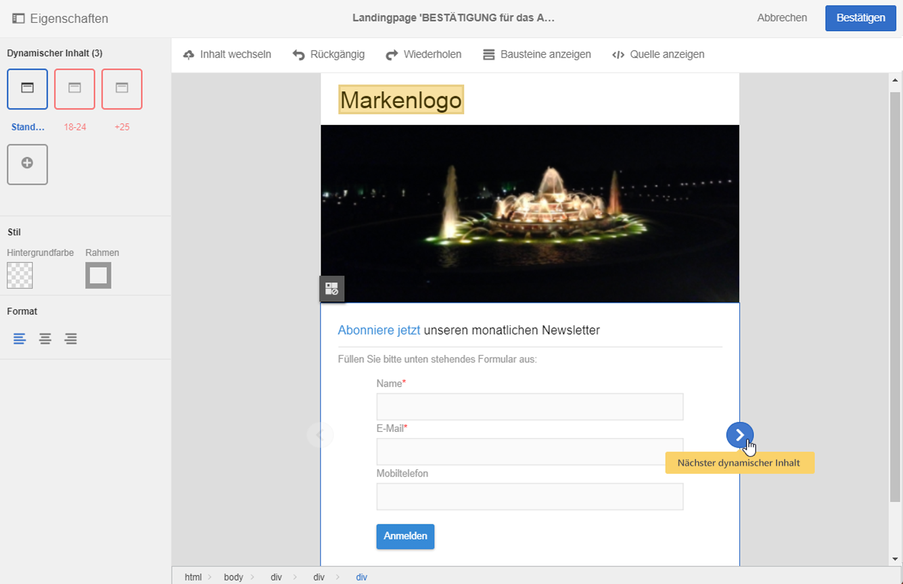
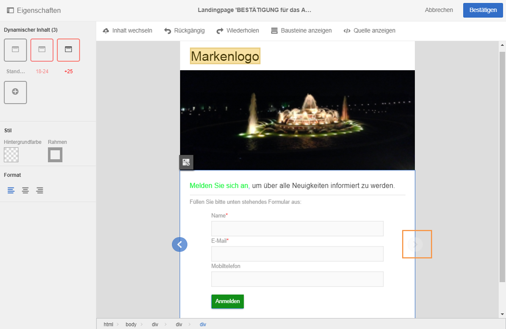
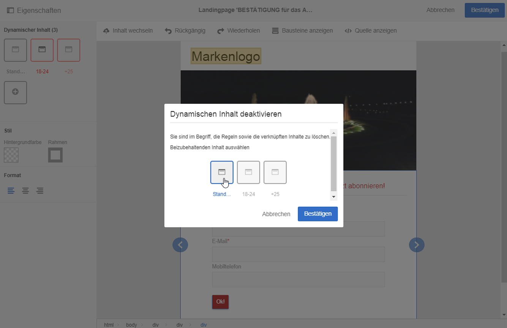
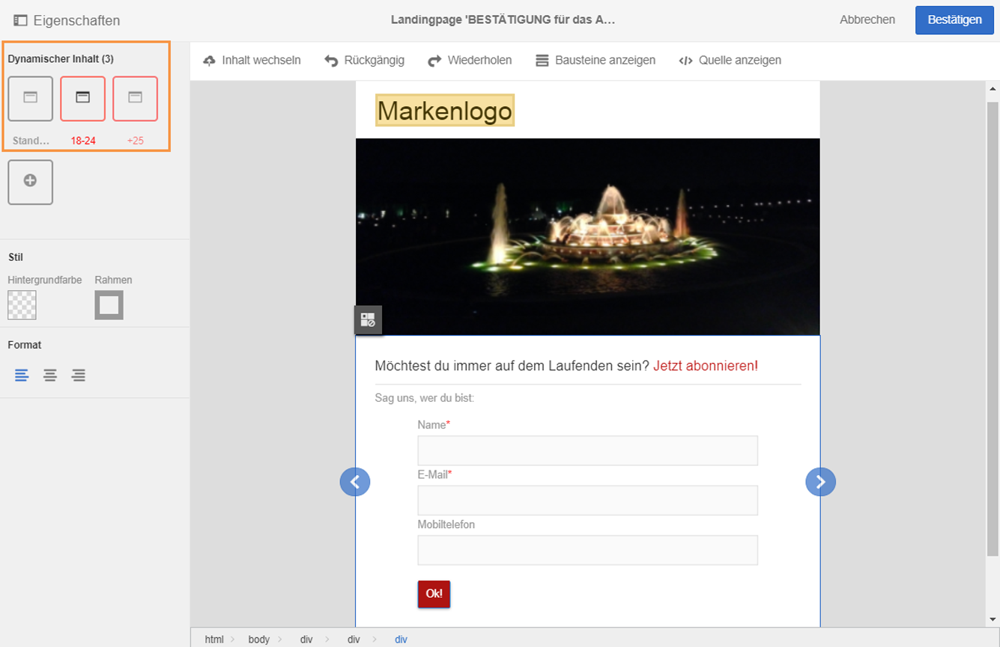

# Dynamische Inhalte in einer Landingpage definieren{#defining-dynamic-content-in-a-landing-page}

Wenn Sie dynamischen Inhalt in einer Landingpage definieren möchten, verwenden Sie den Breadcrumb-Pfad zur Auswahl eines Bausteins oder wählen Sie direkt ein Element aus.

Gewisse Blöcke, beispielsweise Bilder, können nicht direkt ausgewählt werden. Markieren Sie in diesem Fall den übergeordneten Block im Breadcrumb. Dadurch können alle in diesem Block enthaltenen Elemente einschließlich der Bilder bearbeitet werden. Die definierte Bedingung bezieht sich in diesem Fall auf alle Elemente des übergeordneten Blocks.

Die Breadcrumb-Leiste des Inhaltseditors wird im Abschnitt [Verwaltung der Blöcke](../../designing/using/managing-landing-page-structure-and-style.md) beschrieben.

Die nächsten Schritte zur Definition von dynamischem Inhalt für Landingpages erfolgen analog zu denen für E-Mails. Siehe [diesen Abschnitt](../../designing/using/defining-dynamic-content-in-an-email.md).

>[!NOTE]
>
>Die rote Umrandung einer Variante eines Elements zeigt an, dass für diese noch kein Ausdruck definiert wurde.

## Dynamischen Inhalt in einer Landingpage in der Vorschau ansehen  {#previewing-dynamic-content-in-a-landing-page}

Sie haben die Möglichkeit, zwischen den verschiedenen dynamischen Inhalten eines Bausteins zu wechseln. Gehen Sie wie folgt vor:

1. Wählen Sie einen Baustein aus.

   Am linken und rechten Bildrand werden Pfeile angezeigt.

1. Benutzen Sie die Pfeile, um zwischen den verfügbaren Inhalten zu wechseln.

   

   Der Pfeil verblasst, sobald Sie beim letzten (bzw. bei Verwendung des linken Pfeils beim ersten) dynamischen Inhalt angelangt sind.

   

1. Um alle für einen Baustein definierten Bedingungen zu löschen, markieren Sie diesen und klicken Sie erneut auf das Symbol **[!UICONTROL Dynamischen Inhalt deaktivieren]**.
1. Wählen Sie den beizubehaltenden dynamischen Inhalt aus.

   

In der Palette:

* Inhalte, für die ein Ausdruck definiert wurde, sind nicht mehr rot umrandet; sie werden in Grautönen angezeigt.
* Der aktuell ausgewählte Inhalt wird in Blautönen angezeigt.

