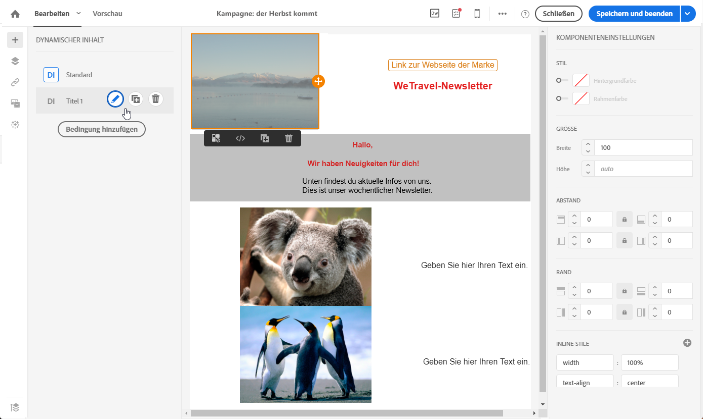

# Dynamische Inhalte in einer E-Mail definieren{#defining-dynamic-content-in-an-email}

Es besteht die Möglichkeit, für eine E-Mail multiple Inhalte zu erstellen, die in Abhängigkeit von mithilfe des Ausdruckseditors definierten Bedingungen den Empfängern dynamisch angezeigt werden. So kann beispielsweise jedem Profil je nach seiner Altersgruppe ein abweichender Inhalt angezeigt werden.

Die Definition dynamischer Inhalte erfolgt anders als die Definition von [Sichtbarkeitsbedingungen](../../designing/using/defining-a-visibility-condition.md).

1. Wählen Sie ein Fragment, eine Komponente oder ein Element aus. Wählen Sie für dieses Beispiel ein Bild aus.
1. Wählen Sie in der dedizierten Symbolleiste das Symbol für **[!UICONTROL dynamischen Inhalt]aus.**

   

   Daraufhin wird in der Palette auf der linken Seite der Bereich **[!UICONTROL Dynamischer Inhalt]angezeigt.**

   

   Standardmäßig enthält dieser Bereich zwei Elemente: die Standardvariante und eine neue Variante.

   >[!NOTE]
   >
   >Für den Inhalt muss stets eine Standardvariante vorhanden sein. Diese kann nicht gelöscht werden.

1. Wählen Sie die Schaltfläche **[!UICONTROL Bearbeiten]aus, um die Anzeigebedingungen für die erste Variante zu definieren.**

   

1. Geben Sie einen Titel ein und wählen Sie die Felder aus, die als Bedingungen spezifiziert werden sollen. Wählen Sie beispielsweise im Knoten **[!UICONTROL Allgemein]** das Feld **Alter]aus.[!UICONTROL **

   

1. Definieren Sie die Filterbedingungen. Beispielsweise könnten Sie Personen zwischen 18 und 25 Jahren einen anderen Inhalt anzeigen lassen.

   

1. Nachdem alle Bedingungen spezifiziert sind, definieren Sie die Reihenfolge, in der diese angewendet werden sollen, und speichern Sie die Änderungen.

   

   Die Inhalte werden in der Reihenfolge ihrer Priorität von oben nach unten in der Palette angezeigt. Weiterführende Informationen zu Prioritäten finden Sie in [diesem Abschnitt](../../designing/using/defining-dynamic-content-in-an-email.md#order-of-priority).

1. Laden Sie ein neues Bild für die soeben definierte Variante hoch.

   

   Den Empfängern zwischen 18 und 25 Jahren wird das neue Bild angezeigt.

   

1. Verwenden Sie die Schaltfläche **[!UICONTROL Bedingung hinzufügen], um einen weiteren Inhalt und die entsprechende Regel hinzuzufügen.**

   

   Beispielsweise könnten Sie Personen zwischen 26 und 35 Jahren ein anderes Bild anzeigen lassen.

1. Gehen Sie für alle anderen Elemente Ihrer E-Mail, die dynamisch angezeigt werden soll, analog vor. Dabei kann es sich um Text, Schaltflächen, Fragmente etc. handeln. Speichern Sie Ihre Änderungen.

>[!CAUTION]
>
>Nach der Vorbereitung der Nachricht und vor ihrem Versand ist die Nachricht mithilfe eines Testversands zu prüfen. Andernfalls werden etwaige Fehler unter Umständen nicht erkannt und die E-Mail nicht versendet.

**Verwandte Themen:**

* [Testversand durchführen](../../sending/using/managing-test-profiles-and-sending-proofs.md#sending-proofs)
* [Ausdrucksbearbeitung](../../automating/using/editing-queries.md#about-query-editor)

## Prioritätsstufe {#order-of-priority}

Bei der Definition eines dynamischen Inhalts im Ausdruckseditor wird folgende Priorität verwendet:

1. Definieren Sie zwei verschiedene dynamische Inhalte mit **zwei verschiedenen Bedingungen**, wie z. B.:

   **Bedingung 1**: Das Geschlecht des Profils ist männlich,

   **Bedingung 2**: Das Profil ist zwischen 20 und 30 Jahre alt.

   

   Gewisse Profile Ihrer Datenbank erfüllen beide Bedingungen, jedes kann jedoch nur eine E-Mail mit einem einzigen dynamischen Inhalt erhalten.

1. Es ist daher notwendig, die Prioritätsstufen der dynamischen Inhalte festzulegen. Ein Profil, das die Bedingung mit Prioritätsstufe **1** erfüllt, wird nur den dynamischen Inhalt erhalten, der dieser Bedingung entspricht, auch wenn es gleichzeitig die Bedingungen mit Prioritätsstufe **2** oder **3** erfüllt.

   

Pro dynamischer Inhalt lässt sich lediglich eine Prioritätsstufe festlegen.
