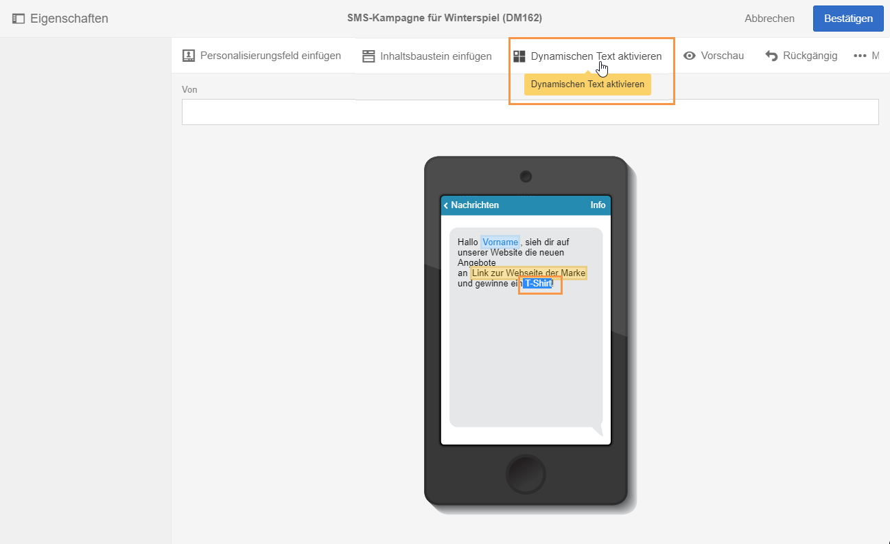
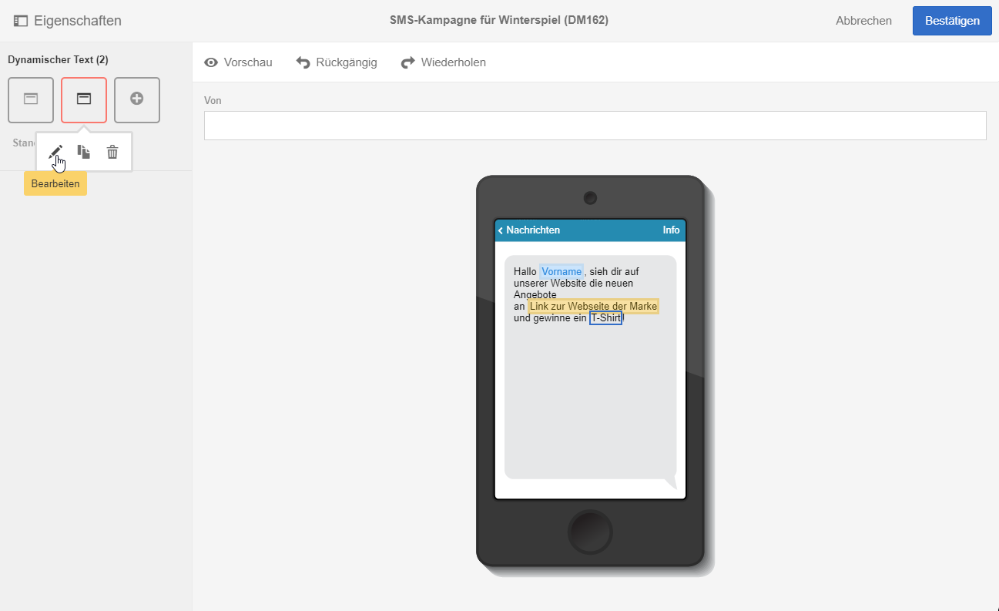
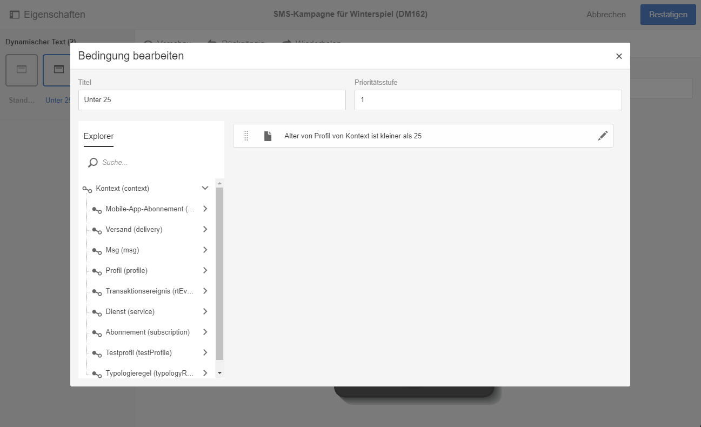
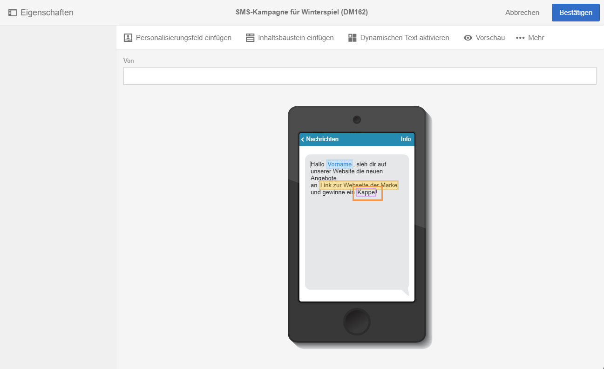

# Dynamische Texte definieren{#defining-dynamic-text}

Die Definition des dynamischen Texts erfolgt analog zur Definition des dynamischen Inhalts. Lesen Sie diesbezüglich auch den Abschnitt [Dynamische Inhalte definieren](../../designing/using/defining-dynamic-content-in-an-email.md).

>[!NOTE]
>
>Für SMS und Push-Benachrichtigungen können Sie nur dynamischen Text definieren. Für Landingpages können Sie sowohl dynamische Inhalte als auch dynamischen Text definieren. Wenn Sie dynamischen Text mit [Email Designer](../../designing/using/about-email-content-design.md#about-the-email-designer) definieren möchten, lesen Sie den Abschnitt [Dynamische Inhalte in einer E-Mail definieren](../../designing/using/defining-dynamic-content-in-an-email.md).

Im folgenden Beispiel wird beschrieben, wie dynamischer Text in einer SMS definiert wird.

1. Markieren Sie innerhalb des Textkörpers Ihrer Nachricht oder Ihrer Landingpage einen Abschnitt.
1. Verwenden Sie die Schaltfläche **[!UICONTROL Dynamischen Text aktivieren]**.

   

   Daraufhin erscheint in der Palette die Option **[!UICONTROL Dynamischer Text.]** Die Konfiguration des dynamischen Texts entspricht der des dynamischen Inhalts.

1. Wählen Sie eine Variante aus.

   

1. Definieren Sie eine Bedingung für diese Variante.

   

Wenn für zumindest eine Variante eine Bedingung definiert wurde, wird um den dynamischen Text ein violetter Rahmen angezeigt.

