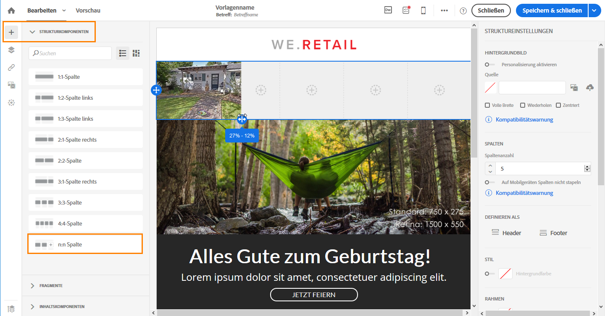
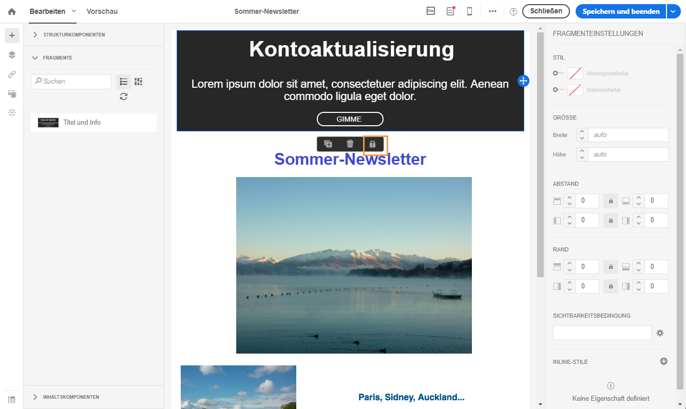
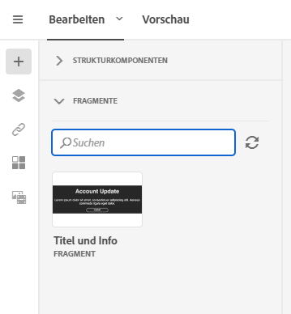
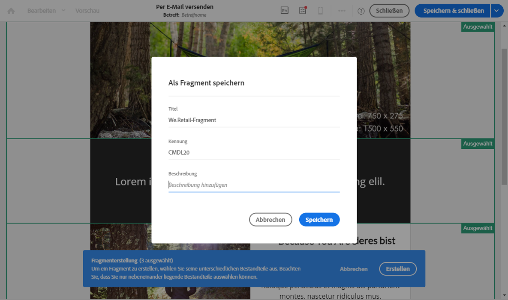
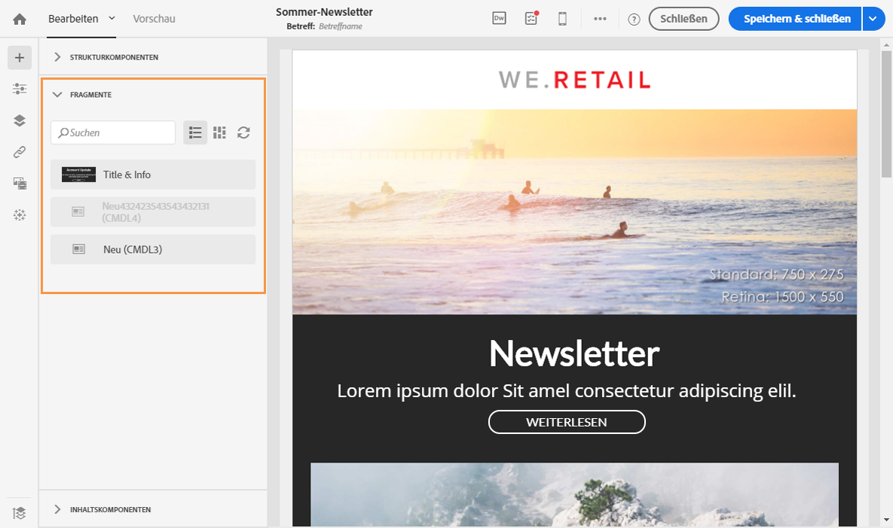

# E-Mail-Struktur definieren{#defining-the-email-structure}

## E-Mail-Struktur bearbeiten {#editing-the-email-structure}

Email Designer bietet eine einfache Möglichkeit, die Struktur Ihrer E-Mail zu bestimmen. Durch das Hinzufügen und Verschieben von strukturellen Elementen durch einfaches Drag &amp; Drop können Sie Ihrer E-Mail in Sekundenschnelle die gewünschte Form verleihen.

Um die Struktur einer E-Mail zu bearbeiten, gehen Sie wie folgt vor:

1. Öffnen Sie vorhandenen Inhalt oder erstellen Sie neuen.
1. Öffnen Sie die **[!UICONTROL Strukturkomponenten]** durch Auswahl des Zeichens **+** auf der linken Seite.

   

1. Wählen Sie die für Ihre E-Mail benötigten Strukturkomponenten mit Drag &amp; Drop aus.

   

   Eine blaue Linie kennzeichnet die Stelle, an der die Strukturkomponente platziert wird, wenn Sie sie loslassen. Sie können die Strukturkomponente oberhalb, zwischen oder unterhalb einer anderen Komponente platzieren, nicht jedoch in einer Komponente.

   >[!NOTE]
   >
   >Sobald die Komponenten in der E-Mail platziert sind, können sie nicht mehr verschoben oder entfernt werden, außer es befindet sich bereits eine Inhaltskomponente oder ein Fragment darin.

1. Mehrere Strukturkomponenten bestehend aus einer oder mehreren Spalten sind verfügbar.

   Wählen Sie die Komponente **[!UICONTROL n:n Spalte]** aus, um die Anzahl der Spalten zu definieren (3 bis 10). Sie können auch die Breite jeder Spalte ändern, indem Sie den Pfeil am unteren Rand einer jeden Spalte verschieben.

   

   >[!NOTE]
   >
   >Die Größe einer Spalte muss immer mindestens 10 % der Gesamtbreite der Strukturkomponente betragen. Sie können nur leere Spalten entfernen.

Sobald die Struktur definiert ist, können Sie Inhaltsfragmente und Komponenten zu Ihrer E-Mail hinzufügen.

## Fragmente und Inhaltskomponenten hinzufügen  {#adding-fragments-and-content-components}

Mit Email Designer können Sie nach dem Hinzufügen von Strukturkomponenten zu Ihrer E-Mail deren Inhalt definieren. Zu diesem Zweck müssen Sie in jede Strukturkomponente Elemente einfügen.

Sie können dazu zwei Kategorien von Inhaltselementen verwenden: **Fragmente** und **Inhaltskomponenten**.

### Über Fragmente  {#about-fragments}

Ein Fragment ist eine wiederverwendbare Komponente, die in einer oder mehreren E-Mails referenziert werden kann.

So nutzen Sie Fragmente in Email Designer optimal:

* Eigene Fragmente erstellen: Siehe [Inhaltsfragment erstellen](../../designing/using/defining-the-email-structure.md#creating-a-content-fragment) und [Inhalt als Fragment speichern](../../designing/using/defining-the-email-structure.md#saving-content-as-a-fragment).
* Diese können beliebig oft in E-Mails verwendet werden. Siehe [Elemente in eine E-Mail einfügen](../../designing/using/defining-the-email-structure.md#inserting-elements-into-an-email).
* Wenn Sie ein Fragment bearbeiten, werden die Änderungen synchronisiert und automatisch in alle E-Mails eingefügt, die dieses Fragment enthalten (vorausgesetzt die E-Mails wurden noch nicht vorbereitet oder gesendet).

Wenn Fragmente zu einer E-Mail hinzugefügt werden, sind sie standardmäßig gesperrt. Wenn Sie ein Fragment für eine bestimmte E-Mail ändern möchten, können Sie die Synchronisation mit dem ursprünglichen Fragment aufheben, indem Sie es in der E-Mail, in der es verwendet wird, entsperren. Danach werden die Änderungen nicht mehr synchronisiert.

Um ein Fragment in einer E-Mail zu entsperren, wählen Sie zuerst das Fragment aus und danach das Sperrsymbol in der dedizierten Symbolleiste.

Dieses Fragment wird dann zu einer unabhängigen Komponente, die nicht mehr mit dem ursprünglichen Fragment verknüpft ist. Es kann dann wie jede andere Inhaltskomponente bearbeitet werden. Siehe [Über Inhaltskomponenten](../../designing/using/defining-the-email-structure.md#about-content-components).

### Über Inhaltskomponenten  {#about-content-components}

Inhaltskomponenten sind leere Komponenten, die nach dem Einfügen in eine E-Mail bearbeitet werden können.

Sie können in einer Strukturkomponente beliebig viele Inhaltskomponenten hinzufügen. Sie können sie auch innerhalb einer Strukturkomponente oder in eine andere Strukturkomponente verschieben.

Dies ist die Liste verfügbarer Komponenten in Email Designer:

* **[!UICONTROL Schaltfläche]**

   Wenn Sie mehrere Schaltflächen benötigen, müssen Sie nicht jede einzelne neu erstellen, sondern können die Komponente **[!UICONTROL Schaltfläche]** in der dedizierten Symbolleiste duplizieren.

   Sie können auch Schaltflächen in Fragmenten speichern, die nochmals verwendet werden können. Weiterführende Informationen dazu finden Sie in den Abschnitten [Inhaltsfragment erstellen](../../designing/using/defining-the-email-structure.md#creating-a-content-fragment) und [Inhalt als Fragment speichern](../../designing/using/defining-the-email-structure.md#saving-content-as-a-fragment).

* **[!UICONTROL Karussell]**

   Weiterführende Informationen dazu finden Sie im Abschnitt zur [Karussellkomponente](../../designing/using/defining-the-email-structure.md#using-the-carousel-component).

* **[!UICONTROL Divisor]**
* **[!UICONTROL HTML]**

   Verwenden Sie diese Komponente, um die verschiedenen Teile Ihres vorhandenen HTML-Codes zu kopieren. Damit können Sie kostenfrei modulare HTML-Komponenten erstellen.

   >[!NOTE]
   >
   >Eine kostenfreie HTML-Komponente ist beschränkt bearbeitbar. Wenn nicht alle Stile inline vorhanden sind, fügen Sie die entsprechende CSS-Datei im  **head**-Abschnitt des HTML-Codes ein. Andernfalls ist die E-Mail nicht responsiv. Verwenden Sie die Schaltfläche **[!UICONTROL Vorschau]**, um Ihren Inhalt zu testen (siehe [Vorschau von Nachrichten ansehen](../../sending/using/previewing-messages.md)).

* **[!UICONTROL Bild]**
* **[!UICONTROL Sozial]**
* **[!UICONTROL Text]**

#### Karussellkomponente verwenden {#using-the-carousel-component}

1. Ziehen Sie die Komponente **[!UICONTROL Karussell]** in eine Strukturkomponente.
1. Durchsuchen Sie Ihre Festplatte nach Bildern.

   

1. Wählen Sie in den **[!UICONTROL Einstellungen]** die Anzahl der gewünschten Miniaturansichten für das Karussell aus.
1. Wählen Sie ein Fallback-Bild von Ihrer Festplatte aus.

   

   Die Karussell-Komponente ist nicht mit allen E-Mail-Programmen kompatibel. Wenn das Karussell vom E-Mail-Programm nicht unterstützt wird, laden Sie ein Fallback-Bild hoch.

   >[!NOTE]
   >
   >Die Karussell-Komponente ist mit den folgenden E-Mail-Plattformen kompatibel: Apple Mail 7, Apple Mail 8, Outlook 2011 for Mac, Outlook 2016 for Mac, Mozilla Thunderbird, iPad und iPad mini iOS, iPhone iOS, Android, AOL (Chrome, Firefox und Safari).

1. Wählen Sie **[!UICONTROL Fallback-Ansicht]** aus, um das Fallback-Bild in Email Designer zu zeigen.

### Elemente in eine E-Mail einfügen {#inserting-elements-into-an-email}

Um den Inhalt Ihrer E-Mail zu definieren, können Sie Inhaltselemente in die zuvor platzierten Strukturkomponenten einfügen. Siehe auch den Abschnitt [E-Mail-Struktur bearbeiten](../../designing/using/defining-the-email-structure.md#editing-the-email-structure)

1. Öffnen Sie die Inhaltselemente durch Auswahl des Zeichens **+** auf der linken Seite. Wählen Sie [Fragmente](../../designing/using/defining-the-email-structure.md#about-fragments) oder [Inhaltskomponenten](../../designing/using/defining-the-email-structure.md#about-content-components) aus.
1. Wenn Sie bereits den Titel oder einen Teil des Titels des Fragments kennen, das Sie hinzufügen möchten, können Sie danach suchen.

   

1. Ziehen Sie ein Fragment oder eine Inhaltskomponente aus der Palette und legen Sie sie in der Strukturkomponente der E-Mail ab.

   

   Nachdem ein Element zur E-Mail hinzugefügt wurde, kann es innerhalb derselben Strukturkomponente oder in eine andere Strukturkomponente in der E-Mail verschoben werden.

   

1. Bearbeiten Sie das Element entsprechend den Anforderungen der jeweiligen E-Mail. Sie können Text, Links, Bilder etc. hinzufügen.

   >[!NOTE]
   >
   >Fragmente sind beim Hinzufügen zu einer E-Mail standardmäßig gesperrt. Wenn Sie ein Fragment für eine E-Mail verändern möchten, können Sie die Synchronisation mit dem ursprünglichen Fragment unterbrechen oder die gewünschten Änderungen direkt im Fragment vornehmen. Siehe [Über Fragmente](../../designing/using/defining-the-email-structure.md#about-fragments).

1. Wiederholen Sie diese Schritte für alle Elemente, die Sie zur E-Mail hinzufügen möchten.
1. Speichern Sie Ihre E-Mail.

Nachdem Inhalt in die E-Mail-Struktur geladen wurde, können Sie den Stil jedes Inhaltselements ändern. Siehe auch den Abschnitt zum [Bearbeiten von Elementen](../../designing/using/editing-email-styles.md#editing-an-element).

>[!NOTE]
>
>Änderungen eines Fragments werden automatisch mit den E-Mails synchronisiert, in denen das Fragment verwendet wird. Weiterführende Informationen dazu finden Sie im Abschnitt [Über Fragmente](../../designing/using/defining-the-email-structure.md#about-fragments).

### Inhaltsfragment erstellen  {#creating-a-content-fragment}

Sie können Ihre eigenen Inhaltsfragmente erstellen und nach Bedarf in einer oder in mehreren E-Mails verwenden.

1. Gehen Sie zu **[!UICONTROL Ressourcen]** &gt; **[!UICONTROL Inhaltsvorlagen &amp; Fragmente]** und wählen Sie **[!UICONTROL Erstellen]** aus.
1. Wählen Sie den Titel der E-Mail aus, um auf den Tab **[!UICONTROL Eigenschaften]** in Email Designer zuzugreifen.
1. Geben Sie einen charakteristischen Titel an und wählen Sie die folgenden Parameter aus, damit Sie das Fragment später zur Verwendung in neuen E-Mails wiederfinden.

   * Da Fragmente nur mit E-Mails kompatibel sind, wählen Sie aus der Dropdown-Liste **[!UICONTROL Inhaltstyp**] die Option **[!UICONTROL Versand]** aus.
   * Wählen Sie aus der Dropdown-Liste **[!UICONTROL HTML-Typ]** die Option **[!UICONTROL Fragment]** aus, um diesen Inhalt als Fragment in Ihren E-Mails verwenden zu können.
   

1. Bei Bedarf können Sie ein Bild als Miniaturansicht für dieses Fragment festlegen. Wählen Sie es in den Vorlageneigenschaften im Tab **[!UICONTROL Miniaturansicht]** l aus.

   

   Diese Miniaturansicht wird neben dem Titel des Fragments angezeigt, wenn eine E-Mail bearbeitet wird.

1. Speichern Sie Ihre Änderungen, um zum Hauptarbeitsbereich zurückzukehren.
1. Fügen Sie eine Strukturkomponente und eine Inhaltskomponente hinzu, die Sie nach Bedarf anpassen können.
1. Speichern Sie das Fragment nach der Bearbeitung.

Das Fragment kann jetzt in jeder mit Email Designer erstellten E-Mail verwendet werden. Es wird in der Palette im Bereich **[!UICONTROL Fragmente]** angezeigt.

>[!NOTE]
>
>Sie können nur dann Personalisierungsfelder in einem Fragment einfügen, wenn es in einer E-Mail verwendet wird. Zu diesem Zweck muss dieses Fragment entsperrt werden. Siehe [Über Fragmente](../../designing/using/defining-the-email-structure.md#about-fragments).

### Inhalt als ein Fragment speichern  {#saving-content-as-a-fragment}

Wenn Sie eine E-Email mit dem E-Mail-Designer bearbeiten, können Sie einen Teil dieser E-Email direkt als Fragment speichern.

>[!CAUTION]
>
>Sie können eine Struktur, die Personalisierungsfelder, dynamische Inhalte oder ein anderes Fragment enthält, nicht als Fragment speichern.

1. Wenn Sie eine E-Email im E-Mail-Designer bearbeiten, wählen **[!UICONTROL Sie in der Hauptsymbolleiste "Als Fragment]** speichern" .

   

1. Wählen Sie aus der Arbeitsfläche die Strukturen aus, die das Fragment zusammenstellen.

   

   >[!NOTE]
   >
   >Sie können nur Strukturen auswählen, die einander nebeneinander liegen.

1. Wählen Sie **[!UICONTROL Erstellen]** aus.

1. Fügen Sie bei Bedarf eine Beschriftung und eine Beschreibung hinzu und klicken Sie dann auf **[!UICONTROL Speichern]**.

   

1. Um das soeben erstellte Fragment zu finden, gehen Sie zu **[!UICONTROL Ressourcen]** &gt; **[!UICONTROL Inhaltsvorlagen und Fragmente]**.

   

1. Um Ihr neues Fragment zu verwenden, öffnen Sie alle E-Mail-Inhalte und wählen Sie es aus der Liste der Fragmente aus.

<!--You need to copy-paste the HTML corresponding to the section that you want to save into a new fragment.

>[!NOTE]
>
>To do this, you need to be familiar with HTML code.

To save as a fragment some email content that you created, follow the steps below.

1. When editing an email in the Email Designer, select **[!UICONTROL Edit]** > **[!UICONTROL HTML]** to open the HTML version of that email.
1. Select and copy the HTML corresponding to the part that you want to save.
1. Go to **[!UICONTROL Resources]** > **[!UICONTROL Content templates & fragments]** and click **[!UICONTROL Create]**.
1. Click the email label to access the **[!UICONTROL Properties]** tab of the Email Designer and select **[!UICONTROL Fragment]** from the **[!UICONTROL HTML type]** drop-down list.
1. Select **[!UICONTROL Edit]** > **[!UICONTROL HTML]** to open the HTML version of the fragment.
1. Paste the HTML that you copied where appropriate.
1. Switch back to the **[!UICONTROL Edit]** view to check the result and save the new fragment.-->

