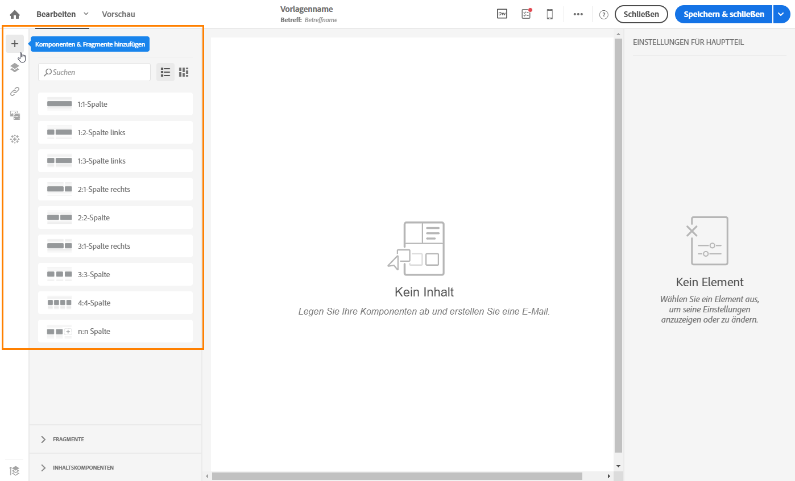
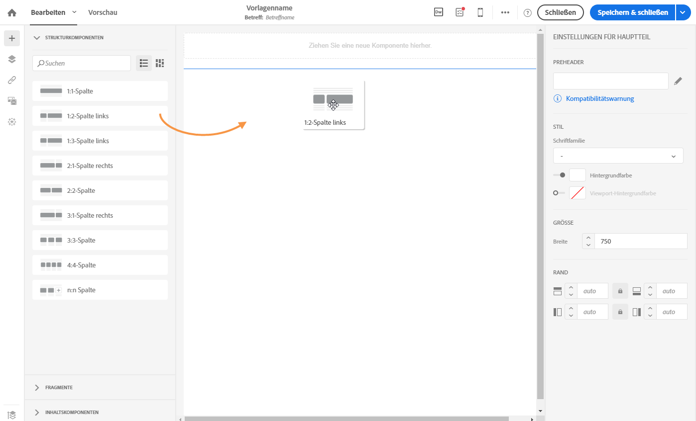
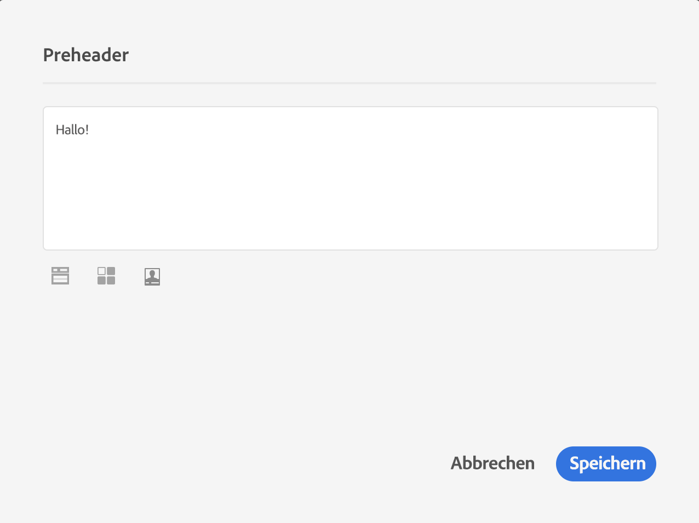
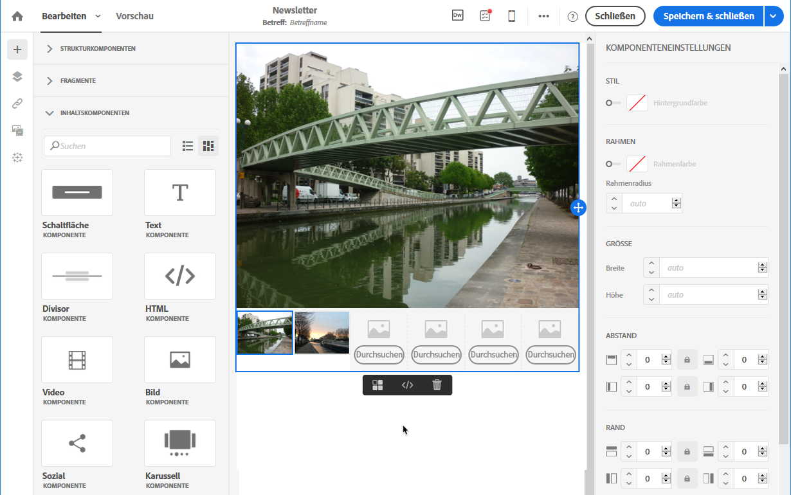
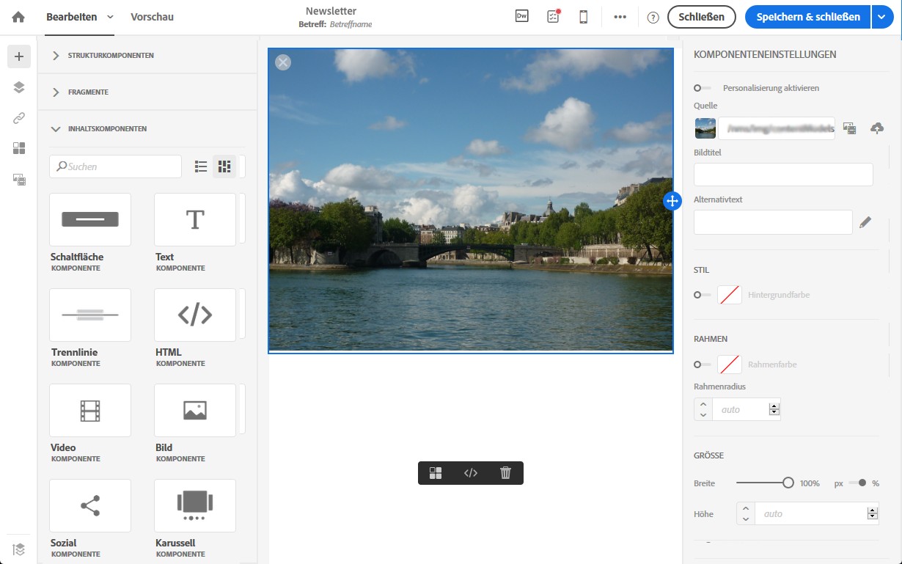

# Erstellen neuer E-Mails {#designing-an-email-content-from-scratch}

Erfahren Sie, wie Sie die Bearbeitung Ihrer E-Mail-Inhalte meistern. In Email Designer können Sie E-Mails und Vorlagen mit oder ohne eigene vordefinierte Inhalte erstellen.

Dies sind die wichtigsten Schritte zum Erstellen und Gestalten eines neuen E-Mail-Inhalts mithilfe von Email Designer:

1. Erstellen Sie eine E-Mail und öffnen Sie ihren Inhalt.
1. Fügen Sie Strukturkomponenten hinzu, um der E-Mail die gewünschte Form zu geben. Siehe auch den Abschnitt [E-Mail-Struktur bearbeiten](#defining-the-email-structure)
1. Fügen Sie Inhaltskomponenten und Fragmente in die Strukturkomponenten ein. Siehe auch den Abschnitt [Fragmente und Inhaltskomponenten hinzufügen](#defining-the-email-structure)
1. Fügen Sie Bilder hinzu und bearbeiten Sie den Text der E-Mail. Siehe [Bilder einfügen](../../designing/using/images.md#inserting-images).
1. Personalisieren Sie Ihre E-Mail durch Hinzufügen von Personalisierungsfeldern, Links etc. Siehe [Personalisierungsfelder einfügen](../../designing/using/personalization.md#inserting-a-personalization-field), [Link einfügen](../../designing/using/links.md#inserting-a-link) und [Dynamische Inhalte in einer E-Mail definieren](../../designing/using/personalization.md#defining-dynamic-content-in-an-email).
1. Definieren Sie die Betreffzeile Ihrer E-Mail. Siehe [Betreffzeile einer E-Mail personalisieren](../../designing/using/subject-line.md#defining-the-subject-line-of-an-email).
1. Sehen Sie sich die E-Mail in der Vorschau an.
1. Speichern Sie den Inhalt und fahren Sie mit der Nachricht fort, nachdem Sie eine Audience definiert und den Versandzeitpunkt festgelegt haben.

Sehen Sie sich dazu auch dieses [Einführungsvideo](https://video.tv.adobe.com/v/22771/?autoplay=true&hidetitle=true) an.

>[!NOTE]
>
>Wenn Sie keinen völlig neuen E-Mail-Inhalt erstellen möchten, können Sie auch die nativen Inhaltsvorlagen verwenden. Weiterführende Informationen dazu finden Sie im Abschnitt [Inhaltsvorlagen](../../designing/using/using-reusable-content.md#content-templates).

## Definieren der E-Mail-Struktur {#defining-the-email-structure}

>[!CONTEXTUALHELP]
>id="ac_structure_components"
>title="Über Strukturkomponenten"
>abstract="Strukturkomponenten definieren das Layout der E-Mail."

>[!CONTEXTUALHELP]
>id="ac_edition_columns"
>title="Definieren von E-Mail-Spalten"
>abstract="Mit Email Designer können Sie das Layout Ihrer E-Mail einfach definieren, indem Sie die Spaltenstruktur definieren."

E-Mail-Designer bietet eine einfache Möglichkeit, die Struktur Ihrer E-Mail zu bestimmen. Durch das Hinzufügen und Verschieben von strukturellen Elementen durch einfaches Drag-and-Drop können Sie Ihrer E-Mail in Sekundenschnelle die gewünschte Form verleihen.

Um die Struktur einer E-Mail zu bearbeiten, gehen Sie wie folgt vor:

1. Öffnen Sie vorhandenen Inhalt oder erstellen Sie neuen.
1. Öffnen Sie die **[!UICONTROL Strukturkomponenten]** durch Auswahl des Zeichens **+** auf der linken Seite.

   

1. Wählen Sie die für Ihre E-Mail benötigten Strukturkomponenten mit Drag &amp; Drop aus.

   

   Eine blaue Linie kennzeichnet die Stelle, an der die Strukturkomponente platziert wird, wenn Sie sie loslassen. Sie können die Strukturkomponente oberhalb, zwischen oder unterhalb einer anderen Komponente platzieren, nicht jedoch in einer Komponente.

   >[!NOTE]
   >
   >Beachten Sie, dass das Stapeln von Spalten nicht mit allen E-Mail-Programmen kompatibel ist. Wenn dies nicht unterstützt wird, werden Spalten nicht gestapelt.
   >
   >Sobald die Komponenten in der E-Mail platziert sind, können sie nicht mehr verschoben oder entfernt werden, außer es befindet sich bereits eine Inhaltskomponente oder ein Fragment darin.

1. Mehrere Strukturkomponenten bestehend aus einer oder mehreren Spalten sind verfügbar.

   Wählen Sie die Komponente **[!UICONTROL n:n Spalte]** aus, um die Anzahl der Spalten zu definieren (3 bis 10). Sie können auch die Breite jeder Spalte ändern, indem Sie den Pfeil am unteren Rand einer jeden Spalte verschieben.

   

   >[!NOTE]
   >
   >Die Größe einer Spalte muss immer mindestens 10 % der Gesamtbreite der Strukturkomponente betragen. Sie können nur leere Spalten entfernen.

Sobald die Struktur definiert ist, können Sie Inhaltsfragmente und Komponenten zu Ihrer E-Mail hinzufügen.

## Verwenden eines Preheaders {#preheader}

>[!CONTEXTUALHELP]
>id="ac_edition_preheader"
>title="Verwenden eines Preheaders"
>abstract="Mit dem Preheader können Sie einen kurzen Zusammenfassungstext konfigurieren, der eine höhere Öffnungsrate für Ihre E-Mail bietet."

Ein Preheader ist ein kurzer Zusammenfassungstext, der beim Anzeigen einer E-Mail aus Ihrem Posteingang der Betreffzeile folgt. Der Preheader liefert eine höhere Öffnungsrate.

Aktivieren Sie das Bearbeitungsfeld **[!UICONTROL Preheader]** und füllen Sie den Inhalt aus.

Sie können einen **[!UICONTROL Inhaltsbaustein]**, einen **[!UICONTROL dynamischen Inhalt]** oder ein **[!UICONTROL Personalisierungsfeld]** in den Preheader-Inhalt einfügen.

>[!NOTE]
>
>Preheader sind nicht mit allen E-Mail-Programmen kompatibel. Wenn Preheader nicht unterstützt werden, werden sie nicht angezeigt.

## Verwenden von Inhaltskomponenten {#about-content-components}

>[!CONTEXTUALHELP]
>id="ac_content_components"
>title="Über Inhaltskomponenten"
>abstract="Inhaltskomponenten sind leere Platzhalter für Inhalte, die Sie bearbeiten können, um eine E-Mail zu erstellen."

Inhaltskomponenten sind leere Komponenten, die nach dem Einfügen in eine E-Mail bearbeitet werden können.

Sie können in einer Strukturkomponente beliebig viele Inhaltskomponenten hinzufügen. Sie können sie auch innerhalb einer Strukturkomponente oder in eine andere Strukturkomponente verschieben.

Dies ist die Liste verfügbarer Komponenten in Email Designer:

### **[!UICONTROL Schaltfläche]**

Wenn Sie mehrere Schaltflächen benötigen, müssen Sie nicht jede einzelne neu erstellen, sondern können die Komponente **[!UICONTROL Schaltfläche]** in der kontextuellen Symbolleiste duplizieren.

Sie können auch Schaltflächen in Fragmenten speichern, die nochmals verwendet werden können. Weiterführende Informationen dazu finden Sie in den Abschnitten [Inhaltsfragment erstellen](../../designing/using/using-reusable-content.md#creating-a-content-fragment) und [Inhalt als Fragment speichern](../../designing/using/using-reusable-content.md#saving-content-as-a-fragment).

Wählen Sie **[!UICONTROL Fallback-Ansicht]** aus, um das Fallback-Bild in Email Designer zu zeigen.

### **[!UICONTROL Text]**

Verwenden Sie diese Komponente, um Text in Ihre E-Mail einzufügen. Sie können die Farbe, den Stil und die Größe des Textes in den **[!UICONTROL Komponenteneinstellungen]** anpassen.

### **[!UICONTROL Trennlinie]**

Verwenden Sie diese Komponente, um eine Trennlinie in Ihre E-Mail einzufügen. Sie können die Farbe, den Stil und die Größe der Trennlinie in den **[!UICONTROL Komponenteneinstellungen]** auswählen.

### **[!UICONTROL HTML]**

Verwenden Sie diese Komponente, um die unterschiedlichen Teile Ihrer existierenden HTML-Datei zu kopieren und einzufügen. Damit können Sie kostenfrei modulare HTML-Komponenten erstellen.

>[!NOTE]
>
>Eine kostenfreie HTML-Komponente ist beschränkt bearbeitbar. Wenn nicht alle Stile inline referenziert sind, fügen Sie die entsprechende CSS-Datei im **head** des HTML-Codes, da die E-Mail sonst nicht responsiv ist. Verwenden Sie die Schaltfläche **[!UICONTROL Vorschau]**, um Ihren Inhalt zu testen (siehe [Vorschau von Nachrichten ansehen](../../sending/using/previewing-messages.md)).

Um die Kompatibilität von externem Inhalt mit Email Designer zu gewährleisten, empfiehlt Adobe, eine neue Nachricht zu erstellen und den Inhalt aus der existierenden E-Mail in Fragmente und Komponenten einzufügen.

Wenn Sie Inhalt haben, der nicht wiederhergestellt werden kann, können Sie den HTML-Code mithilfe der **[!UICONTROL HTML]**-Inhaltskomponente aus der Original-E-Mail kopieren und einfügen. Nur Benutzer, die mit HTML vertraut sind, sollten diese Schritte ausführen.

>[!NOTE]
>
>Der neue Inhalt ist keine exakte Kopie der ursprünglichen E-Mail, aber mithilfe der unten stehenden Schritte können Sie eine Nachricht erstellen, die dem Original möglichst ähnelt.

**Vor dem Kopieren des Inhalts**

1. Stellen Sie fest, welche Bereiche Ihrer ursprünglichen E-Mail Sie in späteren E-Mails wiederverwenden möchten.
1. Speichern Sie alle Bilder und Assets, die Sie verwenden möchten.
1. Wenn Sie ausreichende HTML-Kenntnisse haben, teilen Sie Ihren ursprünglichen HTML-Inhalt in unterschiedliche Teile auf.

### Video {#video-settings}

>[!CONTEXTUALHELP]
>id="ac_edition_video"
>title="Videoeinstellungen"
>abstract="Verwenden Sie diese Komponente, um ein Video in Ihre E-Mail einzufügen. Beachten Sie, dass Videos nicht auf allen E-Mail-Clients funktionieren. Wir empfehlen, ein Reservebild festzulegen."
>additional-url="https://www.emailonacid.com/blog/article/email-development/a_how_to_guide_to_embedding_html5_video_in_email/" text="Zusätzliche Informationen"

Fügen Sie die Videokomponente in eine Strukturkomponente Ihrer E-Mail ein und geben Sie den Video-Link in die **[!UICONTROL Komponenteneinstellungen]** ein.

>[!NOTE]
>
>Beachten Sie, dass das Video nicht mit allen E-Mail-Programmen kompatibel ist. Wenn es nicht unterstützt wird, wird eine Ausweichansicht angezeigt.

### Bild

Verwenden Sie diese Komponente, um ein Bild in Ihre E-Mail einzufügen.

Fügen Sie die Bildkomponente in eine Strukturkomponente ein und klicken Sie auf „Durchsuchen“, um die gewünschte Bilddatei aus Ihrem Dateisystem hochzuladen.

### **[!UICONTROL Social]**

Verwenden Sie diese Komponente, um Links zu Social-Media-Seiten in Ihre E-Mail einzufügen. Die anzuzeigenden Links und die Größe ihrer Symbole können Sie in den **[!UICONTROL Komponenteneinstellungen]** auswählen.

### Karussell {#carousel-settings}

>[!CONTEXTUALHELP]
>id="ac_edition_carousel"
>title="Karusselleinstellungen"
>abstract="Erfahren Sie, wie Sie ein Karussell in Ihren Inhalt einfügen und konfigurieren können. Beachten Sie, dass Karusselle nicht auf allen E-Mail-Clients funktionieren und ein Reservebild angezeigt wird, falls sie nicht unterstützt werden."

1. Ziehen Sie die Komponente **[!UICONTROL Karussell]** in eine Strukturkomponente.
1. Durchsuchen Sie Ihre Festplatte nach Bildern.

   

1. Wählen Sie in den **[!UICONTROL Einstellungen]** die Anzahl der gewünschten Miniaturansichten für das Karussell aus.
1. Wählen Sie ein Fallback-Bild von Ihrer Festplatte aus.

   

Die Karussell-Komponente ist nicht mit allen E-Mail-Programmen kompatibel. Wenn das Karussell vom E-Mail-Programm nicht unterstützt wird, laden Sie ein Fallback-Bild hoch.

>[!NOTE]
>
>Die Karussell-Komponente ist mit den folgenden E-Mail-Plattformen kompatibel: Apple Mail 7, Apple Mail 8, Outlook 2011 for Mac, Outlook 2016 for Mac, Mozilla Thunderbird, iPad und iPad mini iOS, iPhone iOS, Android, AOL (Chrome, Firefox und Safari).

**Verwandte Themen**:

- [E-Mails erstellen](../../channels/using/creating-an-email.md)
- [Audience in einer Nachricht auswählen](../../audiences/using/selecting-an-audience-in-a-message.md)
- [Versandplanung](../../sending/using/about-scheduling-messages.md)
- [Vorschau der Nachricht erzeugen](../../sending/using/previewing-messages.md)
- [E-Mail-Rendering](../../sending/using/email-rendering.md)
