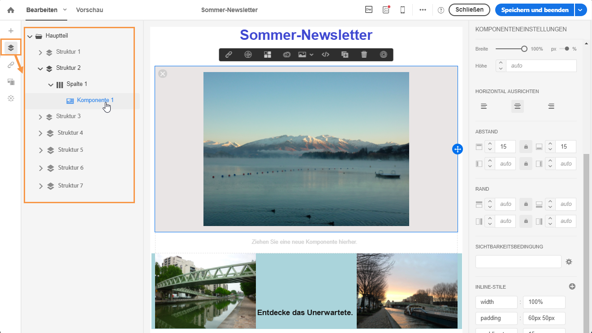
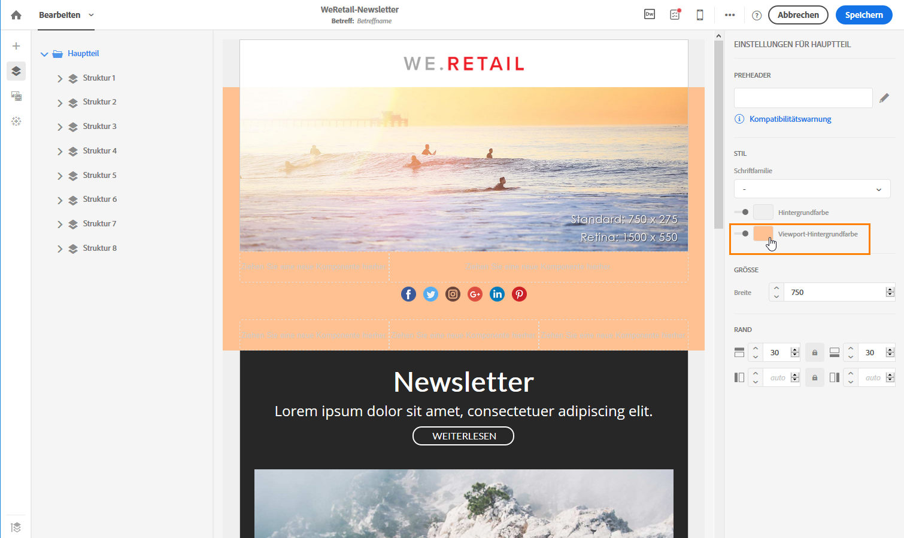
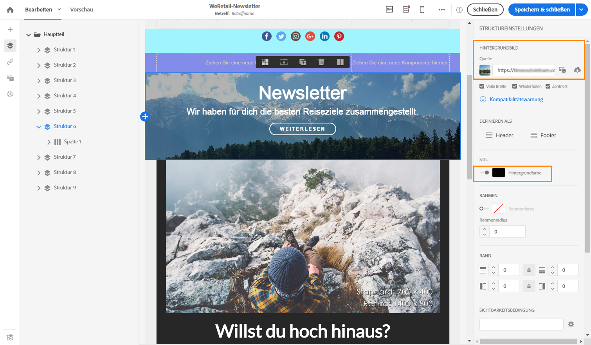
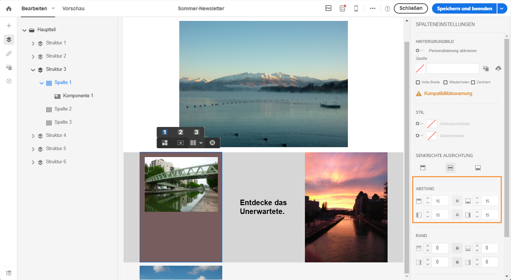

# E-Mail-Stile bearbeiten{#editing-email-styles}

## Element bearbeiten {#editing-an-element}

In Email Designer werden bei der Auswahl eines Elements mehrere für den Inhaltstyp spezifische Optionen im Bereich **[!UICONTROL Einstellungen]** angezeigt. Mit diesen Optionen können Sie den Stil Ihrer E-Mail ändern.

### Element auswählen  {#selecting-an-element}

Um ein Element in der Benutzeroberfläche von Email Designer auszuwählen, können Sie entweder:

* direkt in die die E-Mail klicken
* oder in der **Palette** auf der linken Seite in den Optionen den Strukturbaum durchsuchen.

Im Strukturbaum können Sie eine präziseren Auswahl vornehmen. Sie können die folgende Auswahl treffen:

* die gesamte Strukturkomponente,
* eine der Spalten in der Strukturkomponente
* oder eine Komponente innerhalb einer Spalte.

Um eine Spalte auszuwählen, können Sie auch folgendermaßen vorgehen:

1. Wählen Sie eine Strukturkomponente (direkt in der E-Mail oder unter Verwendung des Strukturbaums in der linken **Palette**).
1. Wählen Sie in der **dedizierten Symbolleiste** die Option **[!UICONTROL Spalte auswählen]**, um die gewünschte Spalte auszuwählen.

In [diesem Abschnitt](../../designing/using/editing-email-styles.md#example--adjusting-vertical-alignment-and-padding) finden Sie ein Beispiel.

### Einstellungen des Stils anpassen  {#adjusting-style-settings}

1. Wählen Sie in Ihrer E-Mail ein Element aus. Weiterführende Informationen dazu finden Sie unter [Element auswählen](../../designing/using/editing-email-styles.md#selecting-an-element).
1. Passen Sie die Einstellungen nach Bedarf an. Für jedes ausgewählte Element sind unterschiedliche Einstellungen verfügbar.

   Sie können beispielsweise Hintergründe einfügen, Größen ändern, die horizontale oder senkrechte Ausrichtung ändern, Farben verwalten sowie [Abstände und Spannen](../../designing/using/editing-email-styles.md#about-padding-and-margin) hinzufügen.

   Verwenden Sie dazu die im Bereich **[!UICONTROL Einstellungen]** angezeigten Optionen oder [fügen Sie Inline-Styling-Attribute hinzu](../../designing/using/editing-email-styles.md#adding-inline-styling-attributes).

   

1. Speichern Sie Ihren Inhalt.

### Über Abstände und Spannen  {#about-padding-and-margin}

In der Benutzeroberfläche von Email Designer können Sie rasch Abstände und Spannen anpassen.

**[!UICONTROL Abstand]**: Mit dieser Einstellung ändern Sie den Raum innerhalb des Rahmens eines Elements.

Beispiel:

* Verwenden Sie Abstände, um Ränder links und recshts von einem Bild einzurichten.
* Verwenden Sie Abstände oben und unten, um einen Abstand zu einem **[!UICONTROL Text]** oder einen **[!UICONTROL Divider]** zu einer Komponente hinzuzufügen.
* Um in einem Strukturelement Rahmen zwischen Spalten einzurichten, definieren Sie für jede Spalte einen Abstand.

**[!UICONTROL Spanne]**: Mit dieser Einstellung verwalten Sie den Raum zwischen dem Rahmen eines Elements und dem nächsten Element.

>[!NOTE]
>
>Je nach Ihrer Auswahl (Strukturkomponente, Spalte oder Inhaltskomponente) ist das Ergebnis anders. Adobe empfiehlt die Einrichtung der Parameter **[!UICONTROL Abstand]** und **[!UICONTROL Rand]** auf Spaltenebene.

Wählen Sie für sowohl **[!UICONTROL Abstand]** als auch **[!UICONTROL Spanne]** das Schlosssymbol aus, um die Synchronisation zwischen den Parametern oben und unten bzw. rechts und links aufzuheben. Dadurch können Sie jeden Parameter einzeln anpassen.

### Über die Ausrichtung  {#about-alignment}

* **Textausrichtung**: Platzieren Sie den Cursor auf einem Text und richten Sie ihn über die dedizierte Symbolleiste aus.

   

* **Horizontale Ausrichtung** kann auf Text, Bilder und Schaltflächen angewendet werden, aktuell aber nicht auf die Komponenten **[!UICONTROL Divider]** und **[!UICONTROL Sozial]**.

   

* Um die **senkrechte Ausrichtung** festzulegen, wählen Sie eine Spalte innerhalb einer Strukturkomponente aus und danach eine Option im Einstellungsfenster.

   

### Über den Hintergrund  {#about-backgrounds}

Für die Einstellung von Hintergründen mit Email Designer empfiehlt Adobe Folgendes:

1. Wenden Sie eine Hintergrundfarbe auf den Hauptteil Ihrer E-Mail an, wenn das Design es so verlangt.
1. Meistens wird die Hintergrundfarbe auf Spaltenebene festgelegt.
1. Versuchen Sie nicht, Hintergrundfarben für Bilder oder Textkomponenten zu verwenden, da sie schwierig zu handhaben sind.

Unten finden Sie die verfügbaren Einstellungen für den Hintergrund.

* Legen Sie eine **[!UICONTROL Hintergrundfarbe]** für die gesamte E-Mail fest. Wählen Sie die Einstellungen für den Hauptteil im Navigationsbaum aus, auf den Sie über die linke Palette zugreifen können.

   

* Legen Sie dieselbe Hintergrundfarbe für alle Strukturkomponenten fest, indem Sie **[!UICONTROL Viewport-Hintergrundfarbe auswählen]**. Mit dieser Option können Sie eine andere Einstellung als die Hintergrundfarbe auswählen.

   

* Legen Sie für jede Strukturkomponente eine andere Hintergrundfarbe fest. Wählen Sie in der linken Palette eine Struktur im Navigationsbaum aus, um eine bestimmte Hintergrundfarbe nur dieser Struktur zuzuweisen.

   

   Wählen Sie aber keine Viewport-Hintergrundfarbe aus, da diese die Struktur-Hintergrundfarben verdecken könnte.

* Legen Sie für den Inhalt einer Strukturkomponente ein **[!UICONTROL Hintergrundbild]** fest.

   

   >[!NOTE]
   >
   >Manche E-Mail-Programme unterstützen keine Hintergrundbilder. Wählen Sie daher eine passende Fallback-Hintergrundfarbe auf, falls das Bild nicht dargestellt werden kann.

* Legen Sie auf Spaltenebene eine Hintergrundfarbe fest.

   

   >[!NOTE]
   >
   >Dies ist der häufigste Anwendungsfall. Adobe empfiehlt, Hintergrundfarben auf Spaltenebene festzulegen, da dies mehr Flexibilität bietet, wenn der gesamte E-Mail-Inhalt bearbeitet wird.

   Sie können auch ein Hintergrundbild auf Spaltenebene einrichten, was aber nur selten verwendet wird.

### Beispiel: Anpassung der senkrechten Ausrichtung und des Abstands {#example--adjusting-vertical-alignment-and-padding}

Sie möchten den Abstand und die senkrechte Ausrichtung innerhalb einer Strukturkomponente bestehend aus drei Spalten anpassen. Gehen Sie dazu wie folgt vor:

1. Wählen Sie eine Strukturkomponente direkt in der E-Mail oder unter Verwendung des Strukturbaums in der linken **Palette** aus.
1. Wählen Sie in der **dedizierten Symbolleiste** mit der Option **[!UICONTROL Spalte auswählen]** die gewünschte Spalte aus. Sie können sie auch im Strukturbaum auswählen.

   

   Die bearbeitbaren Parameter für diese Spalte werden im Bereich **[!UICONTROL Einstellungen]** auf der rechten Seite angezeigt.

1. Wählen Sie unter **[!UICONTROL Senkrecht ausrichten]** die Option **[!UICONTROL Nach oben]** aus.

   

   Die Inhaltskomponente wird am oberen Rand der Spalte angezeigt.

1. Definieren Sie unter **[!UICONTROL Abstand]** den Abstand der Spalte vom oberen Rand. Wählen Sie das Schlosssymbol aus, um die Synchronisation mit dem Abstand vom unteren Rand aufzuheben.

   Definieren Sie den linken und rechten Abstand für diese Spalte.

   

1. Gehen Sie analog mit den anderen Ausrichtungs- und Abstandseinstellungen der Spalten vor.

   

1. Speichern Sie Ihre Änderungen.

## Inline-Styling-Attribute hinzufügen  {#adding-inline-styling-attributes}

Wenn Sie in der Benutzeroberfläche von Email Designer ein Element auswählen und im seitlichen Fenster seine Einstellungen anzeigen, können Sie seine Inline-Attribute und deren Werte ändern.

1. Wählen Sie in Ihrem Inhalt ein Element aus.
1. Suchen Sie im seitlichen Fenster nach den Einstellungen für **[!UICONTROL Inline-Stile]**.

   

1. Ändern Sie die Werte der vorhandenen Attribute oder fügen Sie mit den Schaltflächen **+** neue hinzu. Sie können alle Attribute und Werte hinzufügen, die CSS-kompatibel sind.

Der Stil wird auf das ausgewählte Element angewendet. Wenn für die untergeordneten Elemente keine speziellen Stilattribute definiert sind, wird der Stil des übergeordneten Elements verwendet.
