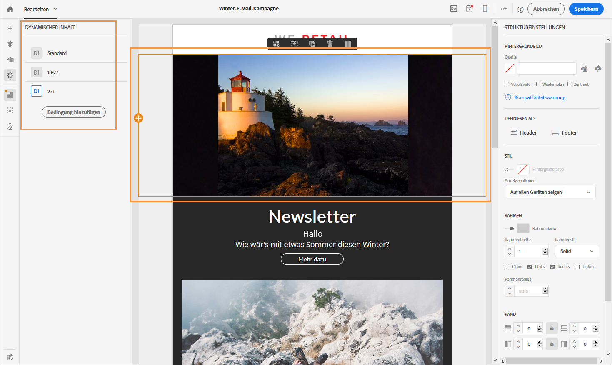
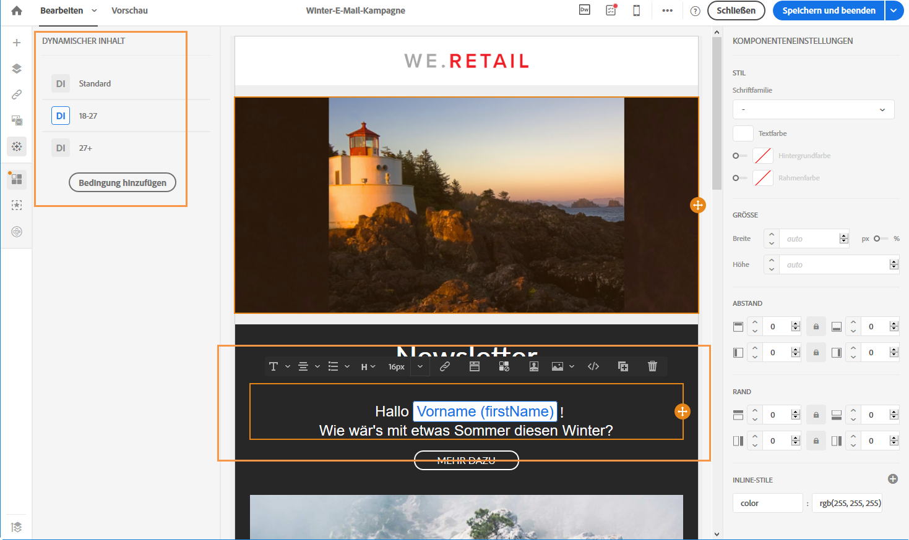
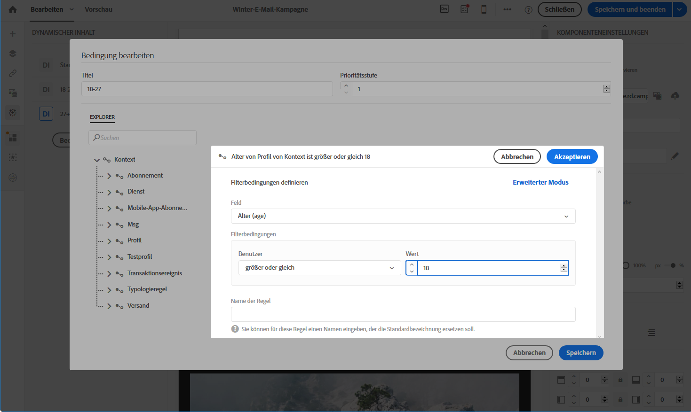
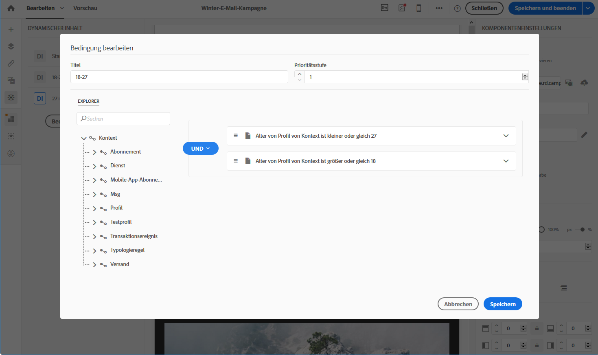
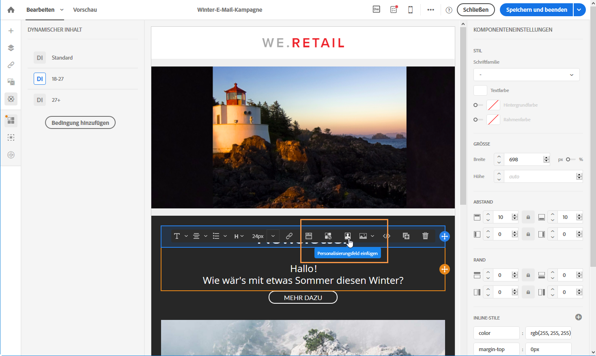
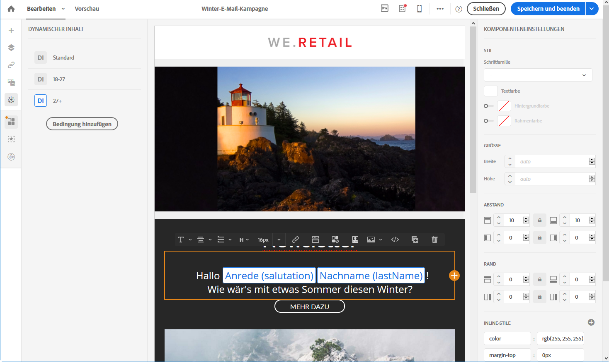

# Beispiel: E-Mail-Personalisierung{#example-email-personalization}

Das vorliegende Beispiel zeigt eine E-Mail mit einem Sonderangebot. Der E-Mail-Inhalt soll je nach Alter der Empfänger personalisiert werden. Empfänger zwischen 18 und 27 Jahren sollen eine E-Mail mit einer anderen Illustration und einer anderen Anrede erhalten als Empfänger über 27 Jahre.

Gehen Sie bei der E-Mail-Erstellung wie folgt vor:

* Aktivieren Sie für die Illustration den dynamischen Inhalt und konfigurieren Sie ihn in Abhängigkeit vom Alter der Empfänger.

   

   Weiterführende Informationen zum Hinzufügen und Konfigurieren von dynamischen Inhalten finden Sie im Abschnitt [Dynamische Inhalte in einer E-Mail definieren](../../designing/using/defining-dynamic-content-in-an-email.md).

* Aktivieren Sie für den Text den dynamischen Inhalt und fügen Sie Personalisierungsfelder ein. Abhängig von der Altersgruppe des Profils beginnt die E-Mail entweder mit dem Vornamen oder dem Titel und dem Nachnamen des Profils.

   

   Weiterführende Informationen zum Hinzufügen und Konfigurieren der Personalisierungsfelder finden Sie im Abschnitt [Personalisierungsfelder einfügen](../../designing/using/inserting-a-personalization-field.md).

## Illustrationen konfigurieren {#configuring-images}

Gehen Sie wie folgt vor:

**Für die Zielgruppe 18 bis 27 Jahre:**

1. Markieren Sie den dynamischen Inhalt im **[!UICONTROL Eigenschaften]**-Bereich der Palette und öffnen Sie den Ausdruckseditor mithilfe der Schaltfläche **Bearbeiten[!UICONTROL .]**

   

1. Benennen Sie den Inhalt und wählen Sie im **[!UICONTROL Profil]**-Knoten das **Alter]-Feld aus.[!UICONTROL **

   

1. Vervollständigen Sie den Ausdruck mit dem Operator **Größer oder gleich** und dem Wert **18**. Auf diese Weise werden alle Profile ausgewählt, für die die Bedingung **18 Jahre und älter** zutrifft.

   

1. Fügen Sie eine weitere Bedingung vom Typ **[!UICONTROL Alter]hinzu.**

   Vervollständigen Sie den Ausdruck mit dem Operator **Kleiner oder gleich** und 27. Auf diese Weise werden alle Profile ausgewählt, für die die Bedingung **27 Jahre und jünger** zutrifft.

   

1. Bestätigen Sie Ihre Änderungen.

**Für die Zielgruppe über 27 Jahre:**

1. Markieren Sie den nächsten dynamischen Inhalt in der Palette und öffnen Sie den Ausdruckseditor.
1. Benennen Sie den Inhalt und wählen Sie im **[!UICONTROL Profil]**-Knoten das **Alter]-Feld aus.[!UICONTROL **
1. Vervollständigen Sie den Ausdruck mit dem Operator **Größer als** und 27. Auf diese Weise werden alle Profile ausgewählt, für die die Bedingung **älter als 27 Jahre** zutrifft.

   

1. Bestätigen Sie Ihre Änderungen.

Die dynamischen Inhalte für die Illustrationen wurden korrekt konfiguriert.

## Text konfigurieren {#configuring-text}

Gehen Sie wie folgt vor:

**Für die Zielgruppe 18 bis 27 Jahre:**

1. Markieren Sie die anzupassende Strukturkomponente und fügen Sie einen dynamischen Inhalt hinzu.
1. Öffnen Sie den Ausdruckseditor des nächsten dynamischen Inhalts und konfigurieren Sie die Bedingung entsprechend der Zielgruppe. Lesen Sie diesbezüglich auch den Abschnitt [Illustrationen konfigurieren](../../designing/using/example--email-personalization.md#configuring-images).
1. In the structure component, at the desired position, click the **[!UICONTROL Personalize]** icon from the contextual toolbar and select **[!UICONTROL Insert personalization field]**.

   

1. Markieren Sie in der sich öffnenden Liste das **[!UICONTROL Vorname]-Feld und validieren Sie.**

   

1. Das Personalisierungsfeld wurde korrekt in den ausgewählten dynamischen Inhalt eingefügt.

**Für die Zielgruppe über 27 Jahre:**

1. Markieren Sie die anzupassende Strukturkomponente und fügen Sie einen dynamischen Inhalt hinzu.
1. Öffnen Sie den Ausdruckseditor des nächsten dynamischen Inhalts und konfigurieren Sie die Bedingung entsprechend der Zielgruppe. Lesen Sie diesbezüglich auch den Abschnitt [Illustrationen konfigurieren](../../designing/using/example--email-personalization.md#configuring-images).
1. In the structure component, at the desired position, click the **[!UICONTROL Personalize]** icon from the contextual toolbar and select **[!UICONTROL Insert personalization field]**.
1. Markieren Sie in der sich öffnenden Liste das **[!UICONTROL Anrede]-Feld.**
1. Gehen Sie analog vor, um das Feld **[!UICONTROL Nachname]hinzuzufügen.**

   

Die Personalisierungsfelder wurden korrekt in den ausgewählten dynamischen Inhalt eingefügt.

## Vorschau der E-Mail erzeugen {#previewing-emails}

Anhand der Vorschau kann geprüft werden, ob die Personalisierungsfelder und die dynamischen Inhalte korrekt konfiguriert wurden, bevor die **[!UICONTROL Testsendungen erzeugt werden]**. Bei der Vorschau können verschiedene Testprofile ausgewählt werden, die den verschiedenen Zielgruppen der E-Mail entsprechen.

Wenn kein Testprofil ausgewählt wird, wird folgende Standard-E-Mail angezeigt:

Die Anrede ist nicht personalisiert und es wird die Standard-Illustration angezeigt.

Das erste Testprofil stammt aus der Altersgruppe von 18 bis 27 Jahren. Die seiner Altersgruppe entsprechende E-Mail stellt sich wie folgt dar:

Als Anrede wird wie gewünscht der Vorname des Profils angezeigt und auch die Illustration entspricht der, die für diese Altersgruppe definiert wurde.

Das zweite Testprofil stammt aus der Altersgruppe von über 27 Jahren. Die entsprechende E-Mail stellt sich wie folgt dar:

Die Illustration zeigt die im dynamischen Inhalt für diese Altersgruppe konfigurierte und auch die Anrede wird korrekt in ihrer langen Version angezeigt.

**Verwandte Themen:**

* [Audiences erstellen](../../audiences/using/creating-audiences.md)
* [Versandvorbereitung](../../sending/using/preparing-the-send.md)

