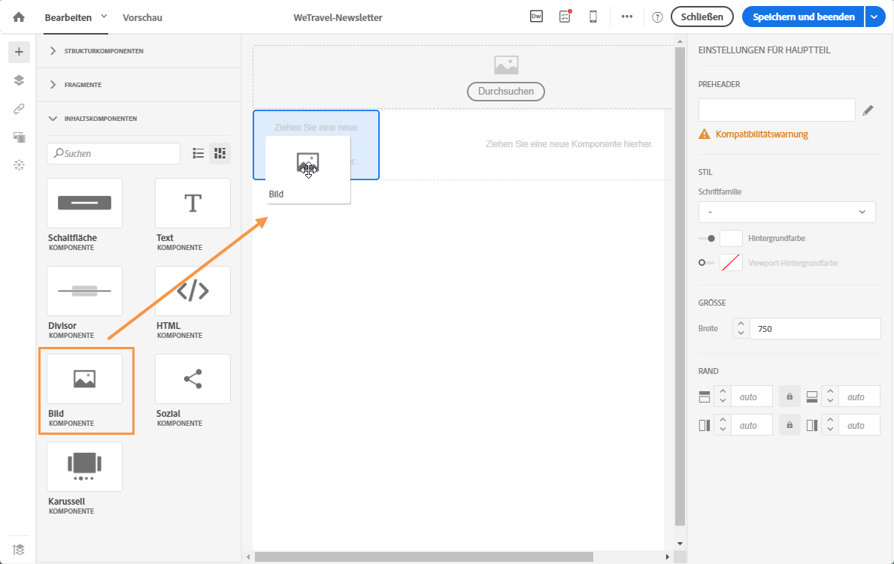
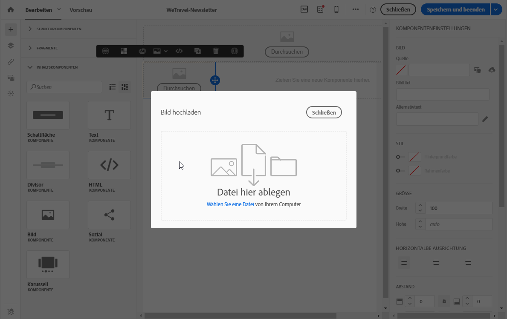
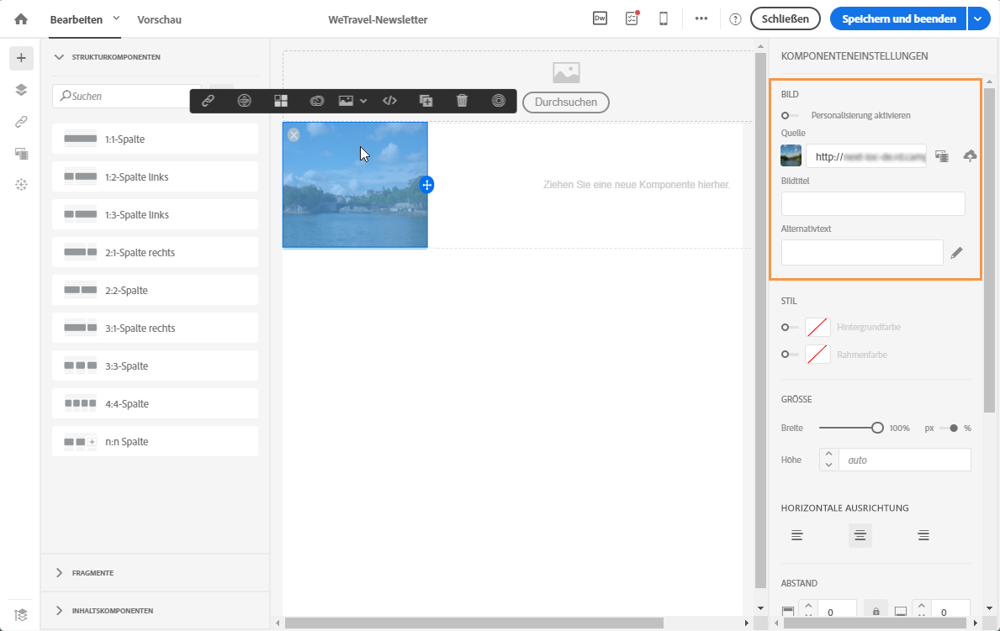
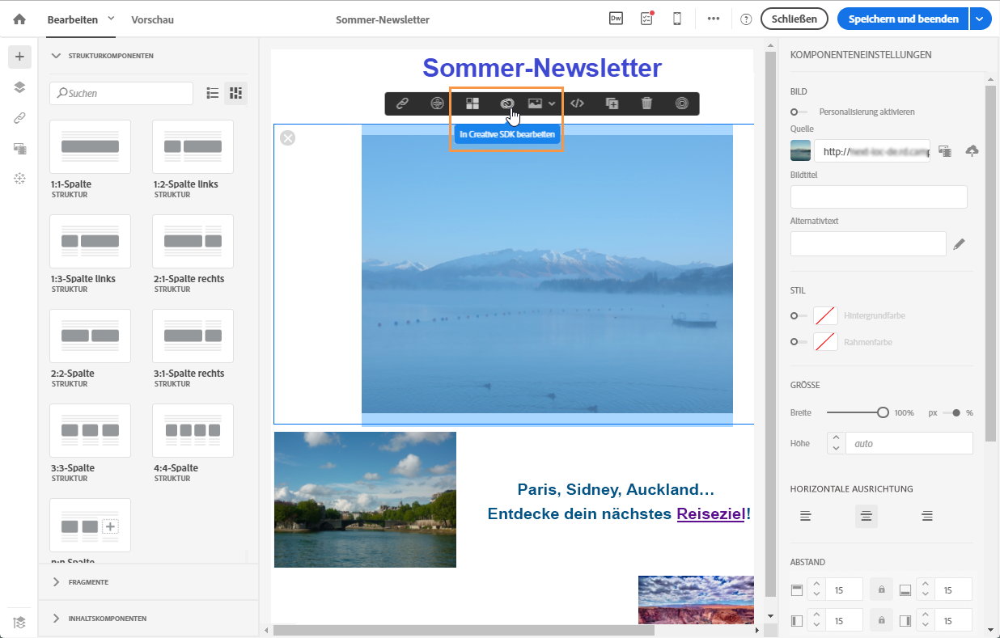
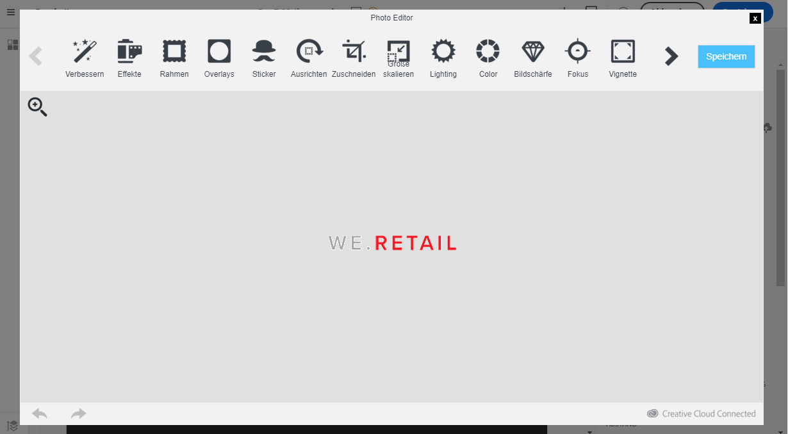

# Bilder verwenden {#images}

## Bilder einfügen{#inserting-images}

Sie können Bilder in E-Mail-Nachrichten und Landingpages einfügen.

Je nach Konfiguration sind die folgenden Arten von Bildern verfügbar:

* Lokale Bilder
* Freigegebene Bilder aus Adobe Experience Cloud – siehe [Campaign und Assets Core Service verwenden](../../integrating/using/working-with-campaign-and-assets-core-service.md)/Assets On Demand
* Dynamische Bilder von Adobe Target – siehe [Campaign und Target verwenden](../../integrating/using/about-campaign-target-integration.md)

>[!CAUTION]
>
>Wenn Sie ein Bild direkt durch Bearbeiten der HTML-Version der E-Mail hinzufügen möchten, dürfen Sie keine **externen Dateien in einem &lt;script>-Tag** der HTML-Seite aufrufen. Der Adobe-Campaign-Server erlaubt keinen Import derartiger Dateien.

### Bilder in eine E-Mail einfügen     {#inserting-images-in-an-email}

1. Fügen Sie eine Strukturkomponente hinzu. Weiterführende Informationen dazu finden Sie im Abschnitt zum [Bearbeiten des E-Mail-Aufbaus](../../designing/using/designing-from-scratch.md#defining-the-email-structure).
1. Fügen Sie innerhalb dieser Strukturkomponente eine Inhaltskomponente des Typs **[!UICONTROL Bild]** hinzu.

   

1. Klicken Sie auf **[!UICONTROL Durchsuchen]**. Ziehen Sie ein Bild in den Arbeitsbereich oder wählen Sie eine Datei von Ihrer Festplatte aus.

   

1. Wählen Sie die soeben hinzugefügte Inhaltskomponente aus.
1. Überprüfen Sie die Bildeigenschaften und passen Sie sie bei Bedarf an.

   

## Bildeigenschaften konfigurieren{#setting-up-image-properties}

Bei Markierung eines Bild-Blocks können in der Palette folgende Eigenschaften konfiguriert werden:

* **Personalisierung aktivieren** ermöglicht die Anpassung der Bildquelle. Siehe [Bildquellen personalisieren](../../designing/using/personalization.md#personalizing-an-image-source)
* Mit der Option **Bildtitel** können Sie einen Titel für das Bild festlegen.
* **Alternativtext** (E-Mail) oder **Legende** (Landingpage) fügt dem Bild einen Text hinzu, der z. B. dann angezeigt wird, wenn das Bild nicht geladen werden kann (entspricht dem **alt**-Tag im HTML-Code).
* Bei der Bearbeitung einer E-Mail ermöglicht **Stil** die Spezifikation der Größe, des Hintergrunds und der Rahmen des Bildes.
* Bei der Bearbeitung einer Landingpage ermöglicht **Dimensionen** die Spezifikation der Bildgröße und der Pixel.

Der Editor unterstützt **alle Bildarten**, deren Format mit den gängigen Browsern kompatibel ist. Um kompatibel zu sein, sind **Flash-Animationen** wie folgt in HTML-Seiten einzufügen:

```
<object type="application/x-shockwave-flash" data="http://www.mydomain.com/flash/your_animation.swf" width="200" height="400">
 <param name="movie" value="http://www.mydomain.com/flash/your_animation.swf" />
 <param name="quality" value="high" />
 <param name="play" value="true"/>
 <param name="loop" value="true"/> 
</object>
```

<!--
## Modifying images with the Adobe Creative SDK{#modifying-images-with-the-adobe-creative-sdk}

You can edit images and use a complete set of features powered by the Adobe Creative SDK to enhance your images directly in the content editor when editing emails or landing pages.

The image editor offers a powerful, full-featured image editing UI component that allows you to edit images and apply effects and frames, original high-quality stickers, beautiful overlays, fun features like tilt shift and color splash, pro-level adjustments and more.

To modify an image with the Adobe Creative SDK:

1. Select the image.
1. In the toolbar, click the Creative Cloud icon.

   

1. Select the tool you want to use through the icons on the top of the window to modify the image.

   

1. Click **[!UICONTROL Save]** when modifications are done. The updated image is saved on Adobe Campaign server and ready to be used.

>[!NOTE]
>
>Tools offered in the image editor cannot be customized.
-->