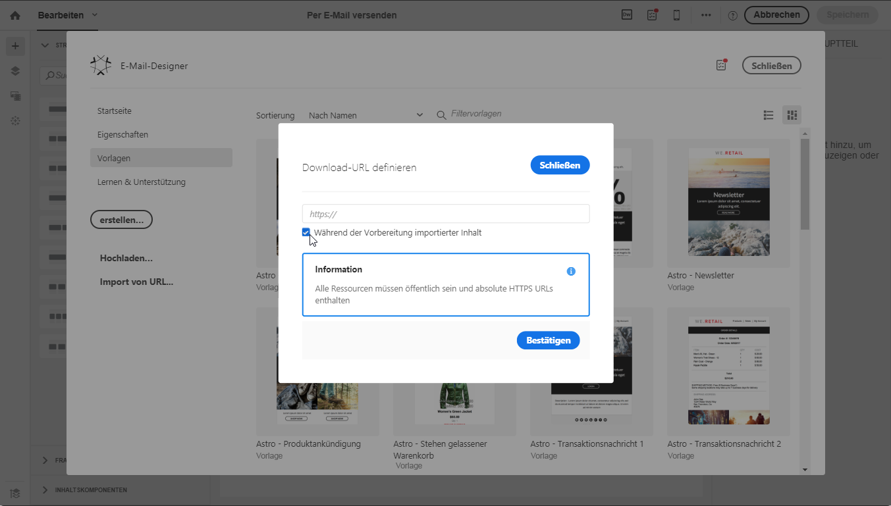

# Inhalt aus einer URL importieren{#importing-content-from-a-url}

Bevor Sie Inhalt aus einer URL importieren, vergewissern Sie sich, dass der Inhalt folgende Anforderungen erfüllt:

* Der Inhalt muss über diese URL öffentlich verfügbar sein.
* Aus Sicherheitsgründen sind nur URLs erlaubt, die mit **[!UICONTROL https]beginnen.**
* Achten Sie darauf, dass alle Ressourcen (Bilder, CSS) in absoluten Relationen und in HTTPS eingerichtet sind. Andernfalls wird die Mirrorseite nach dem Versand der E-Mail ohne ihre Ressourcen dargestellt. Hier ist ein Beispiel einer Definition einer absoluten Relation:

   ```
   <a href="https://www.mywebsite.com/images/myimage.png">
   ```

>[!NOTE]
>
>Das Laden von Inhalt aus einer URL ist nur für den E-Mail-Kanal verfügbar.

Um existierenden Inhalt von einer URL abzurufen, gehen Sie wie folgt vor:

1. Wählen Sie auf der Startseite von Email Designer die Schaltfläche **[!UICONTROL Import von URL]aus.**

   

1. Definieren Sie die URL, von der der Inhalt abgerufen wird.
1. Wählen Sie **[!UICONTROL Bestätigen]**.

**Verwandtes Thema:**

Video zum [Importieren von Inhalt von einer URL](https://helpx.adobe.com/campaign/kt/acs/using/acs-email-designer-tutorial.html#Workingwithexistingcontent)

## Während der Vorbereitung Inhalt von einer URL automatisch abrufen {#retrieving-content-from-a-url-automatically-at-preparation-time}

Durch den Import von Inhalten von einer URL während der Nachrichtenvorbereitung wird immer bei der E-Mail-Vorbereitung der jeweils letzte HTML-Inhalt abgerufen. Dadurch ist der Inhalt wiederkehrender E-Mails zum Versandzeitpunkt immer aktuell. Mit dieser Funktion können Sie auch eine Nachricht für einen bestimmten Tag erstellen, auch wenn der Inhalt noch nicht bereit ist.

Um Inhalte in der Vorbereitungsphase abzurufen, gehen Sie wie folgt vor:

1. Wählen Sie die Option **[!UICONTROL Während der Vorbereitung importierter Inhalt]aus.**

   

1. Der URL-Inhalt wird im Editor als schreibgeschützt angezeigt.

   >[!CAUTION]
   >
   >Bei diesem Schritt sollte die HTML-Anzeige im Inhaltseditor nicht berücksichtigt werden. Sie wird in der Vorbereitungsphase abgerufen.

1. Um den abgerufenen URL-Inhalt in der Vorschau zu betrachten, öffnen Sie die Nachricht nach deren Erstellung und wählen Sie danach die Schaltfläche **[!UICONTROL Vorschau]aus.**

Die Remote URL, von der der Inhalt abgerufen wird, kann personalisiert werden. Gehen Sie dazu wie folgt vor:

1. Wählen Sie am oberen Bildschirmrand den Titel der E-Mail aus, um in Email Designer den Tab **[!UICONTROL Eigenschaften]zu öffnen.**
1. Gehen Sie zum Feld **[!UICONTROL Remote URL].**

   

1. Fügen Sie das Personalisierungsfeld, den Inhaltsbaustein oder den dynamischen Text ein.

   Beispielsweise können Sie im Inhaltsbaustein **[!UICONTROL Aktuelles Datum – TTMMJJJJ]das Datum eingeben.**

   >[!NOTE]
   >
   >Die verfügbaren Personalisierungsfelder werden nur mit den Attributen **Versand** verknüpft (Erstellungsdatum der E-Mail, Status, Kampagnentitel etc.).

