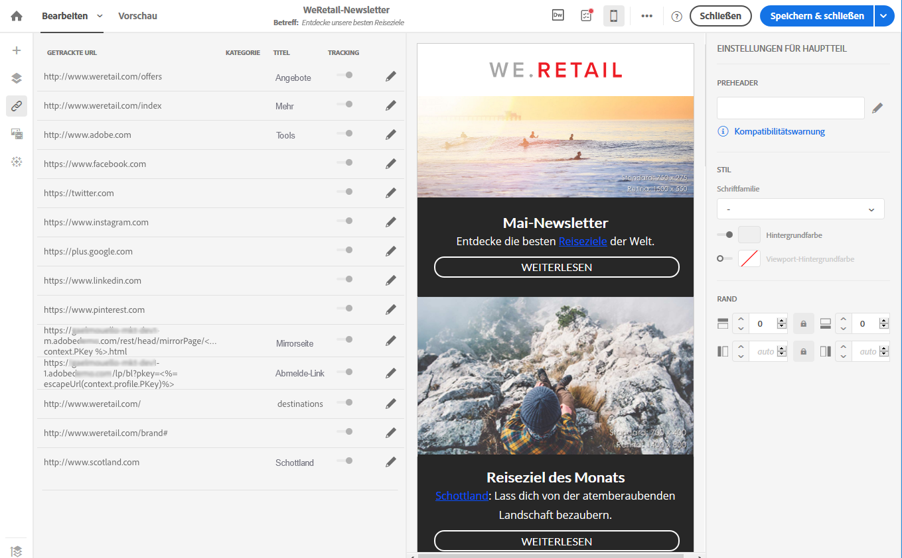

# Link einfügen{#inserting-a-link}

Der Editor bietet Ihnen die Möglichkeit, E-Mails oder Landingpages zu personalisieren, indem Sie Links in den HTML-Inhalt einfügen.

Alle Elemente einer Seite können mit Links belegt werden: Bilder, Wörter, Wortgruppen, Textblöcke etc.

>[!NOTE]
>
>Auf den unten stehenden Bildern sehen Sie, wie Sie einen Link mit [Email Designer](../../designing/using/about-email-content-design.md#about-the-email-designer) einfügen können.

1. Wählen Sie zuerst ein Element aus und danach in der dedizierten Symbolleiste die Option **[!UICONTROL Link einfügen].**

   

1. Wählen Sie den gewünschten Linktyp aus.

   * **Externer Link**: Fügen Sie einen Link auf eine externe URL ein.

      Sie können für die URLs eine Personalisierung festlegen. Siehe [URLs personalisieren](../../designing/using/personalizing-urls.md).

   * **Landingpage**: für den Zugriff auf eine Adobe Campaign-Landingpage.
   * **Anmelde-Link**: ermöglicht die Anmeldung für einen Adobe Campaign-Dienst.
   * **Abmelde-Link**: ermöglicht die Abmeldung von einem Adobe Campaign-Dienst.
   * **Eine Aktion definierender Link**: ermöglicht die Angabe einer Aktion, die durch Auswahl des Landingpage-Elements ausgelöst wird.

      >[!NOTE]
      >
      >Dieser Linktyp steht nur für Landingpages zur Verfügung.

1. Sie können den Text ändern, den ein Empfänger zu sehen bekommt.
1. Sie können das Browserverhalten festlegen, wenn der Benutzer den Link auswählt (z. B. neues Fenster öffnen).

   >[!NOTE]
   >
   >Die Definition des Browserverhaltens ist nur für Landingpages möglich.

1. Speichern Sie Ihre Änderungen.

Sie können auch nach der Erstellung des Links diesen noch im Einstellungsfenster ändern. Klicken Sie auf das Stiftsymbol, um seine Parameter zu bearbeiten.

Bei der Bearbeitung einer E-Mail mit [Email Designer](../../designing/using/about-email-content-design.md#about-the-email-designer) können Sie die von Ihnen erstellten Links in der Tabelle, die alle in der E-Mail enthaltenen URLs aufführt, einfach öffnen und bearbeiten. Diese Liste bietet einen guten Überblick und ermöglicht das Auffinden aller im E-Mail-Inhalt vorhandenen URLs. Weiterführende Informationen darüber, wie Sie diese Liste öffnen, finden Sie im Abschnitt [Über getrackte URLs](../../designing/using/about-tracked-urls.md).

>[!NOTE]
>
>Personalisierte URLs wie **die URL der Mirrorseite** oder **Abmelde-Links** können nicht in dieser Liste geändert werden. Alle anderen Links sind bearbeitbar.

