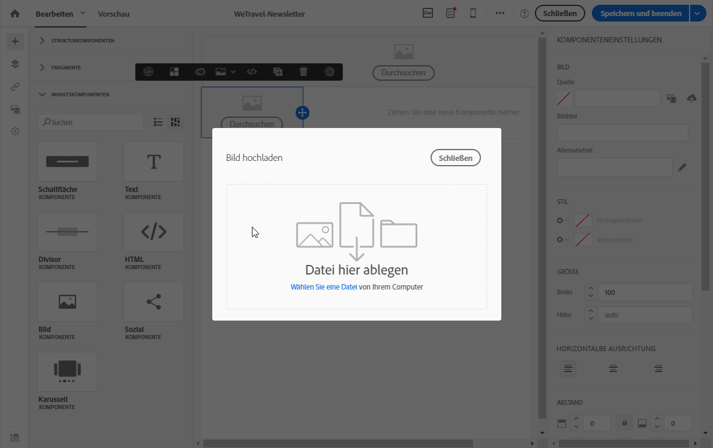
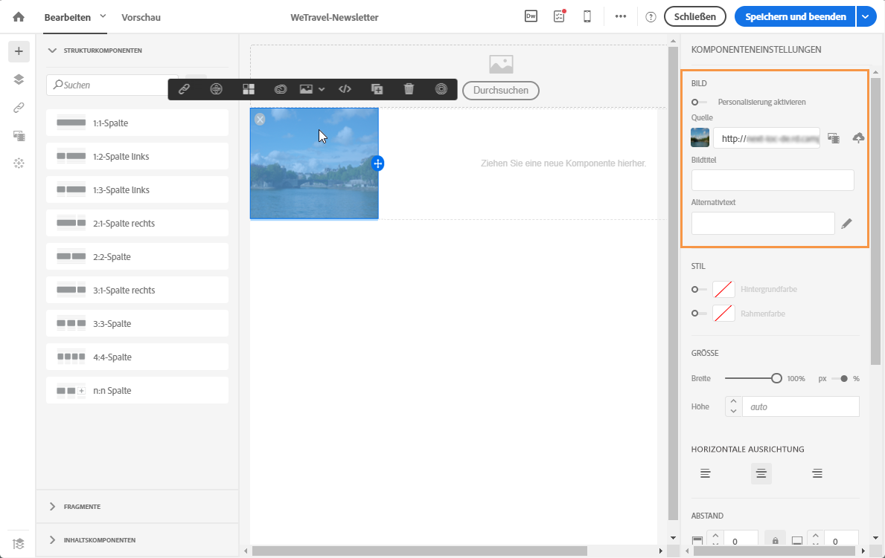

# Bilder einfügen{#inserting-images}

Sie können Bilder in E-Mail-Nachrichten und Landingpages einfügen.

Je nach Konfiguration sind die folgenden Arten von Bildern verfügbar:

* Lokale Bilder
* Freigegebene Bilder aus Adobe Experience Cloud – siehe [Campaign und Assets Core Service verwenden](../../integrating/using/working-with-campaign-and-assets-core-service.md)/Assets On Demand
* Dynamische Bilder von Adobe Target – siehe [Campaign und Target verwenden](../../integrating/using/about-campaign-target-integration.md)

Sie können Bilder mit Adobe Creative SDK ändern, vorausgesetzt dieses ist aktiviert. Siehe [Bilder mit Adobe Creative SDK bearbeiten](../../designing/using/modifying-images-with-the-adobe-creative-sdk.md).

>[!CAUTION]
>
>Wenn Sie ein Bild direkt durch Bearbeiten der HTML-Version der E-Mail hinzufügen möchten, dürfen Sie keine **externen Dateien in einem &lt;script&gt;-Tag** der HTML-Seite aufrufen. Der Adobe-Campaign-Server erlaubt keinen Import derartiger Dateien.

## Bilder in eine E-Mail einfügen {#inserting-images-in-an-email}

1. Fügen Sie eine Strukturkomponente hinzu. Weiterführende Informationen dazu finden Sie im Abschnitt zum [Bearbeiten des E-Mail-Aufbaus](../../designing/using/defining-the-email-structure.md#editing-the-email-structure).
1. Fügen Sie innerhalb dieser Strukturkomponente eine Inhaltskomponente des Typs **[!UICONTROL Bild]hinzu.**

   

1. Klicken Sie auf **[!UICONTROL Durchsuchen]**. Ziehen Sie ein Bild in den Arbeitsbereich oder wählen Sie eine Datei von Ihrer Festplatte aus.

   

1. Wählen Sie die soeben hinzugefügte Inhaltskomponente aus.
1. Überprüfen Sie die Bildeigenschaften und passen Sie sie bei Bedarf an.

   

## Bilder in eine Landingpage einfügen {#inserting-images-in-a-landing-page}

1. Wählen Sie im Inhalt der Landingpage einen Baustein aus, der ein Bild enthält.
1. Verwenden Sie die Schaltfläche **[!UICONTROL Einfügen].**

   

1. Wählen Sie in der dedizierten Symbolleiste die Option **[!UICONTROL Lokales Bild].**

   

1. Datei auswählen.

   

1. Passen Sie die Bildeigenschaften nach Bedarf an.

   

