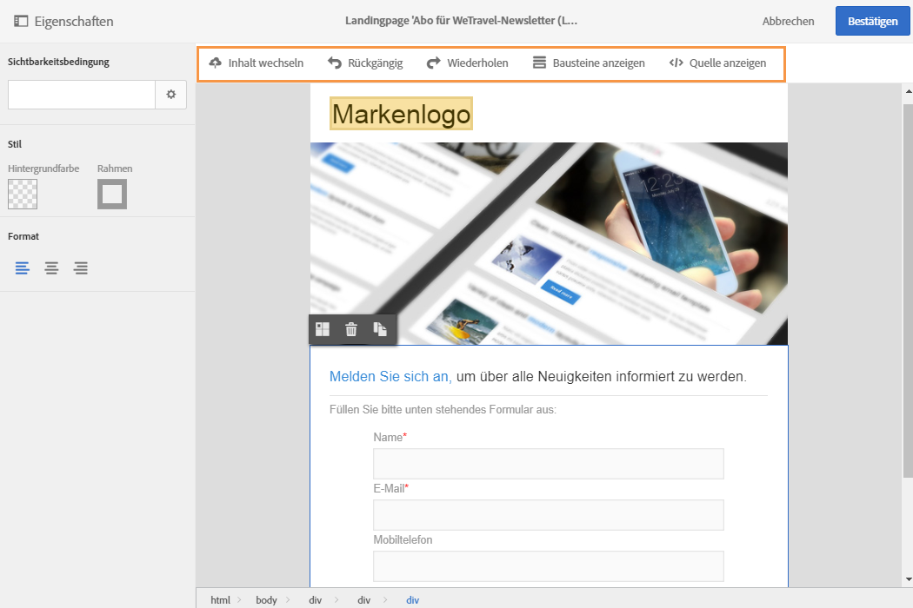

# Benutzeroberfläche des Inhaltseditors für Landingpages{#landing-page-content-editor-interface}

Mit dem Landingpage-Inhaltseditor können Sie mühelos Inhalte in Adobe Campaign definieren, ändern und personalisieren. Um ihn zu öffnen, klicken Sie in den **[!UICONTROL Inhaltsbaustein]** in einem Landingpage-Dashboard.

Der Inhaltseditor besteht aus drei Bereichen. In diesen Bereichen können Sie den Inhalt ansehen und bearbeiten.

1. Die **Palette** links im Bildschirm ermöglicht die Bearbeitung der Eigenschaften des markierten Blocks, wie z. B. Hintergrundfarbe, Rahmen, Ausrichtung, Sichtbarkeitsbedingungen etc. Siehe [Personalisierungsfelder einfügen](../../designing/using/inserting-a-personalization-field.md).
1. In der **Symbolleiste** bieten Schaltflächen Zugriff auf die verfügbaren Aktionen. Sie können eine Vorlage auswählen und den Anzeigemodus wechseln. Siehe [Symbolleiste des Inhaltseditors für Landingpages](../../designing/using/landing-page-content-editor-interface.md#landing-page-editor-action-bar).
1. Im **Hauptarbeitsbereich** ermöglicht eine kontextabhängige Symbolleiste die direkte Bearbeitung des Inhalts. Sie können beispielsweise ein Bild mit einem Link belegen, die Schriftart anpassen, ein Feld löschen etc. Siehe [Symbolleiste des Inhaltseditors für Landingpages](../../designing/using/landing-page-content-editor-interface.md#landing-page-editor-toolbar).

## Symbolleiste des Inhaltseditors für Landingpages  {#landing-page-editor-action-bar}

Die Symbolleiste enthält Schaltflächen, die die Bearbeitung des angezeigten Inhalts ermöglichen.

<table> 
 <thead> 
  <tr> 
   <th> Symbol  </th> 
   <th> Schaltflächenname  </th> 
   <th> Kanal  </th> 
   <th> Beschreibung  </th> 
  </tr> 
 </thead> 
 <tbody> 
  <tr> 
   <td>    </td> 
   <td> Inhalt wechseln   </td> 
   <td> Landingpage und E-Mail  </td> 
   <td> Ermöglicht die Auswahl einer nativen Inhaltsvorlage oder den Import eines anderweitig erstellten HTML-Inhalts. Lesen Sie diesbezüglich auch den Abschnitt <a href="../../designing/using/selecting-an-existing-content.md">Existierenden Inhalt laden</a>.  </td> 
  </tr> 
  <tr> 
   <td>    </td> 
   <td> Rückgängig   </td> 
   <td> Alle  </td> 
   <td> Macht die letzte Aktion rückgängig.  </td> 
  </tr> 
  <tr> 
   <td>    </td> 
   <td> Wiederherstellen   </td> 
   <td> Alle  </td> 
   <td> Stellt die letzte rückgängig gemachte Aktion wieder her.  </td> 
  </tr> 
  <tr> 
   <td>    </td> 
   <td> Blöcke anzeigen   </td> 
   <td> Landingpage und E-Mail  </td> 
   <td> Umrandet alle Inhaltsblöcke (entspricht in HTML dem <strong>&lt;div&gt;</strong>-Tag).  </td> 
  </tr> 
  <tr> 
   <td>    </td> 
   <td> Quelle ansehen   </td> 
   <td> Landingpage und E-Mail  </td> 
   <td> Zeigt den HTML-Quellcode der Seite an.  </td> 
  </tr> 
 </tbody> 
</table>

## Symbolleiste des Inhaltseditors für Landingpages  {#landing-page-editor-toolbar}

Die dedizierte Symbolleiste ist ein **kontextuelles Element** der Editor-Oberfläche. Je nach markiertem Bereich sind unterschiedliche Schaltflächen verfügbar. Sie enthält Aktionsschaltflächen sowie Schaltflächen zur Anpassung des Textstils. Alle Änderungen beziehen sich somit jeweils nur auf das ausgewählte Element. Wenn Sie beispielsweise einen Block markieren, können Sie diesen löschen oder duplizieren. Wenn Sie Text innerhalb eines Blocks markieren, können Sie ihn in einen Link verwandeln oder die Formatierung anpassen.

>[!CAUTION]
>
>Gewisse Funktionen der Schaltfläche betreffen die Formatierung des HTML-Inhalts. Wenn die betroffene Seite jedoch ein CSS-Stylesheet enthält, können sich die **Anweisungen** des Stylesheets als **vorrangig** erweisen.

<table> 
 <thead> 
  <tr> 
   <th> Symbol  </th> 
   <th> Schaltflächenname  </th> 
   <th> Kontext  </th> 
   <th> Beschreibung  </th> 
  </tr> 
 </thead> 
 <tbody> 
  <tr> 
   <td>    </td> 
   <td> Link zu einer externen URL   </td> 
   <td> Jegliches Element  </td> 
   <td> Verlinkt mit einer URL. Weiterführende Informationen zur Konfiguration eines Links finden Sie im Abschnitt <a href="../../designing/using/inserting-a-link.md">Link einfügen</a>.  </td> 
  </tr> 
  <tr> 
   <td>    </td> 
   <td> Link zu einer Landingpage   </td> 
   <td> Jegliches Element  </td> 
   <td> Ermöglicht den Zugriff auf eine Adobe-Campaign-Landingpage. Weiterführende Informationen zur Konfiguration eines Links finden Sie im Abschnitt <a href="../../designing/using/inserting-a-link.md">Link einfügen</a>.  </td> 
  </tr> 
  <tr> 
   <td>    </td> 
   <td> Anmelde-Link   </td> 
   <td> Jegliches Element  </td> 
   <td> Fügt einen Link zur Anmeldung für einen Dienst hinzu. Weiterführende Informationen zur Konfiguration eines Links finden Sie im Abschnitt <a href="../../designing/using/inserting-a-link.md">Link einfügen</a>.  </td> 
  </tr> 
  <tr> 
   <td>    </td> 
   <td> Abmelde-Link   </td> 
   <td> Jegliches Element  </td> 
   <td> Fügt einen Link zur Abmeldung von einem Dienst hinzu. Weiterführende Informationen zur Konfiguration eines Links finden Sie im Abschnitt <a href="../../designing/using/inserting-a-link.md">Link einfügen</a>.  </td> 
  </tr> 
  <tr> 
   <td>    </td> 
   <td> Link entfernen   </td> 
   <td> Link  </td> 
   <td> Löscht (nach Bestätigung) den Link sowie alle verknüpften Konfigurationen.  </td> 
  </tr> 
  <tr> 
   <td>    </td> 
   <td> Personalisierungsfeld einfügen   </td> 
   <td> Textelement  </td> 
   <td> Fügt den Wert eines Datenbankfelds in den Inhalt ein. Siehe <a href="../../designing/using/inserting-a-personalization-field.md">Personalisierungsfelder einfügen</a>.  </td> 
  </tr> 
  <tr> 
   <td>    </td> 
   <td> Inhaltsbaustein einfügen   </td> 
   <td> Textelement  </td> 
   <td> Fügt einen personalisierten Inhaltsbaustein ein. Siehe <a href="../../designing/using/adding-a-content-block.md">Inhaltsbausteine</a>.  </td> 
  </tr> 
  <tr> 
   <td>    </td> 
   <td> Dynamischen Inhalt aktivieren   </td> 
   <td> Textelement  </td> 
   <td> Ermöglicht das Einfügen von dynamischen Inhalten in den Nachrichtenkörper. Siehe <a href="../../designing/using/defining-dynamic-content-in-a-landing-page.md">Dynamische Inhalte definieren</a>.  </td> 
  </tr> 
  <tr> 
   <td>    </td> 
   <td> Dynamischen Inhalt deaktivieren   </td> 
   <td> Textelement  </td> 
   <td> Ermöglicht das Löschen eines dynamischen Inhalts.  </td> 
  </tr> 
  <tr> 
   <td>    </td> 
   <td> Schriftgröße vergrößern   </td> 
   <td> Textelement  </td> 
   <td> Vergrößert den ausgewählten Text (Hinzufügung von <strong>&lt;span style="font-size:"&gt;</strong> im HTML-Code).  </td> 
  </tr> 
  <tr> 
   <td>    </td> 
   <td> Schriftgröße verkleinern   </td> 
   <td> Textelement  </td> 
   <td> Verkleinert den ausgewählten Text (Hinzufügung von <strong>&lt;span style="font-size:"&gt;</strong>).  </td> 
  </tr> 
  <tr> 
   <td>    </td> 
   <td> Fett   </td> 
   <td> Textelement  </td> 
   <td> Formatiert den ausgewählten Text fett (Text wird von den Tags <strong>&lt;strong&gt;</strong><strong>&lt;/strong&gt;</strong> umschlossen).   </td> 
  </tr> 
  <tr> 
   <td>    </td> 
   <td> Kursiv   </td> 
   <td> Textelement  </td> 
   <td> Formatiert den ausgewählten Text kursiv (Text wird von den Tags <strong>&lt;em&gt;</strong><strong>&lt;/em&gt;</strong> umschlossen).   </td> 
  </tr> 
  <tr> 
   <td>    </td> 
   <td> Unterstreichen   </td> 
   <td> Textelement  </td> 
   <td> Unterstreicht den ausgewählten Text (Hinzufügung von <strong>&lt;span style="text-decoration: underline;"&gt;</strong> im HTML-Code).  </td> 
  </tr> 
  <tr> 
   <td>    </td> 
   <td> Hintergrundfarbe ändern   </td> 
   <td> Textelement  </td> 
   <td> Ändert die Hintergrundfarbe des markierten Blocks (Hinzufügung von style="background-color: rgba(170, 86, 255, 0.87)).  </td> 
  </tr> 
  <tr> 
   <td>    </td> 
   <td> Textfarbe ändern   </td> 
   <td> Textelement  </td> 
   <td> Ändert die Farbe des ganzen Texts innerhalb eines Blocks oder nur des markierten Texts (<strong>&lt;span style="color: #56ff56;"&gt;</strong>).  </td> 
  </tr> 
  <tr> 
   <td>    </td> 
   <td> Bild   </td> 
   <td> Block mit einem Bild  </td> 
   <td> Fügt ein Bild aus einer lokalen Datei ein.  </td> 
  </tr> 
  <tr> 
   <td>    </td> 
   <td> Löschen   </td> 
   <td> Jegliche Blöcke  </td> 
   <td> Löscht den Block und seinen Inhalt.  </td> 
  </tr> 
  <tr> 
   <td>    </td> 
   <td> Dublette   </td> 
   <td> Jegliche Blöcke  </td> 
   <td> Dupliziert den Block und alle ihn betreffenden Stilmerkmale.  </td> 
  </tr> 
 </tbody> 
</table>

