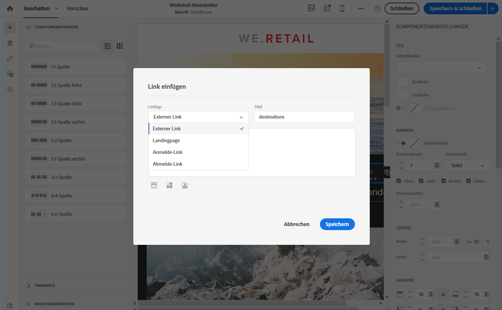
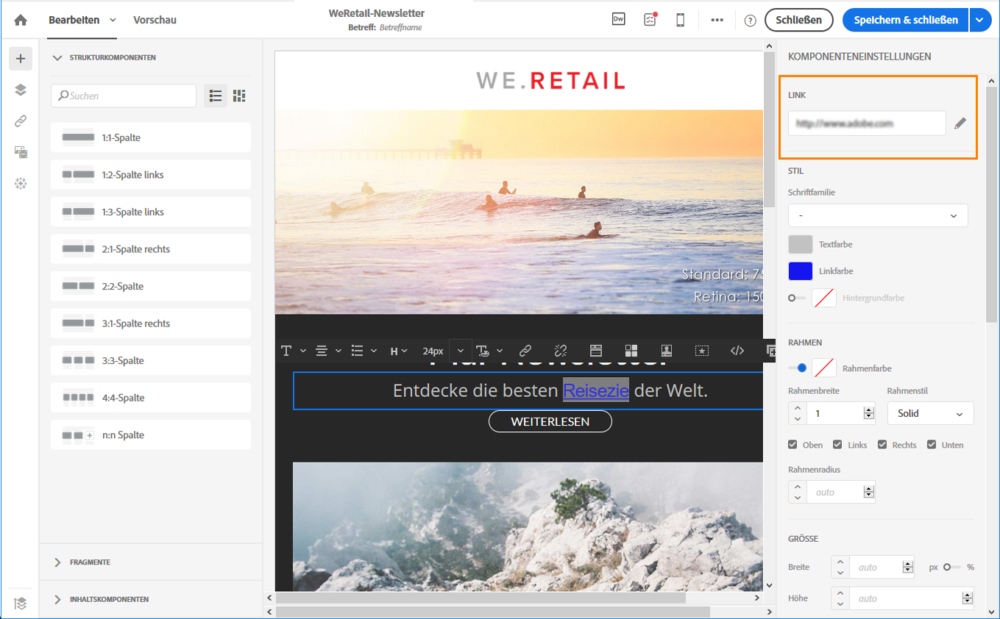
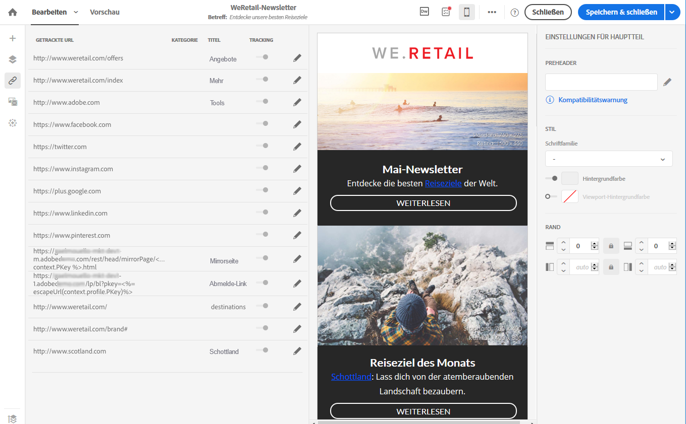
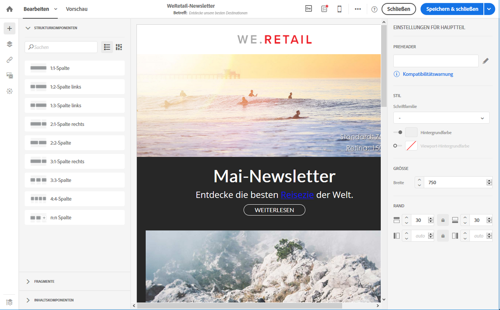
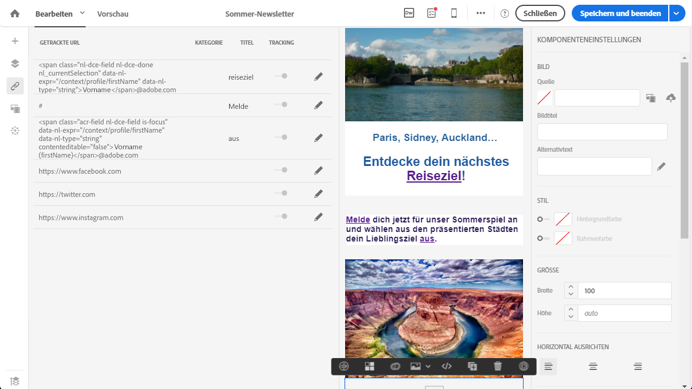
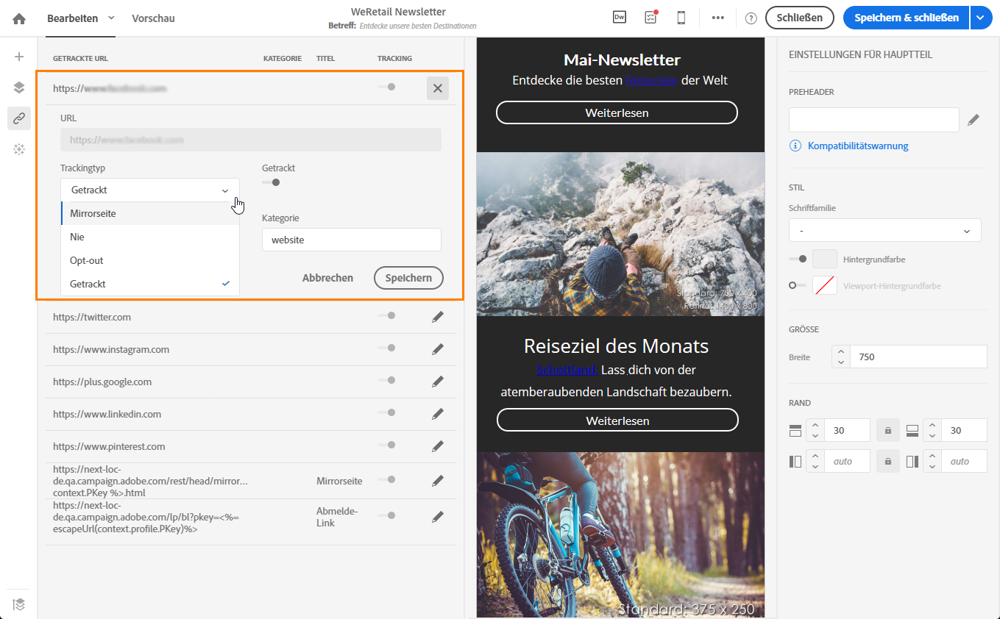
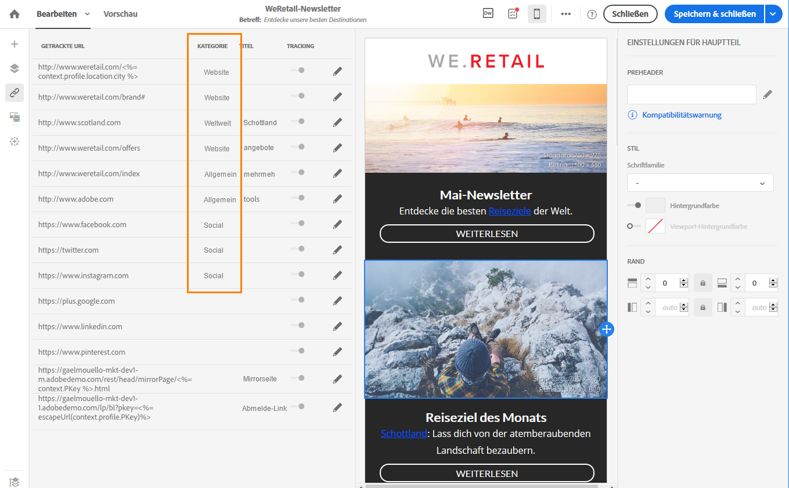
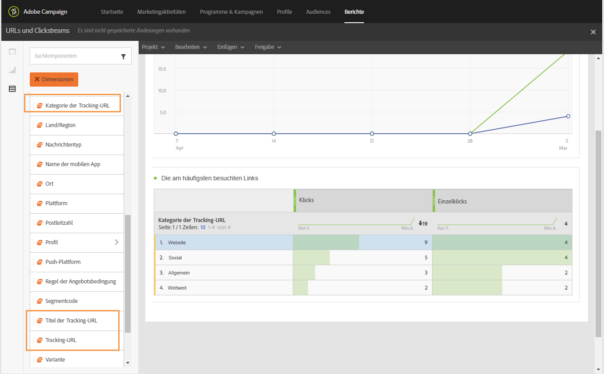

# Links hinzufügen {#links}

## Link einfügen {#inserting-a-link}

Der Editor bietet Ihnen die Möglichkeit, E-Mails oder Landingpages zu personalisieren, indem Sie Links in den HTML-Inhalt einfügen.

Alle Elemente einer Seite können mit Links belegt werden: Bilder, Wörter, Wortgruppen, Textblöcke etc.

>[!NOTE]
>
>Auf den unten stehenden Bildern sehen Sie, wie Sie einen Link mit [Email Designer](../../designing/using/designing-content-in-adobe-campaign.md) einfügen können.

1. Wählen Sie ein Element aus und klicken Sie in der kontextuellen Symbolleiste auf **[!UICONTROL Link einfügen]**.

   

1. Wählen Sie den gewünschten Linktyp aus.

   * **Externer Link**: Fügen Sie einen Link auf eine externe URL ein.

     Sie können für die URLs eine Personalisierung festlegen. Siehe [URLs personalisieren](personalization.md#personalizing-urls).

   * **Landingpage**: für den Zugriff auf eine Adobe Campaign-Landingpage.
   * **Anmelde-Link**: ermöglicht die Anmeldung für einen Adobe Campaign-Dienst.
   * **Abmelde-Link**: ermöglicht die Abmeldung von einem Adobe Campaign-Dienst.
   * **Eine Aktion definierender Link**: ermöglicht die Angabe einer Aktion, die durch Auswahl des Landingpage-Elements ausgelöst wird.

     >[!NOTE]
     >
     >Dieser Linktyp steht nur für Landingpages zur Verfügung.

1. Sie können den Text ändern, den ein Empfänger zu sehen bekommt.
1. Sie können das Browserverhalten festlegen, wenn der Benutzer den Link auswählt (z. B. neues Fenster öffnen).

   >[!NOTE]
   >
   >Die Definition des Browserverhaltens ist nur für Landingpages möglich.

1. Speichern Sie Ihre Änderungen.

Sie können auch nach der Erstellung des Links diesen noch im Einstellungsfenster ändern. Klicken Sie auf das Stiftsymbol, um seine Parameter zu bearbeiten.

Bei der Bearbeitung einer E-Mail mit [Email Designer](../../designing/using/designing-content-in-adobe-campaign.md) können Sie die von Ihnen erstellten Links in der Tabelle, die alle in der E-Mail enthaltenen URLs aufführt, einfach öffnen und bearbeiten. Diese Liste bietet einen guten Überblick und ermöglicht das Auffinden aller im E-Mail-Inhalt vorhandenen URLs. Weiterführende Informationen darüber, wie Sie diese Liste öffnen, finden Sie im Abschnitt [Über getrackte URLs](#about-tracked-urls).

>[!NOTE]
>
>Personalisierte URLs wie **die URL der Mirrorseite** oder **Abmelde-Links** können nicht in dieser Liste geändert werden. Alle anderen Links sind bearbeitbar.

**Verwandte Themen**:

* [Personalisierungsfeld einfügen](../../designing/using/personalization.md#inserting-a-personalization-field)
* [Inhaltsbausteine hinzufügen](../../designing/using/personalization.md#adding-a-content-block)
* [Dynamische Inhalte definieren](../../designing/using/personalization.md#defining-dynamic-content-in-an-email)

## Über getrackte URLs {#about-tracked-urls}

Adobe Campaign bietet Ihnen die Möglichkeit, das Verhalten der Empfänger zu verfolgen, wenn sie eine in einer E-Mail enthaltene URL anklicken. Weiterführende Informationen dazu finden Sie in [diesem Abschnitt](../../sending/using/tracking-messages.md#about-tracking).

Im Symbol **[!UICONTROL Links]** in der Aktionsleiste wird automatisch die Liste aller getrackten URLs Ihres Inhalts angezeigt.

>[!NOTE]
>
>Das Tracking ist standardmäßig aktiviert. Damit diese Funktion für E-Mails verfügbar ist, muss das Tracking in Adobe Campaign aktiv sein. Weiterführende Informationen zu Trackingparametern finden Sie in [diesem Abschnitt](../../administration/using/configuring-email-channel.md#tracking-parameters).

Die URL, die Kategorie, der Titel und der Trackingtyp eines jeden Links können in dieser Liste geändert werden. Um einen Link zu bearbeiten, wählen Sie das entsprechende Stiftsymbol aus.

Für jede getrackte URL können Sie einen der folgenden Tracking-Modi auswählen:

* **Getrackt**: Aktiviert das Tracking dieser URL.
* **Mirrorseite**: Diese URL wird als Mirrorseite behandelt.
* **Nie**: Das Tracking dieser URL wird nie aktiviert. Diese Einstellung wird gespeichert. Wenn die URL künftig in einer Nachricht erscheint, ist ihr Tracking automatisch deaktiviert.
* **Opt-out**: Diese URL wird als Opt-out-URL behandelt.

Sie können das Tracking für jede URL aktivieren oder deaktivieren.

>[!NOTE]
>
>Standardmäßig werden in Adobe Campaign alle Inhalts-URLs getrackt außer die **URL der Mirrorseite** und der **Abmelde-Link**.

Sie haben die Möglichkeit, Ihre URLs mithilfe des Felds **[!UICONTROL Kategorie]** je nach den in der Nachricht verwendeten URLs zu gruppieren. Diese Kategorien können in Berichten angezeigt werden, z. B. in [URLs und Clickstreams](../../reporting/using/urls-and-click-streams.md).

Wenn Sie einen Bericht erstellen, wählen Sie im Tab **[!UICONTROL Komponenten]** die Option **[!UICONTROL Dimension]** aus. Scrollen Sie dann die Liste hinunter, um auf die Tracking-Komponenten zuzugreifen. So können Sie z. B. **[!UICONTROL Kategorie des URL-Trackings]** in den Arbeitsbereich ziehen, um die Ergebnisse zur Tracking-Kategorie jeder angeklickten URL anzuzeigen.

Weiterführende Informationen zur Erstellung benutzerdefinierter Berichte finden Sie in [diesem Abschnitt](../../reporting/using/about-dynamic-reports.md).
