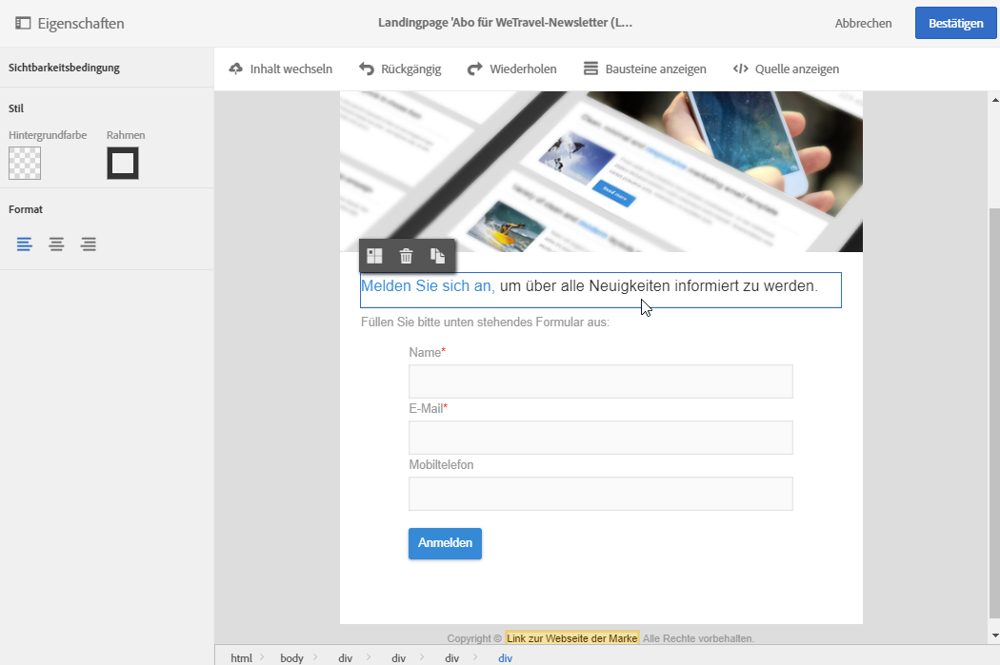
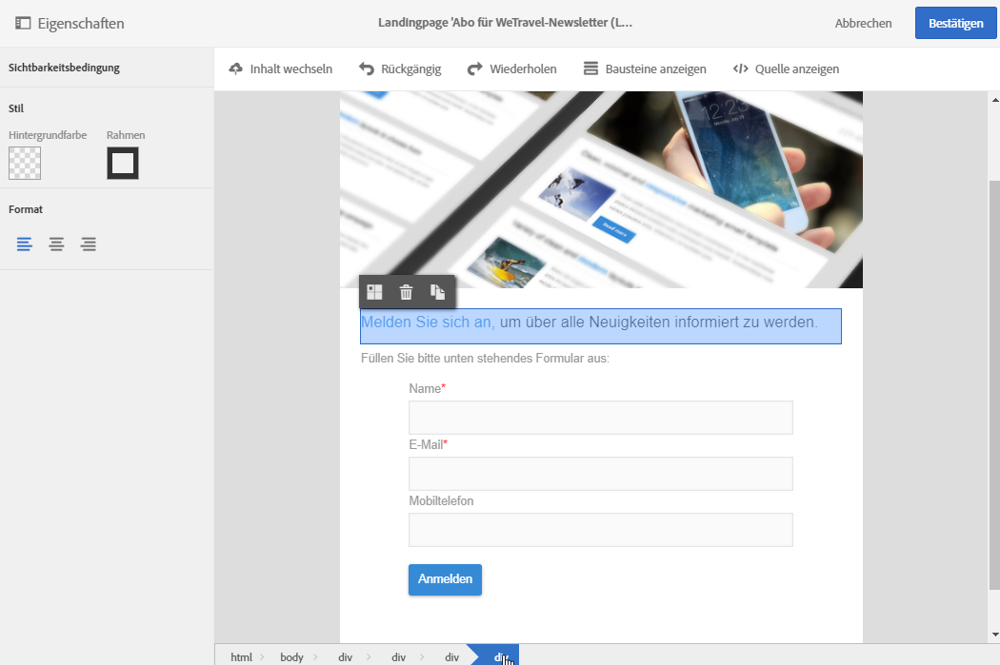
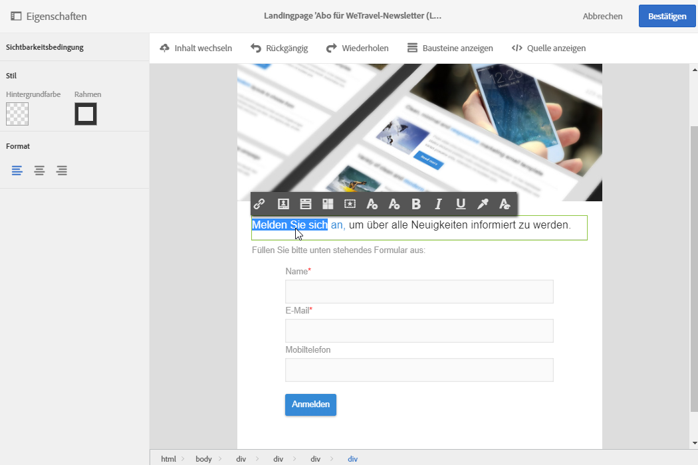
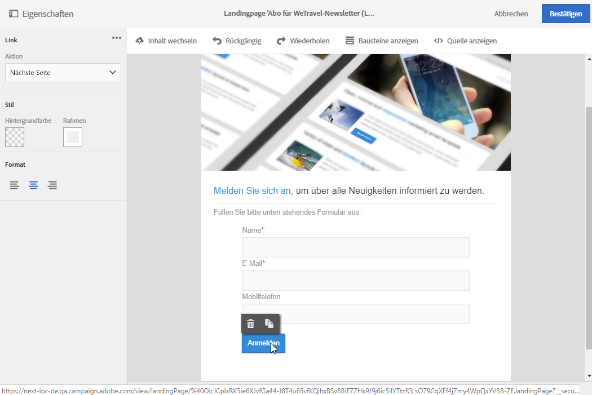
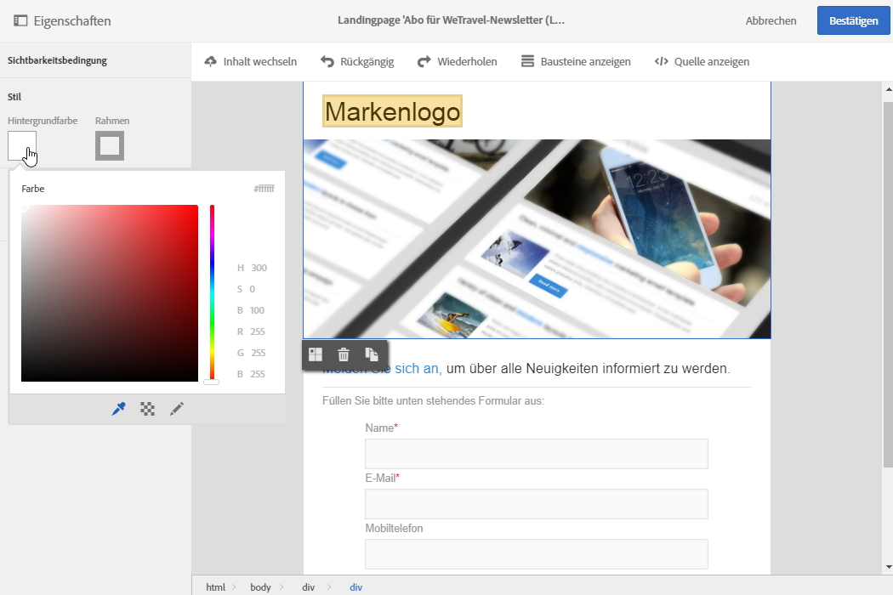
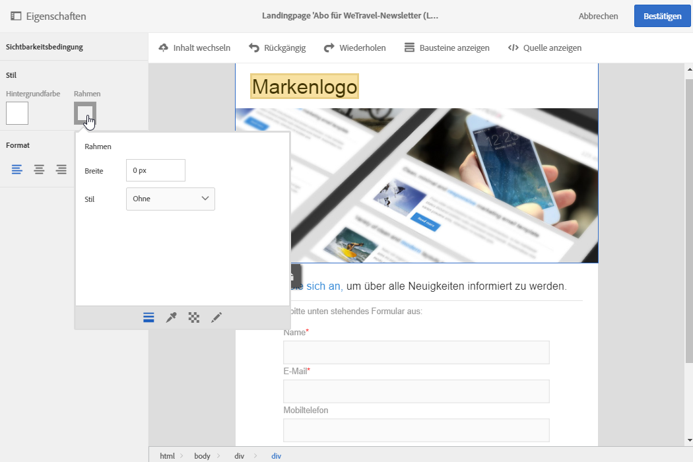
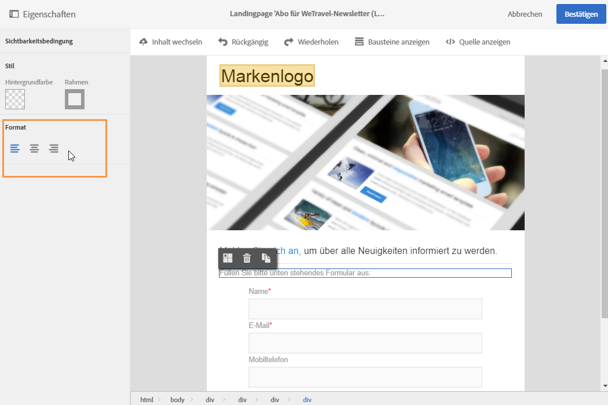

# Struktur und Stil von Landingpages verwalten{#managing-landing-page-structure-and-style}

## Bausteine im Inhaltseditor verwalten {#managing-blocks-in-the-content-editor}

The different HTML content elements are displayed in the landing page as blocks, corresponding to the **&lt;div&gt;** **&lt;/div&gt;** tag.

Zur Bearbeitung eines Blocks ist dieser zu markieren. Dies wird durch eine blaue Umrandung angezeigt.

Wenn ein Block markiert ist, werden die übergeordneten Objekte des entsprechenden HTML-Elements in einer Breadcrumb-Leiste im unteren Teil des Arbeitsbereichs eingeblendet.

Beim Überfahren eines Elements mit der Maus wird dieses farblich unterlegt. Auf diese Weise können Sie leicht von einem Block zum anderen wechseln und das anzupassende HTML-Element präzise auswählen.

Anhand der verschiedenen in der Palette oder der dedizierten Symbolleiste zur Verfügung stehenden Schaltflächen kann der Block dann geändert, dupliziert oder gelöscht werden.

Aktivieren Sie die Textbearbeitung durch einen zweiten Klick in den Block. Der Rahmen um den Block verfärbt sich grün. Danach können Sie Text auswählen oder eingeben. Anhand der verfügbaren Optionen in der Palette und der dedizierten Symbolleiste können Sie beispielsweise Links hinzufügen oder die Textformatierung anpassen.

Die für ein Blockelement (Link, Personalisierungsfeld, Inhaltsbaustein etc.) definierten Parameter können jederzeit über die Palette angepasst werden.

## Rahmen und Hintergrund im Inhaltseditor hinzufügen {#adding-a-border-and-a-background-in-the-content-editor}

Es besteht die Möglichkeit, verschiedene **Hintergrundfarben** aus der Farbpalette für die einzelnen Blöcke auszuwählen. Die Farbe wird jeweils auf den gesamten Block angewendet.

Außerdem können die einzelnen Blöcke mit verschiedenen **Rahmen** versehen werden.

## Textstil im Inhaltseditor ändern {#changing-the-text-style-in-the-content-editor}

Um einen Textstil zu ändern, muss sich der Cursor innerhalb eines Textblocks befinden.

Die Textausrichtung kann mit einer der drei Schaltflächen in der Palette links angepasst werden:

* **Linksbündig ausrichten** - richtet den Text am linken Rand des markierten Blocks aus (fügt style="text-align: left;" in den HTML-Code ein).
* **Zentrieren** - richtet den Text im markierten Block mittig aus (fügt style="text-align: center;" in den HTML-Code ein).
* **Rechtsbündig ausrichten** - richtet den Text am rechten Rand des markierten Blocks aus (fügt style="text-align: right;" in den HTML-Code ein).

Mithilfe der dedizierten Symbolleiste können darüber hinaus die Schriftattribute wie Schriftgröße, Schriftauszeichnung (fett, kursiv oder unterstrichen) und die Schriftfarbe geändert werden. Siehe [diesen Abschnitt](../../designing/using/landing-page-content-editor-interface.md#landing-page-editor-toolbar).
