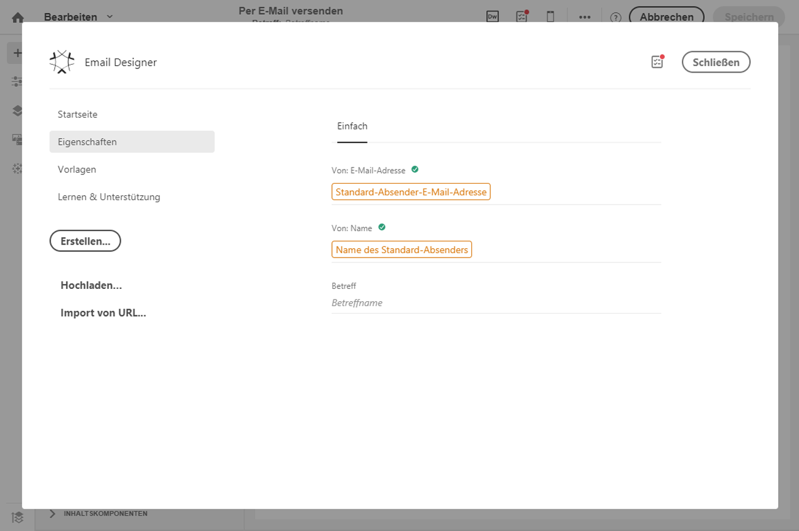
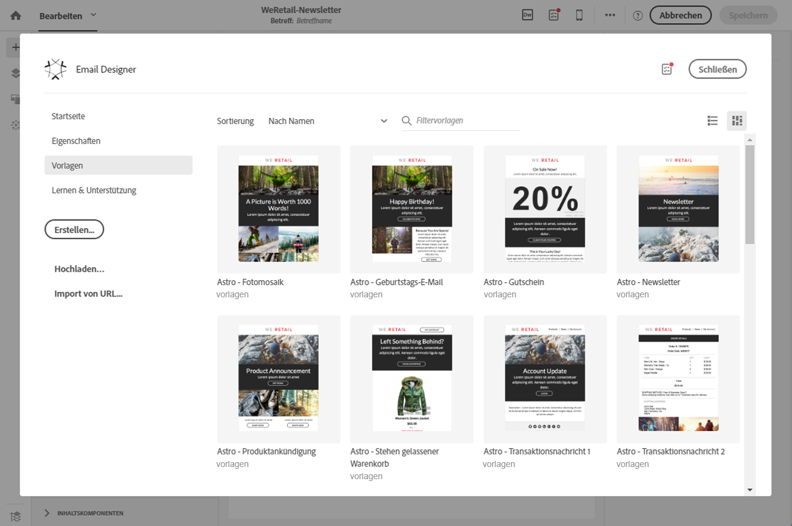
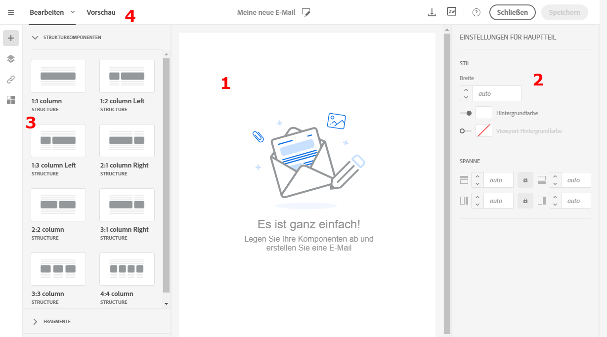
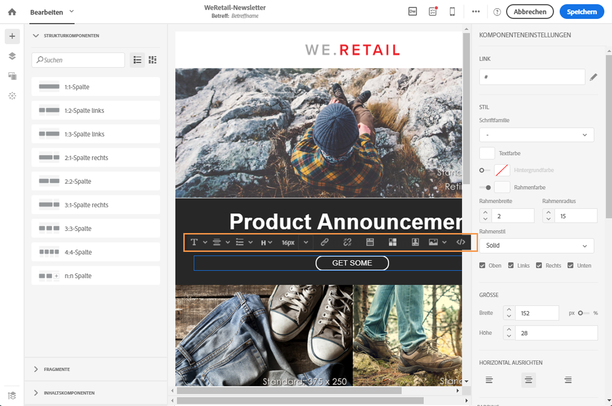
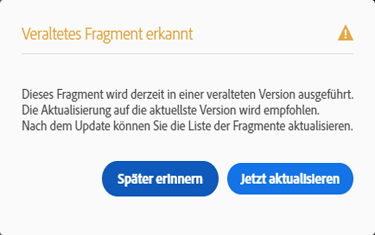

# Email Designer verwenden {#email-designer}

## Übersicht über Email Designer{#about-the-email-designer}

Email Designer ermöglicht die Erstellung von E-Mail-Inhalten und Vorlagen für E-Mail-Inhalte. Der Editor ist kompatibel mit einfachen E-Mails, Transaktions-E-Mails, A/B-Test-E-Mails, mehrsprachigen E-Mails und wiederkehrenden E-Mails.

In diesen [Videos](https://docs.adobe.com/content/help/en/campaign-learn/campaign-standard-tutorials/designing-content/email-designer/email-designer-overview.html#GettingStarted) erhalten Sie eine Anleitung zur Verwendung von Email Designer und dessen Funktionen. Insbesondere wird erläutert, wie neue E-Mails ohne Vorlage und solche mit Vorlage erstellt werden können.

### Startseite von Email Designer {#email-designer-home-page}

Bei der [Erstellung einer E-Mail](../../channels/using/creating-an-email.md) wird bei Auswahl des E-Mail-Inhalts automatisch die Startseite von **[!UICONTROL Email Designer]** angezeigt.

Im Tab **[!UICONTROL Eigenschaften]** können Sie die Details der E-Mail bearbeiten, wie z. B. den Titel, die E-Mail-Adresse und den Namen des Absenders sowie den Betreff der E-Mail. Auf diesen Tab können Sie auch durch Auswahl des E-Mail-Titels am oberen Bildschirmrand zugreifen.

Im Tab **[!UICONTROL Vorlagen]** können Sie aus nativen HTML-Inhalten oder Ihren bereits erstellten Vorlagen auswählen, was die Erstellung der E-Mail beschleunigt. Siehe auch [Inhaltsvorlagen](../../designing/using/using-reusable-content.md#content-templates).

Im Tab **[!UICONTROL Lernen &amp; Unterstützung]** können Sie auf entsprechende Handbücher und Tutorials zugreifen.

Wenn Sie keine Vorlage auswählen, können Sie über die Startseite von Email Designer auch wählen, wie Sie Ihren Inhalt erstellen möchten:

* Wählen Sie die Schaltfläche **[!UICONTROL Erstellen]**, um einen ganz neuen Inhalt zu erstellen. Siehe auch [Neuen E-Mail-Inhalt gestalten](../../designing/using/designing-from-scratch.md#designing-an-email-content-from-scratch).
* Wählen Sie die Schaltfläche **[!UICONTROL Hochladen]** aus, um eine Datei von Ihrem Computer zu laden. Siehe auch [Inhalt aus einer Datei importieren](../../designing/using/using-existing-content.md#importing-content-from-a-file).
* Wählen Sie die Schaltfläche **[!UICONTROL Import von URL]**, um vorhandenen Inhalt von einer URL abzurufen. Siehe auch [Inhalt aus einer URL importieren](../../designing/using/using-existing-content.md#importing-content-from-a-url).

### Benutzeroberfläche von Email Designer {#email-designer-interface}

Email Designer verfügt über zahlreiche Optionen zur Erstellung, Bearbeitung und Anpassung von Inhalten.

Die Benutzeroberfläche besteht aus mehreren Bereichen mit unterschiedlichen Funktionen:

Sie können mit Drag &amp; Drop Strukturkomponenten und Inhaltsfragmente aus den verfügbaren Elementen in der **Palette** (1) in den **Arbeitsbereich** (2) verschieben. Danach können Sie eine Komponente oder ein Element im **Arbeitsbereich** (2) auswählen und im Fenster **Einstellungen** (3) Stil und Aussehen anpassen.

In der **Symbolleiste** (4) sind weitere allgemeine Optionen und Einstellungen verfügbar.

>[!NOTE]
>
>Der Bereich **Einstellungen** kann abhängig von Ihrer Bildschirmauflösung und Anzeige nach links verschoben werden.

In der **dedizierten Symbolleiste** der Editor-Oberfläche sind je nach markiertem Bereich unterschiedliche Schaltflächen verfügbar. Sie enthält Aktionsschaltflächen sowie Schaltflächen zur Anpassung des Textstils. Alle Änderungen beziehen sich somit jeweils nur auf das ausgewählte Element.

### Terminologie {#terminology}

**Vorlagen**: Vorlagen sind E-Mail-Strukturen, die Sie vorbereiten und in mehreren E-Mails wiederverwenden können.

**Fragmente**: Ein Fragment ist eine Komponente, die Sie in mehreren E-Mails wiederverwenden können.

**Strukturkomponenten**: Strukturkomponenten sind Strukturelemente, mit denen Sie das Layout einer E-Mail festlegen können.

**Inhaltskomponenten**: Inhaltskomponenten sind rohe, noch leere Komponenten, die Sie in E-Mails einfügen und dort bearbeiten können.

### Best Practices bei der Inhaltserstellung {#content-design-best-practices}

Um Email Designer optimal zu nutzen und E-Mails möglichst einfach zu erstellen, empfehlen wir folgende Vorgehensweise:

* Verwenden Sie Inline Styling anstatt eines separaten CSS-Stylesheets und CSS im &lt;head>-Abschnitt einer HTML-Datei. Die Verwendung von Inline Styling ermöglicht eine optimale Speicherung und Wiederverwendung der Inhaltsfragmente.

   Siehe auch den Abschnitt zum [Hinzufügen von Inline-Styling-Attributen](../../designing/using/styles.md#adding-inline-styling-attributes).

* Verwenden Sie zum Importieren von ZIP-Dateien mit HTML-Inhalten reguläres CSS. SCSS-Stylesheets werden nicht unterstützt.

* Die einfache Erstellung und Wiederverwendung von Inhaltsfragmenten hilft Ihnen, Ihre Marketingkampagnen konsistent zu halten und damit Ihr Branding zu stärken.

   Siehe [Inhaltsfragment erstellen](../../designing/using/using-reusable-content.md#creating-a-content-fragment).

* Bei der Bearbeitung von **E-Mail-Inhalt**:

   Sehen Sie sich Ihre Nachrichten in der Vorschau an, bevor Sie sie senden. Adobe Campaign ermöglicht es Ihnen, mithilfe von Litmus das E-Mail-Rendering zu testen. Weiterführende Informationen dazu finden Sie im Abschnitt [E-Mail-Rendering](../../sending/using/email-rendering.md).

Weitere Design- und allgemeine Best Practices für Nachrichten werden im folgenden Abschnitt vorgestellt: [Best Practices des Versands](../../sending/using/delivery-best-practices.md)

### Einschränkungen in Email Designer     {#email-designer-limitations}

* Personalisierungsfelder können nicht in einem Fragment verwendet werden. Weiterführende Informationen zu Fragmenten finden Sie in [diesem Abschnitt](../../designing/using/using-reusable-content.md#about-fragments).

<!--* You cannot save directly as a fragment some content of an email that you are editing within the Email Designer. You need to copy-paste the HTML corresponding to that content into a new fragment. For more on this, see [Saving content as a fragment](../../designing/using/using-reusable-content.md#saving-content-as-a-fragment).-->
* Bei der Bearbeitung von Stilen sind nur die Web Fonts verfügbar, die von den meisten E-Mail-Clients offiziell unterstützt werden.
* Stile lassen sich nicht als Thema zur künftigen Wiederverwendung speichern. Doch der CSS-Stil kann in einer Inhaltsvorlage oder einer E-Mail gespeichert werden. Weiterführende Informationen dazu finden Sie in [diesem Abschnitt](../../designing/using/styles.md).
* Werber-Meta-Tag wird im E-Mail-Designer nicht unterstützt.
* Ersatzzeichenpaare, die nicht in der Standard-Mehrsprachigkeit des Unicode-Zeichensatzes enthalten sind, können nicht in 2 Byte (16 Bit) gespeichert werden und müssen in 2 UTF-16-Zeichen kodiert werden. Zu diesen Zeichen gehören einige CJK-Ideogramme, die meisten Emojis und einige Sprachen.
Diese Zeichen können zu Inkompatibilitätsproblemen im dynamischen Text führen. Sie müssen vor dem Senden Ihrer Nachrichten starke Tests durchführen.

### Aktualisieren von Fragmenten {#email-designer-updates}

Email Designer wird laufend verbessert. Wenn Sie E-Mail-Inhalt neu oder von einer nativen Vorlage aus erstellt haben oder wenn Sie Fragmente erstellt haben, wird Ihnen beim nächsten Öffnen des Inhalts möglicherweise folgende Aktualisierungsmeldung angezeigt:

Adobe empfiehlt, Inhalte auf die neueste Version zu aktualisieren, um Probleme wie CSS-Inkompatibilität zu vermeiden. Wählen Sie dazu **[!UICONTROL Jetzt aktualisieren]** aus.

Wenn beim Aktualisieren des Inhalts ein Fehler auftritt, überprüfen Sie Ihren HTML-Code und korrigieren Sie ihn, bevor Sie dieses Update erneut ausführen.

Beachten Sie bei Fragmenten Folgendes:

* Wenn Sie ein Fragment zu einer neuen E-Mail oder Vorlage hinzufügen möchten und diese Meldung erhalten, müssen Sie das Fragment zuerst aktualisieren.

* Wenn Sie mehrere Fragmente haben, müssen Sie jedes Fragment aktualisieren, das Sie in einem E-Mail-Inhalt verwenden möchten.

* Um Auswirkungen auf die aktuellen E-Mail-Nachrichten zu vermeiden, die noch nicht vorbereitet sind, können Sie die entsprechenden Fragmente von der Aktualisierung ausschließen.

* Sie können zwar nach wie vor E-Mails senden, die ein Fragment enthalten, das noch nicht aktualisiert wurde, dieses Fragment ist jedoch nicht bearbeitbar.

* Wenn Fragmente in E-Mails aktualisiert werden, die bereits vorbereitet wurden, wirkt sich dies nicht auf diese E-Mails aus.