# Personalisieren von E-Mail-Inhalten {#personalization}

Es gibt verschiedene Möglichkeiten, um den Inhalt und die Darstellung von Nachrichten in Adobe Campaign zu personalisieren. Diese Personalisierungsmöglichkeiten können abhängig von den jeweiligen Profilen kombiniert werden. Im Allgemeinen bietet Adobe Campaign folgende Möglichkeiten:

* Dynamische Personalisierungsfelder einfügen. Siehe [Personalisierungsfelder einfügen](#inserting-a-personalization-field).
* Vordefinierte Personalisierungsbausteine einfügen. Siehe [Inhaltsbausteine](#adding-a-content-block).
* Absender einer E-Mail personalisieren. Siehe [Personalisierung für den Absender einrichten](#personalizing-the-sender).
* Betreff einer E-Mail personalisieren. Siehe [Betreffzeile einer E-Mail personalisieren](../../designing/using/subject-line.md#subject-line).
* Bedingte Inhalte erstellen. Weitere Informationen finden Sie unter [Definieren dynamischer Inhalte in einer E-Mail](#defining-dynamic-content-in-an-email).

## Personalisierung für den Absender einrichten {#personalizing-the-sender}

Um den Absendernamen, der im Kopf der gesendeten Nachrichten erscheint, zu definieren, gehen Sie auf der Startseite von Email Designer zum Tab **[!UICONTROL Eigenschaften]** (der Zugriff erfolgt über das Startseiten-Symbol). Weitere Informationen hierzu finden Sie unter [Definieren des Absenders einer E-Mail](../../designing/using/subject-line.md#email-sender).

Sie können den Absendernamen ändern, indem Sie **Name des Absenders** auswählen. Geben Sie nun den gewünschten Absendernamen ein.

Sie haben die Möglichkeit, den Absendernamen je nach Zielgruppe zu personalisieren. Sie können Personalisierungsfelder, Inhaltsbausteine und dynamische Inhalte hinzufügen, indem Sie die Symbole unter dem Absendernamen auswählen.

>[!NOTE]
>
>Header-Parameter dürfen nicht leer sein. Die Angabe der Absenderadresse ist für den E-Mail-Versand zwingend erforderlich (gemäß RFC-Standard). Adobe Campaign führt eine Syntax-Prüfung der angegebenen E-Mail-Adressen durch.

## URLs personalisieren{#personalizing-urls}

Sie haben in Adobe Campaign die Möglichkeit, in Ihrer Nachricht eine oder mehrere URLs zu personalisieren, indem Sie Personalisierungsfelder, Inhaltsbausteine oder dynamische Inhalte an diese anschließen. Gehen Sie wie folgt vor:

1. Fügen Sie eine externe URL ein und geben Sie deren Parameter an. Siehe [Link einfügen](../../designing/using/links.md#inserting-a-link).
1. Wenn die Personalisierungsoptionen nicht angezeigt werden, verwenden Sie im Einstellungsfenster das Stiftsymbol neben der ausgewählten URL, um die Personalisierungsoptionen aufzurufen.
1. Fügen Sie die gewünschten Personalisierungsfelder, Inhaltsbausteine und dynamischen Inhalte hinzu.

   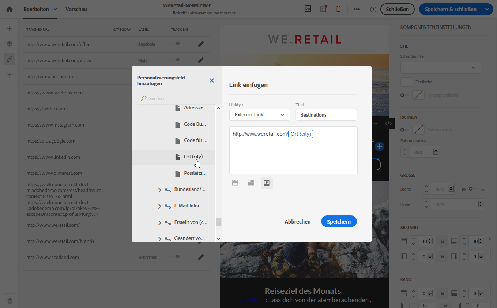

1. Speichern Sie Ihre Änderungen.

>[!NOTE]
>
>Wenn der URL-Signaturmechanismus für Trackinglinks deaktiviert ist, kann die Personalisierung von URLs weder auf den Domain-Namen noch auf die URL-Erweiterung angewendet werden. Bei der Nachrichtenanalyse wird eine Fehlernachricht angezeigt, wenn die Personalisierung nicht korrekt ist.
>
>Bei der Auswahl eines Inhaltsbausteins dürfen Sie keine Elemente wie **Link zur Mirrorseite** auswählen. Dieser Typ von Inhaltsbausteinen darf nicht innerhalb eines Links verwendet werden.

## Personalisierungsfeld einfügen{#inserting-a-personalization-field}

Adobe Campaign bietet die Möglichkeit, Felder aus der Datenbank, beispielsweise den Vornamen der Profile, in Form von Platzhaltern in Ihren Inhalten zu verwenden.

>[!NOTE]
>
>In den unten stehenden Bildern sehen Sie, wie Sie einen Link mit [Email Designer](../../designing/using/designing-content-in-adobe-campaign.md) einfügen können.

Um ein Personalisierungsfeld einzufügen, gehen Sie folgendermaßen vor:

1. Klicken Sie in einen Textbaustein und wählen Sie dann in der kontextuellen Symbolleiste das **[!UICONTROL Personalisierungssymbol]** und danach **[!UICONTROL Personalisierungsfeld einfügen]** aus. Weiterführende Informationen zur Benutzeroberfläche von Email Designer finden Sie [in diesem Abschnitt](../../designing/using/designing-content-in-adobe-campaign.md#email-designer-interface).

   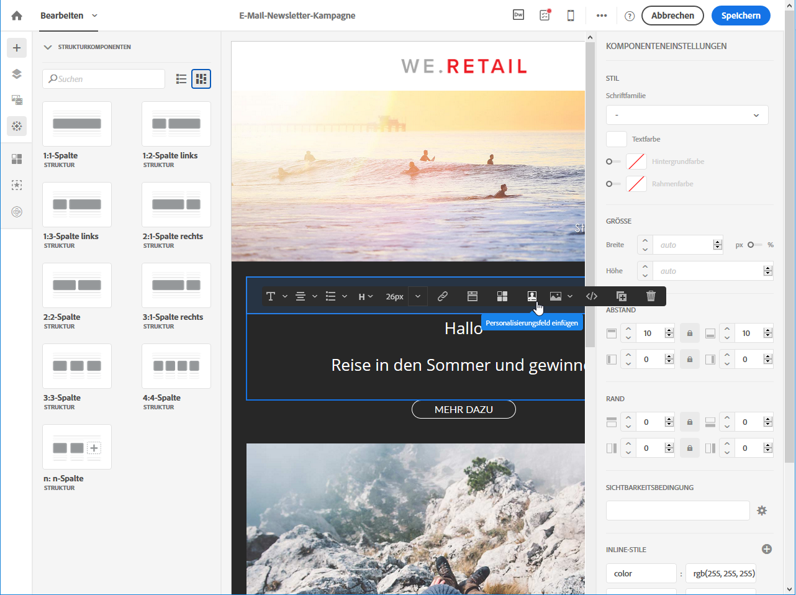

1. Wählen Sie das Feld aus, das Sie in den Inhalt der Seite einfügen möchten.

   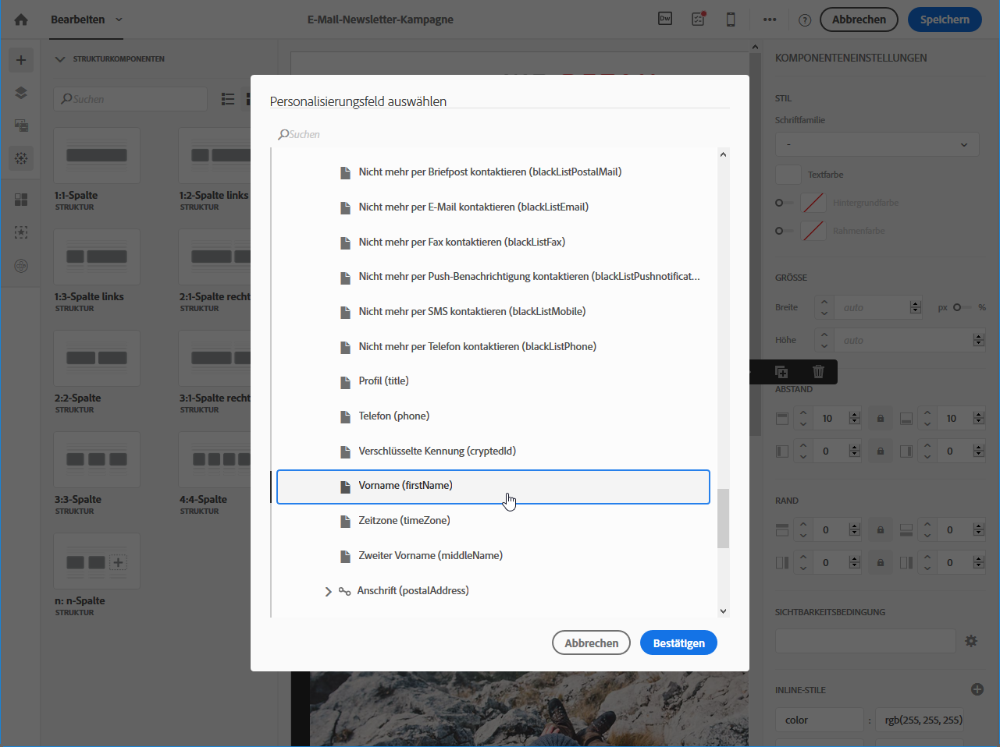

1. Wählen Sie **[!UICONTROL Bestätigen]** aus.

Der Name des Felds erscheint daraufhin hervorgehoben im Editor.

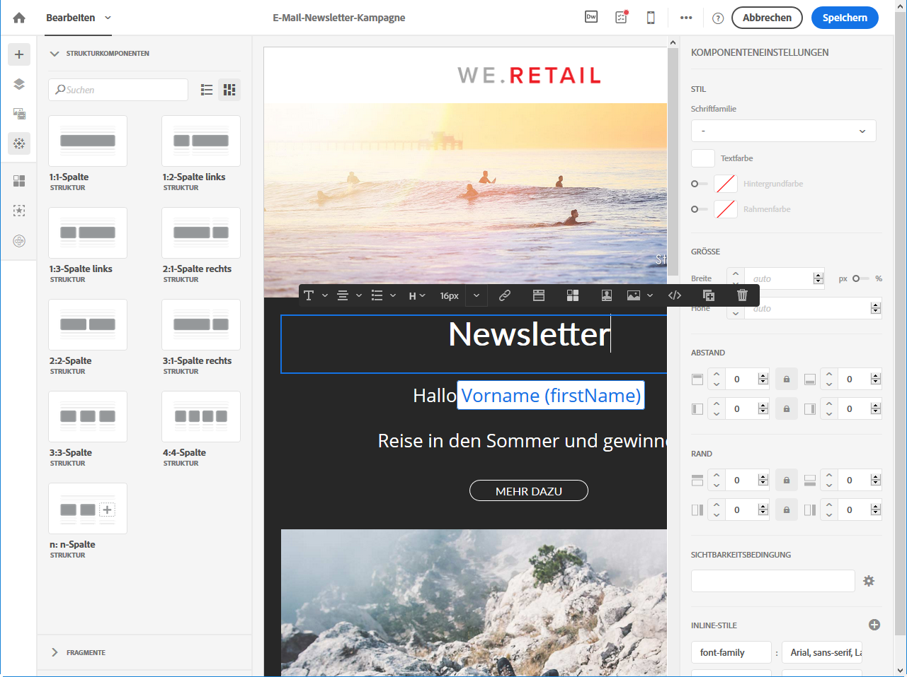

Der entsprechende Platzhalter wird zum Zeitpunkt der Personalisierung (d. h. bei der Vorschauerzeugung, der E-Mail-Vorbereitung) durch den für das jeweilige Profil gespeicherten Wert aus der Datenbank ersetzt.

>[!NOTE]
>
>Bei von einem Workflow aus erstellten E-Mails stehen außerdem die innerhalb des Workflows berechneten Zusatzdaten in den Personalisierungsfeldern zur Verfügung. Weiterführende Informationen zur Hinzufügung von Zusatzdaten innerhalb von Workflows finden Sie im Abschnitt [Daten anreichern](../../automating/using/about-targeting-activities.md#enriching-data).

## Inhaltsbaustein hinzufügen{#adding-a-content-block}

Adobe Campaign bietet eine Reihe von vorkonfigurierten Inhaltsbausteinen. Diese Bausteine sind dynamisch und personalisierbar und sie weisen ein spezifisches Rendering auf. Sie ermöglichen beispielsweise das Einfügen einer bestimmten Anrede in Abhängigkeit von den verfügbaren Empfängerinformationen oder auch eines Links zur Mirrorseite.

>[!NOTE]
>
>Auf den unten stehenden Bildern sehen Sie, wie Sie einen Inhaltsbaustein mit [Email Designer](../../designing/using/designing-content-in-adobe-campaign.md) einfügen können.

So fügen Sie einen Inhaltsbaustein hinzu:

1. Klicken Sie in einen Textbaustein und wählen Sie dann in der kontextuellen Symbolleiste das **[!UICONTROL Personalisierungssymbol]** und danach **[!UICONTROL Inhaltsbaustein einfügen]** aus. Weiterführende Informationen zur Benutzeroberfläche von Email Designer finden Sie [in diesem Abschnitt](../../designing/using/designing-content-in-adobe-campaign.md#email-designer-interface).

   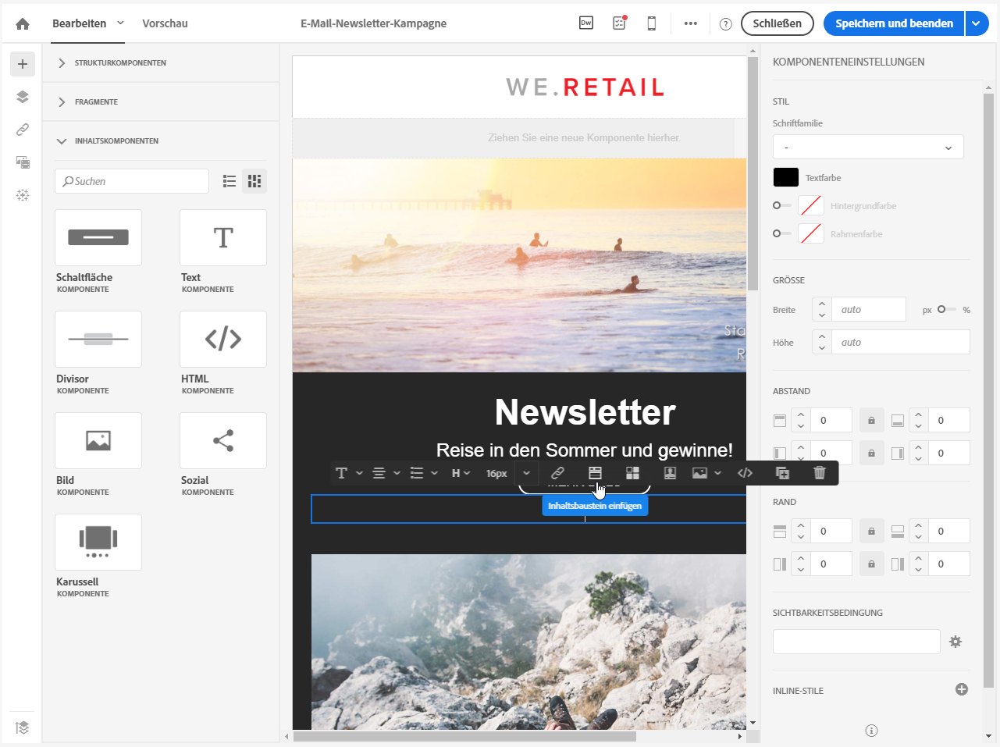

1. Wählen Sie den einzufügenden Inhaltsbaustein aus der Liste aus. Je nach Kontext (E-Mail oder Landingpage) können unterschiedliche Bausteine verfügbar sein.

   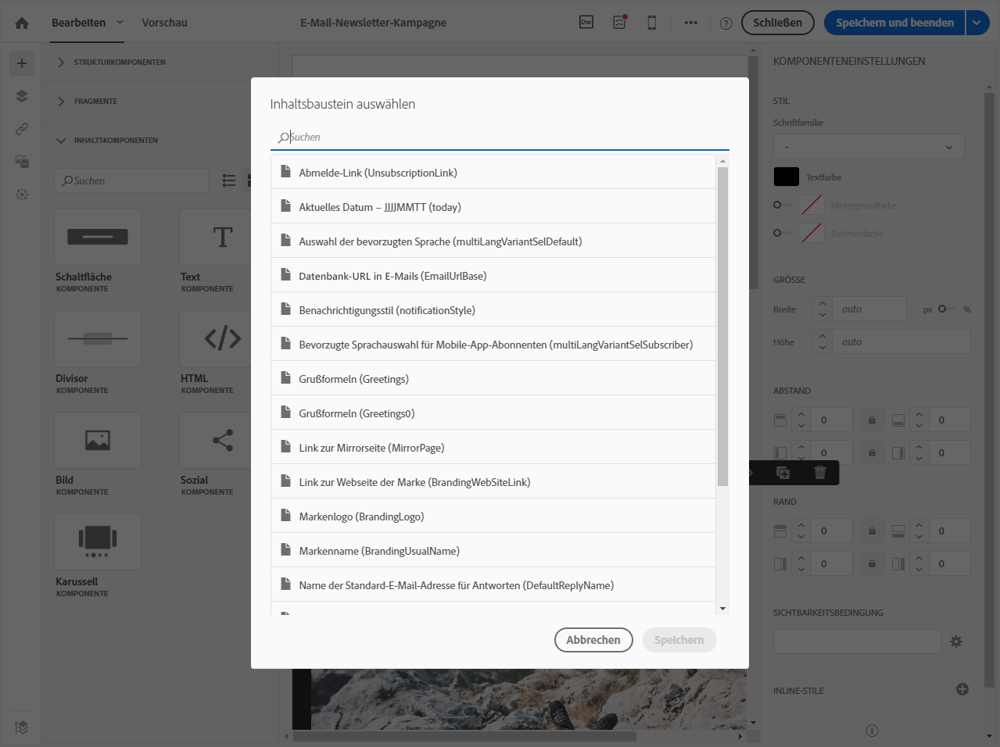

1. Wählen Sie **[!UICONTROL Speichern]** aus.

Der Name des Bausteins erscheint daraufhin im Editor. Er ist gelb unterlegt. Er wird in der Personalisierungsphase automatisch an das Profil angepasst.

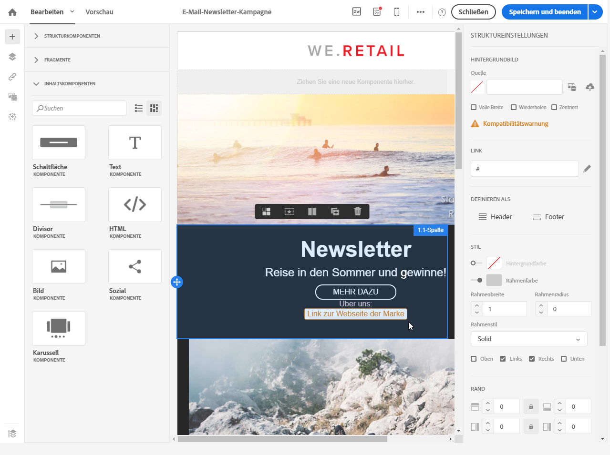

Es stehen folgende native Inhaltsbausteine zur Verfügung:

* **[!UICONTROL Basis-URL in den E-Mails (EmailUrlBase)]**: Dieser Inhaltsbaustein kann nur in einem **Versand** verwendet werden.
* **[!UICONTROL URL der Mirrorseite (MirrorPageUrl)]**: Dieser Inhaltsbaustein kann nur in einem **Versand** verwendet werden.
* **[!UICONTROL Link zur Mirrorseite (MirrorPage)]**: Dieser Inhaltsbaustein kann nur in einem **Versand** verwendet werden.
* **[!UICONTROL Grußformeln (Greetings)]**
* **[!UICONTROL Abmelde-Link (UnsubscriptionLink)]**: Dieser Inhaltsbaustein kann nur in einem **Versand** verwendet werden.
* **[!UICONTROL Teilen-Links der sozialen Netzwerke (LandingPageViralLinks)]**: Dieser Inhaltsbaustein kann nur in einer **Landingpage** verwendet werden.
* **[!UICONTROL Name des Standard-Absenders (DefaultSenderName)]**: Dieser Inhaltsbaustein kann nur in einem **Versand** verwendet werden.
* **[!UICONTROL Name der Standard-E-Mail-Adresse für Antworten (DefaultReplyName)]**: Dieser Inhaltsbaustein kann nur in einem **Versand** verwendet werden.
* **[!UICONTROL Standard-E-Mail-Adresse des Absenders (DefaultSenderAddress)]**: Dieser Inhaltsbaustein kann nur in einem **Versand** verwendet werden.
* **[!UICONTROL Standard-E-Mail-Adresse für Fehler (DefaultErrorAddress)]**: Dieser Inhaltsbaustein kann nur in einem **Versand** verwendet werden.
* **[!UICONTROL Standard-E-Mail-Adresse für Antworten (DefaultReplyAddress)]**: Dieser Inhaltsbaustein kann nur in einem **Versand** verwendet werden.
* **[!UICONTROL Markenname (BrandingUsualName)]**
* **[!UICONTROL Link zur Webseite der Marke (BrandingWebSiteLink)]**
* **[!UICONTROL Markenlogo (BrandingLogo)]**
* **[!UICONTROL Benachrichtigungsstil (notificationStyle)]**

### Benutzerdefinierte Inhaltsbausteine erstellen {#creating-custom-content-blocks}

Sie haben die Möglichkeit, weitere Inhaltsbausteine zu erstellen, die in Nachrichten oder Landingpages eingefügt werden können.

Gehen Sie wie folgt vor, um einen Inhaltsbaustein zu erstellen:

1. Greifen Sie über das erweiterte Menü und die Schaltflächen **[!UICONTROL Ressourcen > Inhaltsbausteine]** auf die Liste der Inhaltsbausteine zu.
1. Verwenden Sie die Schaltfläche **[!UICONTROL Erstellen]** oder duplizieren Sie einen bereits existierenden Inhaltsbaustein.

   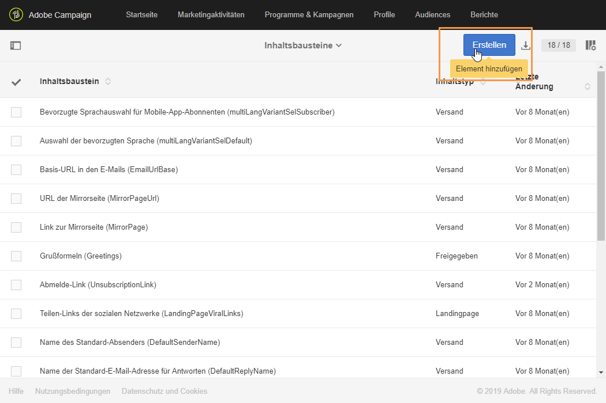

1. Geben Sie einen Titel ein.
1. Wählen Sie den **[!UICONTROL Inhaltstyp des Bausteins]**. Dabei stehen drei Optionen zur Verfügung:

   * **[!UICONTROL Freigegeben:]** Der Inhaltsbaustein kann in einem Versand oder einer Landingpage verwendet werden.
   * **[!UICONTROL Versand:]** Der Inhaltsbaustein kann nur in einem Versand verwendet werden.
   * **[!UICONTROL Landingpage:]** Der Inhaltsbaustein kann nur in einer Landingpage verwendet werden.

   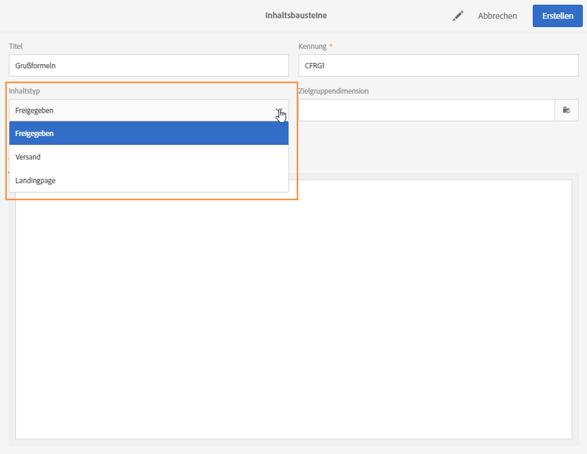

1. Sie können eine **[!UICONTROL Zielgruppendimension]** auswählen. Weiterführende Informationen dazu finden Sie im Abschnitt [Über Zielgruppendimensionen](#about-targeting-dimension).

   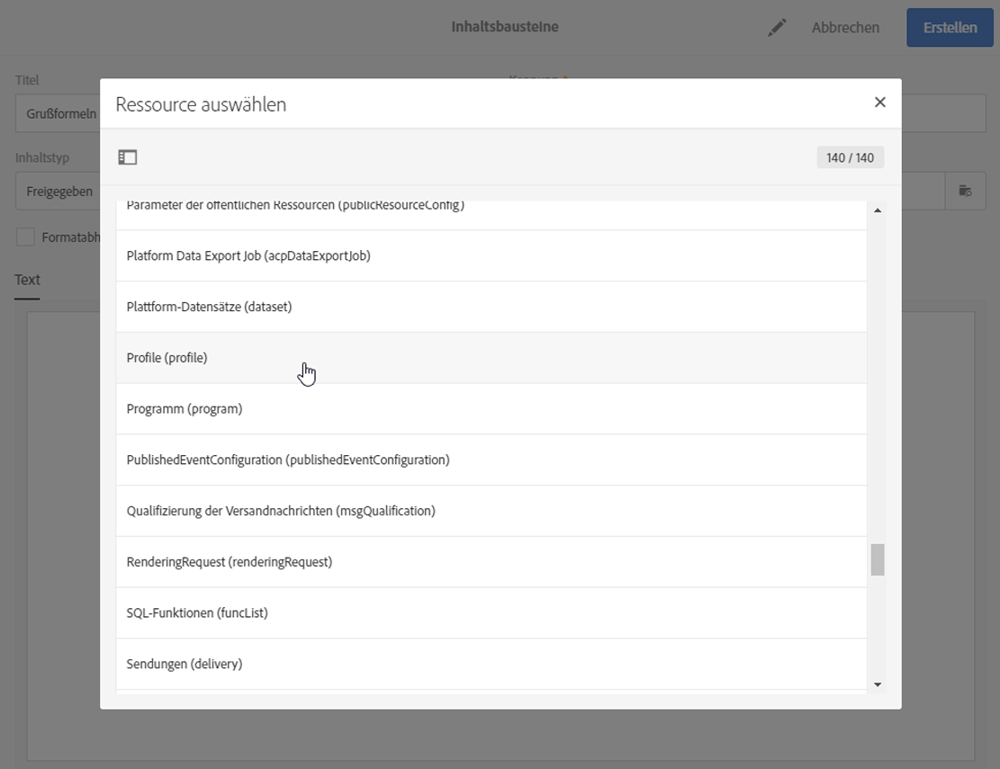

1. Wählen Sie gegebenenfalls die Option **[!UICONTROL Formatabhängig]** aus, um zwei verschiedene Bausteine zu definieren: einen für E-Mails im HTML-Format und einen für E-Mails im Textformat. Im unteren Teil des Editors werden in diesem Fall zwei Tabs (HTML und Text) angezeigt, um den jeweiligen Inhalt zu definieren.

   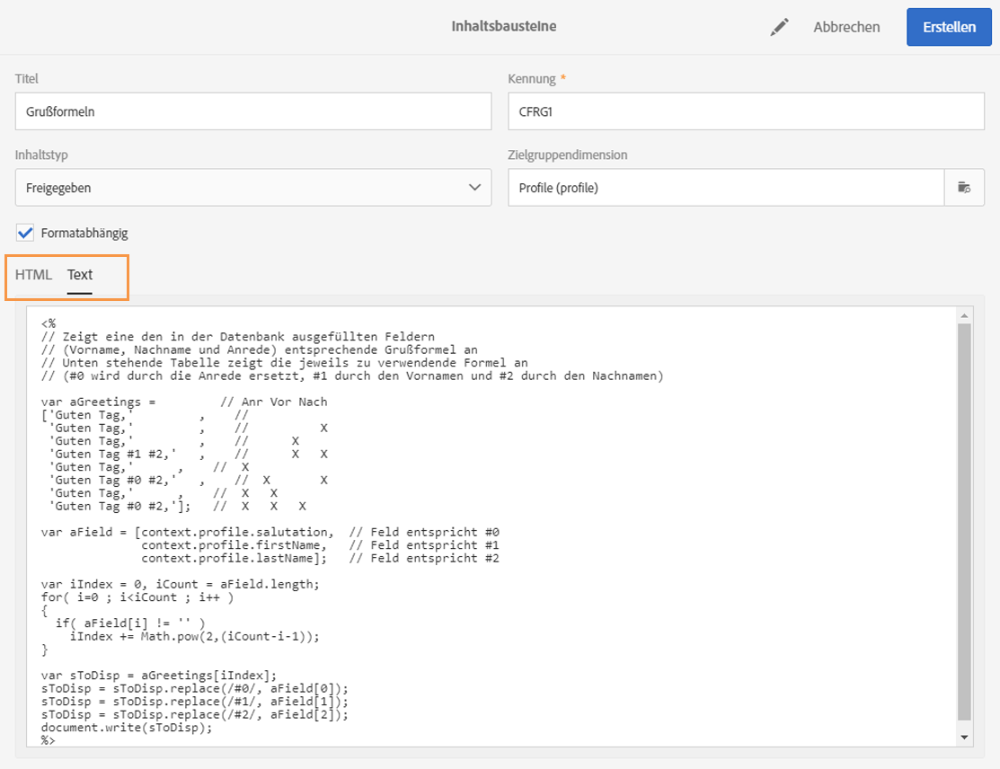

1. Geben Sie den Inhalt des bzw. der Inhaltsbausteine an und bestätigen Sie die Angaben mithilfe der Schaltfläche **[!UICONTROL Erstellen]**.

Der Inhaltsbaustein kann nun im Inhaltseditor einer Nachricht oder einer Landingpage verwendet werden.

>[!CAUTION]
>
>Achten Sie darauf, dass beim Bearbeiten des Inhalts eines Bausteins keine zusätzlichen Leerzeichen zwischen dem Anfang und dem Ende Ihrer *if*-Anweisungen vorhanden sind. In HTML werden die Leerzeichen auf dem Bildschirm angezeigt und wirken sich daher auf die Darstellung des Inhalts aus.

### Über Zielgruppendimensionen             {#about-targeting-dimension}

Mit der Zielgruppendimension können Sie festlegen, in welchem Nachrichtentyp Sie den Inhaltsbaustein verwenden können. Auf diese Weise wird verhindert, dass in einer Nachricht unpassende Bausteine verwendet werden, die zu Fehlern führen könnten.

Beim Bearbeiten einer Nachricht können Sie nur Inhaltsbausteine mit einer Zielgruppendimension auswählen, die mit der Zielgruppendimension der Nachricht kompatibel ist.

Beispielsweise ist die Zielgruppendimension des Bausteins **[!UICONTROL Abmelde-Link]** **[!UICONTROL Profile]**, da diese Zielgruppendimension Personalisierungsfelder speziell für die Ressource **[!UICONTROL Profile]** enthält. Folglich kann der Baustein **[!UICONTROL Abmelde-Link]** nicht in einer [Ereignis-Transaktionsnachricht](../../channels/using/getting-started-with-transactional-msg.md#transactional-message-types) verwendet werden, weil die Zielgruppendimension dieses Nachrichtentyps **[!UICONTROL Echtzeit-Ereignisse]** lautet. Sie können aber den Baustein **Abmelde-Link** in einer [Profil-Transaktionsnachricht](../../channels/using/getting-started-with-transactional-msg.md#transactional-message-types) verwenden, weil die Zielgruppendimension dieses Nachrichtentyps **Profile** lautet. Der Baustein **[!UICONTROL Link zur Mirrorseite]** hat keine Zielgruppendimension, deshalb kann er in jeder beliebigen Nachricht verwendet werden.

Wenn Sie dieses Feld leer lassen, ist der Inhaltsbaustein unabhängig von der Zielgruppendimension mit allen Nachrichten kompatibel. Wenn Sie eine Zielgruppendimension festlegen, ist dieser Baustein nur mit Nachrichten kompatibel, die dieselbe Zielgruppendimension aufweisen.

Lesen Sie diesbezüglich auch den Abschnitt [Zielgruppendimensionen und Ressourcen](../../automating/using/query.md#targeting-dimensions-and-resources).

**Verwandte Themen:**

* [Personalisierungsfeld einfügen](#inserting-a-personalization-field)
* [Inhaltsbaustein hinzufügen](#adding-a-content-block)
* [Dynamische Inhalte in einer E-Mail definieren](#defining-dynamic-content-in-an-email)

## Bildquellen personalisieren{#personalizing-an-image-source}

Sie haben in Adobe Campaign die Möglichkeit, in Ihrer Nachricht ein oder mehrere Bilder nach einem bestimmten Kriterium zu personalisieren oder Tracking zu verwenden, indem Sie Personalisierungsfelder, Inhaltsbausteine oder dynamische Inhalte in die Bildquelle einfügen. Gehen Sie wie folgt vor:

1. Fügen Sie entweder ein neues Bild in Ihren Nachrichteninhalt ein oder wählen Sie ein bereits vorhandenes Bild aus.
1. Aktivieren Sie in der Palette der Bildeigenschaften die Option **[!UICONTROL Personalisierung aktivieren]**.

   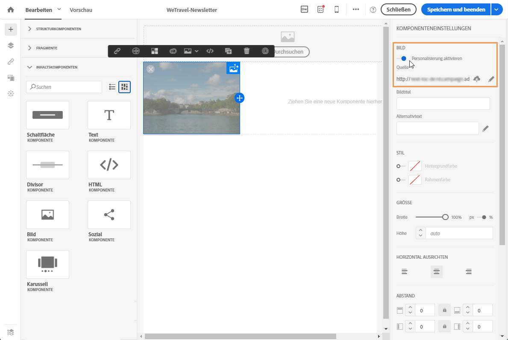

   Das Feld **[!UICONTROL Quelle]** wird angezeigt und das ausgewählte Bild ist im Editor als **personalisiert** gekennzeichnet.

1. Greifen Sie mithilfe des Stiftsymbols neben der Schaltfläche des **[!UICONTROL Quelle]**-Felds auf die Personalisierungsoptionen zu.
1. Fügen Sie im Anschluss an die ursprüngliche Bildquelle die gewünschten Personalisierungsfelder, Inhaltsbausteine und dynamischen Inhalte hinzu.

   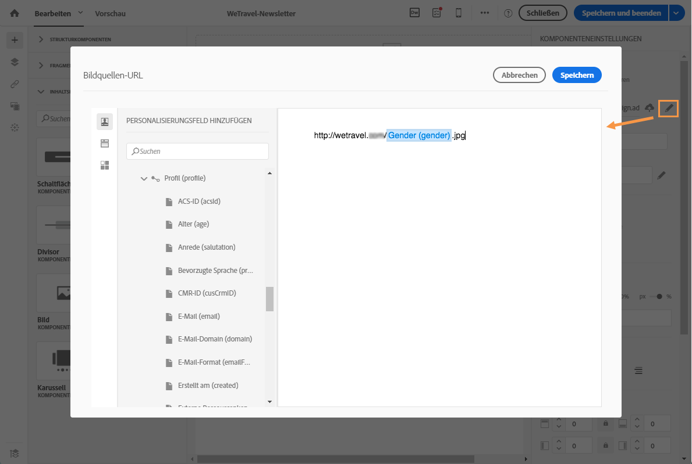

   >[!NOTE]
   >
   >Der Domain-Name (http://meinedomain.com) kann nicht personalisiert werden, sondern muss manuell eingegeben werden. Die restliche URL kann personalisiert werden. Beispiel: http://meinedomain.com/`[Gender]`.jpg

1. Bestätigen Sie Ihre Änderungen.

## Bedingter Inhalt {#conditional-content}

### Sichtbarkeitsbedingung definieren{#defining-a-visibility-condition}

Es besteht die Möglichkeit, für alle Elemente Sichtbarkeitsbedingungen zu definieren. Das entsprechende Element wird nur dann angezeigt, wenn die Bedingung erfüllt ist.

Markieren Sie den gewünschten Block und geben Sie in den Einstellungen im Feld **[!UICONTROL Sichtbarkeitsbedingung]** die zu erfüllende Bedingung an.

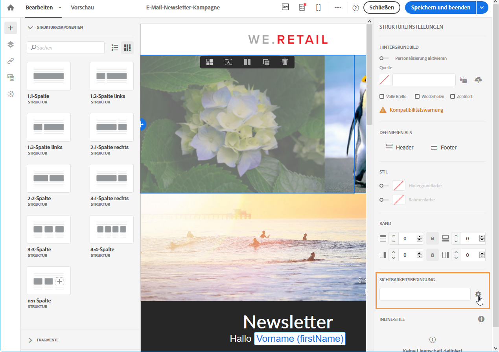

Diese Option steht nur für folgende Elemente zur Verfügung: ADDRESS, BLOCKQUOTE, CENTER, DIR, DIV, DL, FIELDSET, FORM, H1, H2, H3, H4, H5, H6, NOSCRIPT, OL, P, PRE, UL, TR, TD.

Weiterführende Informationen zum Ausdruckseditor finden Sie im Abschnitt [Ausdrucksbearbeitung](../../automating/using/editing-queries.md#about-query-editor).

Diese Bedingungen übernehmen die XTK-Ausdruckssyntax (z. B. **context.profile.email !=&#39;&#39;** oder **context.profile.status=&#39;0&#39;**). Standardmäßig werden alle Felder angezeigt.

>[!NOTE]
>
>Es ist nicht möglich, Bedingungen für Blöcke zu definieren, die Unterelemente mit dynamischen Inhalten enthalten oder die selbst bereits einem dynamischen Inhalt angehören. Unsichtbare dynamische Blöcke, wie beispielsweise Dropdown-Menüs, können nicht bearbeitet werden.

### Dynamische Inhalte in einer E-Mail definieren{#defining-dynamic-content-in-an-email}

>[!CONTEXTUALHELP]
>id="ac_dynamic_content"
>title="Dynamische Inhalte definieren"
>abstract="Definieren Sie unterschiedliche Inhalte, die einigen Profilen nur entsprechend den von Ihnen festgelegten Bedingungen angezeigt werden."

Es besteht die Möglichkeit, für eine E-Mail multiple Inhalte zu erstellen, die in Abhängigkeit von mithilfe des Ausdruckseditors definierten Bedingungen den Empfängern dynamisch angezeigt werden. So kann beispielsweise jedem Profil je nach seiner Altersgruppe ein abweichender Inhalt angezeigt werden.

Die Definition dynamischer Inhalte erfolgt anders als die Definition von [Sichtbarkeitsbedingungen](#defining-a-visibility-condition).

1. Wählen Sie ein Fragment, eine Komponente oder ein Element aus. Wählen Sie für dieses Beispiel ein Bild aus.
1. Wählen Sie in der kontextuellen Symbolleiste das Symbol für **[!UICONTROL dynamischen Inhalt]** aus.

   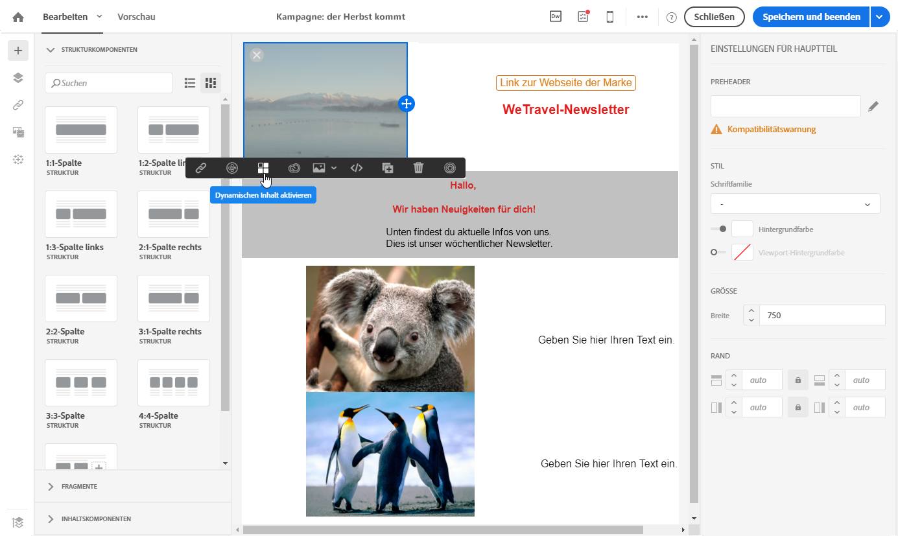

   Daraufhin wird in der Palette auf der linken Seite der Bereich **[!UICONTROL Dynamischer Inhalt]** angezeigt.

   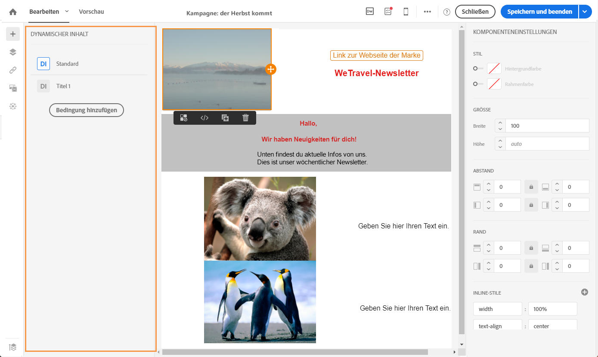

   Standardmäßig enthält dieser Bereich zwei Elemente: die Standardvariante und eine neue Variante.

   >[!NOTE]
   >
   >Für den Inhalt muss stets eine Standardvariante vorhanden sein. Diese kann nicht gelöscht werden.

1. Wählen Sie die Schaltfläche **[!UICONTROL Bearbeiten]** aus, um die Anzeigebedingungen für die erste Variante zu definieren.

   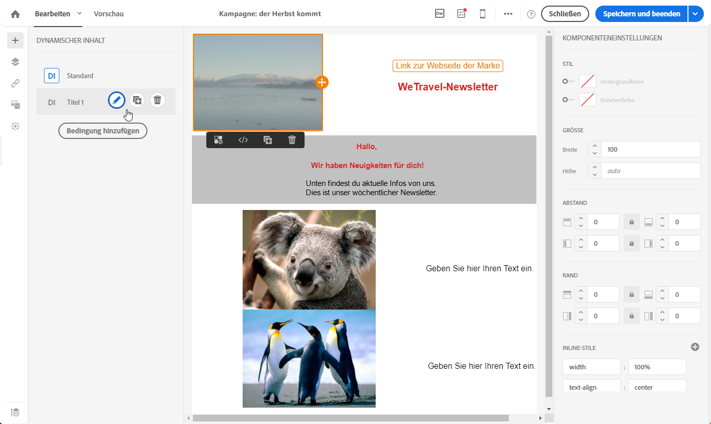

1. Geben Sie einen Titel ein und wählen Sie die Felder aus, die als Bedingungen spezifiziert werden sollen. Wählen Sie beispielsweise im Knoten **[!UICONTROL Allgemein]** das Feld **[!UICONTROL Alter]** aus.

   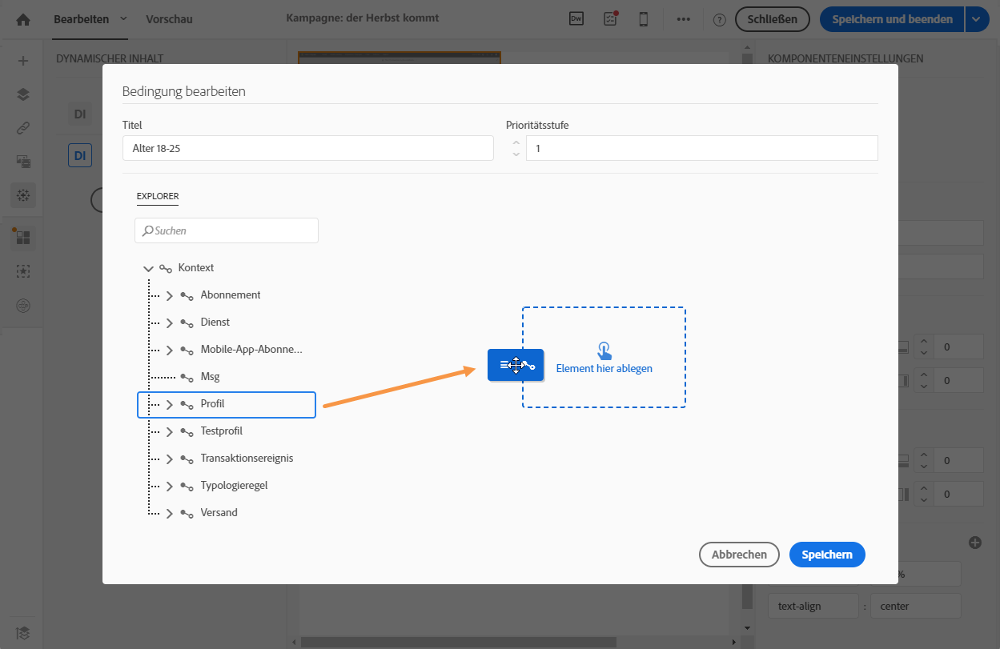

1. Definieren Sie die Filterbedingungen. Beispielsweise könnten Sie Personen zwischen 18 und 25 Jahren einen anderen Inhalt anzeigen lassen.

   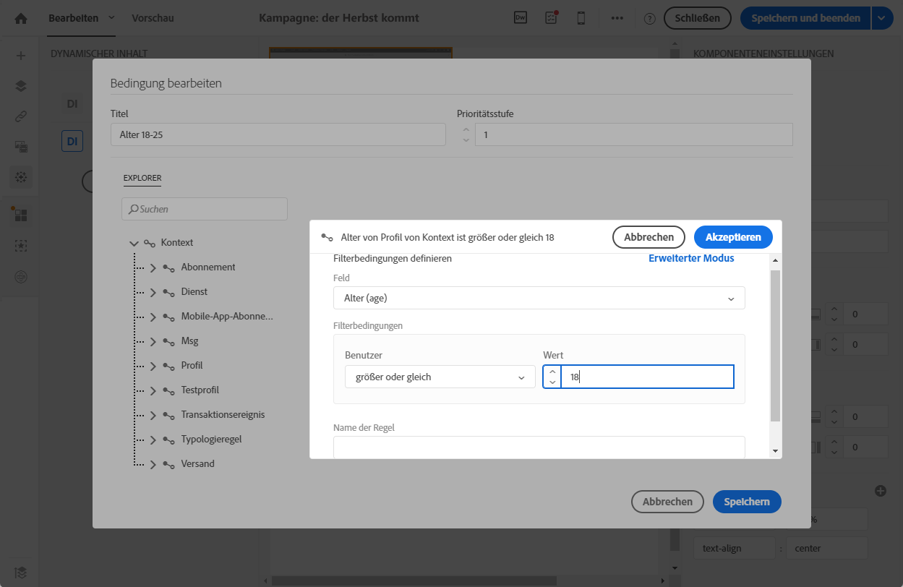

1. Nachdem alle Bedingungen spezifiziert sind, definieren Sie die Reihenfolge, in der diese angewendet werden sollen, und speichern Sie die Änderungen.

   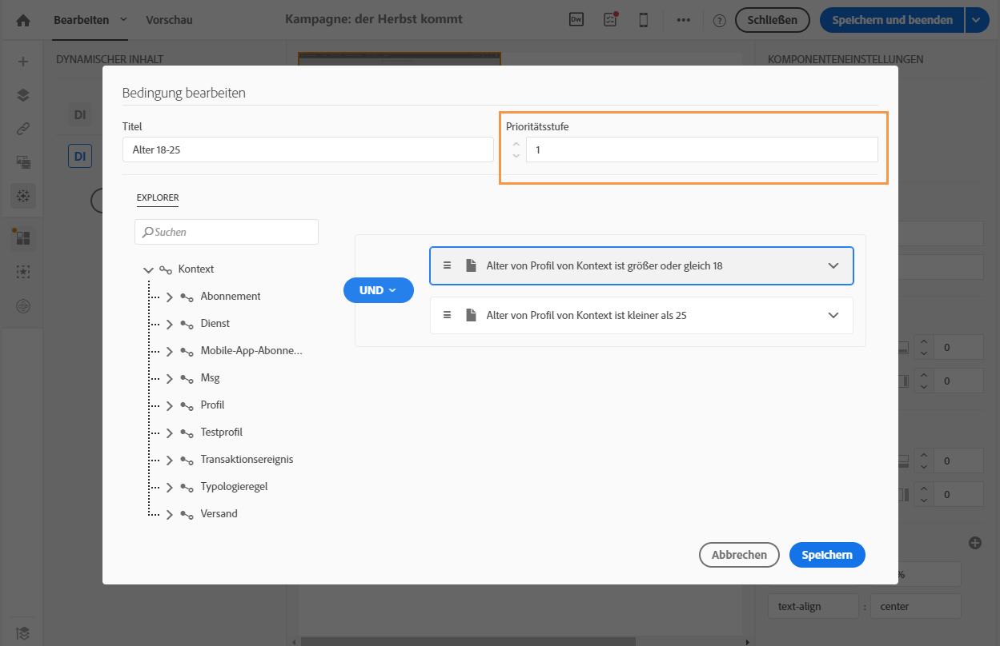

   Die Inhalte werden in der Reihenfolge ihrer Priorität von oben nach unten in der Palette angezeigt. Weiterführende Informationen zu Prioritäten finden Sie in [diesem Abschnitt](#defining-dynamic-content-in-an-email).

1. Laden Sie ein neues Bild für die soeben definierte Variante hoch.

   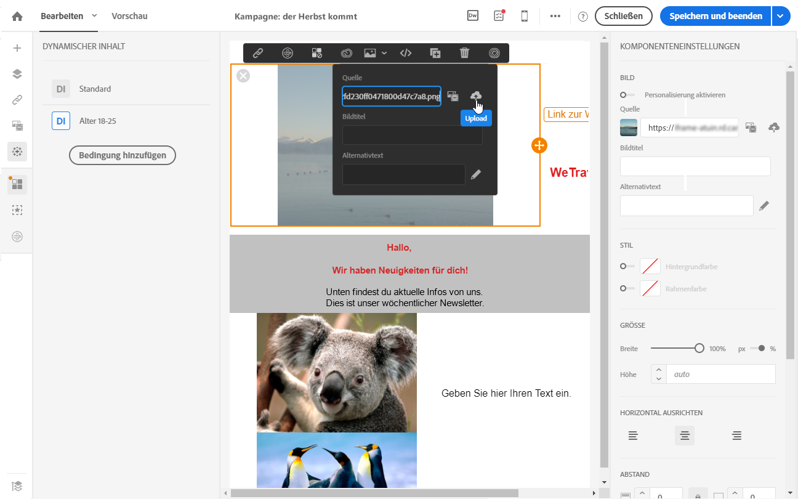

   Den Empfängern zwischen 18 und 25 Jahren wird das neue Bild angezeigt.

   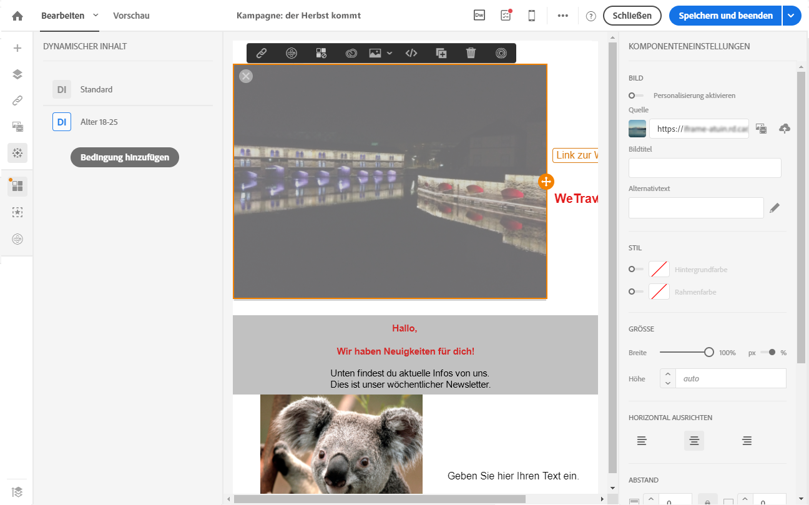

1. Verwenden Sie die Schaltfläche **[!UICONTROL Bedingung hinzufügen]**, um einen weiteren Inhalt und die entsprechende Regel hinzuzufügen.

   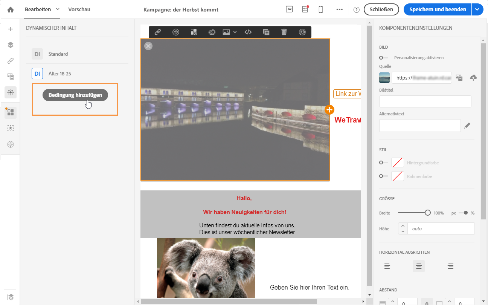

   Beispielsweise könnten Sie Personen zwischen 26 und 35 Jahren ein anderes Bild anzeigen lassen.

1. Gehen Sie für alle anderen Elemente Ihrer E-Mail, die dynamisch angezeigt werden soll, analog vor. Dabei kann es sich um Text, Schaltflächen, Fragmente etc. handeln. Speichern Sie Ihre Änderungen.

>[!CAUTION]
>
>Nach der Vorbereitung der Nachricht und vor ihrem Versand ist die Nachricht mithilfe eines Testversands zu prüfen. Andernfalls werden etwaige Fehler unter Umständen nicht erkannt und die E-Mail nicht versendet.

**Verwandte Themen:**

* [Testversand durchführen](../../sending/using/sending-proofs.md)
* [Erweiterten Ausdruck bearbeiten](../../automating/using/editing-queries.md#about-query-editor)

### Prioritätsstufe {#order-of-priority}

Bei der Definition eines dynamischen Inhalts im Ausdruckseditor wird folgende Priorität verwendet:

1. Definieren Sie zwei verschiedene dynamische Inhalte mit **zwei verschiedenen Bedingungen**, wie z. B.:

   **Bedingung 1**: Das Geschlecht des Profils ist männlich,

   **Bedingung 2**: Das Profil ist zwischen 20 und 30 Jahre alt.

   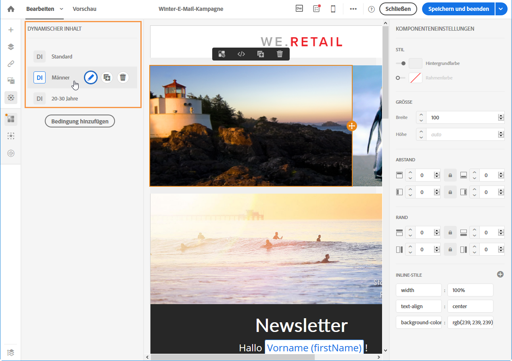

   Gewisse Profile Ihrer Datenbank erfüllen beide Bedingungen, jedes kann jedoch nur eine E-Mail mit einem einzigen dynamischen Inhalt erhalten.

1. Es ist daher notwendig, die Prioritätsstufen der dynamischen Inhalte festzulegen. Ein Profil, das die Bedingung mit Prioritätsstufe **1** erfüllt, wird nur den dynamischen Inhalt erhalten, der dieser Bedingung entspricht, auch wenn es gleichzeitig die Bedingungen mit Prioritätsstufe **2** oder **3** erfüllt.

   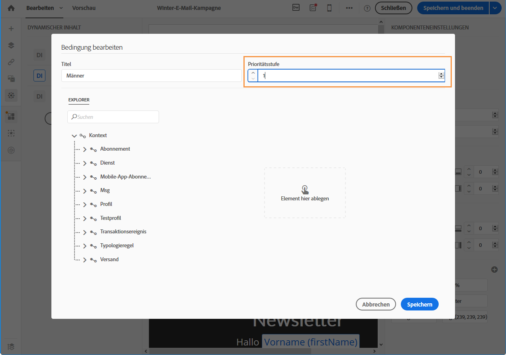

Pro dynamischer Inhalt lässt sich lediglich eine Prioritätsstufe festlegen.

## Beispiel: E-Mail-Personalisierung{#example-email-personalization}

Im vorliegenden Beispiel hat ein Mitglied des Marketing-Teams eine E-Mail erstellt, um einige Kunden darüber zu informieren, dass es ein exklusives Sonderangebot für sie gibt. Der E-Mail-Inhalt soll je nach Alter der Empfänger personalisiert werden. Empfänger zwischen 18 und 27 Jahren sollen eine E-Mail mit einer anderen Illustration und einer anderen Anrede erhalten als Empfänger über 27 Jahre.

Gehen Sie bei der E-Mail-Erstellung wie folgt vor:

* Aktivieren Sie für die Illustration den dynamischen Inhalt und konfigurieren Sie ihn in Abhängigkeit vom Alter der Empfänger.

  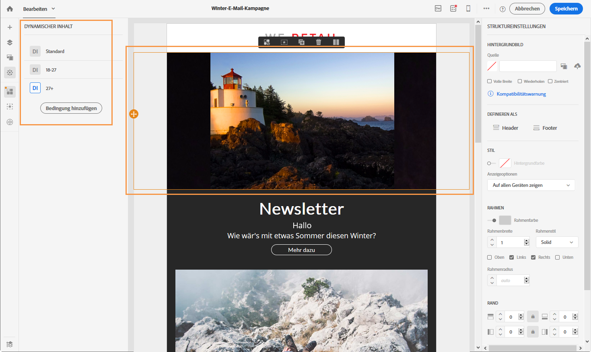

  Weiterführende Informationen zum Hinzufügen und Konfigurieren von dynamischen Inhalten finden Sie im Abschnitt [Dynamische Inhalte in einer E-Mail definieren](#defining-dynamic-content-in-an-email).

* Aktivieren Sie für den Text den dynamischen Inhalt und fügen Sie Personalisierungsfelder ein. Abhängig von der Altersgruppe des Profils beginnt die E-Mail entweder mit dem Vornamen oder dem Titel und dem Nachnamen des Profils.

  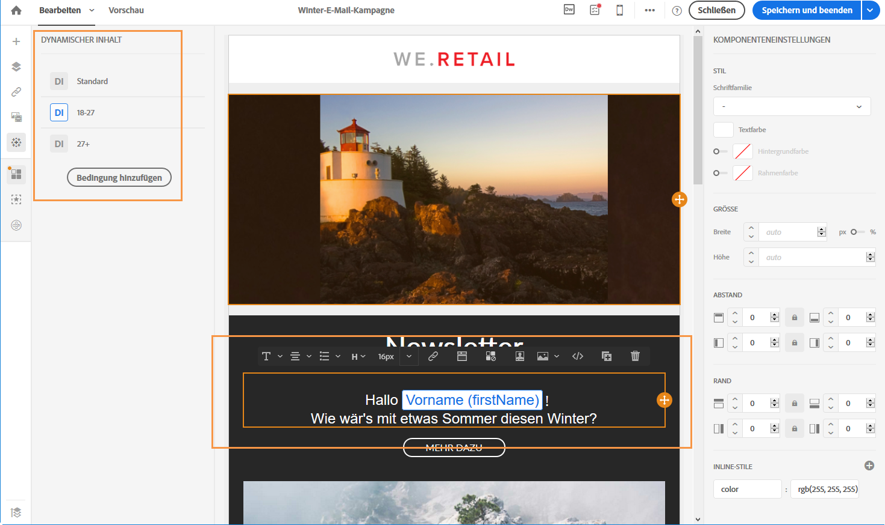

  Weiterführende Informationen zum Hinzufügen und Konfigurieren der Personalisierungsfelder finden Sie im Abschnitt [Personalisierungsfelder einfügen](#inserting-a-personalization-field).

### Bilder konfigurieren {#configuring-images}

>[!CONTEXTUALHELP]
>id="ac_dynamic_image"
>title="Verwalten dynamischer Bilder"
>abstract="Personalisieren Sie Ihre E-Mail mit dynamischen Bildern gemäß den von Ihnen festgelegten Bedingungen."

Gehen Sie wie folgt vor:

**Für die Zielgruppe 18 bis 27 Jahre:**

1. Markieren Sie den dynamischen Inhalt im **[!UICONTROL Eigenschaften]**-Bereich der Palette und öffnen Sie den Ausdruckseditor mithilfe der Schaltfläche **[!UICONTROL Bearbeiten]**.

   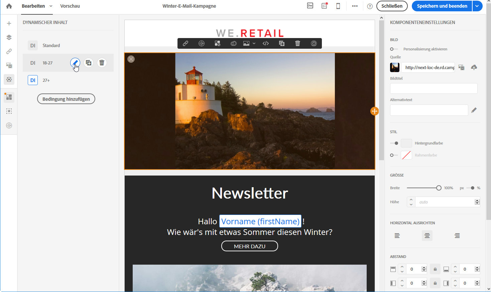

1. Benennen Sie den Inhalt und wählen Sie im **[!UICONTROL Profil]**-Knoten das **[!UICONTROL Alter]**-Feld aus.

   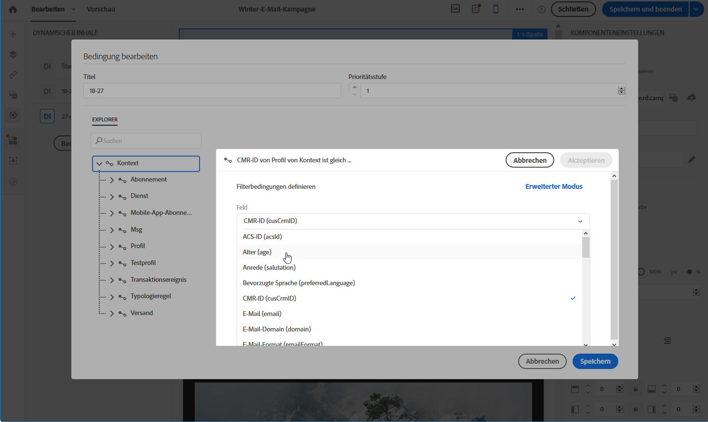

1. Vervollständigen Sie den Ausdruck mit dem Operator **Größer oder gleich** und dem Wert **18**. Auf diese Weise werden alle Profile ausgewählt, für die die Bedingung **18 Jahre und älter** zutrifft.

   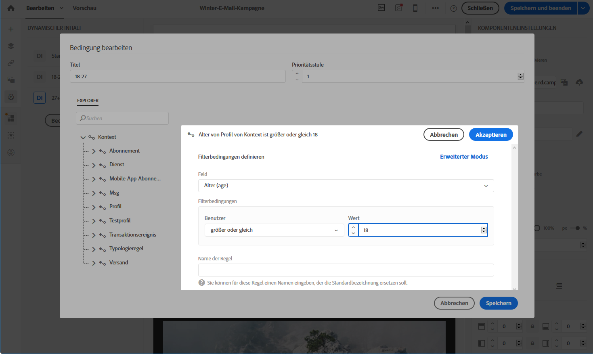

1. Fügen Sie eine weitere Bedingung vom Typ **[!UICONTROL Alter]** hinzu.

   Vervollständigen Sie den Ausdruck mit dem Operator **Kleiner oder gleich** und 27. Auf diese Weise werden alle Profile ausgewählt, für die die Bedingung **27 Jahre und jünger** zutrifft.

   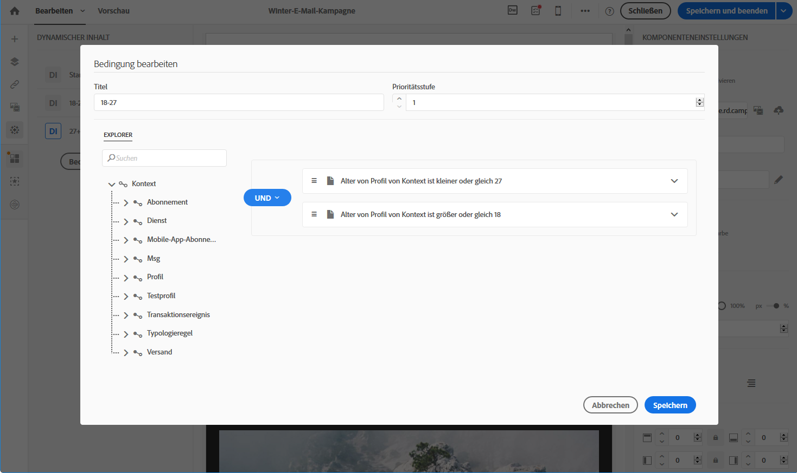

1. Bestätigen Sie Ihre Änderungen.

**Für die Zielgruppe über 27 Jahre:**

1. Markieren Sie den nächsten dynamischen Inhalt in der Palette und öffnen Sie den Ausdruckseditor.
1. Benennen Sie den Inhalt und wählen Sie im **[!UICONTROL Profil]**-Knoten das **[!UICONTROL Alter]**-Feld aus.
1. Vervollständigen Sie den Ausdruck mit dem Operator **Größer als** und 27. Auf diese Weise werden alle Profile ausgewählt, für die die Bedingung **älter als 27 Jahre** zutrifft.

   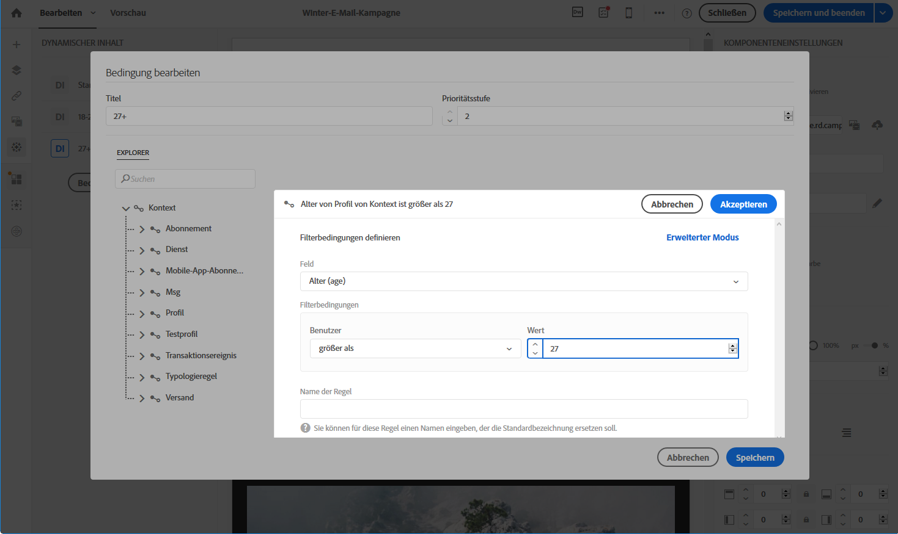

1. Bestätigen Sie Ihre Änderungen.

Die dynamischen Inhalte für die Illustrationen wurden korrekt konfiguriert.

### Text konfigurieren             {#configuring-text}

Gehen Sie wie folgt vor:

**Für die Zielgruppe 18 bis 27 Jahre:**

1. Markieren Sie die anzupassende Strukturkomponente und fügen Sie einen dynamischen Inhalt hinzu.
1. Öffnen Sie den Ausdruckseditor des nächsten dynamischen Inhalts und konfigurieren Sie die Bedingung entsprechend der Zielgruppe. Lesen Sie diesbezüglich auch den Abschnitt [Illustrationen konfigurieren](#configuring-images).
1. Wählen Sie in der Strukturkomponente an der gewünschten Position das **[!UICONTROL Personalisierungssymbol]** in der kontextuellen Symbolleiste und danach **[!UICONTROL Personalisierungsfeld einfügen]** aus.

   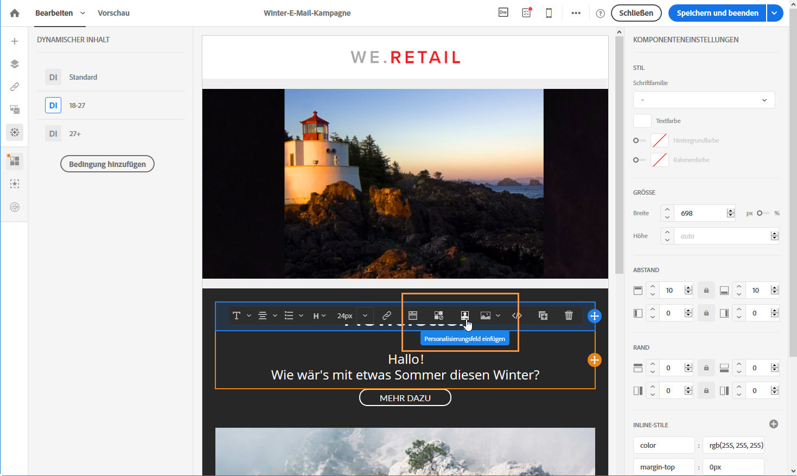

1. Markieren Sie in der sich öffnenden Liste das **[!UICONTROL Vorname]**-Feld und bestätigen Sie Ihre Auswahl.

   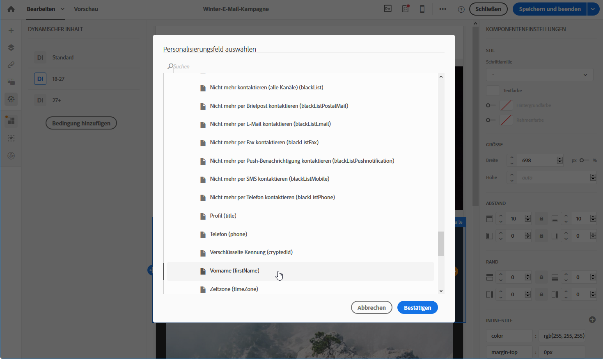

1. Das Personalisierungsfeld wurde korrekt in den ausgewählten dynamischen Inhalt eingefügt.

**Für die Zielgruppe über 27 Jahre:**

1. Markieren Sie die anzupassende Strukturkomponente und fügen Sie einen dynamischen Inhalt hinzu.
1. Öffnen Sie den Ausdruckseditor des nächsten dynamischen Inhalts und konfigurieren Sie die Bedingung entsprechend der Zielgruppe. Lesen Sie diesbezüglich auch den Abschnitt [Illustrationen konfigurieren](#configuring-images).
1. Wählen Sie in der Strukturkomponente an der gewünschten Position das **[!UICONTROL Personalisierungssymbol]** in der kontextuellen Symbolleiste und danach **[!UICONTROL Personalisierungsfeld einfügen]** aus.
1. Markieren Sie in der sich öffnenden Liste das **[!UICONTROL Anrede]**-Feld.
1. Gehen Sie analog vor, um das Feld **[!UICONTROL Nachname]** hinzuzufügen.

   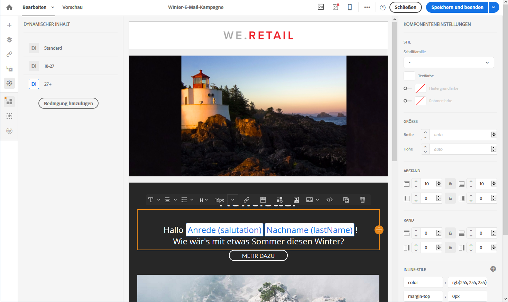

Die Personalisierungsfelder wurden korrekt in den ausgewählten dynamischen Inhalt eingefügt.

### Vorschau der E-Mail erzeugen             {#previewing-emails}

Anhand der Vorschau kann geprüft werden, ob die Personalisierungsfelder und die dynamischen Inhalte korrekt konfiguriert wurden, bevor die **[!UICONTROL Testsendungen]** erzeugt werden. Bei der Vorschau können verschiedene Testprofile ausgewählt werden, die den verschiedenen Zielgruppen der E-Mail entsprechen.

Wenn kein Testprofil ausgewählt wird, wird folgende Standard-E-Mail angezeigt:

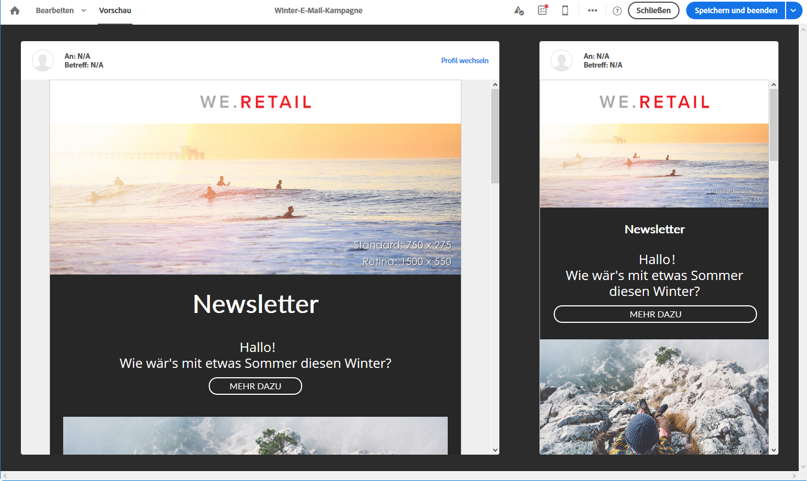

Die Anrede ist nicht personalisiert und es wird die Standard-Illustration angezeigt.

Das erste Testprofil stammt aus der Altersgruppe von 18 bis 27 Jahren. Die seiner Altersgruppe entsprechende E-Mail stellt sich wie folgt dar:

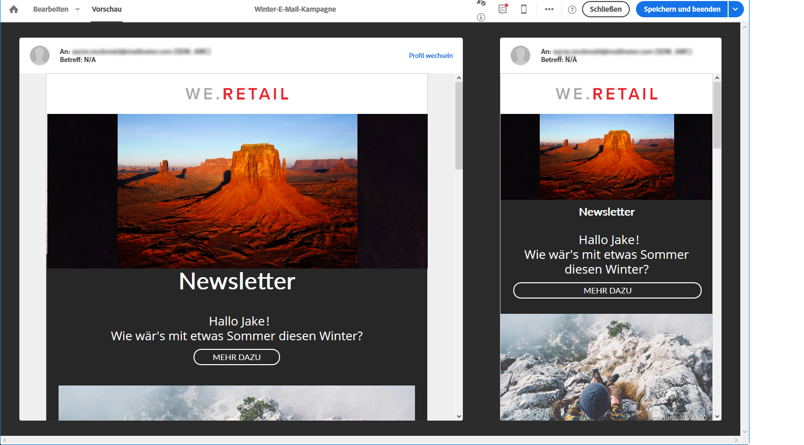

Als Anrede wird wie gewünscht der Vorname des Profils angezeigt und auch die Illustration entspricht der, die für diese Altersgruppe definiert wurde.

Das zweite Testprofil stammt aus der Altersgruppe von über 27 Jahren. Die entsprechende E-Mail stellt sich wie folgt dar:

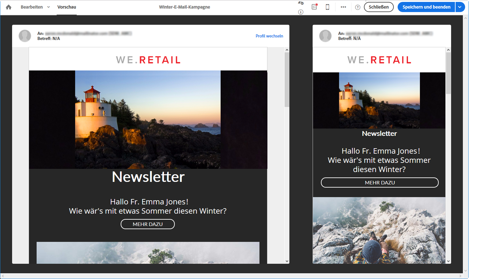

Die Illustration zeigt die im dynamischen Inhalt für diese Altersgruppe konfigurierte und auch die Anrede wird korrekt in ihrer langen Version angezeigt.

**Verwandte Themen:**

* [Erstellen von Audiences](../../audiences/using/creating-audiences.md)
* [Versandvorbereitung](../../sending/using/preparing-the-send.md)
