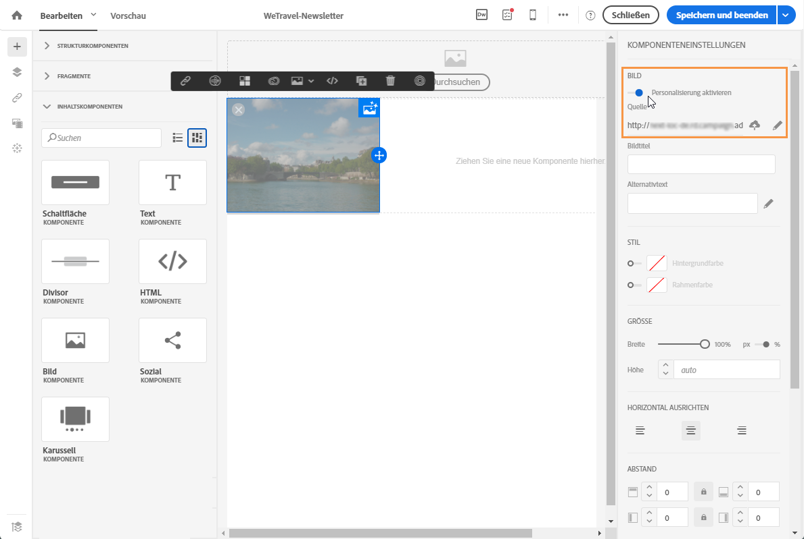

# Bildquellen personalisieren{#personalizing-an-image-source}

Sie haben in Adobe Campaign die Möglichkeit, in Ihrer Nachricht ein oder mehrere Bilder nach einem bestimmten Kriterium zu personalisieren oder Tracking zu verwenden, indem Sie Personalisierungsfelder, Inhaltsbausteine oder dynamische Inhalte in die Bildquelle einfügen. Gehen Sie wie folgt vor:

1. Fügen Sie entweder ein neues Bild in Ihren Nachrichteninhalt ein oder wählen Sie ein bereits vorhandenes Bild aus.
1. Aktivieren Sie in der Palette der Bildeigenschaften die Option **[!UICONTROL Personalisierung aktivieren].**

   

   Das Feld **[!UICONTROL Quelle]** wird angezeigt und das ausgewählte Bild ist im Editor als **personalisiert** gekennzeichnet.

1. Greifen Sie mithilfe des Stiftsymbols neben der Schaltfläche des **[!UICONTROL Quelle]-Felds auf die Personalisierungsoptionen zu.**
1. Fügen Sie im Anschluss an die ursprüngliche Bildquelle die gewünschten Personalisierungsfelder, Inhaltsbausteine und dynamischen Inhalte hinzu.

   

   >[!NOTE]
   >
   >Der Domain-Name (http://meinedomain.com) kann nicht personalisiert werden, sondern muss manuell eingegeben werden. Die restliche URL kann personalisiert werden. For example: http://mydomain.com/`[Gender]`.jpg

1. Bestätigen Sie Ihre Änderungen.

