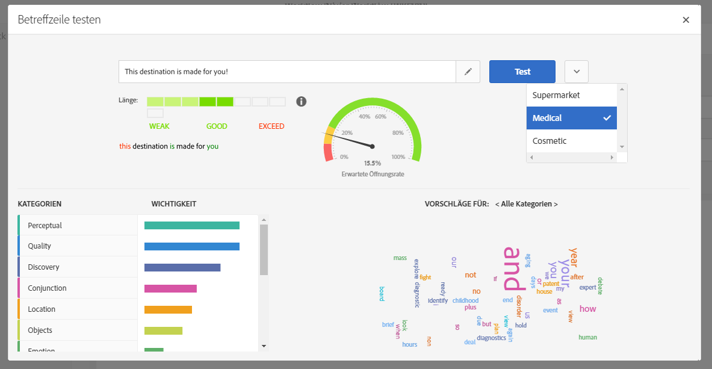

# Betreffzeile einer E-Mail personalisieren{#personalizing-the-subject-line-of-an-email}

## E-Mail-Betreff personalisieren {#personalizing-an-email-subject}

Die Betreffzeile ist für die Vorbereitung und den Versand einer Nachricht unbedingt erforderlich.

>[!NOTE]
>
>Wenn die Betreffzeile leer ist, wird ein Warnhinweis im Nachrichten-Dashboard und in Email Designer angezeigt.

Um den E-Mail-Betreff zu konfigurieren, öffnen Sie auf der Startseite von Email Designer den Tab **[!UICONTROL Eigenschaften]** (der Zugriff erfolgt über das Startseiten-Symbol) und füllen Sie den Bereich **Betreff]aus.[!UICONTROL **

Sie können zur Betreffzeile auch Personalisierungsfelder, Inhaltsbausteine und dynamische Inhalte hinzufügen, indem Sie die entsprechenden Symbole auswählen.

**Verwandte Themen:**

* [Personalisierungsfeld einfügen](../../designing/using/inserting-a-personalization-field.md)
* [Inhaltsbausteine](../../designing/using/adding-a-content-block.md)
* [Dynamische Inhalte in einer E-Mail definieren](../../designing/using/defining-dynamic-content-in-an-email.md)

## Prädiktive Betreffzeile {#predictive-subject-line}

Beim Bearbeiten von E-Mails können Sie verschiedene Betreffzeilen ausprobieren und dabei eine jeweilige Einschätzung der Öffnungsrate erhalten, bevor Sie die E-Mail senden.

Diese Funktion ist standardmäßig deaktiviert. Sie wird beim Import des ersten Modells aktiviert. Bei einem Modell handelt es sich um das Ergebnis aus branchenspezifischen Trainingsdatensätzen. Durch Modelle kann das System bei der Unterbreitung neuer Betreffzeilen darauf bezogene Öffnungsraten für E-Mails voraussagen.

>[!NOTE]
>
>Diese Funktion ist ausschließlich für E-Mail-Nachrichten und Datenbanken mit englischen Inhalten verfügbar. Das trainierte Modell riskiert inkonsistent zu sein und fehlerhafte Ergebnisse zu erzeugen, wenn Ihre Instanz E-Mails beinhaltet, deren Inhalt in anderen Sprachen gehalten ist. Die Option zum Testen von Betreffs ist nur dann sichtbar, wenn in Ihrer Instanz bereits ein Modell verfügbar ist.

### Betreff testen {#testing-a-subject}

Gehen Sie zum Testen Ihrer Betreffzeile wie folgt vor:

1. Erstellen Sie eine neue oder öffnen Sie eine bereits existierende E-Mail.
1. Gehen Sie in den Inhalt und geben Sie den Betreff der E-Mail im entsprechenden Eingabefeld ein.
1. Greifen Sie mithilfe der Schaltfläche **[!UICONTROL Betreff testen]** auf das Fenster **Betreffzeile testen]zu.[!UICONTROL ** Der Betreff lässt sich in diesem Fenster noch anpassen.
1. Wählen Sie das passende Modell aus, das für die Voraussage der Öffnungsrate berücksichtigt werden soll. Es stehen mehrere Modelle zur Verfügung, die jeweils einer speziellen Branche entsprechen.
1. Verwenden Sie zum **[!UICONTROL Testen der Betreffzeile die gleichnamige Schaltfläche]**.

Ihr Betreff wird nun analysiert.

>[!NOTE]
>
>Sollte die Betreffzeile zu kurz sein, kann keine Analyse durchgeführt werden und es wird eine Fehlermeldung angezeigt.

Bei der Analyse werden mehrere Indikatoren berechnet und es werden eine Reihe von Tools angezeigt, die Ihnen Anhaltspunkte zur Bearbeitung des Betreffs geben:

* **Erwartete Öffnungsrate**: Diese Grafik zeigt Ihnen, welche Öffnungsrate Sie mit Bezug auf den aktuellen Betreff Ihrer E-Mail erwarten können.
* **Länge des Betreffs**: Dieser Indikator zeigt an, ob der aktuelle Betreff die richtige Länge aufweist, oder ob er ggf. länger oder kürzer sein sollte.
* **Farbig markierte Wörter**: Beim Testen des Betreffs handelt es sich bei grün hervorgehobenen Stellen um die Wörter, die laut Voraussage am meisten zur Steigerung der Öffnungsrate beitragen. Bei rot hervorgehobenen Stellen handelt es sich um die Wörter, die laut Voraussage am wenigsten zur Steigerung der Öffnungsrate beitragen. Beim Hinzufügen oder Löschen von Wörtern im Betreff verschiebt sich von daher auch die Hervorhebung.
* **Kategorien und Wortvorschläge**: Im unteren Teil des Fensters werden eine Reihe für das ausgewählte Modell relevante Kategorien angezeigt. Die prioritär nach Wichtigkeit sortierten Kategorien helfen Ihnen zu erkennen, ob Ihr Betreff Wörter enthält, die einer jeweiligen Kategorie angehören, die in diesem Fall mit einem Häkchensymbol gekennzeichnet ist. Jede Kategorie enthält einen Satz an vorgeschlagenen Wörtern, die Sie in Ihrem Betreff verwenden können, um ihn genauer auf Zielgruppen zuzuschneiden und die Öffnungsrate zu steigern. Diese Wörter werden am meisten innerhalb einer bestimmten Kategorie verwendet.

>[!NOTE]
>
>Personalisierungsfelder und Satzzeichen werden bei der Analyse außen vor gelassen. Bei dynamischen/bedingten Inhalten werden alle Varianten als eine einzige Betreffzeile angesehen.

### Modelle importieren {#importing-models}

Auf Ihrem Adobe-Campaign-Server laufen Modelle nicht standardmäßig. Für den Erhalt eines Modells und die Aktivierung der Funktion gibt es zwei Möglichkeiten:

* Sie können ein lokales lernfähiges Modell mithilfe von Daten aus Ihren bisherigen E-Mail-Nachrichten trainieren:

   * Wenn Sie bereits Adobe Campaign verwenden, wird das lokale Modell automatisch von in der Vergangenheit von Ihnen gesendeten Nachrichten lernen.
   * Neue Adobe-Campaign-Nutzer können aus ihrem alten System/ESP eine CSV-Datei mit den folgenden vier Spalten extrahieren: Datum, Betreff, Gesendet, Öffnungen. To do that, go to **[!UICONTROL Administration]** &gt; **[!UICONTROL Channels]** &gt; **[!UICONTROL Email]** &gt; **[!UICONTROL Subject Line Import]** and follow the instructions provided on the successive screens. Importieren Sie nach Hochladen der Betreffs ein lokales Modell, wie weiter unten beschrieben. Das lokale Modell wird automatisch mit den hochgeladenen Daten trainiert.
   * Wenn Sie als neuer Adobe-Campaign-Nutzer keinen Zugang zu einer CSV-Datei wie der oben beschriebenen haben, können Sie entweder ein vortrainiertes Modell verwenden oder solange warten, bis Sie in Ihrem System über ausreichend Versanddaten verfügen, mit deren Hilfe ein lokales lernfähiges Modell trainiert werden kann. Das System bestimmt automatisch, ob Ihr aktueller Datensatz ausreichend Daten zur Erkennung von Mustern und zum Training des lernfähigen Modells enthält.

      >[!NOTE]
      >
      >Es gibt keine bestimmte Anzahl erforderlicher Betreffzeilen zum Trainieren Ihres eigenen Modells. Um es trainieren zu können, müssen die Betreffzeilen unterschiedlich lauten und dürfen keine Dubletten haben. Sind nicht genügend Daten vorhanden, die verarbeitet werden können, ist das System nicht in der Lage, das lernfähige Modell zu trainieren. Ihre Instanz darf nur ein trainiertes Modell enthalten.
   Laden Sie zum Training eines lokalen lernfähigen Modells [hier](https://support.neolane.net/webApp/downloadCenter?__userConfig=psaDownloadCenter) das Modell subjectLineTraining.xml herunter und verwenden Sie die Funktion [Package-Import](../../automating/using/managing-packages.md), um es in Ihre Adobe-Campaign-Instanz hochzuladen. Das Training des lernfähigen Modells wird automatisch von einem technischen Workflow übernommen.

   The first time you want to train a model, an administrator can force the **[!UICONTROL SubjectLine Training workflow]** to start from the **[!UICONTROL Administration]** &gt; **[!UICONTROL Application settings]** &gt; **[!UICONTROL Workflows]** menu.

   Nach dem Hochladen und Training eines lernfähigen Modells wird die Funktion automatisch aktiviert und neben dem für die Betreffzeile Ihrer Nachrichten vorgesehenen Feld wird eine neue Option angezeigt.

   Der technische Workflow übernimmt dann automatisch das wöchentliche Training Ihres lernfähigen Modells.

* Sie haben die Möglichkeit, unter Verwendung der Funktion [Package-Import](../../automating/using/managing-packages.md) vortrainierte, für spezifische Branchen entwickelte Modelle zu importieren (Medizin etc.). Diese Modelle sind [hier](https://support.neolane.net/webApp/downloadCenter?__userConfig=psaDownloadCenter) verfügbar und können nicht nachträglich trainiert werden.

   Nach dem Hochladen eines solchen Modells wird die Funktion automatisch aktiviert und neben dem für die Betreffzeile Ihrer Nachrichten vorgesehenen Feld wird eine neue Option angezeigt.

>[!NOTE]
>
>Der Import und die Erzeugung trainierter Modelle ist Administratoren vorbehalten.

Folgende gebrauchsfertige Modelle stehen zur Verfügung:

* Kosmetikbranche: subjectInsightCosmetic.xml
* Supermarktbranche: subjectInsightSupermarket.xml
* Medizinbranche: subjectInsightMedical.xml
* Trainierbares Modell: subjectLineTraining.xml

