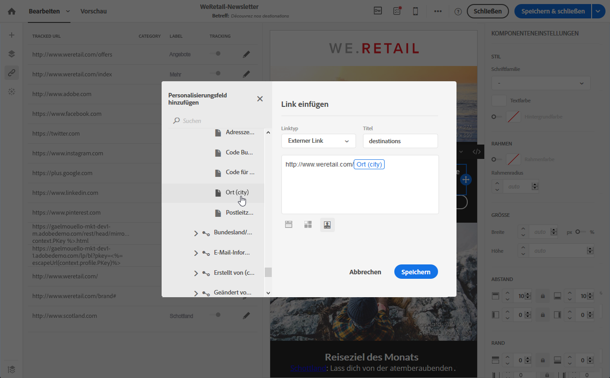

# URLs personalisieren{#personalizing-urls}

Sie haben in Adobe Campaign die Möglichkeit, in Ihrer Nachricht eine oder mehrere URLs zu personalisieren, indem Sie Personalisierungsfelder, Inhaltsbausteine oder dynamische Inhalte an diese anschließen. Gehen Sie wie folgt vor:

1. Fügen Sie eine externe URL ein und geben Sie deren Parameter an. Siehe [Link einfügen](../../designing/using/inserting-a-link.md).
1. Wenn die Personalisierungsoptionen nicht angezeigt werden, verwenden Sie im Einstellungsfenster das Stiftsymbol neben der ausgewählten URL, um die Personalisierungsoptionen aufzurufen.
1. Fügen Sie die gewünschten Personalisierungsfelder, Inhaltsbausteine und dynamischen Inhalte hinzu.

   

1. Speichern Sie Ihre Änderungen.

>[!NOTE]
>
>Die Personalisierung von URLs kann sich weder auf den Domain-Namen noch auf die URL-Erweiterung beziehen. Bei der Nachrichtenvorbereitung wird eine Fehlernachricht angezeigt, wenn die Personalisierung nicht korrekt ist. Bei der Auswahl eines Inhaltsbausteins dürfen Sie keine Elemente wie **Link zur Mirrorseite** auswählen. Dieser Typ von Inhaltsbausteinen darf nicht innerhalb eines Links verwendet werden.

**Verwandte Themen**:

* [Personalisierungsfeld einfügen](../../designing/using/inserting-a-personalization-field.md)
* [Inhaltsbausteine hinzufügen](../../designing/using/adding-a-content-block.md)
* [Dynamische Inhalte definieren](../../designing/using/defining-dynamic-content-in-an-email.md)

