# Bearbeiten von Plain Text-, HTML- und mobilen E-Mail-Formaten {#plain-text-and-html-modes}

Mit Email Designer können Sie verschiedene Renderings Ihrer E-Mails bearbeiten. Sie können eine Textversion Ihrer E-Mail erstellen, die HTML-Quelle einer E-Mail bearbeiten und E-Mails für mobile Geräte entwerfen.

## Textversion der E-Mail erstellen {#generating-a-text-version-of-the-email}

Standardmäßig wird automatisch eine **[!UICONTROL reine Textversion]** Ihrer E-Mail erzeugt und mit der **[!UICONTROL bearbeiteten]** Version synchronisiert.

Auch die zur HTML-Version hinzugefügten Personalisierungsfelder und Inhaltsbausteine werden mit der Textversion synchronisiert.

>[!NOTE]
>
>Um Inhaltsbausteine in der Textversion verwenden zu können, dürfen sie keinen HTML-Code enthalten.

Um eine Textversion zu erhalten, die anders ist als die HTML-Version, deaktivieren Sie die Synchronisation, indem Sie den Schalter **[!UICONTROL Mit HTML synchronisieren]** in der **[!UICONTROL Nur Text]**-Ansicht Ihrer E-Mail auswählen.

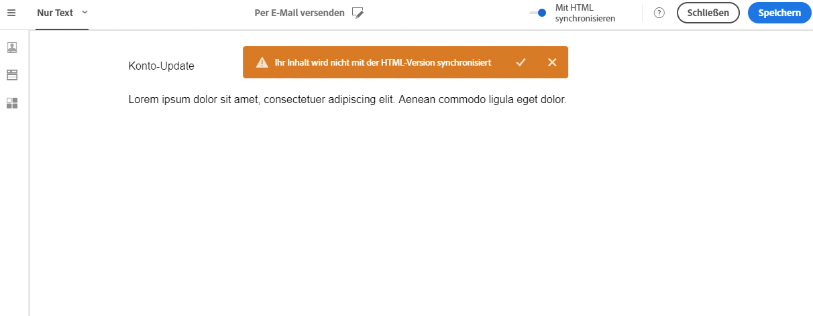

Sie können die Textversion dann nach Belieben bearbeiten.

>[!NOTE]
>
>Wenn Sie die **[!UICONTROL Nur Text]**-Version bei deaktivierter Synchronisation bearbeiten, werden beim nächsten Mal, wenn Sie die Option **[!UICONTROL Mit HTML synchronisieren]** aktivieren, alle Änderungen, die Sie in der Textversion vorgenommen haben, durch die HTML-Version ersetzt. Die Änderungen, die Sie in der **[!UICONTROL Nur Text]**-Ansicht vorgenommen haben, werden in der **[!UICONTROL HTML]**-Ansicht nicht dargestellt.

## Die Inhaltsquelle einer E-Mail in HTML bearbeiten {#editing-an-email-content-source-in-html}

Für fortgeschrittene Benutzer und zur Fehlerbehebung kann der E-Mail-Inhalt direkt im HTML-Format angezeigt und bearbeitet werden.

Es gibt zwei Möglichkeiten, die HTML-Version der E-Mail zu bearbeiten:

* Wählen Sie **[!UICONTROL Bearbeiten]** > **[!UICONTROL HTML]** aus, um die HTML-Version der gesamten E-Mail aufzurufen.

   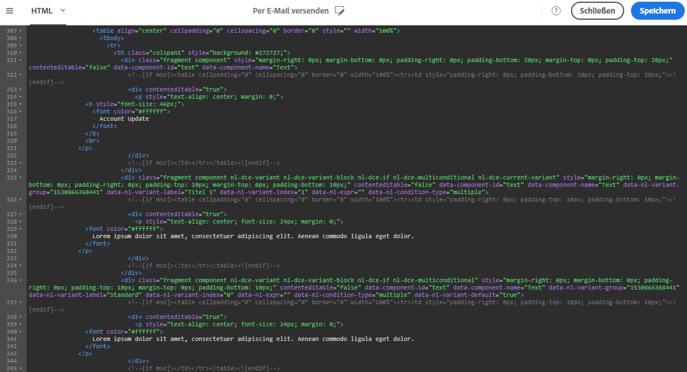

* Wählen Sie in der WYSIWYG-Benutzeroberfläche ein Element und danach das Symbol **[!UICONTROL Quellcode]** aus

   Nur der Quellcode des ausgewählten Elements wird angezeigt. Sie können den Quellcode bearbeiten, wenn das ausgewählte Element eine **[!UICONTROL HTML]**-Inhaltskomponente ist. Andere Komponenten sind schreibgeschützt, können aber in der vollständigen HTML-Version der E-Mail bearbeitet werden.

   

Wenn Sie den HTML-Code ändern, könnte es sein, dass Ihre E-Mails nicht mehr responsiv sind. Deshalb sollten Sie diese Funktion unbedingt unter Verwendung der Schaltfläche **[!UICONTROL Vorschau]** testen. Siehe [Vorschau der Nachricht erzeugen](../../sending/using/previewing-messages.md).

## Entwerfen von E-Mails für mobiles Rendering {#switching-to-mobile-view}

Sie können das responsive Design einer E-Mail anpassen, indem Sie alle Stiloptionen für die Darstellung auf Mobilgeräten einzeln bearbeiten. So können Sie beispielsweise für die mobile Version Ihrer E-Mail die Spannen und Abstände verändern sowie kleinere oder größere Schriftgrade verwenden, die Schaltflächen ändern oder unterschiedliche Hintergrundfarben auswählen.

Alle Stiloptionen sind in der Mobile-Ansicht verfügbar. Die Stileinstellungen von Email Designer werden zuvor auf dieser Seite angezeigt.

1. Erstellen Sie eine E-Mail und bearbeiten Sie den Inhalt. Weiterführende Informationen dazu finden Sie im Abschnitt [Neuen E-Mail-Inhalt gestalten](../../designing/using/designing-from-scratch.md#designing-an-email-content-from-scratch).
1. Öffnen Sie mit der Schaltfläche **[!UICONTROL Zur Mobile-Ansicht wechseln]** die Mobile-Ansicht.

   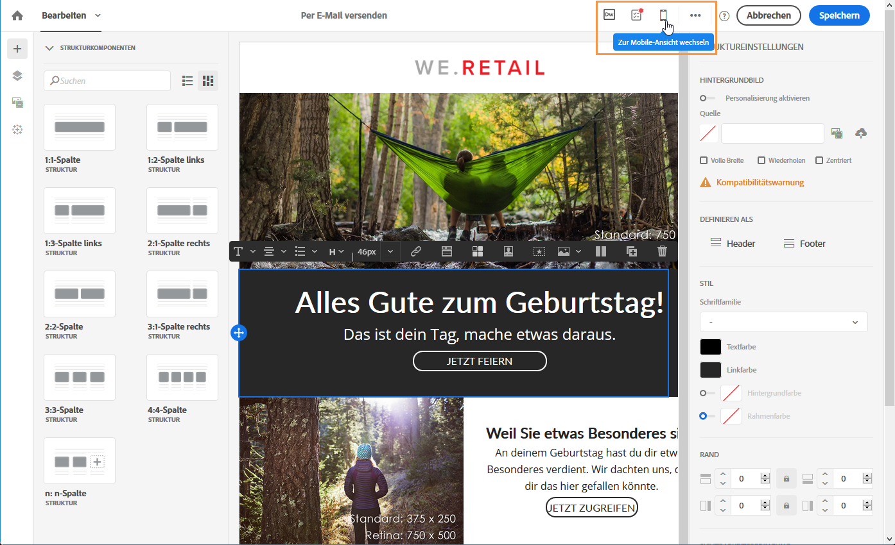

   Die Mobile-Version der E-Mail wird angezeigt. Sie enthält alle in der Desktop-Ansicht definierten Komponenten und Stile.

1. Sie können alle Stileinstellungen unabhängig voneinander bearbeiten, z. B. Hintergrundfarbe, Ausrichtung, Abstand, Spanne, Schriftart, Textfarbe usw.

   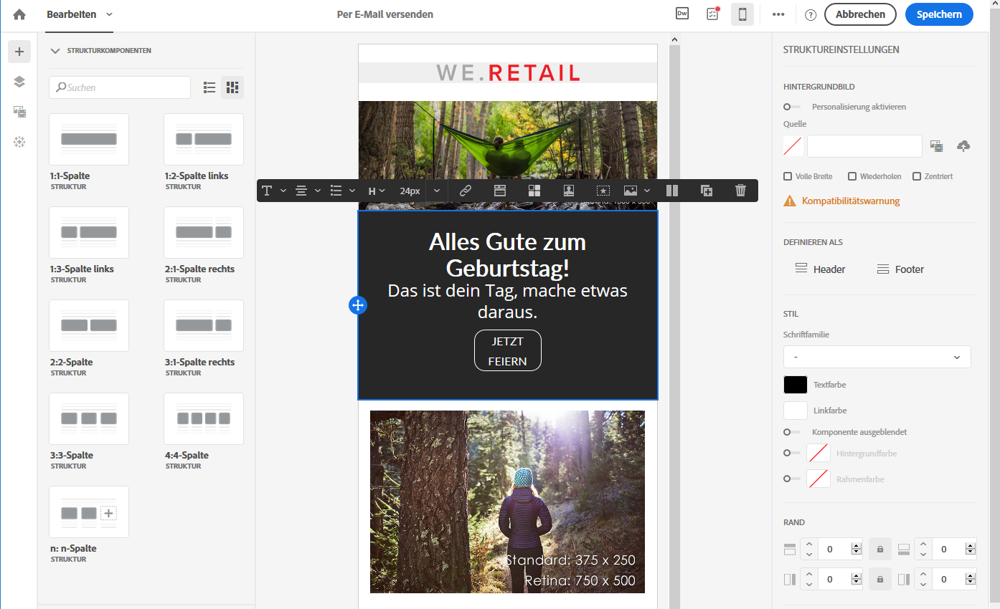

1. Änderungen von Stileinstellungen in der Mobile-Ansicht werden nur auf die Mobile-Version angewendet.

   Sie können in der Mobile-Ansicht z. B. die Größe eines Bildes verringern, einen grünen Hintergrund hinzufügen und den Abstand verändern.

   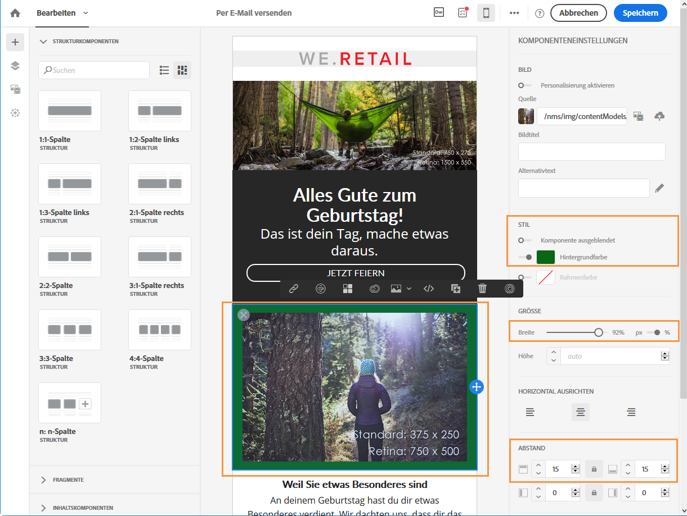

1. Sie können Komponenten auf Mobilgeräten ausblenden. Wählen Sie dazu **[!UICONTROL Nur auf Desktops zeigen]** in den **[!UICONTROL Anzeigeoptionen]** aus.

   Sie können eine Komponente auch auf Desktop-Geräten ausblenden, sodass sie nur auf Mobilgeräten angezeigt wird. Wählen Sie dazu **[!UICONTROL Nur auf Mobilgeräten zeigen]** aus.

   Mit dieser Option haben Sie beispielsweise die Möglichkeit, ein bestimmtes Bild auf Mobilgeräten und ein anderes Bild auf Desktop-Geräten anzuzeigen.

   Sie können diese Option sowohl in der Mobile- als auch der Desktop-Ansicht auswählen.

   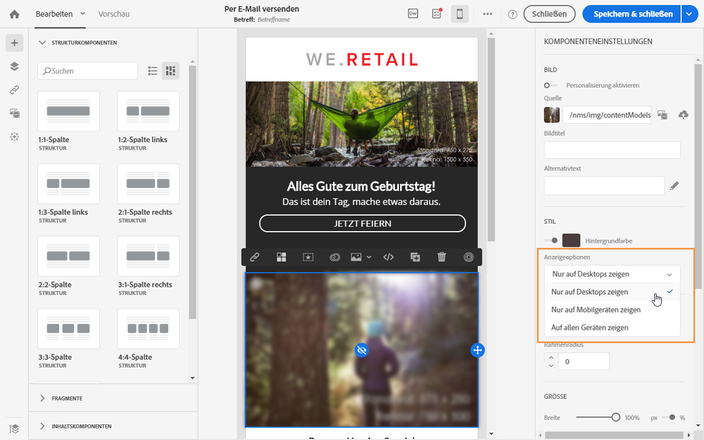

1. Wählen Sie nochmals die Schaltfläche **[!UICONTROL Zur Mobile-Ansicht wechseln]** aus, um zur Desktop-Ansicht zu wechseln. Die soeben vorgenommenen Stiländerungen sind in dieser Version nicht vorhanden.

   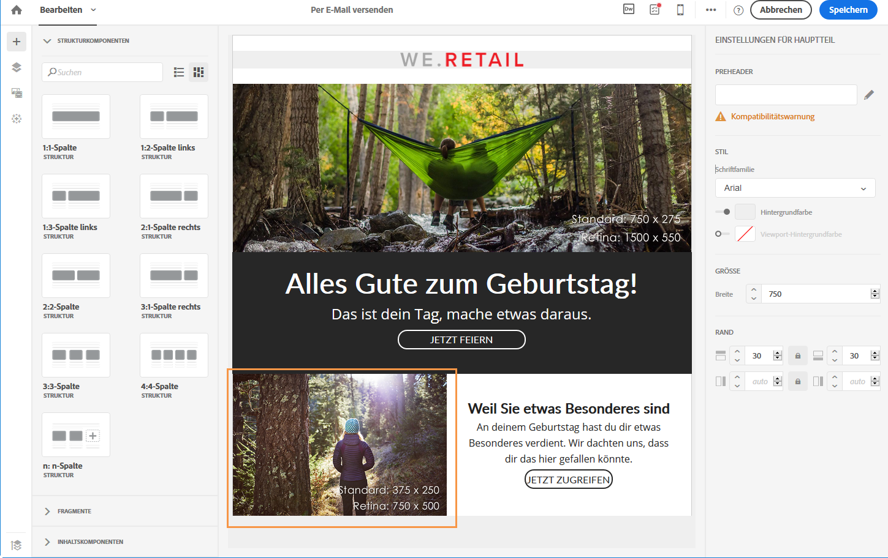

   >[!NOTE]
   >
   >Die einzige Ausnahme sind die Einstellungen für **[!UICONTROL Inline-Stile]**. Inline-Stil-Einstellungen werden auch von der standardmäßigen Desktop-Ansicht übernommen.

1. Andere Änderungen an der Struktur oder am Inhalt der E-Mail, wie zum Beispiel Textänderungen, der Upload eines neuen Bildes, das Hinzufügen einer neuen Komponente etc. werden auch in der Standardansicht angezeigt.

   Wechseln Sie wieder in die Mobile-Ansicht und ändern Sie z. B. Text und ersetzen Sie ein Bild.

   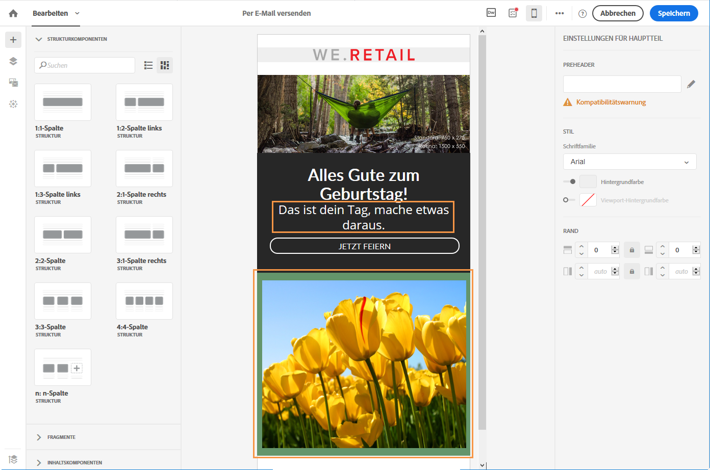

1. Wählen Sie nochmals die Schaltfläche **[!UICONTROL Zur Mobile-Ansicht wechseln]** aus, um zur Desktop-Ansicht zu wechseln. Die Änderungen wurden übernommen.

   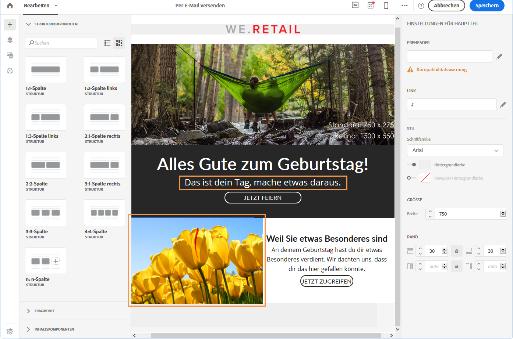

1. Wenn Sie in der Mobile-Version einen Stil entfernen, wird der im Desktop-Modus angewendete Stil übernommen.

   Fügen Sie in der Mobile-Ansicht z. B. für eine Schaltfläche eine grüne Hintergrundfarbe ein.

   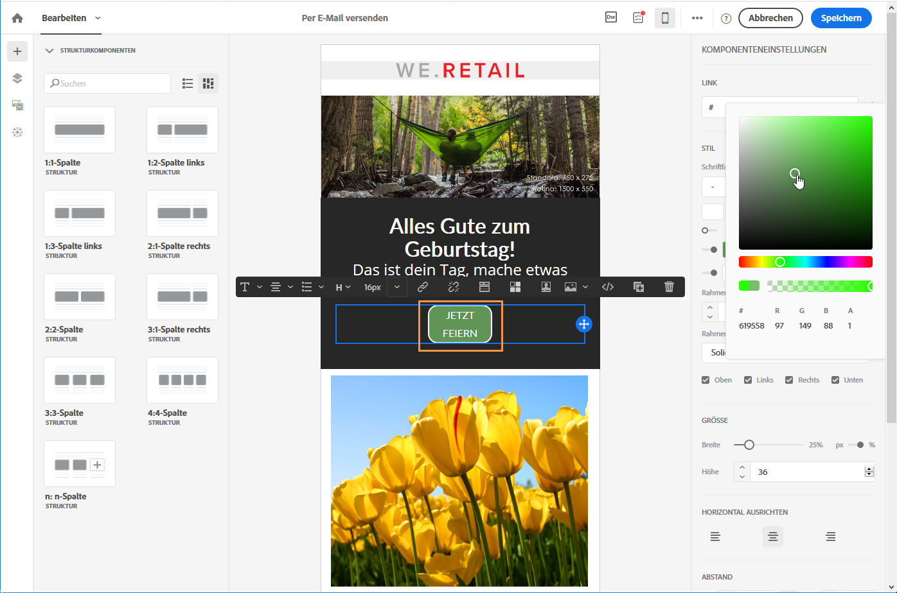

1. Wechseln Sie in die Desktop-Ansicht und wählen Sie für dieselbe Schaltfläche einen grauen Hintergrund.

   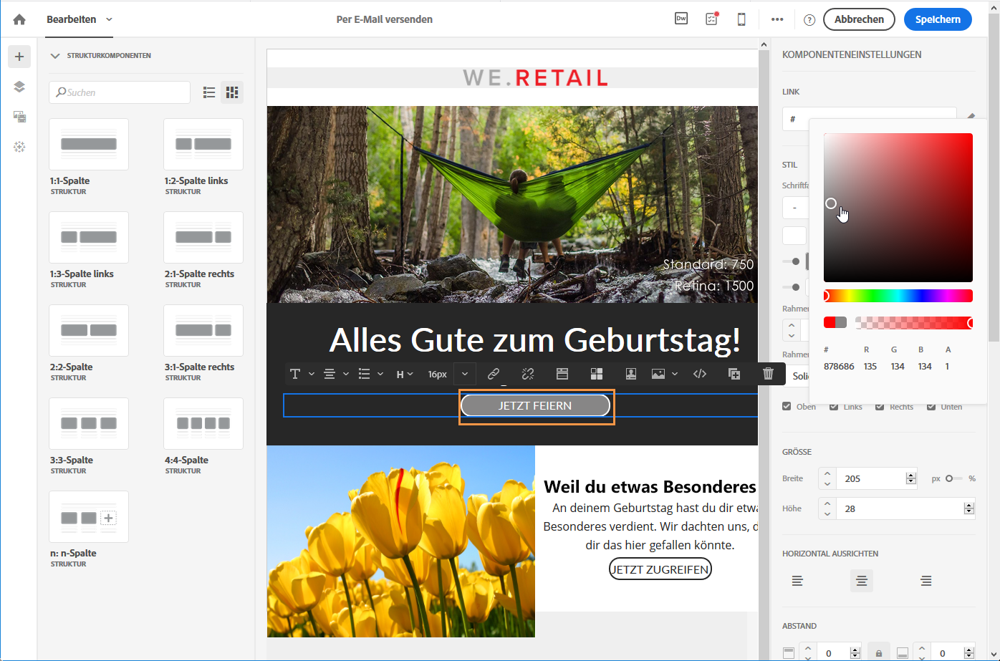

1. Wechseln Sie nochmals zur Mobile-Ansicht und deaktivieren Sie die Einstellung **[!UICONTROL Hintergrundfarbe]**.

   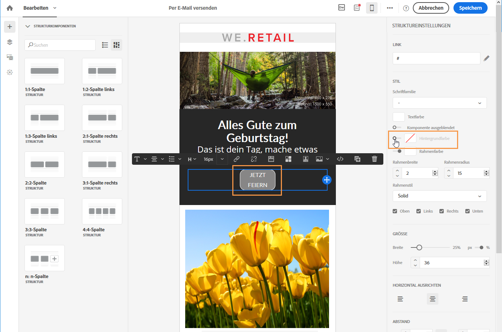

   Die in der Desktop-Ansicht ausgewählte Hintergrundfarbe wird jetzt angewendet: Die Schaltfläche wird grau (nicht farblos) dargestellt.

   Die einzige Ausnahme ist die Einstellung für die **[!UICONTROL Randfarbe]**. Wenn diese in der Mobile-Ansicht deaktiviert ist, wird kein Rahmen mehr hinzugefügt, selbst wenn in der Desktop-Ansicht eine Randfarbe definiert wurde.

>[!NOTE]
>
>Die Mobile-Ansicht ist nicht in [Fragmenten](../../designing/using/using-reusable-content.md#about-fragments) verfügbar.
